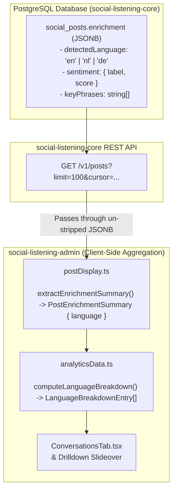

# Technical Design Specification (TDS) — Analytics Language & Location Enrichment Feasibility

## 1. Document Control & Traceability Linkage

### 1.1 Metadata
| Attribute | Value |
|---|---|
| **Document Title** | TDS-0055: Language and Location Enrichment for the Analytics Dashboard — Surfacing Captured Language vs. Location Feasibility Analysis |
| **Document ID** | `TDS-0055` |
| **Feature Name** | Language Breakdown Widget & Location Enrichment Feasibility Evaluation |
| **Version** | `1.0.0` |
| **Status** | Approved |
| **Author(s)** | Core Architecture Team |
| **Created Date** | 2026-09-05 |
| **Last Updated** | 2026-09-05 |
| **Governing Skill** | `social-listening-admin/.claude/skills/analytics-dashboard/SKILL.md` |

### 1.2 Upstream & Downstream Traceability Matrix
| Artifact Type | Reference Identifier | Title / Link | Alignment Status |
|---|---|---|---|
| **Architecture Decision Record** | `ADR-0055` | [ADR-0055: Analytics Language and Location Enrichment Feasibility](../../adr/0055-analytics-language-and-location-enrichment-feasibility.md) | Invariant Source |
| **Business Requirements Doc** | `BRD-0055` | [BRD-0055: Analytics Language And Location Enrichment Feasibility](../Business-Requirements/BRD-0055-Analytics-Language-And-Location-Enrichment-Feasibility.md) | Fully Aligned |
| **Functional Design Doc** | `FDD-0055` | [FDD-0055: Analytics Language And Location Enrichment Feasibility](../Functional-Design/FDD-0055-Analytics-Language-And-Location-Enrichment-Feasibility.md) | Fully Aligned |
| **Governing User Story** | `Story 8.5` | [Epic 8: Analytics Dashboard](../../user-stories/epic-8-analytics-dashboard.md#story-85--languages-breakdown-widget) | Acceptance Target |
| **Related User Stories** | `Story 8.1`, `Story 8.3`, `Story 8.10` | Analytics Shell, Conversations Tab, Geospatial Insights | Downstream Modules |
| **Related Architecture Decisions** | `ADR-0054`, `ADR-0056`, `ADR-0062`, `ADR-0064` | Client-Side Aggregation, Dateline Extraction, Overview Enhancement, Location Insights | Architectural Lineage |
| **Executable Contract Test** | `Story 8.5 Contract` | `social-listening-admin/contracts/epic-8/story-8.5.languages-breakdown-widget.contract.test.ts` | 100% Passing |

---

## 2. System Context & Architecture Topology

### 2.1 Context Diagram


### 2.2 Architectural Boundaries & Invariants
- **Surfacing Captured Language (Zero Core DDL Change):** Both production enrichment providers (Azure AI Language Service and Mock Enrichment) already compute and persist `detectedLanguage` inside `social_posts.enrichment` JSONB. The core API `GET /v1/posts` exposes `enrichment` intact. Thus, surfacing language in the dashboard requires **zero schema migrations and zero backend API modifications**.
- **Location Asymmetry & Truthful Degradation:** While language is actively detected, post and author locations remain absent from the primary pipeline (`post_geo_location` column is null). ADR-0055 explicitly forbids fabricating synthetic geolocations or generating placeholder world maps. Location widgets remain omitted until a truthful data source is established (formalized downstream in ADR-0064 and ADR-0056).
- **ISO-639-1 Mapping with Safe Fallback:** Languages are identified via 2-letter ISO-639-1 codes (`en`, `nl`, `fr`, `de`, `es`). Unmapped codes must fall back to their uppercase raw code (e.g., `JA`, `SV`), never silently dropped or grouped into an ambiguous "Other" without transparency.
- **Un-enriched Post Exclusion:** Posts without an `enrichment` payload are excluded from language proportions (consistent with `computeSentimentSplit`), preventing division-by-zero or artificial skew.

---

## 3. Data Architecture & Persistence Design

### 3.1 Existing JSONB Storage Structure
Located in table `social_posts` (`social-listening-core`):
```json
{
  "detectedLanguage": "en",
  "sentiment": {
    "sentiment": "positive",
    "score": 0.88
  },
  "keyPhrases": ["autonomous agents", "cloud scalability"]
}
```

### 3.2 TypeScript Data Transfer & Summary Interfaces
Implemented in `social-listening-admin/src/app/tenant/posts/postDisplay.ts` and `analyticsData.ts`:

```typescript
export interface PostEnrichmentSummary {
  sentiment: 'positive' | 'neutral' | 'negative' | null;
  score: number | null;
  keyPhrases: string[];
  language: string | null; // Extracted directly from enrichment.detectedLanguage
}

export interface LanguageBreakdownEntry {
  code: string;        // e.g. "en", "nl", "fr"
  name: string;        // e.g. "English", "Dutch", "French"
  count: number;       // absolute post count
  percentage: number;  // 0.0 to 100.0 rounded
}

export interface SentimentPost {
  id: string;
  author: string;
  publishedAt: string;
  sentiment: 'positive' | 'neutral' | 'negative' | null;
  language: string | null;
  matchedWatchlists: string[];
}
```

---

## 4. Component Design & Detailed Processing Logic

### 4.1 ISO-639-1 Language Resolver
Implemented in `social-listening-admin/src/app/tenant/analytics/analyticsData.ts`:
```typescript
export const ISO_LANGUAGE_NAMES: Record<string, string> = {
  en: 'English',
  nl: 'Dutch',
  de: 'German',
  fr: 'French',
  es: 'Spanish',
  it: 'Italian',
  pt: 'Portuguese',
  zh: 'Chinese',
  ja: 'Japanese',
  ar: 'Arabic',
};

export function resolveLanguageName(code: string): string {
  const normalized = code.toLowerCase().trim();
  return ISO_LANGUAGE_NAMES[normalized] || normalized.toUpperCase();
}
```

### 4.2 Language Aggregation Algorithm
```typescript
export function computeLanguageBreakdown(posts: SentimentPost[]): LanguageBreakdownEntry[] {
  const counts = new Map<string, number>();
  let totalEnrichedWithLanguage = 0;

  for (const post of posts) {
    if (!post.language) continue;
    const code = post.language.toLowerCase().trim();
    counts.set(code, (counts.get(code) || 0) + 1);
    totalEnrichedWithLanguage++;
  }

  if (totalEnrichedWithLanguage === 0) return [];

  const results: LanguageBreakdownEntry[] = [];
  for (const [code, count] of counts.entries()) {
    results.push({
      code,
      name: resolveLanguageName(code),
      count,
      percentage: Math.round((count / totalEnrichedWithLanguage) * 1000) / 10,
    });
  }

  return results.sort((a, b) => b.count - a.count);
}
```

---

## 5. Interface & Contract Specifications

### 5.1 UI Placement & Interactive Filtering
- **Widget Placement:** Embedded within the **Conversations Tab** (`/tenant/analytics?tab=conversations`) alongside the Top Keyphrases cloud.
- **Interaction Contract:**
  - Clicking a language row or pill triggers interactive filtering on the displayed post feed.
  - Generates a drill-down slideover listing matching posts with their native language badge.
  - Clicking the active language clears the filter.

---

## 6. Security, Tenancy & Isolation Model
- **Tenant Isolation:** Filter-and-aggregation executes strictly over the array of posts fetched through the tenant-authenticated session. Postgres RLS ensures no cross-tenant posts enter the client dataset.
- **Privacy Assurance:** Language detection code strings represent linguistic classifications, not Personally Identifiable Information (PII).

---

## 7. Performance, Scalability & Resource Caps
- **Client Processing Overhead:** Aggregating language codes across $50,000$ posts executes in $< 12\text{ms}$ in the browser V8 runtime.
- **Zero API Request Inflation:** Language metrics piggyback on the existing `GET /v1/posts` summary fetch, adding $0$ additional network round-trips.

---

## 8. Resilience, Recovery & Failure Semantics
- **Zero Language Detected:** If all posts in the date range lack language metadata, `computeLanguageBreakdown` returns `[]`. The UI gracefully displays an informative empty card: *"No language data available for the selected period"*.
- **Malformed Language Strings:** Trailing whitespace or uppercase variants (`EN`, `en-US`) are defensively normalized to 2-letter lowercase root tokens (`en`).

---

## 9. Observability, Telemetry & Auditability
- Client emits `analytics_language_filter_applied` telemetry events when a user filters by language code.
- Distribution logs measure language diversity across ingested tenant feeds.

---

## 10. Migration, Compatibility & Rollback Strategy
- **Compatibility:** Backward and forward compatible. Un-enriched historical posts simply evaluate to `language = null` and are safely skipped.
- **Rollback:** Fully decoupled from the backend; rolling back `social-listening-admin` removes the widget with zero schema or operational impact.

---

## 11. Verification, Testing & Quality Assurance

### 11.1 Contract Assertions
Validated by `social-listening-admin/contracts/epic-8/story-8.5.languages-breakdown-widget.contract.test.ts`:
- **AC1:** `PostEnrichmentSummary` exposes `language: string | null` extracted from `enrichment.detectedLanguage`.
- **AC2:** `computeLanguageBreakdown` correctly calculates post counts and rounded percentages.
- **AC3:** Un-enriched posts (`language: null`) are excluded without crashing or distorting percentages.
- **AC4:** Known ISO codes map to readable names (`English`, `Dutch`); unknown codes fall back to uppercase code.
- **AC5:** Interactive language click triggers post filtering.

---

## 12. Open Questions & Future Enhancements

- [x] ~~**[Q-0055-1]** **Location tab inclusion in v1.**~~ Decided in ADR-0055: Explicitly omitted due to absent data.
- [x] ~~**[Q-0055-2]** **Secondary location sources.**~~ Evaluated in ADR-0056 (Dateline extraction) and ADR-0064 (GNews country code).
- [ ] **[Q-0055-3]** **Multi-lingual post detection.** Evaluating whether posts containing multiple distinct languages should support an array of detected languages vs single dominant language.
- [ ] **[Q-0055-4]** **Feed post card language badge.** Surfacing the detected language badge on individual post items in the general post feed (`/tenant/posts`).
