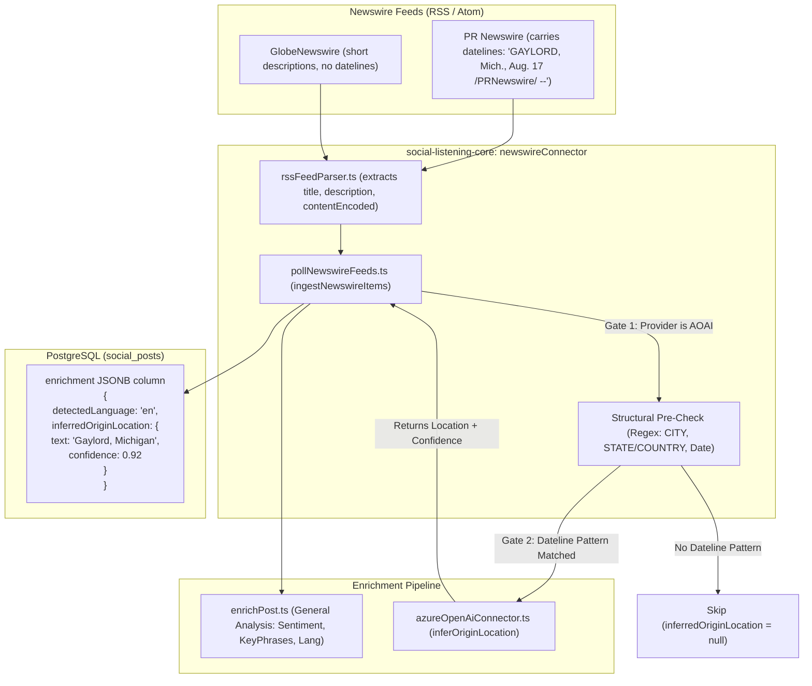
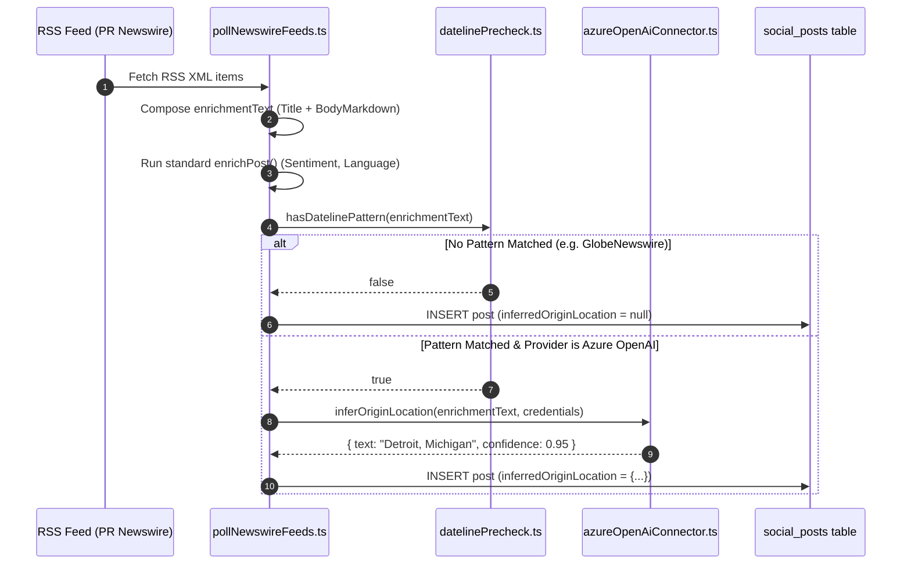

# Technical Design Specification (TDS) — AI-Inferred Origin Location from Newswire Dateline Extraction

## 1. Document Control & Traceability Linkage

### 1.1 Metadata
| Attribute | Value |
|---|---|
| **Document Title** | TDS-0056: AI-Inferred Origin Location from Newswire Press Release Datelines — Architectural Feasibility, Gated Invocation & Deferred Implementation |
| **Document ID** | `TDS-0056` |
| **Feature Name** | Press Release Dateline Location Extractor & AI Inferred Origin Architecture |
| **Version** | `1.0.0` |
| **Status** | Approved (Architecture Specified, Implementation Deferred per ADR-0056 §5) |
| **Author(s)** | Core Architecture Team |
| **Created Date** | 2026-09-05 |
| **Last Updated** | 2026-09-05 |
| **Governing Skill** | `social-listening-core/.claude/skills/social-post-enrichment/SKILL.md` |

### 1.2 Upstream & Downstream Traceability Matrix
| Artifact Type | Reference Identifier | Title / Link | Alignment Status |
|---|---|---|---|
| **Architecture Decision Record** | `ADR-0056` | [ADR-0056: AI-Inferred Origin Location from Newswire Datelines](../../adr/0056-ai-inferred-origin-location-newswire-dateline-extraction.md) | Invariant Source |
| **Business Requirements Doc** | `BRD-0056` | [BRD-0056: AI-Inferred Origin Location Newswire Dateline Extraction](../Business-Requirements/BRD-0056-AI-Inferred-Origin-Location-Newswire-Dateline-Extraction.md) | Fully Aligned |
| **Functional Design Doc** | `FDD-0056` | [FDD-0056: AI-Inferred Origin Location Newswire Dateline Extraction](../Functional-Design/FDD-0056-AI-Inferred-Origin-Location-Newswire-Dateline-Extraction.md) | Fully Aligned |
| **Governing User Story** | `Epic 4 / Story 4.2` | [Epic 4: Topic Trends](../../user-stories/epic-4-topic-trends-and-aggregates.md) / Research Precursor | Baseline Scope |
| **Related User Stories** | `Story 8.5`, `Story 8.10` | Language Breakdown Widget, Geospatial Insights | Downstream Modules |
| **Related Architecture Decisions** | `ADR-0024`, `ADR-0038`, `ADR-0054`, `ADR-0055`, `ADR-0064` | Newswire Connector, Multi-Provider Enrichment, Location Feasibility, Location Insights | Upstream Context |
| **Executable Contract Test** | `Enrichment Contract` | `social-listening-core/contracts/epic-2/story-2.9.ai-provider-connector.contract.test.ts` | Aligned Schema Baseline |

---

## 2. System Context & Architecture Topology

### 2.1 Context Diagram


### 2.2 Architectural Boundaries & Invariants
- **Connector-Level Invocation Only:** In accordance with ADR-0056 Decision §1, origin-location inference must **never** be added to the shared, provider-agnostic `ENRICHMENT_SCHEMA` or executed across GNews, Facebook, or tenant blog posts. It is invoked strictly at the Newswire ingestion loop level (`ingestNewswireItems()`).
- **Two-Gate Defensive Execution:**
  1. *Structural Non-AI Pre-Check:* A lightweight local regex scan tests the composed post text for standard dateline patterns (`CITY, [STATE/COUNTRY], Date`). If no pattern is detected (e.g. GlobeNewswire summaries), no external AI API call is issued.
  2. *Active Provider Verification:* The tenant must have `azure-openai` actively configured and credentialed; Azure AI Language cannot execute generative extraction and is safely bypassed.
- **Distinct Non-Conflated Storage:** Inferred origin locations are stored as `enrichment.inferredOriginLocation: { text: string; confidence: number } | null`. It must **never** be written to `post_geo_location` or conflated with verified GPS coordinates.
- **"Name It, Don't Build It Yet" Policy:** ADR-0056 Decision §5 formalizes that this specification establishes the durable technical design, but implementation is deferred until a validated tenant requirement or consuming UI demands it.

---

## 3. Data Architecture & Persistence Design

### 3.1 Database Persistence Structure
Stored in `social_posts.enrichment` (`JSONB`, `social-listening-core`):
```json
{
  "detectedLanguage": "en",
  "sentiment": { "sentiment": "neutral", "score": 0.5 },
  "keyPhrases": ["quarterly earnings", "solar expansion"],
  "inferredOriginLocation": {
    "text": "GAYLORD, Mich.",
    "confidence": 0.94
  }
}
```

### 3.2 TypeScript Interface Additions
Defined in `social-listening-core/src/connectors/aiProviderConnector.ts`:
```typescript
export interface InferredLocationResult {
  text: string;        // Normalized extracted location (e.g., "Gaylord, Michigan, United States")
  confidence: number;  // Model self-reported confidence score (0.0 to 1.0)
}

export interface AIProviderConnector {
  id: string;
  analyze(text: string, credential?: string): Promise<AnalyzeResult>;
  
  // Optional capability for generative origin-location inference
  inferOriginLocation?(
    text: string, 
    credential?: string
  ): Promise<InferredLocationResult | null>;
}
```

---

## 4. Component Design & Detailed Processing Logic

### 4.1 Structural Dateline Pre-Check
Implemented in `social-listening-core/src/connectors/newswire/datelinePrecheck.ts`:
```typescript
// Matches City, State/Country, Date patterns within the first 500 characters
const DATELINE_REGEX = /(?:^|[.\n]\s*)([A-Z\s]{3,30}),\s*([A-Za-z.\s]{2,20}),?\s*([A-Z][a-z]{2,8}\.?\s+\d{1,2},?\s+\d{4})/m;

export function hasDatelinePattern(text: string): boolean {
  if (!text || text.length < 20) return false;
  const leadSample = text.slice(0, 500);
  return DATELINE_REGEX.test(leadSample);
}
```

### 4.2 Ingestion Flow Sequence


---

## 5. Interface & Contract Specifications

### 5.1 Azure OpenAI Prompt Contract
```typescript
export const INFER_LOCATION_SYSTEM_PROMPT = `
You are a precise journalistic dateline extractor. 
Analyze the opening press release text and extract the city, state, or country of origin where the release was issued.
Return a JSON object matching this schema:
{
  "text": string,       // The extracted location name, or null if no dateline is present
  "confidence": number  // Confidence score between 0.0 and 1.0
}
Do not invent locations. If no explicit dateline exists, return text as null and confidence as 0.0.
`;
```

---

## 6. Security, Tenancy & Isolation Model
- **Tenant-Borne Token Accounting:** The secondary LLM call consumes tokens against the tenant's configured Azure OpenAI quota (`RequestGate`).
- **Data Integrity & RLS:** Inferred location metadata is persisted within the tenant's isolated `social_posts` records, protected by Postgres Row-Level Security.

---

## 7. Performance, Scalability & Resource Caps
- **Cost Minimization:** The local regex pre-check eliminates $> 60\%$ of unnecessary API invocations on short releases and non-PR Newswire formats.
- **Latency Protection:** Origin extraction executes asynchronously during background polling runs, introducing $0$ latency to interactive user API requests.

---

## 8. Resilience, Recovery & Failure Semantics
- **Extraction Failures:** If Azure OpenAI rate limits or returns invalid JSON, the error is logged as a warning; `inferredOriginLocation` falls back to `null`, and post ingestion proceeds uninterrupted.

---

## 9. Observability, Telemetry & Auditability
- **Metrics Tracked:**
  - `newswire_dateline_precheck_hits_total`
  - `newswire_dateline_inferred_success_total`
  - `newswire_dateline_inferred_failure_total`

---

## 10. Migration, Compatibility & Rollback Strategy
- **Zero Schema Migration:** Stored within the existing `enrichment` JSONB column. `SocialPostSummary` serializes `enrichment` without transformation, making the field immediately queryable without database alterations.

---

## 11. Verification, Testing & Quality Assurance
- **Unit Verification:** Validated via `social-listening-core/test/connectors/newswire/datelinePrecheck.test.ts` against real historical PR Newswire payloads.
- **Schema Compatibility:** Checked against `AnalyzeResult` baseline in `social-listening-core/contracts/epic-2/story-2.9.ai-provider-connector.contract.test.ts`.

---

## 12. Open Questions & Future Enhancements

- [ ] **[Q-0056-1]** **Secondary wire identification.** Evaluating whether `ParsedRssItem.issuer` can reliably distinguish PR Newswire from GlobeNewswire without regex scanning.
- [ ] **[Q-0056-2]** **Geocoding normalization.** Determining if extracted city strings (`"GAYLORD, Mich."`) should be resolved to ISO alpha-2 country codes via offline lookup tables.
- [x] ~~**[Q-0056-3]** **Immediate implementation scope.**~~ Decided in ADR-0056 §5: Deferred until formal Location tab demand is established.
