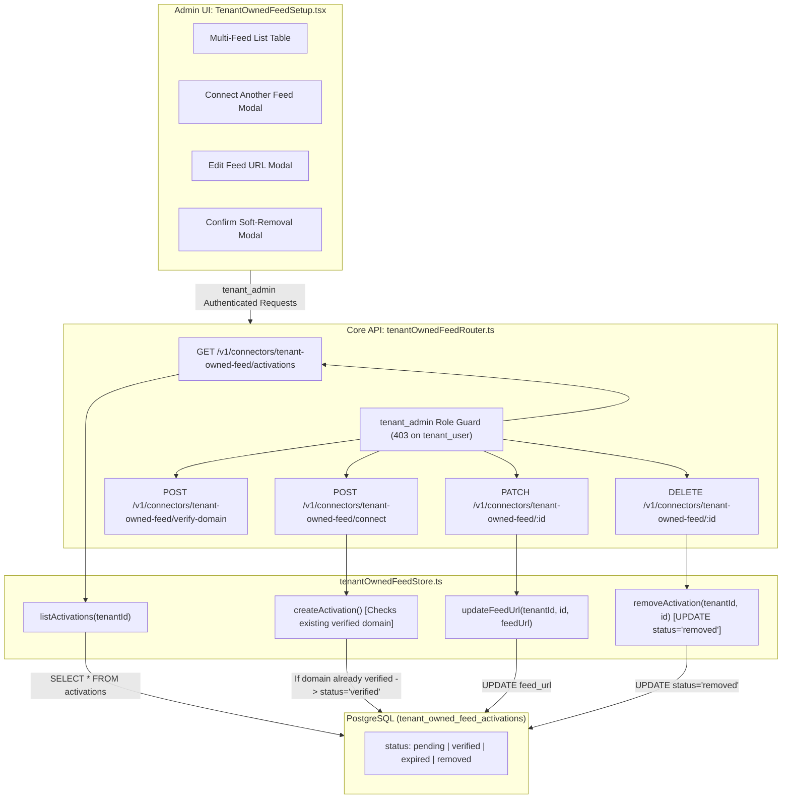
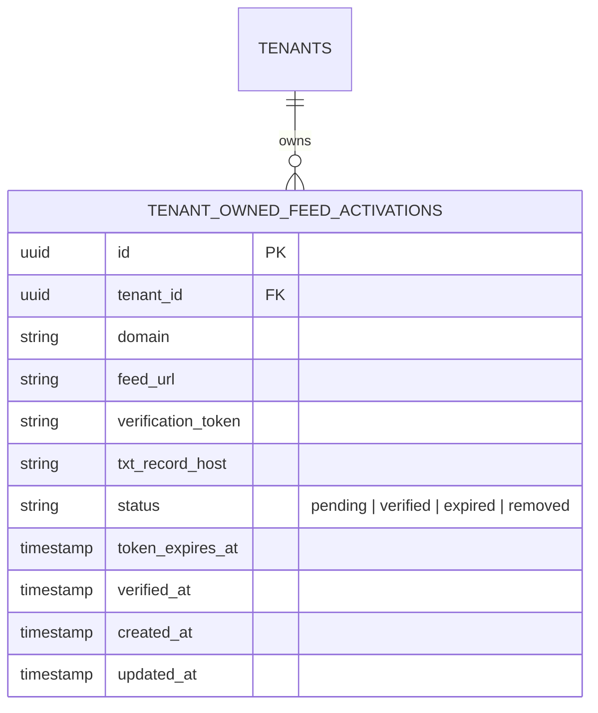

# Technical Design Specification (TDS) — Tenant-Owned-Feed Multi-Feed Administration

## 1. Document Control & Traceability Linkage

### 1.1 Metadata
| Attribute | Value |
|---|---|
| **Document Title** | TDS-0057: Multi-Feed Administration for the Tenant-Owned-Feed Connector |
| **Document ID** | `TDS-0057` |
| **Feature Name** | Multi-Feed Administration (List, Edit Feed URL, Soft-Remove, Same-Domain Auto-Verify) |
| **Version** | `1.0.0` |
| **Status** | Approved |
| **Author(s)** | Core API & Admin UI Team |
| **Created Date** | 2026-09-04 |
| **Last Updated** | 2026-09-04 |
| **Governing Skill** | `social-listening-core/.claude/skills/tenant-owned-feed-connector/SKILL.md` |

### 1.2 Upstream & Downstream Traceability Matrix
| Artifact Type | Reference Identifier | Title / Link | Alignment Status |
|---|---|---|---|
| **Architecture Decision Record** | `ADR-0057` | [ADR-0057: Multi-feed administration for the tenant-owned-feed connector](../../adr/0057-tenant-owned-feed-multi-feed-administration.md) | Invariant Source |
| **Business Requirements Doc** | `BRD-0057` | [BRD-0057: Tenant-Owned-Feed Multi-Feed Administration](../Business-Requirements/BRD-0057-Tenant-Owned-Feed-Multi-Feed-Administration.md) | Fully Aligned |
| **Functional Design Doc** | `FDD-0057` | [FDD-0057: Tenant-Owned-Feed Multi-Feed Administration](../Functional-Design/FDD-0057-Tenant-Owned-Feed-Multi-Feed-Administration.md) | Fully Aligned |
| **Governing User Story** | `Story 6.20` | [Epic 6: Tenant Admin UI](../../user-stories/epic-6-tenant-admin-ui.md#story-620--tenant-owned-feed-multi-feed-administration) | Acceptance Target |
| **Related User Story** | `Story 2.19` | [Epic 2: Ingestion Connectors and Rate Limits](../../user-stories/epic-2-ingestion-connectors-and-rate-limits.md#story-219--tenant-owned-feed-naming-and-byline) | Byline / Naming Contract |
| **Executable Contract Test** | `Story 6.20 Contract` | `contracts/epic-2/story-6.20.tenant-owned-feed-multi-feed-administration.contract.test.ts` | 100% Passing |

---

## 2. System Context & Architecture Topology

### 2.1 Context Diagram


### 2.2 Architectural Boundaries & Invariants
- **Strict Role-Based Access:** All endpoints under `/v1/connectors/tenant-owned-feed/` (`connect`, `verify-domain`, `activations`, `:id` patch, `:id` delete) strictly enforce `tenant_admin` role. `tenant_user` callers receive `403 Forbidden`.
- **Immutable Domain Verification Guarantee:** `PATCH /:id` accepts `{ feedUrl }` only. Passing `domain` triggers an immediate `400 Bad Request`. A verified domain anchor cannot be repointed to an unverified domain in-place.
- **Same-Domain Verification Bypass:** If a tenant already possesses a `status = 'verified'` record for a domain (e.g. `example.com`), registering an additional feed (e.g. `example.com/podcast.xml`) automatically marks the new row as `verified` without prompting for a redundant DNS TXT challenge.
- **Soft-Removal Invariant:** Calling `DELETE /:id` executes an `UPDATE` setting `status = 'removed'`. The audit trail is preserved; existing posts remain intact, and polling halts immediately because `getVerifiedActivations()` filters strictly on `status = 'verified'`.

---

## 3. Data Architecture & Persistence Design

### 3.1 Entity Relationship Diagram


### 3.2 Schema Migration (PostgreSQL)
```sql
-- Migration 0029_add_removed_status_to_feed_activations.sql
ALTER TABLE tenant_owned_feed_activations 
    DROP CONSTRAINT IF EXISTS tenant_owned_feed_activations_status_check;

ALTER TABLE tenant_owned_feed_activations 
    ADD CONSTRAINT tenant_owned_feed_activations_status_check 
    CHECK (status IN ('pending', 'verified', 'expired', 'removed'));

-- Index to optimize verified feed polling across multi-feed tenants
CREATE INDEX IF NOT EXISTS idx_tenant_owned_feeds_verified_poll 
    ON tenant_owned_feed_activations (tenant_id, domain) 
    WHERE status = 'verified';
```

---

## 4. API, Interface & Integration Contract Design

### 4.1 REST Endpoints Contract
```typescript
// GET /v1/connectors/tenant-owned-feed/activations
export interface FeedActivationListItem {
  id: string;
  domain: string;
  feedUrl: string;
  status: 'pending' | 'verified' | 'expired' | 'removed';
  txtRecordHost: string;
  txtRecordValue: string; // Dynamically computed via expectedTxtRecordValue()
  tokenExpiresAt: string;
  verifiedAt: string | null;
  createdAt: string;
}

// PATCH /v1/connectors/tenant-owned-feed/:id
export interface UpdateFeedUrlRequest {
  feedUrl: string; // Must be valid HTTP/HTTPS URL; domain edits forbidden
}

// DELETE /v1/connectors/tenant-owned-feed/:id
export interface RemoveFeedResponse {
  id: string;
  status: 'removed';
  message: string;
}
```

### 4.2 Router Implementation Snippet (`src/connectors/tenantOwnedFeedRouter.ts`)
```typescript
router.patch('/:id', requireTenantAdmin, async (req, res) => {
  const { id } = req.params;
  const { feedUrl, domain } = req.body;

  if (domain !== undefined) {
    return res.status(400).json({ error: 'Domain cannot be modified on an existing feed. Remove and reconnect to change domains.' });
  }

  if (!feedUrl || typeof feedUrl !== 'string') {
    return res.status(400).json({ error: 'Valid feedUrl is required.' });
  }

  const updated = await updateFeedUrl(req.tenantId, id, feedUrl);
  if (!updated) {
    return res.status(404).json({ error: 'Feed activation not found.' });
  }

  return res.status(200).json(updated);
});
```

---

## 5. Rate Limiting, Concurrency & Flow Control

- **Unbounded Feeds with Fair Queuing:** Ingestion polling iterates through all verified feeds per tenant. Each feed fetch acquires an outbound slot in `RequestGate`, enforcing a minimum delay between fetches to prevent hammering external web servers.
- **Concurrent Registration Protection:** Concurrent registrations for the same domain-feed combination are resolved safely via tenant-scoped transactions.

---

## 6. Security, Identity & Credential Governance

- **Uniform Role Enforcement:** Fixed legacy under-authorization by wrapping `connect` and `verify-domain` with `requireTenantAdmin`.
- **SSRF Validation on URL Edits:** `updateFeedUrl()` validates target hostnames against RFC 1918 private subnets and loopback addresses, preventing SSRF attacks when administrators update feed endpoints.

---

## 7. Error Handling, Resilience & Failure Classification

| Condition | HTTP Status | Error Code | Client Handling |
|---|---|---|---|
| `tenant_user` calls feed management | `403 Forbidden` | `FORBIDDEN_ROLE` | Admin UI redirects or disables actions for non-admin users. |
| In-place domain change attempted | `400 Bad Request` | `DOMAIN_EDIT_FORBIDDEN` | Displays error instructing user to remove and reconnect. |
| Malformed feed URL provided | `400 Bad Request` | `INVALID_FEED_URL` | Client form validation highlights malformed URL structure. |
| Non-existent feed ID | `404 Not Found` | `FEED_NOT_FOUND` | Refreshes feed list. |

---

## 8. Testing & Contract Gate Plan

### 8.1 Contract Tests
Contract test file: `contracts/epic-2/story-6.20.tenant-owned-feed-multi-feed-administration.contract.test.ts`.

| Test ID | Scenario | Verification Method |
|---|---|---|
| `TEST-MFEED-01` | List all tenant feeds | Create pending, verified, and removed feeds; assert `GET /activations` returns all rows with recomputed TXT values. |
| `TEST-MFEED-02` | Same-domain auto-verification | Verify `example.com/feed1`; connect `example.com/feed2`; assert `feed2` status is immediately `verified`. |
| `TEST-MFEED-03` | Role-based authorization guard | Call `connect`, `patch`, and `delete` with `role: 'tenant_user'`; assert `403 Forbidden` for each. |
| `TEST-MFEED-04` | Reject domain modification | Send `PATCH /:id` with `{ domain: 'newdomain.com' }`; assert `400 Bad Request`. |
| `TEST-MFEED-05` | Soft deletion status transition | Call `DELETE /:id`; assert row status transitions to `removed` and is omitted from `getVerifiedActivations()`. |

---

## 9. Component Skill (`SKILL.md`) Documentation Updates

Updates to `.claude/skills/tenant-owned-feed-connector/SKILL.md`:
- **Multi-Feed Support:** Document that a tenant may hold multiple active feeds across one or more domains.
- **Same-Domain Bypass Rule:** Note that once a domain has at least one verified record, subsequent feeds on the same domain bypass DNS verification.
- **Admin-Only Rule:** All feed configuration routes are strictly restricted to `tenant_admin`.

---

## 10. Observability, Metrics & Operational Telemetry

- `tenant_owned_feeds_active_gauge{tenant_id}` (gauge)
- `tenant_owned_feed_mutations_total{action="connect|verify|patch|delete"}` (counter)

---

## 11. Migration, Rollout & Feature Gating

- Migration `0029_add_removed_status_to_feed_activations.sql` updates the check constraint.
- Admin UI `TenantOwnedFeedSetup.tsx` updated to render multi-feed table layout with inline edit and modal confirmation.

---

## 12. Technical Assumptions, Dependencies & Open Questions

### 12.1 Assumptions & Dependencies
- **[A-0057-1]** Postgres CHECK constraints can be modified safely via drop-and-add statements.
- **[D-0057-1]** `getVerifiedActivations()` used by `pollTenantOwnedFeed` filters strictly by `status = 'verified'`.

### 12.2 Open Questions
- [x] **[Q-0057-1]** *Feed Count Ceiling:* Left unbounded at v1; operational telemetry will monitor outbound poll volume.
- [x] **[Q-0057-2]** *Expired Token Cleanup:* Retained for historical audit; expired rows can be removed manually by admins.
- [x] **[Q-0057-3]** *Platform Admin Visibility:* Scoped separately to Platform Admin console epic.
