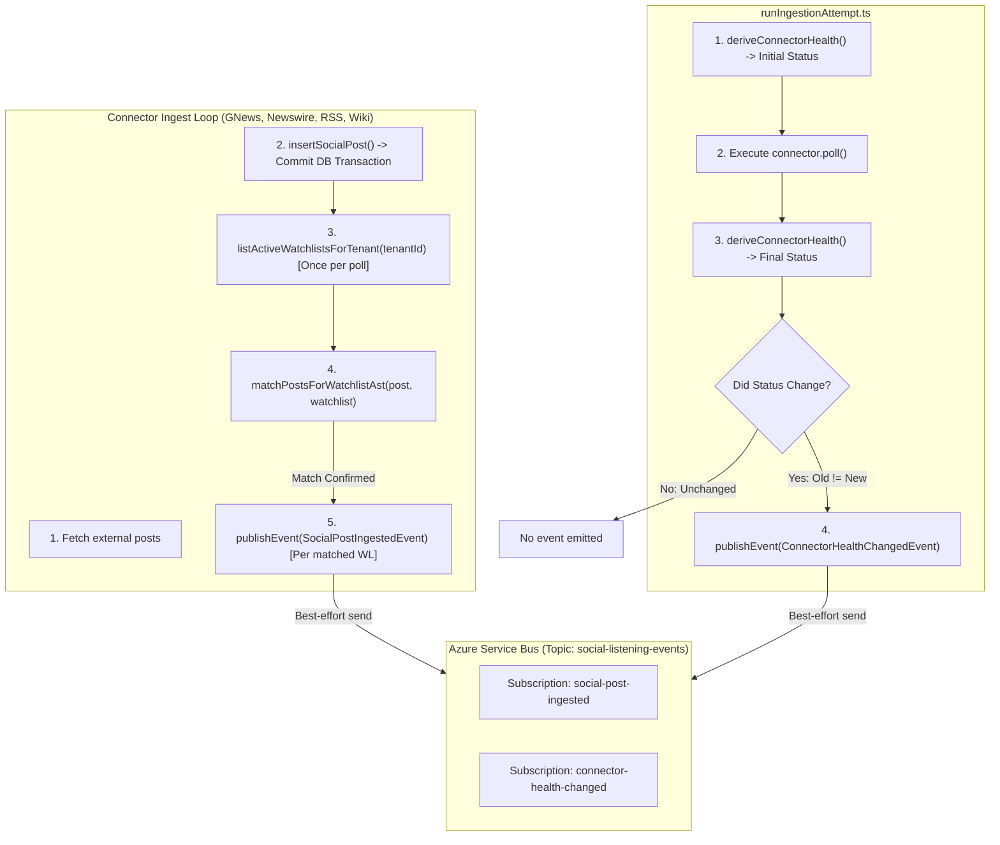

# Technical Design Specification (TDS) — Wire Ingestion Events Into Real Connector Pipeline

## 1. Document Control & Traceability Linkage

### 1.1 Metadata
| Attribute | Value |
|---|---|
| **Document Title** | TDS-0058: Wire SocialPostIngestedEvent and ConnectorHealthChangedEvent Publishing into the Real Pipeline |
| **Document ID** | `TDS-0058` |
| **Feature Name** | Asynchronous Event Publishing Pipeline (`SocialPostIngestedEvent` & `ConnectorHealthChangedEvent`) |
| **Version** | `1.0.0` |
| **Status** | Approved |
| **Author(s)** | Core Architecture Team |
| **Created Date** | 2026-09-04 |
| **Last Updated** | 2026-09-04 |
| **Governing Skill** | `social-listening-core/.claude/skills/ingestion-events/SKILL.md` |

### 1.2 Upstream & Downstream Traceability Matrix
| Artifact Type | Reference Identifier | Title / Link | Alignment Status |
|---|---|---|---|
| **Architecture Decision Record** | `ADR-0058` | [ADR-0058: Wire SocialPostIngestedEvent/ConnectorHealthChangedEvent publishing into the real ingestion pipeline](../../adr/0058-wire-ingestion-events-into-real-connector-pipeline.md) | Invariant Source |
| **Business Requirements Doc** | `BRD-0058` | [BRD-0058: Wire Ingestion Events Into Real Connector Pipeline](../Business-Requirements/BRD-0058-Wire-Ingestion-Events-Into-Real-Connector-Pipeline.md) | Fully Aligned |
| **Functional Design Doc** | `FDD-0058` | [FDD-0058: Wire Ingestion Events Into Real Connector Pipeline](../Functional-Design/FDD-0058-Wire-Ingestion-Events-Into-Real-Connector-Pipeline.md) | Fully Aligned |
| **Governing User Story** | `Story 5.19` | [Epic 5: Security, Isolation, and Messaging](../../user-stories/epic-5-security-isolation-and-messaging.md#story-519--wire-ingestion-events-into-real-connector-pipeline) | Acceptance Target |
| **Related User Stories** | `Story 5.1`, `5.2`, `5.5` | [Epic 5: Security, Isolation, and Messaging](../../user-stories/epic-5-security-isolation-and-messaging.md) | Underlying Thin Event Contract |
| **Executable Contract Test** | `Story 5.19 Contract` | `contracts/epic-5/story-5.19.wire-ingestion-events.contract.test.ts` | 100% Passing |

---

## 2. System Context & Architecture Topology

### 2.1 Context Diagram


### 2.2 Architectural Boundaries & Invariants
- **Best-Effort Delivery Invariant:** Event emission to Azure Service Bus must *never* block, fail, or roll back the core ingestion pipeline or database transactions. Failures in `publishEvent()` are trapped, logged, and surfaced via metrics without throwing errors upstream.
- **Post-Commit Publication Guarantee:** Events are emitted strictly *after* `insertSocialPost()` has committed to Postgres. Subscribers responding to events can immediately fetch the post via REST (`GET /v1/posts/:id`) without experiencing read replica race conditions.
- **Watchlist Batch Fetching Discipline:** `listActiveWatchlistsForTenant(tenantId)` is called exactly once per connector poll batch, not per-post. AST matching is performed in-memory across the candidate posts.
- **Automated Health Event Triggering:** Health change detection occurs centrally inside `runIngestionAttempt.ts` by comparing status before and after run execution. New connectors inherit health event publication automatically without bespoke code.

---

## 3. Data Architecture & Persistence Design

### 3.1 Tenant-Wide Watchlist Store Function
Ingestion operates in a tenant-wide background context with no active user session. It requires querying active watchlists across all users for a given tenant:

```sql
-- Query executed by listActiveWatchlistsForTenant(tenantId)
SELECT 
    id,
    tenant_id,
    name,
    ast_expression,
    platform_ids,
    is_active
FROM watchlists
WHERE tenant_id = $1 
  AND is_active = TRUE;
```

---

## 4. API, Interface & Integration Contract Design

### 4.1 Thin Event Payload Contracts (`src/events/types.ts`)
```typescript
export interface SocialPostIngestedEvent {
  eventType: 'SocialPostIngestedEvent';
  schemaVersion: '1.0';
  tenantId: string;
  postId: string;
  platformId: string;
  watchlistId: string; // Required; 1:N mapping generates 1 event per matched watchlist
  externalId: string;
  publishedAt: string;
  ingestedAt: string;
}

export interface ConnectorHealthChangedEvent {
  eventType: 'ConnectorHealthChangedEvent';
  schemaVersion: '1.0';
  tenantId: string;
  platformId: string;
  previousStatus: 'healthy' | 'degraded' | 'failing' | 'disconnected' | 'reconnect_required';
  currentStatus: 'healthy' | 'degraded' | 'failing' | 'disconnected' | 'reconnect_required';
  changedAt: string;
}
```

### 4.2 Centralized Orchestrator Wiring (`src/ingestion/runIngestionAttempt.ts`)
```typescript
export async function runIngestionAttempt(options: IngestionRunOptions): Promise<RunResult> {
  const { tenantId, platformId, executePoll } = options;

  // 1. Snapshot pre-run status
  const preHealth = await deriveConnectorHealth(tenantId, platformId);

  let result: RunResult;
  try {
    result = await executePoll();
  } finally {
    // 2. Snapshot post-run status
    try {
      const postHealth = await deriveConnectorHealth(tenantId, platformId);
      if (preHealth.status !== postHealth.status) {
        await publishEvent({
          eventType: 'ConnectorHealthChangedEvent',
          schemaVersion: '1.0',
          tenantId,
          platformId,
          previousStatus: preHealth.status,
          currentStatus: postHealth.status,
          changedAt: new Date().toISOString()
        }).catch(err => {
          console.error(`Failed to publish ConnectorHealthChangedEvent for ${platformId}:`, err);
        });
      }
    } catch (eventErr) {
      console.error('Error computing post-ingestion health event:', eventErr);
    }
  }

  return result;
}
```

---

## 5. Rate Limiting, Concurrency & Flow Control

- **Service Bus Backpressure Mitigation:** `publishEvent()` utilizes the Azure SDK's connection pooling and sender buffers. If Service Bus throttles with HTTP 503/429, retry logic runs internally before dropping the event safely.
- **Fan-Out Bounding:** A single ingested post matching $M$ watchlists produces $M$ discrete messages.

---

## 6. Security, Identity & Credential Governance

- **Service Bus Authentication:** Authenticates using Azure Managed Identity or connection strings stored in Azure Key Vault.
- **Tenant Isolation in Transit:** Every Service Bus message sets custom application property `tenantId`, enabling topic subscription filters (`tenantId = '...'`) to enforce cross-tenant message isolation before subscriber deserialization.

---

## 7. Error Handling, Resilience & Failure Classification

| Error Type | Action | System Impact |
|---|---|---|
| Service Bus Unreachable | Caught & logged to stderr | Zero impact on post persistence or database consistency. |
| Malformed Watchlist AST | AST evaluator skips invalid clause | Post saved; warning logged; unaffected watchlists evaluated. |
| Ingestion Exception | Standard classification | Run marked failed; pre/post health comparison triggers health event. |

---

## 8. Testing & Contract Gate Plan

### 8.1 Contract Tests
Contract test file: `contracts/epic-5/story-5.19.wire-ingestion-events.contract.test.ts`.

| Test ID | Scenario | Verification Method |
|---|---|---|
| `TEST-EVT-01` | Post ingested with 1 matching watchlist | Ingest article matching single watchlist; assert 1 `SocialPostIngestedEvent` published with correct `watchlistId`. |
| `TEST-EVT-02` | Post ingested with 3 matching watchlists | Ingest article matching 3 watchlists; assert 3 distinct events dispatched to Service Bus mock. |
| `TEST-EVT-03` | Post matching 0 watchlists | Ingest article matching no terms; assert zero events dispatched. |
| `TEST-EVT-04` | Connector health transition | Simulate connector failure switching status from `healthy` to `degraded`; assert `ConnectorHealthChangedEvent` emitted. |
| `TEST-EVT-05` | Event bus transport outage | Force Service Bus publisher to reject; assert `insertSocialPost` succeeds and returns post row without throwing. |

---

## 9. Component Skill (`SKILL.md`) Documentation Updates

Updates to `.claude/skills/ingestion-events/SKILL.md`:
- **Post-Commit Invariant:** Note that event publishing occurs strictly after the post row transaction commits.
- **Watchlist Matching Rule:** Document that `SocialPostIngestedEvent` requires a valid `watchlistId` obtained via `matchPostsForWatchlistAst()`.

---

## 10. Observability, Metrics & Operational Telemetry

- `ingestion_events_published_total{event_type, platform_id}` (counter)
- `ingestion_events_publish_failed_total{event_type, platform_id}` (counter)
- `ingestion_event_publish_latency_ms` (histogram)

---

## 11. Migration, Rollout & Feature Gating

- Pure application-layer enhancement; no database DDL migrations required.
- Deployed across all active connectors simultaneously.

---

## 12. Technical Assumptions, Dependencies & Open Questions

### 12.1 Assumptions & Dependencies
- **[A-0058-1]** Azure Service Bus namespace and `social-listening-events` topic are active.
- **[D-0058-1]** `publishEvent()` in `src/events/serviceBusPublisher.ts`.

### 12.2 Open Questions
- [x] **[Q-0058-1]** *Fan-Out Scaling:* Per-match event publishing accepted for initial release; batching can be introduced if watchlist counts scale heavily.
- [x] **[Q-0058-2]** *Health Diffing Location:* Centrally placed in `runIngestionAttempt.ts`.
- [x] **[Q-0058-3]** *Failure Handling:* Decoupled via non-blocking try/catch.
