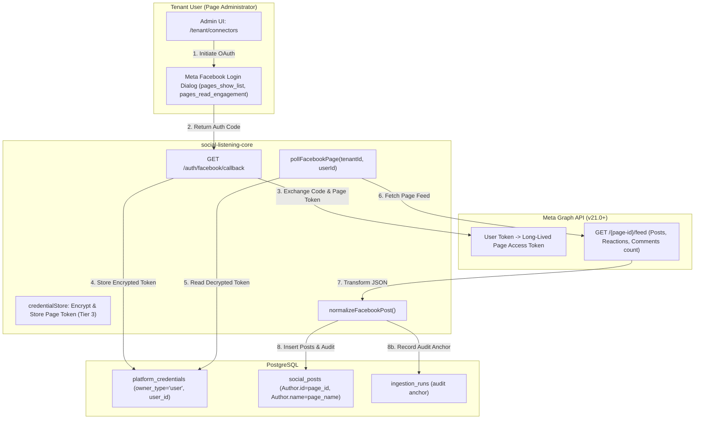
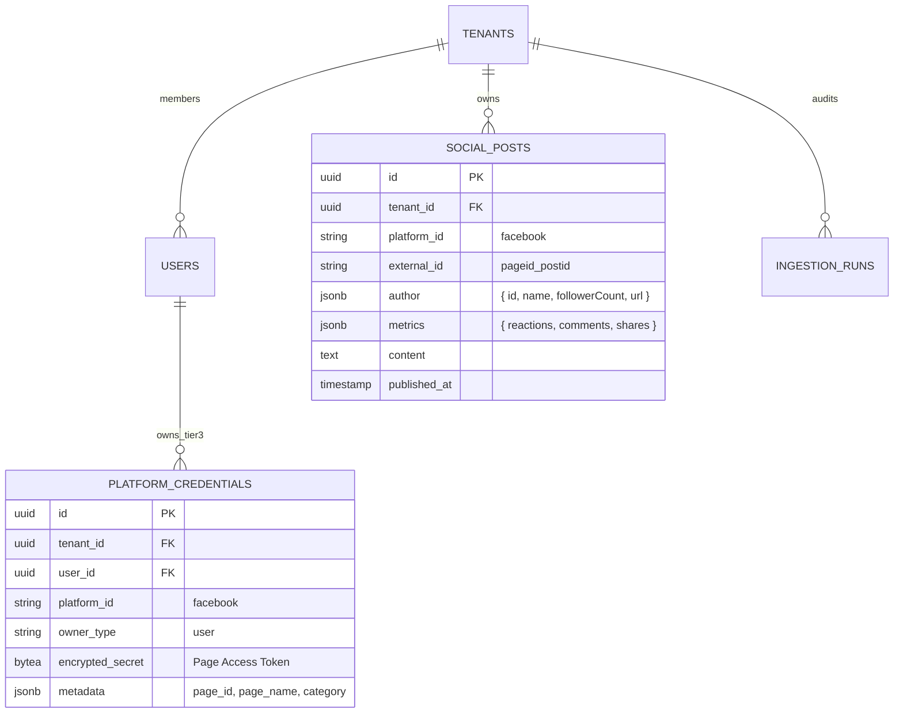

# Technical Design Specification (TDS) — Facebook Connector (Tenant-Owned Page Scope & Organization Author)

## 1. Document Control & Traceability Linkage

### 1.1 Metadata
| Attribute | Value |
|---|---|
| **Document Title** | TDS-0059: Facebook Connector — Narrowed to Tenant-Owned Connected Page Scope with Organization-as-Author |
| **Document ID** | `TDS-0059` |
| **Feature Name** | Facebook Page Ingestion Connector & Tier-3 OAuth Token Lifecycle |
| **Version** | `1.0.0` |
| **Status** | Approved |
| **Author(s)** | Core Connector Architecture Team |
| **Created Date** | 2026-09-04 |
| **Last Updated** | 2026-09-04 |
| **Governing Skill** | `social-listening-core/.claude/skills/facebook-connector/SKILL.md` |

### 1.2 Upstream & Downstream Traceability Matrix
| Artifact Type | Reference Identifier | Title / Link | Alignment Status |
|---|---|---|---|
| **Architecture Decision Record** | `ADR-0059` | [ADR-0059: Facebook connector — narrowed to a tenant's own connected Page](../../adr/0059-facebook-connector-tenant-owned-page-scope-organization-as-author.md) | Invariant Source |
| **Business Requirements Doc** | `BRD-0059` | [BRD-0059: Facebook Connector Tenant-Owned Page Scope](../Business-Requirements/BRD-0059-Facebook-Connector-Tenant-Owned-Page-Scope-Organization-As-Author.md) | Fully Aligned |
| **Functional Design Doc** | `FDD-0059` | [FDD-0059: Facebook Connector Tenant-Owned Page Scope](../Functional-Design/FDD-0059-Facebook-Connector-Tenant-Owned-Page-Scope-Organization-As-Author.md) | Fully Aligned |
| **Governing User Story** | `Story 2.15` | [Epic 2: Ingestion Connectors and Rate Limits](../../user-stories/epic-2-ingestion-connectors-and-rate-limits.md#story-215--facebook-connector-narrowed-to-tenant-owned-connected-page) | Acceptance Target |
| **Related User Stories** | `Story 6.3`, `Story 2.18` | [Epic 6: Tenant Admin UI](../../user-stories/epic-6-tenant-admin-ui.md) / [Epic 2](../../user-stories/epic-2-ingestion-connectors-and-rate-limits.md) | UI Display & Engagement Counts |
| **Executable Contract Test** | `Story 2.15 Contract` | `contracts/epic-2/story-2.15.facebook-connector.contract.test.ts` | 100% Passing |

---

## 2. System Context & Architecture Topology

### 2.1 Context Diagram


### 2.2 Architectural Boundaries & Invariants
- **Owned Page Scope Invariant:** The Facebook connector operates strictly as an owned-channel mirror. It connects to the specific Facebook Page(s) administered by the authenticated user. Broad public keyword discovery across unowned Facebook pages is non-viable and strictly prohibited by API constraints.
- **UI Labeling Discipline:** The connector must *never* be labeled simply "Facebook" in the UI; it must be labeled **"Facebook Page (Owned Feed)"** to prevent tenant confusion regarding public social listening capabilities.
- **Tier-3 Credential Governance:** Authentication is bound to an individual Page Administrator (`owner_type = 'user'`). A Tenant Admin cannot create or activate this credential on behalf of another user.
- **Organization-as-Author Modeling:** Ingested posts assign the Facebook Page as `Author` (`Author.externalAuthorId = page.id`, `Author.name = page.name`). In contrast to keyless RSS feeds, `Author.followerCount` is populated directly from the Page's fan/follower count.
- **Silent Invalidation Detection:** Token revocations or permissions changes (e.g. user removed as Page admin) immediately transition connector health to `'reconnect_required'` via `deriveConnectorHealth()`.

---

## 3. Data Architecture & Persistence Design

### 3.1 Entity Relationship Diagram


---

## 4. API, Interface & Integration Contract Design

### 4.1 Normalized Post Mapping (`src/connectors/facebook/facebookNormalizer.ts`)
```typescript
export interface MetaGraphPost {
  id: string; // "{page_id}_{post_id}"
  message?: string;
  created_time: string;
  permalink_url: string;
  shares?: { count: number };
  reactions?: { summary: { total_count: number } };
  comments?: { summary: { total_count: number } };
}

export function normalizeFacebookPost(raw: MetaGraphPost, pageMetadata: { pageId: string; pageName: string; fans: number }): NormalizedSocialPost {
  return {
    externalId: raw.id,
    platform: 'facebook',
    content: raw.message ?? '',
    publishedAt: new Date(raw.created_time),
    url: raw.permalink_url,
    author: {
      id: pageMetadata.pageId,
      name: pageMetadata.pageName,
      handle: pageMetadata.pageName,
      followerCount: pageMetadata.fans,
      isOrganization: true
    },
    metrics: {
      likes: raw.reactions?.summary?.total_count ?? 0,
      comments: raw.comments?.summary?.total_count ?? 0,
      shares: raw.shares?.count ?? 0
    }
  };
}
```

---

## 5. Rate Limiting, Concurrency & Flow Control

- **Engaged-Users Rate Limit Algorithm:** Meta enforces a dynamic rate limit of **$4,800 \times \text{Engaged Users}$** calls per rolling 24-hour window per Page.
- **Request Gate Mapping:** Polling requests are tracked in `RequestGate` under the composite key `tenantId:userId:facebook`. Polling intervals default to 30 minutes, preventing quota exhaustion even on low-engagement Pages.

---

## 6. Security, Identity & Credential Governance

- **Scope Minimalism:** The OAuth handshake requests the absolute minimum permissions: `pages_show_list`, `pages_read_engagement`.
- **Token Envelope Encryption:** Long-lived Page access tokens are stored in `platform_credentials` with AES-256-GCM envelope encryption under the tenant's Key Vault key.
- **Re-Consent Health Transition:** When Meta returns OAuth Error Code `190` (Invalid/Revoked Access Token) or Subcode `463` (Expired), the failure is classified as non-retryable and health transitions to `reconnect_required`.

---

## 7. Error Handling, Resilience & Failure Classification

| Meta Graph API Error | Classification | Health Transition | Recovery Action |
|---|---|---|---|
| `OAuthException` (Code 190, Subcode 463/467) | Non-Retryable | `reconnect_required` | Prompt Page Admin in UI to re-authenticate via Facebook Login. |
| Rate Limit Reached (Code 4 / Code 17 / Code 32) | Retryable | `degraded` | Back off polling exponentially; resume on next scheduler tick. |
| Server Temporary (Code 1 / Code 2) | Retryable | `healthy` / `degraded` | Standard retry with jitter; do not halt pipeline. |

---

## 8. Testing & Contract Gate Plan

### 8.1 Contract Tests
Contract test file: `contracts/epic-2/story-2.15.facebook-connector.contract.test.ts`.

| Test ID | Scenario | Verification Method |
|---|---|---|
| `TEST-FB-01` | OAuth Page token ingestion | Mock Graph API `/feed` response; verify normalized `SocialPost` creation with Page Author. |
| `TEST-FB-02` | Follower count persistence | Assert `Author.followerCount` is populated from Page fan count metadata. |
| `TEST-FB-03` | OAuth invalidation handling | Simulate HTTP 400 with code 190; assert failure recorded as non-retryable and health derives `reconnect_required`. |
| `TEST-FB-04` | Post-fetch fallback matching | Run watchlist AST matching against ingested Page post text; assert matches resolved via ADR-0006 fallback. |

---

## 9. Component Skill (`SKILL.md`) Documentation Updates

Updates to `.claude/skills/facebook-connector/SKILL.md`:
- **Owned Scope Policy:** Emphasize that Facebook connector is restricted to owned Facebook Pages.
- **Tier-3 Credentials:** Explicitly detail that credentials must be stored under `owner_type = 'user'` with associated `userId`.
- **UI Naming:** Require UI components to display "Facebook Page (Owned Feed)".

---

## 10. Observability, Metrics & Operational Telemetry

- `facebook_ingested_posts_total{page_id}` (counter)
- `facebook_token_status{tenant_id, user_id, status="valid|reconnect_required"}` (gauge)
- `facebook_graph_api_rate_limit_percent` (gauge)

---

## 11. Migration, Rollout & Feature Gating

- Prerequisite: Meta App registration, Business Verification, and App Review approval for `pages_show_list` and `pages_read_engagement`.
- Core pipeline: Registers connector via `src/connectors/registry.ts`.

---

## 12. Technical Assumptions, Dependencies & Open Questions

### 12.1 Assumptions & Dependencies
- **[A-0059-1]** Connecting user is an active Administrator of the target Facebook Page.
- **[D-0059-1]** Meta Graph API v21.0 or higher.

### 12.2 Open Questions
- [x] **[Q-0059-1]** *Public Content Feasibility:* Confirmed non-viable for general monitoring; narrowed to owned Page posts.
- [x] **[Q-0059-2]** *Credential Tier:* Revised from Tier 2 to Tier 3 (user-bound OAuth grant).
- [x] **[Q-0059-3]** *Comments & Mentions:* Deferred from v1 over third-party personal data privacy concerns.
