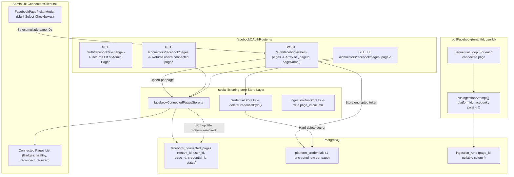
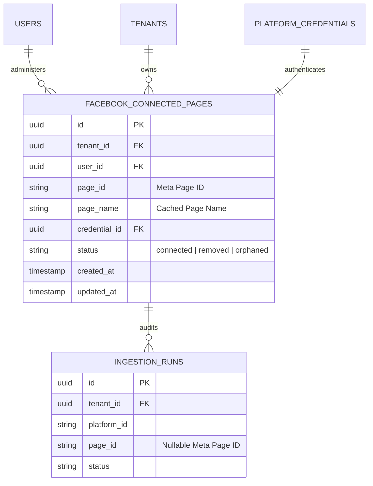

# Technical Design Specification (TDS) — Facebook Connector: Multiple Pages Per User

## 1. Document Control & Traceability Linkage

### 1.1 Metadata
| Attribute | Value |
|---|---|
| **Document Title** | TDS-0060: Facebook Connector — Multiple Pages Per User Cardinality Architecture |
| **Document ID** | `TDS-0060` |
| **Feature Name** | Multi-Page Connection, Storage (`facebook_connected_pages`), & Sequential Per-Page Polling |
| **Version** | `1.0.0` |
| **Status** | Approved |
| **Author(s)** | Core Connector Architecture Team |
| **Created Date** | 2026-09-04 |
| **Last Updated** | 2026-09-04 |
| **Governing Skill** | `social-listening-core/.claude/skills/facebook-connector/SKILL.md` |

### 1.2 Upstream & Downstream Traceability Matrix
| Artifact Type | Reference Identifier | Title / Link | Alignment Status |
|---|---|---|---|
| **Architecture Decision Record** | `ADR-0060` | [ADR-0060: Facebook connector — one user may connect more than one Page](../../adr/0060-facebook-connector-multiple-pages-per-user.md) | Invariant Source |
| **Business Requirements Doc** | `BRD-0060` | [BRD-0060: Facebook Connector Multiple Pages Per User](../Business-Requirements/BRD-0060-Facebook-Connector-Multiple-Pages-Per-User.md) | Fully Aligned |
| **Functional Design Doc** | `FDD-0060` | [FDD-0060: Facebook Connector Multiple Pages Per User](../Functional-Design/FDD-0060-Facebook-Connector-Multiple-Pages-Per-User.md) | Fully Aligned |
| **Governing User Story** | `Story 6.27` | [Epic 6: Tenant Admin UI](../../user-stories/epic-6-tenant-admin-ui.md#story-627--facebook-support-connecting-more-than-one-page-per-user) | Acceptance Target |
| **Executable Contract Test** | `Story 6.27 Contract` | `contracts/epic-2/story-6.27.facebook-multi-page-support.contract.test.ts` | 100% Passing |

---

## 2. System Context & Architecture Topology

### 2.1 Context Diagram


### 2.2 Architectural Boundaries & Invariants
- **Per-User (Tier-3) Boundary:** Connected pages are strictly owned and managed by the authorizing user (`user_id`). A tenant admin cannot disconnect or modify another user's connected Facebook Pages.
- **Dedicated Child Table Invariant:** `facebook_connected_pages` isolates multi-page tracking from `platform_credentials`. `platform_credentials` remains a clean, generic envelope-encryption store with zero provider-specific schema leakage.
- **Sequential Ingestion Iteration:** The per-page poll cycle runs sequentially, never in unbounded parallel bursts (`Promise.all`). Each page poll acquires its slot via `RequestGate`, honoring Meta's rolling hourly window without spikes.
- **Independent Failure Isolation:** If a single Page token fails or expires, `ClassifiableError` is recorded for that specific `page_id` in `ingestion_runs`. Polling continues uninterrupted for the remaining connected pages.
- **Triple-Status Page Lifecycle:** Page status in `facebook_connected_pages` consists of:
  1. `connected`: Active and eligible for scheduled polling.
  2. `removed`: Deliberately disconnected by the owning user; secret deleted from `platform_credentials`.
  3. `orphaned`: Detected when a user re-authorizes OAuth but Meta's `/me/accounts` no longer returns the page (e.g. user removed as Page admin).

---

## 3. Data Architecture & Persistence Design

### 3.1 Entity Relationship Diagram


### 3.2 Schema DDL (PostgreSQL Migration)
```sql
-- Migration 0033_create_facebook_connected_pages.sql
CREATE TABLE IF NOT EXISTS facebook_connected_pages (
    id UUID PRIMARY KEY DEFAULT gen_random_uuid(),
    tenant_id UUID NOT NULL REFERENCES tenants(id) ON DELETE CASCADE,
    user_id UUID NOT NULL REFERENCES users(id) ON DELETE CASCADE,
    page_id VARCHAR(128) NOT NULL,
    page_name VARCHAR(255) NOT NULL,
    credential_id UUID NOT NULL REFERENCES platform_credentials(id) ON DELETE CASCADE,
    status VARCHAR(32) NOT NULL DEFAULT 'connected' 
        CHECK (status IN ('connected', 'removed', 'orphaned')),
    created_at TIMESTAMPTZ NOT NULL DEFAULT NOW(),
    updated_at TIMESTAMPTZ NOT NULL DEFAULT NOW(),
    CONSTRAINT uq_tenant_user_page UNIQUE (tenant_id, user_id, page_id)
);

ALTER TABLE facebook_connected_pages ENABLE ROW LEVEL SECURITY;
ALTER TABLE facebook_connected_pages FORCE ROW LEVEL SECURITY;

CREATE POLICY tenant_isolation_facebook_connected_pages ON facebook_connected_pages
    FOR ALL
    USING (tenant_id = NULLIF(current_setting('app.tenant_id', true), '')::uuid);

-- Add nullable page_id to ingestion_runs for per-page health auditing
ALTER TABLE ingestion_runs ADD COLUMN IF NOT EXISTS page_id VARCHAR(128);

CREATE INDEX IF NOT EXISTS idx_ingestion_runs_platform_page 
    ON ingestion_runs (tenant_id, platform_id, page_id, started_at DESC);
```

---

## 4. API, Interface & Integration Contract Design

### 4.1 Multi-Page Selection Contract (`src/http/versions/v1/facebookOAuthRouter.ts`)
```typescript
// POST /v1/auth/facebook/select-pages
export interface SelectPagesRequest {
  sessionToken: string;
  selectedPages: Array<{
    pageId: string;
    pageName: string;
  }>;
}

export interface SelectPagesResponse {
  results: Array<{
    pageId: string;
    status: 'connected' | 'error';
    error?: string;
  }>;
}

// GET /v1/connectors/facebook/pages
export interface ConnectedPageListItem {
  id: string;
  pageId: string;
  pageName: string;
  status: 'connected' | 'removed' | 'orphaned';
  healthStatus: 'healthy' | 'degraded' | 'failing' | 'reconnect_required';
  lastPolledAt: string | null;
  createdAt: string;
}
```

### 4.2 Credential Store Targeted Deletion (`src/credentials/credentialStore.ts`)
```typescript
export async function deleteCredentialById(tenantId: string, credentialId: string): Promise<void> {
  await pool.query(
    `DELETE FROM platform_credentials
     WHERE tenant_id = $1 AND id = $2`,
    [tenantId, credentialId]
  );
}
```

### 4.3 Page-Aware Health Derivation (`src/connectors/connectorHealth.ts`)
```typescript
export async function deriveConnectorHealth(
  tenantId: string,
  platformId: string,
  pageId?: string
): Promise<ConnectorHealth> {
  const query = pageId 
    ? `SELECT status, started_at, completed_at, error_summary, is_credential_failure, retryable 
       FROM ingestion_runs 
       WHERE platform_id = $1 AND page_id = $2 
       ORDER BY started_at DESC LIMIT 20`
    : `SELECT status, started_at, completed_at, error_summary, is_credential_failure, retryable 
       FROM ingestion_runs 
       WHERE platform_id = $1 
       ORDER BY started_at DESC LIMIT 20`;

  const params = pageId ? [platformId, pageId] : [platformId];
  const { rows } = await pool.query(query, params);

  return calculateHealthFromRuns(rows);
}
```

---

## 5. Rate Limiting, Concurrency & Flow Control

- **Sequential Processing:** Pages are processed in a strict sequence:
  ```typescript
  for (const page of connectedPages) {
    await pollFacebookSinglePage(tenantId, userId, page);
  }
  ```
- **Shared RequestGate Serialization:** All HTTP calls acquire tokens under the gate key `${tenantId}:${userId}:facebook`. Pacing is shared across all pages, ensuring that 20 connected pages never burst outbound traffic beyond Meta API limits.

---

## 6. Security, Identity & Credential Governance

- **Authorization Scope:** The user claiming and connecting pages must provide a valid OAuth user token containing `pages_show_list` permission.
- **Granular Secret Erasure:** Disconnecting a single Page calls `deleteCredentialById()`, removing that specific Page access token while leaving other active page tokens undisturbed.

---

## 7. Error Handling, Resilience & Failure Classification

- **Partial Failure in OAuth Multi-Select:** If token exchange fails for 1 page out of 10 during `select-pages`, successful pages are committed and the failing page is returned with an error description in the response array.
- **Per-Page Ingestion Fault Isolation:** A fatal OAuth error on `page_A` records an `IngestionRun` marked `status: 'failed'` with `is_credential_failure: true`, without aborting the loop for `page_B`.

---

## 8. Testing & Contract Gate Plan

### 8.1 Contract Tests
Contract test file: `contracts/epic-2/story-6.27.facebook-multi-page-support.contract.test.ts`.

| Test ID | Scenario | Verification Method |
|---|---|---|
| `TEST-FBMP-01` | Connect multiple pages | Submit 3 pages in `select-pages`; assert 3 distinct rows in `facebook_connected_pages` and `platform_credentials`. |
| `TEST-FBMP-02` | Sequential poll execution | Trigger `pollFacebook()`; verify 3 separate `ingestion_runs` created, each with matching `page_id`. |
| `TEST-FBMP-03` | Granular per-page disconnect | Disconnect Page 1; assert Page 1 status is `removed`, Page 1 credential deleted, Pages 2 & 3 untouched. |
| `TEST-FBMP-04` | Per-page health differentiation | Simulate failure on Page 1; assert Page 1 health is `reconnect_required` while Page 2 remains `healthy`. |
| `TEST-FBMP-05` | Orphaned page auto-transition | Re-run `/exchange` omitting a previously connected Page; assert missing Page transitions to `orphaned`. |

---

## 9. Component Skill (`SKILL.md`) Documentation Updates

Updates to `.claude/skills/facebook-connector/SKILL.md`:
- **Cardinality Rules:** Explicitly describe that a single user may hold multiple connected Facebook Pages.
- **Sequential Polling Discipline:** Mandate that `pollFacebook` iterates pages in sequence and logs independent `ingestion_runs` per page.
- **Per-Page Health Querying:** Guide developers to pass `pageId` to `deriveConnectorHealth()` when querying status for individual pages.

---

## 10. Observability, Metrics & Operational Telemetry

- `facebook_connected_pages_gauge{tenant_id, user_id, status}` (gauge)
- `facebook_page_poll_duration_ms{page_id}` (histogram)
- `facebook_page_orphaned_transitions_total` (counter)

---

## 11. Migration, Rollout & Feature Gating

- Migration `0033_create_facebook_connected_pages.sql` creates table and indexes.
- Backward compatibility: Single-page installations automatically migrated into `facebook_connected_pages` via backfill script.

---

## 12. Technical Assumptions, Dependencies & Open Questions

### 12.1 Assumptions & Dependencies
- **[A-0060-1]** Authorizing user holds administrative access to all selected pages.
- **[D-0060-1]** Postgres RLS enforces tenant isolation on `facebook_connected_pages`.

### 12.2 Open Questions
- [x] **[Q-0060-1]** *Storage Pattern:* Decided on dedicated child table `facebook_connected_pages`.
- [x] **[Q-0060-2]** *Sequential vs Parallel:* Sequential execution adopted to protect Meta rate limits.
- [x] **[Q-0060-3]** *Health Resolution:* `deriveConnectorHealth` extended with optional `pageId` parameter.
