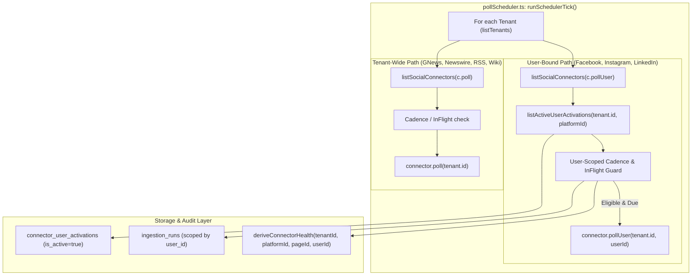

# Technical Design Specification (TDS) — Tier-3 (User-Bound) Poll Scheduling

## 1. Document Control & Traceability Linkage

### 1.1 Metadata
| Attribute | Value |
|---|---|
| **Document Title** | TDS-0061: Tier-3 (User-Bound) Poll Scheduling Engine with Per-User Isolation |
| **Document ID** | `TDS-0061` |
| **Feature Name** | Tier-3 Per-User Ingestion Scheduling, Cross-User Health Isolation, and `pollUser()` Dispatch |
| **Version** | `1.0.0` |
| **Status** | Approved |
| **Author(s)** | Core Architecture Team |
| **Created Date** | 2026-09-04 |
| **Last Updated** | 2026-09-04 |
| **Governing Skill** | `social-listening-core/.claude/skills/live-ingestion-polling-scheduler/SKILL.md` |

### 1.2 Upstream & Downstream Traceability Matrix
| Artifact Type | Reference Identifier | Title / Link | Alignment Status |
|---|---|---|---|
| **Architecture Decision Record** | `ADR-0061` | [ADR-0061: Tier-3 (user-bound) poll scheduling](../../adr/0061-tier-3-poll-scheduler-per-user-enumeration.md) | Invariant Source |
| **Business Requirements Doc** | `BRD-0061` | [BRD-0061: Tier-3 Poll Scheduler Per-User Enumeration](../Business-Requirements/BRD-0061-Tier-3-Poll-Scheduler-Per-User-Enumeration.md) | Fully Aligned |
| **Functional Design Doc** | `FDD-0061` | [FDD-0061: Tier-3 Poll Scheduler Per-User Enumeration](../Functional-Design/FDD-0061-Tier-3-Poll-Scheduler-Per-User-Enumeration.md) | Fully Aligned |
| **Governing User Story** | `Story 1.15` | [Epic 1: Repository and API Foundation](../../user-stories/epic-1-repository-and-api-foundation.md#story-115--tier-3-user-bound-poll-scheduling) | Acceptance Target |
| **Related User Stories** | `Story 1.13`, `1.14`, `6.27` | [Epic 1](../../user-stories/epic-1-repository-and-api-foundation.md) / [Epic 6](../../user-stories/epic-6-tenant-admin-ui.md) | In-Flight & Multi-Page Prereqs |
| **Executable Contract Test** | `Story 1.15 Contract` | `contracts/epic-1/story-1.15.tier3-poll-scheduling.contract.test.ts` | 100% Passing |

---

## 2. System Context & Architecture Topology

### 2.1 Context Diagram


### 2.2 Architectural Boundaries & Invariants
- **Strict Cross-User Isolation:** User A's failing runs or currently in-flight runs must *never* delay, skip, or disable User B's polling ticks within the same tenant.
- **Generic Polymorphic Dispatch:** `SocialConnector` exposes `pollUser?(tenantId: string, userId: string)` alongside existing `poll?`. The scheduler invokes `pollUser()` dynamically via registry introspection without platform hardcoding.
- **Per-User In-Flight Guard:** A Tier-3 poll is skipped if and only if that specific `(tenantId, platformId, userId)` pair has an active `ingestion_runs` row with `status = 'running'`.
- **User-Scoped Deterministic Jitter:** Jitter calculation is extended to 3 segments: `jitterFraction(tenantId, platformId, userId) = hash(tenantId:platformId:userId)`. This ensures that multiple users within the same tenant polling Facebook don't fire concurrently on the same tick.

---

## 3. Data Architecture & Persistence Design

### 3.1 Schema Migration (PostgreSQL)
```sql
-- Migration 0034_add_ingestion_runs_user_id.sql
ALTER TABLE ingestion_runs 
    ADD COLUMN IF NOT EXISTS user_id UUID REFERENCES users(id) ON DELETE SET NULL;

CREATE INDEX IF NOT EXISTS idx_ingestion_runs_tier3_poll 
    ON ingestion_runs (tenant_id, platform_id, user_id, started_at DESC);
```

### 3.2 User Enumeration & In-Flight Queries
```sql
-- 1. Enumerate active users for a Tier-3 platform
SELECT user_id 
FROM connector_user_activations 
WHERE tenant_id = $1 
  AND platform_id = $2 
  AND is_active = TRUE;

-- 2. In-flight status check for a specific user
SELECT status 
FROM ingestion_runs 
WHERE tenant_id = $1 
  AND platform_id = $2 
  AND user_id = $3 
ORDER BY started_at DESC 
LIMIT 1;
```

---

## 4. API, Interface & Integration Contract Design

### 4.1 Extended Connector Interfaces (`src/connectors/types.ts`)
```typescript
import { RunIngestionAttemptResult } from '../ingestion/runIngestionAttempt';

export interface SocialConnector {
  id: string;
  displayName: string;
  authMode: 'none' | 'apiKey' | 'oauth2';
  deliveryMode: 'poll' | 'webhook' | 'push';
  
  // Tier-2 tenant-wide entry point
  poll?(tenantId: string): Promise<RunIngestionAttemptResult>;
  
  // Tier-3 user-bound entry point
  pollUser?(tenantId: string, userId: string): Promise<RunIngestionAttemptResult>;
  
  pollCadenceMs?: number;
}
```

### 4.2 Extended Jitter & Health Signatures (`src/connectors/connectorHealth.ts`)
```typescript
export function jitterFraction(tenantId: string, platformId: string, userId?: string): number {
  const seed = userId ? `${tenantId}:${platformId}:${userId}` : `${tenantId}:${platformId}`;
  let hash = 0;
  for (let i = 0; i < seed.length; i++) {
    hash = ((hash << 5) - hash) + seed.charCodeAt(i);
    hash |= 0;
  }
  const normalized = Math.abs(hash % 1000) / 1000;
  return (normalized * 0.1) - 0.05; // [-0.05, +0.05]
}

export async function deriveConnectorHealth(
  tenantId: string,
  platformId: string,
  pageId?: string,
  userId?: string
): Promise<ConnectorHealth> {
  // Queries ingestion_runs and platform_credentials filtering by user_id if provided
  // Preserves full isolation across multiple users
}
```

### 4.3 Scheduler Ingestion Loop (`src/scheduler/pollScheduler.ts`)
```typescript
// Tier-3 user enumeration loop within runSchedulerTick()
const tier3Connectors = listSocialConnectors().filter(c => typeof c.pollUser === 'function' && c.pollCadenceMs !== undefined);

for (const connector of tier3Connectors) {
  const activeUserIds = await listActiveUserActivations(tenant.id, connector.id);
  
  for (const userId of activeUserIds) {
    try {
      const eligible = await shouldAttemptIngestion(tenant.id, connector.id, 'user', userId);
      if (!eligible) continue;

      const lastStatus = await getMostRecentRunStatusForUser(tenant.id, connector.id, userId);
      if (lastStatus === 'running') continue;

      const lastRun = await getMostRecentRunForUser(tenant.id, connector.id, userId);
      const cadence = connector.pollCadenceMs!;
      const jitter = jitterFraction(tenant.id, connector.id, userId);
      const effectiveCadence = cadence * (1 + jitter);

      const lastStartedAt = lastRun ? lastRun.startedAt.getTime() : -Infinity;
      if (now.getTime() - lastStartedAt >= effectiveCadence) {
        connector.pollUser!(tenant.id, userId).catch(err => {
          console.error(`Error polling Tier-3 connector ${connector.id} for user ${userId}:`, err);
        });
      }
    } catch (err) {
      console.error(`Scheduler evaluation failed for user ${userId} on ${connector.id}:`, err);
    }
  }
}
```

---

## 5. Rate Limiting, Concurrency & Flow Control

- **Tenant-Level Fair Pacing:** Even though polls are scheduled per-user, external requests flow through `RequestGate` using `tenantId:userId:platformId` or `tenantId:platformId`.
- **Parallel Dispatch Safety:** Different users within the same tenant are evaluated and dispatched independently without cross-user thread blocking.

---

## 6. Security, Identity & Credential Governance

- **User Context Injection:** Tier-3 polls invoke `withTenant(tenantId, fn, pool, userId)`. Downstream database writes have access to both `app.tenant_id` and `app.current_user_id` session variables.
- **Tenant Isolation:** Active user activation lists (`listActiveUserActivations`) run with RLS enforcement, ensuring tenant boundaries cannot be breached.

---

## 7. Error Handling, Resilience & Failure Classification

- **Independent User Failure Boundaries:** An uncaught exception in User A's `pollUser()` triggers the scheduler's inner `try/catch`, logging the error and proceeding directly to evaluate User B.
- **Circuit Breaker Localization:** Non-retryable OAuth token failures (e.g. Meta Error 190) disable only User A's activation; User B's activation remains `healthy` and continues normal scheduled polling.

---

## 8. Testing & Contract Gate Plan

### 8.1 Contract Tests
Contract test file: `contracts/epic-1/story-1.15.tier3-poll-scheduling.contract.test.ts`.

| Test ID | Scenario | Verification Method |
|---|---|---|
| `TEST-T3SCHED-01` | Active user enumeration | Activate Facebook for User 1 and User 2; verify scheduler evaluates both users on tick. |
| `TEST-T3SCHED-02` | Cross-user in-flight isolation | Set User 1 run status to `running`; assert User 1 is skipped while User 2 poll is invoked. |
| `TEST-T3SCHED-03` | Cross-user circuit-breaker isolation | Simulate 5 failures for User 1 (`failing`); assert User 2 health remains `healthy` and polls normally. |
| `TEST-T3SCHED-04` | Per-user jitter dispersion | Assert `jitterFraction` produces distinct offsets for User 1 and User 2 for same tenant & platform. |
| `TEST-T3SCHED-05` | Generic `pollUser` invocation | Register mock connector with `pollUser`; verify scheduler invokes `pollUser(tenantId, userId)`. |

---

## 9. Component Skill (`SKILL.md`) Documentation Updates

Updates to `.claude/skills/live-ingestion-polling-scheduler/SKILL.md`:
- **Tier-3 Interface Requirement:** Clarify that user-bound connectors must implement `pollUser(tenantId, userId)` rather than `poll(tenantId)`.
- **User Scoping:** Explain the role of `ingestion_runs.user_id` and why `deriveConnectorHealth` must receive `userId` for Tier-3 connectors.

---

## 10. Observability, Metrics & Operational Telemetry

- `scheduler_tier3_polls_triggered_total{platform_id, tenant_id, user_id}` (counter)
- `scheduler_tier3_polls_skipped_in_flight{platform_id, user_id}` (counter)

---

## 11. Migration, Rollout & Feature Gating

- Migration `0034_add_ingestion_runs_user_id.sql` adds column and index.
- Applied seamlessly without service restart.

---

## 12. Technical Assumptions, Dependencies & Open Questions

### 12.1 Assumptions & Dependencies
- **[A-0061-1]** Tier-3 connectors are activated in `connector_user_activations`.
- **[D-0061-1]** `users` table exists and foreign keys resolve correctly.

### 12.2 Open Questions
- [x] **[Q-0061-1]** *Signature Distinction:* TypeScript interface separation (`poll` vs `pollUser`) adopted.
- [x] **[Q-0061-2]** *Health Scoping:* `deriveConnectorHealth` parameter order coordinated (`tenantId, platformId, pageId?, userId?`).
- [x] **[Q-0061-3]** *Jitter Cardinality:* 3-segment hash implemented.
