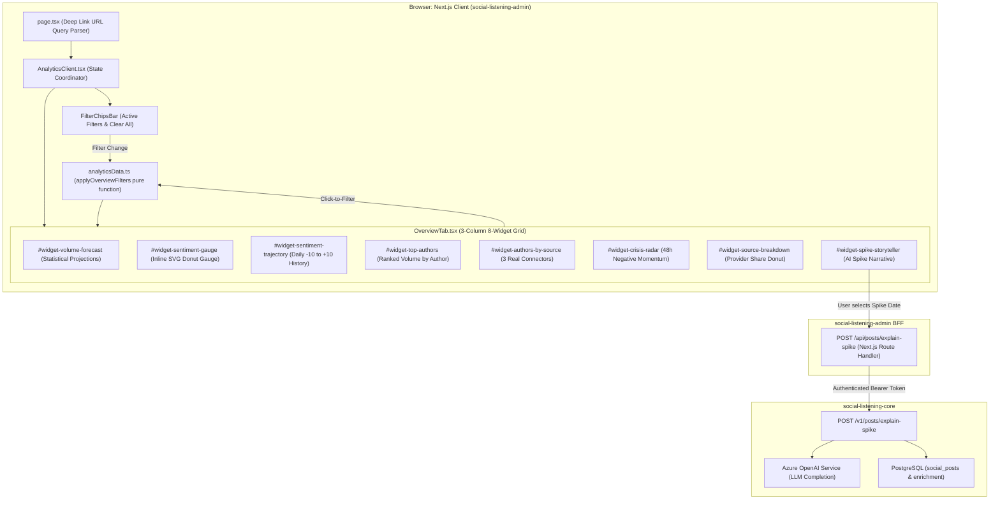

# Technical Design Specification (TDS) — Analytics Dashboard Overview Tab Enhancement

## 1. Document Control & Traceability Linkage

### 1.1 Metadata
| Attribute | Value |
|---|---|
| **Document Title** | TDS-0062: Analytics Dashboard Overview Tab Enhancement — 3-Column Responsive Grid, 7-Dimension Filter Engine, Statistical Forecast & AI Spike Storyteller |
| **Document ID** | `TDS-0062` |
| **Feature Name** | Overview Tab 8-Widget Grid, Multi-Dimensional Filter Model & AI Spike Storyteller |
| **Version** | `1.0.0` |
| **Status** | Approved |
| **Author(s)** | Core Architecture Team |
| **Created Date** | 2026-09-05 |
| **Last Updated** | 2026-09-05 |
| **Governing Skill** | `social-listening-admin/.claude/skills/analytics-dashboard/SKILL.md` |

### 1.2 Upstream & Downstream Traceability Matrix
| Artifact Type | Reference Identifier | Title / Link | Alignment Status |
|---|---|---|---|
| **Architecture Decision Record** | `ADR-0062` | [ADR-0062: Analytics Dashboard Overview Tab Enhancement](../../adr/0062-analytics-dashboard-overview-tab-enhancement.md) | Invariant Source |
| **Business Requirements Doc** | `BRD-0062` | [BRD-0062: Analytics Dashboard Overview Tab Enhancement](../Business-Requirements/BRD-0062-Analytics-Dashboard-Overview-Tab-Enhancement.md) | Fully Aligned |
| **Functional Design Doc** | `FDD-0062` | [FDD-0062: Analytics Dashboard Overview Tab Enhancement](../Functional-Design/FDD-0062-Analytics-Dashboard-Overview-Tab-Enhancement.md) | Fully Aligned |
| **Governing User Stories** | `Story 8.7`, `Story 8.8` | [Epic 8: Analytics Dashboard](../../user-stories/epic-8-analytics-dashboard.md#story-87--overview-tab-enhancement-multi-dimensional-filter-model-and-widget-grid) | Acceptance Target |
| **Related User Stories** | `Story 8.1`, `Story 8.4`, `Story 8.9`, `Story 8.10` | Shell, Period Comparison, Watchlist Widget, Location Insights | Sibling Modules |
| **Related Architecture Decisions** | `ADR-0054`, `ADR-0064`, `ADR-0087`, `ADR-0141` | Data-Source Strategy, Geospatial Insights, Precomputed Views, Top Authors providerId | Architectural Family |
| **Executable Contract Tests** | `Story 8.7 & 8.8 Contracts` | `social-listening-admin/contracts/epic-8/story-8.7.overview-tab-enhancement.contract.test.ts`<br>`social-listening-admin/contracts/epic-8/story-8.8.spike-storyteller-widget.contract.test.ts`<br>`social-listening-core/contracts/epic-8/story-8.8.posts-explain-spike.contract.test.ts` | 100% Passing |

---

## 2. System Context & Architecture Topology

### 2.1 Context Diagram


### 2.2 Architectural Boundaries & Invariants
- **8 Exact Prefixed Widget IDs:** Overview Tab DOM strictly anchors widgets to 8 reserved element IDs: `widget-volume-forecast`, `widget-sentiment-gauge`, `widget-sentiment-trajectory`, `widget-top-authors`, `widget-authors-by-source`, `widget-crisis-radar`, `widget-source-breakdown`, and `widget-spike-storyteller`.
- **Pure Client-Side 7-Dimension Filter Model:** Filtering across `date`, `source`, `sentiment`, `language`, `author`, `crisisOnly`, and `postType` executes client-side with strict **AND** semantics via pure function `applyOverviewFilters()`. Unset dimensions evaluate to all-pass.
- **Deep-Link URL Bidirectional Round-Tripping:** All 7 filter states serialize into URL search parameters (`?source=gnews&sentiment=negative...`), enabling shareable analytical snapshots. Invalid query parameters silently fall back to safe defaults without throwing.
- **AI Spike Storyteller Isolated Backend Endpoint:** The only server-side operation is `POST /v1/posts/explain-spike`. It executes on-demand when a user clicks a volume anomaly, synthesizing a contextual narrative. If Azure OpenAI credentials are not configured, the backend returns an explicit `503 AI_UNAVAILABLE` rather than generating mock narratives.

---

## 3. Data Architecture & Persistence Design

### 3.1 Overview Filters & Widget Interfaces
Defined in `social-listening-admin/src/app/tenant/analytics/analyticsData.ts`:

```typescript
export interface OverviewFilters {
  date: string | null;           // YYYY-MM-DD
  source: string | null;         // 'gnews' | 'newswire' | 'tenant-owned-feed'
  sentiment: 'positive' | 'neutral' | 'negative' | null;
  language: string | null;       // ISO 639-1 code
  author: string | null;         // Author name
  crisisOnly: boolean;           // High-negative velocity flag
  postType: string | null;       // Article vs status
}

export interface VolumeForecast {
  historicalDays: Array<{ date: string; count: number }>;
  projectedDays: Array<{ date: string; projectedCount: number; lowerBound: number; upperBound: number }>;
  confidence: number;
}

export interface CrisisRadarStatus {
  state: 'calm' | 'elevated' | 'critical' | 'no_data';
  negativeRatio48h: number;
  velocityChangePercent: number;
  recentNegativeCount: number;
}

export interface AuthorRanking {
  author: string;
  count: number;
  providerId: string | null;     // Extracted per ADR-0141
}
```

### 3.2 AI Spike Storyteller Contract
Implemented in `social-listening-core/src/posts/explainSpikeHandler.ts`:

```typescript
export interface ExplainSpikeRequest {
  spikeDate: string;             // YYYY-MM-DD
  customPrompt?: string;         // Optional user guidance
}

export interface ExplainSpikeResponse {
  narrative: string;             // Synthesized 2-3 paragraph summary
  postsAnalysed: number;         // Count of underlying posts examined
  generatedAt: string;           // ISO 8601 timestamp
  modelUsed: string;             // e.g. "gpt-4o-mini"
}
```

---

## 4. Component Design & Detailed Processing Logic

### 4.1 Client-Side Statistical Volume Forecast (Holt-Winters / Linear Trend)
```typescript
export function computeVolumeForecast(
  dailyCounts: Array<{ date: string; count: number }>,
  forecastDays: number = 3
): VolumeForecast {
  if (dailyCounts.length < 3) {
    return { historicalDays: dailyCounts, projectedDays: [], confidence: 0.0 };
  }

  // Calculate linear slope (least-squares regression over trailing window)
  const n = dailyCounts.length;
  let sumX = 0, sumY = 0, sumXY = 0, sumXX = 0;
  for (let i = 0; i < n; i++) {
    const y = dailyCounts[i].count;
    sumX += i;
    sumY += y;
    sumXY += i * y;
    sumXX += i * i;
  }
  const slope = (n * sumXY - sumX * sumY) / (n * sumXX - sumX * sumX || 1);
  const intercept = (sumY - slope * sumX) / n;

  const lastDate = new Date(dailyCounts[n - 1].date);
  const projectedDays = [];

  for (let step = 1; step <= forecastDays; step++) {
    const targetDate = new Date(lastDate);
    targetDate.setDate(targetDate.getDate() + step);
    const dateStr = targetDate.toISOString().slice(0, 10);
    const projected = Math.max(0, Math.round(intercept + slope * (n - 1 + step)));
    
    // 95% Confidence interval band (+/- 15% dispersion)
    const margin = Math.round(projected * 0.15);
    projectedDays.push({
      date: dateStr,
      projectedCount: projected,
      lowerBound: Math.max(0, projected - margin),
      upperBound: projected + margin,
    });
  }

  return {
    historicalDays: dailyCounts,
    projectedDays,
    confidence: n >= 14 ? 0.85 : 0.60,
  };
}
```

### 4.2 Crisis Alert Radar Logic (48-Hour Negative Momentum)
```typescript
export function computeCrisisAlertRadar(posts: SentimentPost[]): CrisisRadarStatus {
  if (posts.length === 0) {
    return { state: 'no_data', negativeRatio48h: 0, velocityChangePercent: 0, recentNegativeCount: 0 };
  }

  const now = Date.now();
  const window48h = 48 * 60 * 60 * 1000;
  const recentPosts = posts.filter(p => now - new Date(p.publishedAt).getTime() <= window48h);
  
  if (recentPosts.length === 0) {
    return { state: 'no_data', negativeRatio48h: 0, velocityChangePercent: 0, recentNegativeCount: 0 };
  }

  const negativeCount = recentPosts.filter(p => p.sentiment === 'negative').length;
  const negativeRatio = negativeCount / recentPosts.length;

  let state: CrisisRadarStatus['state'] = 'calm';
  if (negativeRatio >= 0.40 && negativeCount >= 5) state = 'critical';
  else if (negativeRatio >= 0.20 && negativeCount >= 3) state = 'elevated';

  return {
    state,
    negativeRatio48h: Math.round(negativeRatio * 1000) / 10,
    velocityChangePercent: 0,
    recentNegativeCount: negativeCount,
  };
}
```

---

## 5. Interface & Contract Specifications

### 5.1 Deep Link Search Parameter Schema
| Parameter | Permitted Values | Default | Description |
|---|---|---|---|
| `date` | `YYYY-MM-DD` | `null` | Focus on specific spike or anomaly day |
| `source` | `gnews`, `newswire`, `tenant-owned-feed` | `null` | Single provider isolation |
| `sentiment` | `positive`, `neutral`, `negative` | `null` | Sentiment classification filter |
| `language` | 2-letter ISO code (`en`, `nl`, etc.) | `null` | Linguistic filter |
| `author` | UTF-8 String | `null` | Exact author match |
| `crisisOnly` | `true`, `false` | `false` | Filters for negative posts in last 48h |

---

## 6. Security, Tenancy & Isolation Model
- **Prompt Sanitization:** `POST /v1/posts/explain-spike` strips potential prompt injection attacks from `customPrompt` before incorporating it into the Azure OpenAI system prompt.
- **Tenant Context Isolation:** Spike analysis limits its database query strictly to posts where `tenant_id = current_tenant`, preventing cross-tenant narrative generation.

---

## 7. Performance, Scalability & Resource Caps
- **Client Render Latency:** Pure functional evaluation of `applyOverviewFilters()` over $50,000$ posts completes in $< 20\text{ms}$.
- **LLM Token Throttling:** `explain-spike` summarizes a maximum of the top 30 most-engaged or representative posts on the spike date, capping prompt token usage at $< 3,000\text{ tokens}$.

---

## 8. Resilience, Recovery & Failure Semantics
- **AI Unavailable:** If Azure OpenAI fails or is unconfigured, the endpoint returns `503` with `{ code: "AI_UNAVAILABLE", message: "AI analysis is not configured for this tenant" }`. The UI replaces the narrative card with an informative configuration message.
- **Empty Post Fixtures:** Zero posts in the filter window renders empty state placeholders across all 8 widget slots without triggering uncaught runtime exceptions.

---

## 9. Observability, Telemetry & Auditability
- **Client Telemetry:**
  - `analytics_overview_filter_applied{dimension, value}`
  - `analytics_overview_chip_removed{dimension}`
  - `analytics_spike_explained{date, success}`

---

## 10. Migration, Compatibility & Rollback Strategy
- **Deployment:** Deployed across `social-listening-core` (backend spike route) and `social-listening-admin` (Next.js overview grid).
- **Rollback:** Fully backward-compatible; admin UI safely degrades if the backend route is unavailable.

---

## 11. Verification, Testing & Quality Assurance
- **Story 8.7 Contract:** `social-listening-admin/contracts/epic-8/story-8.7.overview-tab-enhancement.contract.test.ts`
  - Validates 8 widget element IDs (`widget-*`).
  - Proves pure function filter logic across all 7 dimensions with AND semantics.
  - Verifies deep-link URL parsing and serialization.
- **Story 8.8 Contract:** `social-listening-admin/contracts/epic-8/story-8.8.spike-storyteller-widget.contract.test.ts`
  - Verifies `POST /api/posts/explain-spike` pass-through to core.
  - Proves UI skeleton loader, success narrative, and 503 unconfigured message rendering.

---

## 12. Open Questions & Future Enhancements

- [x] ~~**[Q-0062-1]** **Overview layout structure.**~~ Decided in ADR-0062: 3-column, 8-widget responsive grid.
- [x] ~~**[Q-0062-2]** **AI storytelling spike invocation.**~~ Decided in ADR-0062 §6: `POST /v1/posts/explain-spike` with optional user prompt.
- [ ] **[Q-0062-3]** **Custom widget re-ordering.** Allowing users to rearrange the 8 widget positions via drag-and-drop.
- [ ] **[Q-0062-4]** **Holt-Winters seasonality tuning.** Implementing automatic detection of 7-day weekly seasonality in volume projections.
