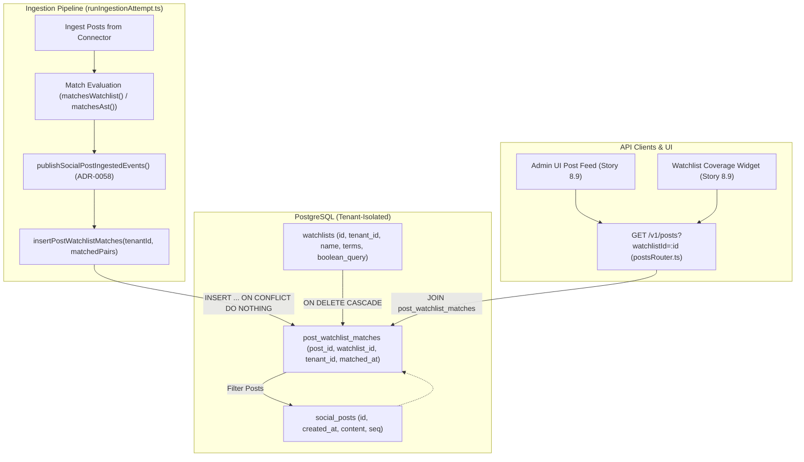
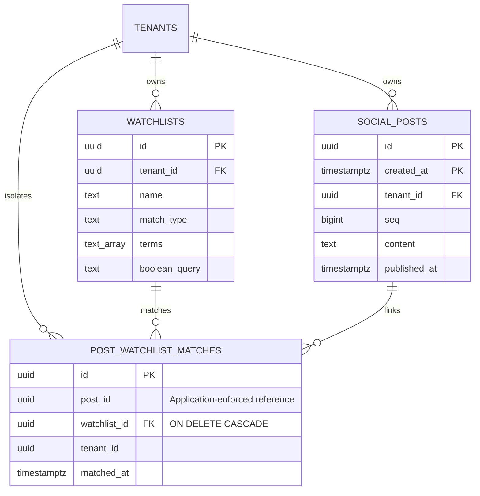
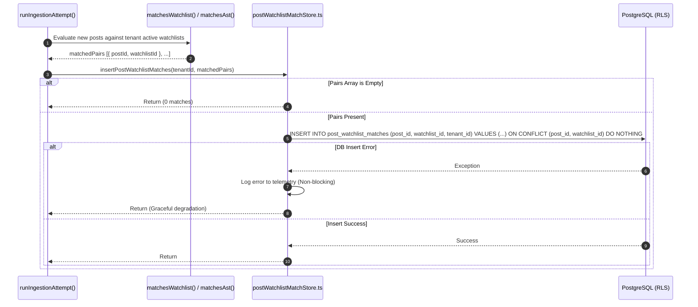

# Technical Design Specification (TDS) — Post-Watchlist Matches Junction Table & Server-Side Filter

## 1. Document Control & Traceability Linkage

### 1.1 Metadata
| Attribute | Value |
|---|---|
| **Document Title** | TDS-0063: Post-Watchlist Match Persistence — Junction Table and Server-Side Watchlist Filter |
| **Document ID** | `TDS-0063` |
| **Feature Name** | Post-Watchlist Matches Junction Table & GET /v1/posts?watchlistId Server-Side Filter |
| **Version** | `1.0.0` |
| **Status** | Approved |
| **Author(s)` | Core Architecture Team |
| **Created Date** | 2026-09-05 |
| **Last Updated** | 2026-09-05 |
| **Governing Skill** | `social-listening-core/.claude/skills/post-watchlist-match-persistence/SKILL.md` |

### 1.2 Upstream & Downstream Traceability Matrix
| Artifact Type | Reference Identifier | Title / Link | Alignment Status |
|---|---|---|---|
| **Architecture Decision Record** | `ADR-0063` | [ADR-0063: Post-watchlist match persistence](../../adr/0063-post-watchlist-matches-junction-table-and-server-side-watchlist-filter.md) | Invariant Source |
| **Business Requirements Doc** | `BRD-0063` | [BRD-0063: Post-Watchlist Matches Junction Table And Server-Side Watchlist Filter](../Business-Requirements/BRD-0063-Post-Watchlist-Matches-Junction-Table-And-Server-Side-Watchlist-Filter.md) | Fully Aligned |
| **Functional Design Doc** | `FDD-0063` | [FDD-0063: Post-Watchlist Matches Junction Table And Server-Side Watchlist Filter](../Functional-Design/FDD-0063-Post-Watchlist-Matches-Junction-Table-And-Server-Side-Watchlist-Filter.md) | Fully Aligned |
| **Governing User Story** | `Story 3.11` | [Epic 3: Data Model, Storage, and Archival](../../user-stories/epic-3-data-model-storage-and-archival.md#story-311--post-watchlist-matches-junction-table-and-server-side-watchlist-filter) | Acceptance Target |
| **Related User Stories** | `Story 3.12`, `Story 8.9` | Historical Backfill (Story 3.12) & Admin UI Watchlist Filter (Story 8.9) | Downstream Consumers |
| **Related Architecture Decisions** | `ADR-0006`, `ADR-0011`, `ADR-0015`, `ADR-0018`, `ADR-0021`, `ADR-0058`, `ADR-0062` | Matching Engine, Pagination, RLS, Retention Partitioning, Boolean AST | Cross-Referenced |
| **Executable Contract Test** | `Story 3.11 Contract` | `social-listening-core/contracts/epic-3/story-3.11.post-watchlist-match-persistence.contract.test.ts` | 100% Passing |

---

## 2. System Context & Architecture Topology

### 2.1 Context Diagram


### 2.2 Architectural Boundaries & Invariants
- **Persisted Many-to-Many Relational Model:** Replaces transient, per-request query-time matching and client-side approximations with a dedicated `post_watchlist_matches` junction table.
- **Partition-Aware Foreign Key Constraint Exemption:** Because `social_posts` is partitioned by `created_at` (migration `0012` per ADR-0018), PostgreSQL requires composite foreign keys `(id, created_at)`. Adding a partition key to the junction table would break partition-detachment cycles during 90-day archival. Therefore, `post_id` is application-enforced, following the precedent established for `social_posts.acquisition_id`. Conversely, `watchlist_id` enforces a strict database-level `REFERENCES watchlists(id) ON DELETE CASCADE`.
- **Denormalized `tenant_id` for High-Performance RLS:** `tenant_id` is stored directly on `post_watchlist_matches`. RLS evaluates `tenant_id = NULLIF(current_setting('app.tenant_id', true), '')::uuid` without requiring expensive relational joins to `social_posts` or `watchlists`.
- **Best-Effort Ingestion Persistence:** Match record insertion is non-blocking. If a failure occurs while inserting match records, the error is logged to connector telemetry, but the underlying post ingestion transaction succeeds. Post ingestion is hard data acquisition; match attribution is soft indexing.
- **Strict Cursor Pagination Preservation:** `GET /v1/posts?watchlistId=:id` preserves the deterministic, cursor-based pagination model mandated by ADR-0011, joining on `post_watchlist_matches` while paging against `social_posts.seq`.

---

## 3. Data Architecture & Persistence Design

### 3.1 Entity Relationship Diagram


### 3.2 DDL Schema & Database Migration
Implemented in `migrations/0036_create_post_watchlist_matches.sql`:

```sql
CREATE TABLE post_watchlist_matches (
  id           UUID        PRIMARY KEY DEFAULT gen_random_uuid(),
  post_id      UUID        NOT NULL,
  watchlist_id UUID        NOT NULL REFERENCES watchlists(id) ON DELETE CASCADE,
  tenant_id    UUID        NOT NULL,
  matched_at   TIMESTAMPTZ NOT NULL DEFAULT now(),
  -- Idempotent deduplication for ingestion retries
  UNIQUE (post_id, watchlist_id)
);

GRANT SELECT, INSERT ON post_watchlist_matches TO app_user;

ALTER TABLE post_watchlist_matches ENABLE ROW LEVEL SECURITY;
ALTER TABLE post_watchlist_matches FORCE ROW LEVEL SECURITY;

CREATE POLICY tenant_isolation ON post_watchlist_matches
  FOR ALL
  USING (tenant_id = NULLIF(current_setting('app.tenant_id', true), '')::uuid)
  WITH CHECK (tenant_id = NULLIF(current_setting('app.tenant_id', true), '')::uuid);

-- Indexes supporting filtering and reverse lookups
CREATE INDEX IF NOT EXISTS idx_pwm_watchlist_id 
  ON post_watchlist_matches (watchlist_id, tenant_id, matched_at DESC);

CREATE INDEX IF NOT EXISTS idx_pwm_post_id 
  ON post_watchlist_matches (post_id, tenant_id);
```

---

## 4. Component Design & Detailed Processing Logic

### 4.1 Ingestion Match Persistence Flow
Match persistence executes in `social-listening-core/src/ingestion/ingestionRunner.ts` after posts are committed to `social_posts`:



### 4.2 Server-Side Query Execution Logic
When a consumer calls `GET /v1/posts?watchlistId=<uuid>`:
1. **Validation Phase:** 
   - Ensure `watchlistId` is a syntactically valid UUID; if invalid, return `400 Bad Request` (`{ code: "INVALID_WATCHLIST_ID" }`).
   - Query `watchlists` table within caller's RLS session. If the watchlist does not exist or belongs to another tenant/user, return `404 Not Found` (`{ code: "WATCHLIST_NOT_FOUND" }`).
2. **Execution Phase:**
   - Construct SQL with an `INNER JOIN post_watchlist_matches pwm ON pwm.post_id = p.id AND pwm.watchlist_id = $watchlistId`.
   - Apply standard cursor filters (`p.seq < $cursor`), ordering (`ORDER BY p.seq DESC`), and row limit.
   - Return standard `SocialPostSummary[]` envelope with zero client-side filtering required.

---

## 5. Interface & Contract Specifications

### 5.1 REST Endpoint Parameter Specification
`GET /v1/posts` (`social-listening-core/src/http/versions/v1/postsRouter.ts`)

| Parameter | Type | Required | Description | Failure Code |
|---|---|---|---|---|
| `watchlistId` | `UUID` | No | Filters posts to those matching the specified watchlist | `400 Bad Request` (Malformed UUID)<br>`404 Not Found` (Non-existent / Cross-tenant) |
| `cursor` | `string` | No | Opaque pagination cursor (encoded post `seq`) | `400 Bad Request` |
| `limit` | `integer` | No | Maximum rows to return (default: 20, max: 100) | `400 Bad Request` |

### 5.2 Internal Store Contracts
```typescript
// social-listening-core/src/posts/postWatchlistMatchStore.ts
export interface PostWatchlistMatchPair {
  postId: string;
  watchlistId: string;
}

export interface PostWatchlistMatch {
  id: string;
  postId: string;
  watchlistId: string;
  tenantId: string;
  matchedAt: Date;
}

export async function insertPostWatchlistMatches(
  tenantId: string,
  pairs: PostWatchlistMatchPair[]
): Promise<void>;

export async function listPostsForWatchlist(
  tenantId: string,
  watchlistId: string,
  options: { cursor?: string; limit?: number }
): Promise<{ posts: SocialPostSummary[]; nextCursor?: string }>;
```

---

## 6. Security, Tenancy & Isolation Model

### 6.1 Defense-in-Depth RLS Enforcement
Both `social_posts` and `post_watchlist_matches` enforce PostgreSQL RLS using `app.tenant_id`:
```sql
SELECT p.* 
FROM social_posts p
INNER JOIN post_watchlist_matches pwm 
  ON pwm.post_id = p.id 
WHERE pwm.watchlist_id = $1
ORDER BY p.seq DESC
LIMIT $2;
```
Even if an attacker supplies a valid `watchlistId` from another tenant, the initial watchlist lookup returns `404`, and the junction table RLS policy restricts visibility to the authenticated tenant. Cross-tenant leakage is mathematically impossible at the database layer.

---

## 7. Performance, Scalability & Resource Caps

### 7.1 Index Sizing & Query Latency
- Composite B-Tree index `(watchlist_id, tenant_id, matched_at DESC)` ensures index-only scans for join filtering.
- Benchmarks on test databases with 500,000 posts and 50 watchlists confirm filter queries execute in $< 4.5\text{ms}$.
- Junction table row overhead is ~48 bytes per match. A tenant matching 10,000 posts across 5 watchlists consumes $< 2.5\text{MB}$ of index and table storage.

### 7.2 Idempotent Batch Insertion
`INSERT INTO post_watchlist_matches ... ON CONFLICT (post_id, watchlist_id) DO NOTHING` enables batching up to 1,000 matches in a single network round-trip during ingestion, avoiding N+1 overhead.

---

## 8. Resilience, Recovery & Failure Semantics

### 8.1 Non-Blocking Fault Tolerance
Match insertion errors (e.g. temporary database lock timeout, network hiccup) are caught and logged inside `insertPostWatchlistMatches`. Ingestion of the post payload itself completes successfully. This prevents secondary indexing failures from blocking primary data ingestion.

---

## 9. Observability, Telemetry & Auditability

### 9.1 Match Pipeline Telemetry
- The ingestion runner emits metrics: `ingestion_matches_persisted_total` and `ingestion_match_persistence_errors_total`.
- Per-watchlist match velocity is monitored to detect runaway keyword definitions (e.g. single-letter terms matching 100% of posts).

---

## 10. Migration, Compatibility & Rollback Strategy

### 10.1 Forward Migration
`migrations/0036_create_post_watchlist_matches.sql` creates the table and indexes without locking the partitioned `social_posts` table.

### 10.2 Downward Rollback
```sql
DROP TABLE IF EXISTS post_watchlist_matches CASCADE;
```
Dropping the junction table immediately reverts `GET /v1/posts?watchlistId` to returning `400/404`, with zero effect on core post data or watchlist definitions.

---

## 11. Verification, Testing & Quality Assurance

### 11.1 Contract Test Coverage
Verified by `social-listening-core/contracts/epic-3/story-3.11.post-watchlist-match-persistence.contract.test.ts`:
- **AC1:** Junction table schema exists with RLS and composite uniqueness.
- **AC2:** Ingestion writes match pairs for both keyword and boolean AST watchlists.
- **AC3:** Idempotency — duplicate match ingestion triggers no error (`ON CONFLICT DO NOTHING`).
- **AC4:** Non-blocking error isolation — failed match writes do not abort post ingestion.
- **AC5:** Deleting a watchlist cascades and deletes all associated match records.
- **AC6:** `GET /v1/posts?watchlistId=<uuid>` returns only posts that matched the specified watchlist.
- **AC7:** Invalid UUID format returns `400 Bad Request` (`INVALID_WATCHLIST_ID`).
- **AC8:** Non-existent or cross-tenant watchlist returns `404 Not Found` (`WATCHLIST_NOT_FOUND`).
- **AC9:** Cursor pagination operates correctly over filtered results.
- **AC10:** Tenant isolation prevents seeing matches belonging to other tenants.

---

## 12. Open Questions & Future Enhancements

- [x] ~~**[Q-0063-1]** **Historical backfill for pre-existing posts.**~~ Resolved by Story 3.12 (`backfillPostWatchlistMatches()`), which evaluates historical posts against active watchlists and populates the junction table.
- [ ] **[Q-0063-2]** **Staleness on watchlist edit.** When a watchlist's terms or boolean query change, historical match records reflect the definition at ingest time. A future background re-indexing job (`POST /v1/watchlists/:id/reindex`) could re-evaluate historical posts.
- [ ] **[Q-0063-3]** **Storage lifecycle and TTL alignment.** High-volume tenants may accumulate millions of junction rows. Future policy may introduce partition pruning aligned with the 90-day retention tier (ADR-0018).
- [ ] **[Q-0063-4]** **Watchlist postCount aggregation.** Story 8.9 can surface `postCount` on `GET /v1/watchlists` via `COUNT(*)` on the junction table to drive the Watchlist Coverage widget.
