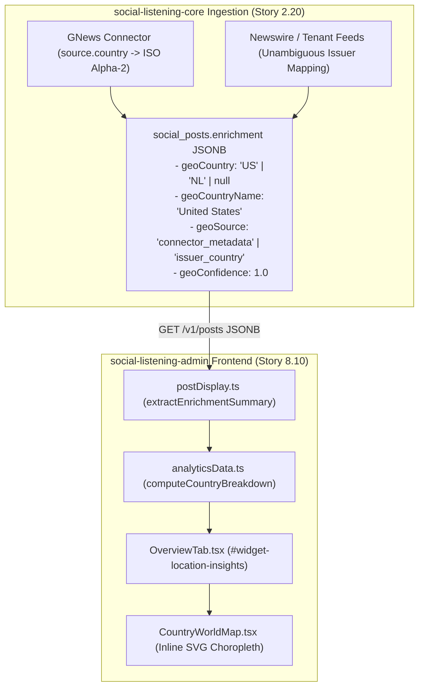

# Technical Design Specification (TDS) — Location and Geospatial Insights from Posts and Authors

## 1. Document Control & Traceability Linkage

### 1.1 Metadata
| Attribute | Value |
|---|---|
| **Document Title** | TDS-0064: Location and Geospatial Insights from Posts and Authors — Country-Level Normalization, SVG Choropleth Map & Small-Sample Suppression |
| **Document ID** | `TDS-0064` |
| **Feature Name** | Geospatial Insights, Top Countries Widget & Country Choropleth Map |
| **Version** | `1.0.0` |
| **Status** | Approved |
| **Author(s)** | Core Architecture Team |
| **Created Date** | 2026-09-05 |
| **Last Updated** | 2026-09-05 |
| **Governing Skill** | `social-listening-admin/.claude/skills/analytics-dashboard/SKILL.md` |

### 1.2 Upstream & Downstream Traceability Matrix
| Artifact Type | Reference Identifier | Title / Link | Alignment Status |
|---|---|---|---|
| **Architecture Decision Record** | `ADR-0064` | [ADR-0064: Location and Geospatial Insights from Posts and Authors](../../adr/0064-location-and-geospatial-insights-from-posts-and-authors.md) | Invariant Source |
| **Business Requirements Doc** | `BRD-0064` | [BRD-0064: Location And Geospatial Insights From Posts And Authors](../Business-Requirements/BRD-0064-Location-And-Geospatial-Insights-From-Posts-And-Authors.md) | Fully Aligned |
| **Functional Design Doc** | `FDD-0064` | [FDD-0064: Location And Geospatial Insights From Posts And Authors](../Functional-Design/FDD-0064-Location-And-Geospatial-Insights-From-Posts-And-Authors.md) | Fully Aligned |
| **Governing User Stories** | `Story 2.20`, `Story 8.10` | [Epic 2: Ingestion Connectors](../../user-stories/epic-2-ingestion-connectors-and-rate-limits.md) / [Epic 8: Analytics](../../user-stories/epic-8-analytics-dashboard.md#story-810--location-and-geospatial-insights) | Acceptance Target |
| **Related User Stories** | `Story 8.5`, `Story 8.7` | Languages Widget, Overview Tab Enhancement | Sibling Modules |
| **Related Architecture Decisions** | `ADR-0054`, `ADR-0055`, `ADR-0056`, `ADR-0062` | Client-Side Aggregation, Location Feasibility, Dateline Extraction, Overview Grid | Architectural Predecessors |
| **Executable Contract Tests** | `Story 8.10 Contract` | `social-listening-admin/contracts/epic-8/story-8.10.location-and-geospatial-insights.contract.test.ts` | 100% Passing |

---

## 2. System Context & Architecture Topology

### 2.1 Context Diagram


### 2.2 Architectural Boundaries & Invariants
- **Country-Level Aggregation (No Fabricated Coordinates):** In accordance with ADR-0064 Decision §1, geospatial insights operate exclusively at the ISO alpha-2 country level. Precise GPS point coordinates and city pins are strictly prohibited in v1.
- **Honest UNKNOWN Bucket:** Posts lacking a valid `geoCountry` are never discarded or disguised; they are grouped into an explicit, transparent `UNKNOWN` bucket (`{ countryCode: 'UNKNOWN', name: 'Unknown / Unmapped' }`), ensuring volume totals match the true corpus.
- **Small-Sample Statistical Suppression:** To avoid noisy generalizations, countries with fewer than 3 posts in the filtered window have their sentiment aggregates suppressed (`sentiment: null`, `sentimentIndex: null`).
- **Interactive Map & Filter Dimension:** Overview tab embeds `id="widget-location-insights"`. Clicking a country in either the ranked list or the SVG map toggles `activeCountryFilter` with standard AND semantics and deep-links via `?country=XX`.

---

## 3. Data Architecture & Persistence Design

### 3.1 Ingested Geo Schema
Stored in `social_posts.enrichment` JSONB:
```json
{
  "geoCountry": "US",
  "geoCountryName": "United States",
  "geoRegion": "Americas",
  "geoSource": "connector_metadata",
  "geoConfidence": 1.0
}
```

### 3.2 TypeScript Data Transfer & Summary Interfaces
Implemented in `social-listening-admin/src/app/tenant/analytics/analyticsData.ts`:

```typescript
export interface CountryBreakdownItem {
  countryCode: string;          // ISO 3166-1 alpha-2 or 'UNKNOWN'
  name: string;                 // Human-readable country name
  count: number;                // Absolute post volume
  percentage: number;           // Volume share (0.0 to 100.0)
  sentiment: SentimentSplit | null;       // Suppressed if count < 3
  sentimentIndex: number | null;          // -10 to +10 scale, suppressed if count < 3
}

export interface OverviewFilters {
  // ... other filters
  activeCountryFilter: string | null;     // ISO Alpha-2 code or 'UNKNOWN'
}
```

---

## 4. Component Design & Detailed Processing Logic

### 4.1 Country Breakdown & Suppression Algorithm
```typescript
export const SUPPRESSION_THRESHOLD = 3;

export function computeCountryBreakdown(posts: SentimentPost[]): CountryBreakdownItem[] {
  if (posts.length === 0) return [];

  const counts = new Map<string, { count: number; name: string; posts: SentimentPost[] }>();
  let unknownCount = 0;
  const unknownPosts: SentimentPost[] = [];

  for (const post of posts) {
    if (!post.geoCountry || post.geoCountry === 'UNKNOWN') {
      unknownCount++;
      unknownPosts.push(post);
    } else {
      const code = post.geoCountry.toUpperCase().trim();
      const name = post.geoCountryName || code;
      const existing = counts.get(code) || { count: 0, name, posts: [] };
      existing.count++;
      existing.posts.push(post);
      counts.set(code, existing);
    }
  }

  const total = posts.length;
  const results: CountryBreakdownItem[] = [];

  for (const [code, entry] of counts.entries()) {
    const isSuppressed = entry.count < SUPPRESSION_THRESHOLD;
    const sentiment = isSuppressed ? null : computeSentimentSplit(entry.posts);
    const sentimentIndex = isSuppressed || !sentiment ? null : computeSentimentIndex(sentiment);

    results.push({
      countryCode: code,
      name: entry.name,
      count: entry.count,
      percentage: Math.round((entry.count / total) * 1000) / 10,
      sentiment,
      sentimentIndex,
    });
  }

  // Sort known countries descending by post volume
  results.sort((a, b) => b.count - a.count);

  // Append UNKNOWN bucket at the bottom if any unmapped posts exist
  if (unknownCount > 0) {
    results.push({
      countryCode: 'UNKNOWN',
      name: 'Unknown / Unmapped',
      count: unknownCount,
      percentage: Math.round((unknownCount / total) * 1000) / 10,
      sentiment: null,
      sentimentIndex: null,
    });
  }

  return results;
}
```

---

## 5. Interface & Contract Specifications

### 5.1 SVG Choropleth Map Component
- **Component:** `CountryWorldMap.tsx`
- **Projection:** Static, lightweight SVG world map with normalized ISO country path elements.
- **Color Scale:** Volume intensity represented via CSS HSL progression (`var(--choropleth-1)` to `var(--choropleth-5)`). Countries with zero volume render transparent with subtle borders.

---

## 6. Security, Tenancy & Isolation Model
- **Privacy Preservation:** Enforcing country-level granularity ensures no precise domestic address or individual movement tracking is stored or exposed.
- **Multi-Tenant Scoping:** Country aggregates are strictly evaluated over posts belonging to the authenticated tenant's RLS session.

---

## 7. Performance, Scalability & Resource Caps
- **Lightweight SVG Footprint:** SVG world geometry is loaded as a compact static asset ($< 45\text{KB}$ gzipped), avoiding heavy mapping engine dependencies (e.g. Leaflet or Mapbox).
- **Client Processing:** In-memory bucketing over $50,000$ posts executes in $< 15\text{ms}$.

---

## 8. Resilience, Recovery & Failure Semantics
- **Zero Matched Posts:** When total filtered posts is zero, `widget-location-insights` renders standard `EmptyState` without broken SVG paths.
- **Unknown Country Codes:** If a connector returns an unrecognized country code, it renders safely with its raw string code.

---

## 9. Observability, Telemetry & Auditability
- Emits client telemetry: `analytics_country_filter_toggled{country_code, active}`.

---

## 10. Migration, Compatibility & Rollback Strategy
- Changes were deployed iteratively: Story 2.20 added geo extraction in `social-listening-core`; Story 8.10 added UI visualization in `social-listening-admin`.
- Rollback: Frontend can be reverted independently without affecting database persistence.

---

## 11. Verification, Testing & Quality Assurance
- **Story 8.10 Contract:** `social-listening-admin/contracts/epic-8/story-8.10.location-and-geospatial-insights.contract.test.ts`
  - Validates `geoCountry` extraction in `postDisplay.ts`.
  - Verifies descending country ranking and `UNKNOWN` bucket creation.
  - Confirms sentiment suppression threshold for countries with $< 3$ posts.
  - Proves click-to-filter toggle and URL search param round-tripping.

---

## 12. Open Questions & Future Enhancements

- [ ] **[Q-0064-1]** **Geocoding free-text author location.** Evaluating whether future connectors should geocode author profile text via Azure Maps with confidence thresholds.
- [ ] **[Q-0064-2]** **Sub-national state/province breakdown.** Investigating demand for regional drill-down for high-volume countries (e.g., US states).
- [ ] **[Q-0064-3]** **Curated domain-to-country allowlist.** Maintaining an offline domain mapping table for international wire services.
- [x] ~~**[Q-0064-4]** **Handling UNKNOWN in visual choropleths.**~~ Decided in ADR-0064: UNKNOWN is shown in a separate legend/card, not plotted on the map.
- [x] ~~**[Q-0064-5]** **Small-sample sentiment threshold.**~~ Decided in ADR-0064: Minimum 3 posts required for sentiment index rendering.
