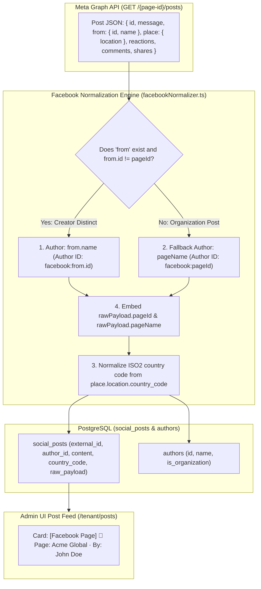

# Technical Design Specification (TDS) — Facebook Connector Reconfirmation & Two-Tier Author Resolution

## 1. Document Control & Traceability Linkage

### 1.1 Metadata
| Attribute | Value |
|---|---|
| **Document Title** | TDS-0067: Facebook Connector Scope Reconfirmation, Hosting Page Dependency, and Two-Tier Author Resolution |
| **Document ID** | `TDS-0067` |
| **Feature Name** | Facebook Page Connector Refinement (Two-Tier Authorship, Hosting Page Attribution & Geospatial Normalization) |
| **Version** | `1.0.0` |
| **Status** | Approved |
| **Author(s)** | Core Architecture Team |
| **Created Date** | 2026-09-04 |
| **Last Updated** | 2026-09-04 |
| **Governing Skill** | `social-listening-core/.claude/skills/facebook-connector/SKILL.md` |

### 1.2 Upstream & Downstream Traceability Matrix
| Artifact Type | Reference Identifier | Title / Link | Alignment Status |
|---|---|---|---|
| **Architecture Decision Record** | `ADR-0067` | [ADR-0067: Facebook Connector Scope Reconfirmation](../../adr/0067-reconfirm-facebook-connector.md) | Invariant Source |
| **Business Requirements Doc** | `BRD-0067` | [BRD-0067: Reconfirm Facebook Connector](../Business-Requirements/BRD-0067-Reconfirm-Facebook-Connector.md) | Fully Aligned |
| **Functional Design Doc** | `FDD-0067` | [FDD-0067: Reconfirm Facebook Connector](../Functional-Design/FDD-0067-Reconfirm-Facebook-Connector.md) | Fully Aligned |
| **Governing User Story** | `Story 2.23` | [Epic 2: Ingestion Connectors and Rate Limits](../../user-stories/epic-2-ingestion-connectors-and-rate-limits.md#story-223--facebook-page-dependency-and-two-tier-author-resolution) | Acceptance Target |
| **Executable Contract Test** | `Story 2.23 Contract` | `contracts/epic-2/story-2.23.facebook-page-dependency-and-author-resolution.contract.test.ts` | 100% Passing |

---

## 2. System Context & Architecture Topology

### 2.1 Context Diagram


### 2.2 Architectural Boundaries & Invariants
- **Personal Profile Ingestion Exclusion:** Automated ingestion operates *exclusively* against authorized Facebook Pages. Ingestion of personal timeline posts (`/me/feed`) is architecturally blocked.
- **Two-Tier Author Resolution Hierarchy:**
  1. **Tier 1 (True Author):** If `from.name` exists and `from.id !== pageId`, assign `Author.displayName = from.name` and `Author.id = "facebook:" + from.id`.
  2. **Tier 2 (Hosting Page Fallback):** If `from` is absent or matches `pageId`, assign `Author.displayName = pageName` and `Author.id = "facebook:" + pageId` (Organization-as-Author).
- **Hosting Page Dependency Invariant:** Every post persisted from Facebook must store `pageId` and `pageName` in `raw_payload`.
- **Geospatial Normalization (ADR-0064):** If `place.location.country_code` is present, normalize it to uppercase ISO 3166-1 alpha-2 and persist in `social_posts.country_code`.

---

## 3. Data Architecture & Persistence Design

### 3.1 Schema & Field Mapping (`social_posts` & `raw_payload`)
```sql
-- Structure of denormalized raw_payload metadata for Facebook posts
/*
{
  "pageId": "100293848123",
  "pageName": "Acme Global Solutions",
  "author": "John Doe",
  "resolvedByTier": "true_author", -- or "page_fallback"
  "place": {
    "name": "Amsterdam Headquarters",
    "countryCode": "NL"
  }
}
*/
```

---

## 4. API, Interface & Integration Contract Design

### 4.1 Two-Tier Normalizer Function (`src/connectors/facebook/facebookNormalizer.ts`)
```typescript
export interface FacebookPostRawPayload {
  id: string;
  message?: string;
  created_time: string;
  permalink_url: string;
  from?: { id: string; name: string };
  place?: {
    location?: {
      country_code?: string;
      city?: string;
    };
  };
  reactions?: { summary: { total_count: number } };
  comments?: { summary: { total_count: number } };
  shares?: { count: number };
}

export function normalizeFacebookPostWithTwoTierAuthor(
  raw: FacebookPostRawPayload,
  pageMeta: { id: string; name: string; followerCount?: number }
): NormalizedSocialPost {
  const isDistinctCreator = raw.from && raw.from.name && raw.from.id !== pageMeta.id;

  const author = isDistinctCreator
    ? {
        id: `facebook:${raw.from!.id}`,
        name: raw.from!.name,
        handle: raw.from!.name,
        isOrganization: false
      }
    : {
        id: `facebook:${pageMeta.id}`,
        name: pageMeta.name,
        handle: pageMeta.name,
        followerCount: pageMeta.followerCount,
        isOrganization: true
      };

  const countryCode = raw.place?.location?.country_code
    ? raw.place.location.country_code.toUpperCase()
    : null;

  return {
    externalId: raw.id,
    platform: 'facebook',
    content: raw.message ?? '',
    publishedAt: new Date(raw.created_time),
    url: raw.permalink_url,
    countryCode,
    author,
    metrics: {
      likes: raw.reactions?.summary?.total_count ?? 0,
      comments: raw.comments?.summary?.total_count ?? 0,
      shares: raw.shares?.count ?? 0
    },
    rawPayload: {
      ...raw,
      pageId: pageMeta.id,
      pageName: pageMeta.name,
      author: author.name,
      resolvedByTier: isDistinctCreator ? 'true_author' : 'page_fallback'
    }
  };
}
```

---

## 5. Rate Limiting, Concurrency & Flow Control

- Rate limiting respects Page engagement quotas via `RequestGate` (ADR-0003/ADR-0020/ADR-0060).
- Normalization is a purely CPU-bound, synchronous transformation occurring prior to persistence.

---

## 6. Security, Identity & Credential Governance

- Personal profile OAuth tokens are exchanged strictly for Page tokens. The user's personal timeline data is neither stored nor logged.
- Page tokens are envelope-encrypted via `credentialStore.ts`.

---

## 7. Error Handling, Resilience & Failure Classification

- **Missing `from` Object:** If Meta restricts `from` due to permissions or Graph API versioning, the normalizer gracefully defaults to Tier 2 (Page Name fallback) without throwing an error.
- **Malformed Country Code:** If `country_code` is not a valid 2-letter code, `countryCode` is set to `null` while preserving the rest of the post.

---

## 8. Testing & Contract Gate Plan

### 8.1 Contract Tests
Contract test file: `contracts/epic-2/story-2.23.facebook-page-dependency-and-author-resolution.contract.test.ts`.

| Test ID | Scenario | Verification Method |
|---|---|---|
| `TEST-FBAUTH-01` | True author resolution (Tier 1) | Supply post with distinct `from` (`from.id !== pageId`); verify `Author.name === from.name`. |
| `TEST-FBAUTH-02` | Page author fallback (Tier 2) | Supply post with missing `from` or `from.id === pageId`; verify `Author.name === pageName`. |
| `TEST-FBAUTH-03` | Hosting page denormalization | Verify `rawPayload.pageId` and `rawPayload.pageName` exist on the stored post record. |
| `TEST-FBAUTH-04` | Geospatial country normalization | Supply `place.location.country_code = 'nl'`; verify post `country_code` is normalized to `'NL'`. |

---

## 9. Component Skill (`SKILL.md`) Documentation Updates

Updates to `.claude/skills/facebook-connector/SKILL.md`:
- **Author Resolution Pattern:** Document the Two-Tier hierarchy for determining post authorship.
- **Attribution Display:** Require frontend components to render both hosting Page and author name.

---

## 10. Observability, Metrics & Operational Telemetry

- `facebook_author_resolution_total{tier="true_author|page_fallback"}` (counter)
- `facebook_geospatial_posts_total{country_code}` (counter)

---

## 11. Migration, Rollout & Feature Gating

- Backward-compatible; applies to all new Facebook post ingests.
- Historical Facebook posts retain existing author mappings.

---

## 12. Technical Assumptions, Dependencies & Open Questions

### 12.1 Assumptions & Dependencies
- **[A-0067-1]** Meta Graph API v21.0 returns `from` and `place` when available and permitted.
- **[D-0067-1]** Geospatial country normalization adheres to ISO 3166-1 alpha-2 (ADR-0064).

### 12.2 Open Questions
- [x] **[Q-0067-1]** *Personal Profile Ingestion:* Reconfirmed strictly non-viable; excluded.
- [x] **[Q-0067-2]** *Author Ambiguity:* Resolved via Two-Tier resolution hierarchy.
