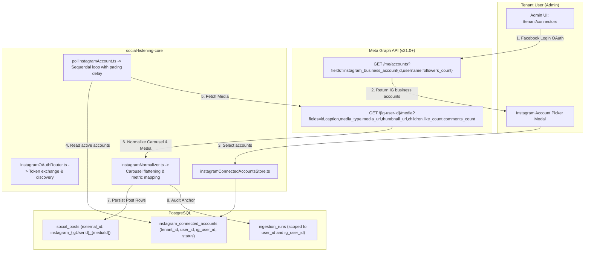
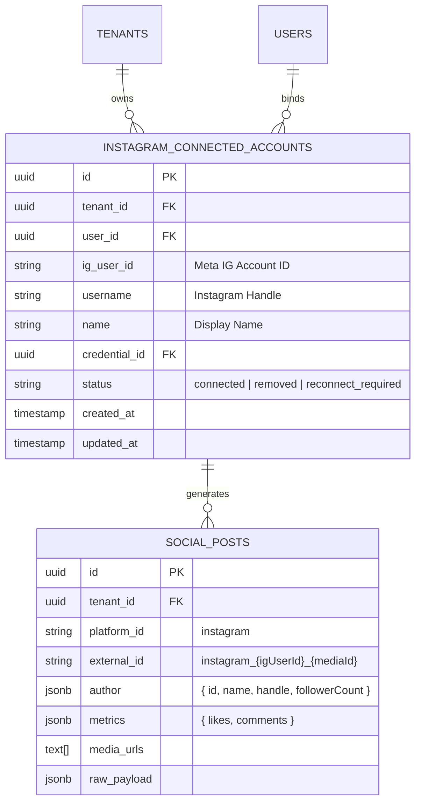

# Technical Design Specification (TDS) — Instagram Connector (Business & Creator Accounts)

## 1. Document Control & Traceability Linkage

### 1.1 Metadata
| Attribute | Value |
|---|---|
| **Document Title** | TDS-0068: Instagram Connector — Business/Creator Account Scope, Media & Carousel Normalization, and Tier-3 OAuth |
| **Document ID** | `TDS-0068` |
| **Feature Name** | Instagram Business Connector & Carousel Media Ingestion Engine |
| **Version** | `1.0.0` |
| **Status** | Approved |
| **Author(s)** | Core Connector Architecture Team |
| **Created Date** | 2026-09-04 |
| **Last Updated** | 2026-09-04 |
| **Governing Skill** | `social-listening-core/.claude/skills/instagram-connector/SKILL.md` |

### 1.2 Upstream & Downstream Traceability Matrix
| Artifact Type | Reference Identifier | Title / Link | Alignment Status |
|---|---|---|---|
| **Architecture Decision Record** | `ADR-0068` | [ADR-0068: Instagram Connector](../../adr/0068-instagram-connector.md) | Invariant Source |
| **Business Requirements Doc** | `BRD-0068` | [BRD-0068: Instagram Connector](../Business-Requirements/BRD-0068-Instagram-Connector.md) | Fully Aligned |
| **Functional Design Doc** | `FDD-0068` | [FDD-0068: Instagram Connector](../Functional-Design/FDD-0068-Instagram-Connector.md) | Fully Aligned |
| **Governing User Story** | `Story 2.24` | [Epic 2: Ingestion Connectors and Rate Limits](../../user-stories/epic-2-ingestion-connectors-and-rate-limits.md#story-224--instagram-connector-businesscreator-model-and-ingestion) | Acceptance Target |
| **Executable Contract Test** | `Story 2.24 Contract` | `contracts/epic-2/story-2.24.instagram-connector.contract.test.ts` | 100% Passing |

---

## 2. System Context & Architecture Topology

### 2.1 Context Diagram


### 2.2 Architectural Boundaries & Invariants
- **Business/Creator Account Invariant:** Ingestion is strictly confined to professional Instagram Business and Creator accounts connected to an authorized Facebook Page. Personal Instagram user profiles are inaccessible via API and strictly excluded.
- **Single Parent Post Model for Carousels:** A multi-item carousel album (`CAROUSEL_ALBUM`) creates exactly **one row** in `social_posts`. Child slide images/videos are denormalized into `media_urls` and `raw_payload.carouselItems`.
- **Bounded Lookback & Short-Circuit:**
  - Initial sync lookback ceiling: Max **30 days** OR **100 media items**, whichever is reached first.
  - Incremental polling short-circuits immediately upon encountering the first already-ingested `externalId`.
- **Sequential Multi-Account Pacing:** A user with multiple Instagram accounts has their accounts polled sequentially with an inter-account delay (1.2s) to prevent bursting against Meta's `X-App-Usage` quota.
- **Explicit Reconnection Classification:** Errors 190 (Token Expired), 10 (Permissions Revoked), and 100 (Unlinked Account) immediately trigger the `reconnect_required` health status and notify the user.

---

## 3. Data Architecture & Persistence Design

### 3.1 Entity Relationship Diagram


### 3.2 Schema Migration (PostgreSQL)
```sql
-- Migration 0035_create_instagram_connected_accounts.sql
CREATE TABLE IF NOT EXISTS instagram_connected_accounts (
    id UUID PRIMARY KEY DEFAULT gen_random_uuid(),
    tenant_id UUID NOT NULL REFERENCES tenants(id) ON DELETE CASCADE,
    user_id UUID NOT NULL REFERENCES users(id) ON DELETE CASCADE,
    ig_user_id VARCHAR(128) NOT NULL,
    username VARCHAR(128) NOT NULL,
    name VARCHAR(255),
    credential_id UUID NOT NULL REFERENCES platform_credentials(id) ON DELETE CASCADE,
    status VARCHAR(32) NOT NULL DEFAULT 'connected' 
        CHECK (status IN ('connected', 'removed', 'reconnect_required')),
    created_at TIMESTAMPTZ NOT NULL DEFAULT NOW(),
    updated_at TIMESTAMPTZ NOT NULL DEFAULT NOW(),
    CONSTRAINT uq_tenant_user_ig_account UNIQUE (tenant_id, user_id, ig_user_id)
);

ALTER TABLE instagram_connected_accounts ENABLE ROW LEVEL SECURITY;
ALTER TABLE instagram_connected_accounts FORCE ROW LEVEL SECURITY;

CREATE POLICY tenant_isolation_instagram_connected_accounts ON instagram_connected_accounts
    FOR ALL
    USING (tenant_id = NULLIF(current_setting('app.tenant_id', true), '')::uuid);
```

---

## 4. API, Interface & Integration Contract Design

### 4.1 Instagram Normalizer Contract (`src/connectors/instagram/instagramNormalizer.ts`)
```typescript
export interface InstagramMediaRaw {
  id: string;
  caption?: string;
  media_type: 'IMAGE' | 'VIDEO' | 'CAROUSEL_ALBUM';
  media_url?: string;
  thumbnail_url?: string;
  permalink: string;
  timestamp: string;
  username: string;
  like_count?: number;
  comments_count?: number;
  children?: {
    data: Array<{
      id: string;
      media_type: 'IMAGE' | 'VIDEO';
      media_url: string;
      thumbnail_url?: string;
    }>;
  };
}

export function normalizeInstagramMedia(
  media: InstagramMediaRaw,
  accountMeta: { igUserId: string; username: string; followersCount?: number; pageName?: string }
): NormalizedSocialPost {
  // Extract media URLs from primary or carousel children
  const mediaUrls: string[] = [];
  if (media.media_type === 'CAROUSEL_ALBUM' && media.children?.data) {
    media.children.data.forEach(child => {
      if (child.media_url) mediaUrls.push(child.media_url);
    });
  } else if (media.media_url) {
    mediaUrls.push(media.media_url);
  }

  return {
    externalId: `instagram_${accountMeta.igUserId}_${media.id}`,
    platform: 'instagram',
    content: media.caption ?? '',
    publishedAt: new Date(media.timestamp),
    url: media.permalink,
    mediaUrls,
    author: {
      id: `instagram:${accountMeta.igUserId}`,
      name: accountMeta.username,
      handle: `@${accountMeta.username}`,
      followerCount: accountMeta.followersCount,
      isOrganization: true
    },
    metrics: {
      likes: media.like_count ?? 0,
      comments: media.comments_count ?? 0
    },
    rawPayload: {
      ...media,
      igUserId: accountMeta.igUserId,
      username: accountMeta.username,
      pageName: accountMeta.pageName,
      carouselItems: media.children?.data ?? []
    }
  };
}
```

---

## 5. Rate Limiting, Concurrency & Flow Control

- **Sequential Inter-Account Delay:**
  ```typescript
  for (const account of userInstagramAccounts) {
    await pollInstagramSingleAccount(tenantId, userId, account);
    await sleep(1200); // 1.2s delay to pace calls across accounts
  }
  ```
- **Dynamic 429 Handling:** On encountering HTTP 429 or Meta Error 4, parse `Retry-After` header and back off without terminating the connector or marking it as failed.

---

## 6. Security, Identity & Credential Governance

- **Permission Bounds:** Minimum necessary permissions: `instagram_basic`, `pages_show_list`, `pages_read_engagement`.
- **Envelope Encryption:** Stored under `platform_credentials` with `owner_type = 'user'`, encrypted using AES-256-GCM.

---

## 7. Error Handling, Resilience & Failure Classification

| Error Code | Meaning | Action |
|---|---|---|
| Meta Code 190 | Access Token Expired | Classify as `reconnect_required`; update account row; alert user. |
| Meta Code 10 | Permission Revoked | Transition to `reconnect_required`. |
| Meta Code 100 | Page / Account Unlinked | Transition account status to `removed` or `reconnect_required`. |
| Meta Code 4 | Rate Limit Exceeded | Exponential backoff; retry on subsequent scheduler ticks. |

---

## 8. Testing & Contract Gate Plan

### 8.1 Contract Tests
Contract test file: `contracts/epic-2/story-2.24.instagram-connector.contract.test.ts`.

| Test ID | Scenario | Verification Method |
|---|---|---|
| `TEST-IG-01` | Ingest single image post | Verify normalized `SocialPost` creation with caption, metrics, and `@handle` author. |
| `TEST-IG-02` | Carousel album normalization | Ingest `CAROUSEL_ALBUM` with 4 slides; assert single parent post created with 4 `mediaUrls`. |
| `TEST-IG-03` | Incremental poll short-circuit | Ingest 5 posts; re-poll with 1 new post and 4 existing; assert poller stops at first existing ID. |
| `TEST-IG-04` | 30-day lookback ceiling | Verify poller ceases pagination once post timestamp breaches 30-day threshold. |
| `TEST-IG-05` | Reconnect required transition | Simulate Meta Error 190; verify account status transitions to `reconnect_required`. |

---

## 9. Component Skill (`SKILL.md`) Documentation Updates

Updates to `.claude/skills/instagram-connector/SKILL.md`:
- **Professional Account Scope:** Highlight that personal profiles cannot be polled.
- **Carousel Data Structure:** Explain how carousel items are denormalized into `media_urls` and `raw_payload.carouselItems`.
- **Short-Circuit Algorithm:** Document the descending chronological pagination termination rule.

---

## 10. Observability, Metrics & Operational Telemetry

- `instagram_ingested_media_total{media_type}` (counter)
- `instagram_account_status_gauge{status}` (gauge)
- `instagram_rate_limit_throttle_total` (counter)

---

## 11. Migration, Rollout & Feature Gating

- Migration `0035_create_instagram_connected_accounts.sql` creates table and RLS policy.
- Registered dynamically via `src/connectors/registry.ts`.

---

## 12. Technical Assumptions, Dependencies & Open Questions

### 12.1 Assumptions & Dependencies
- **[A-0068-1]** Instagram Business/Creator account is tethered to a Facebook Page.
- **[D-0068-1]** Meta Graph API v21.0 support for `/media` edge.

### 12.2 Open Questions
- [x] **[Q-0068-1]** *Carousel Model:* Single parent row selected over separate slide post rows.
- [x] **[Q-0068-2]** *Lookback Window:* Max 30 days OR 100 items adopted for initial synchronization.
