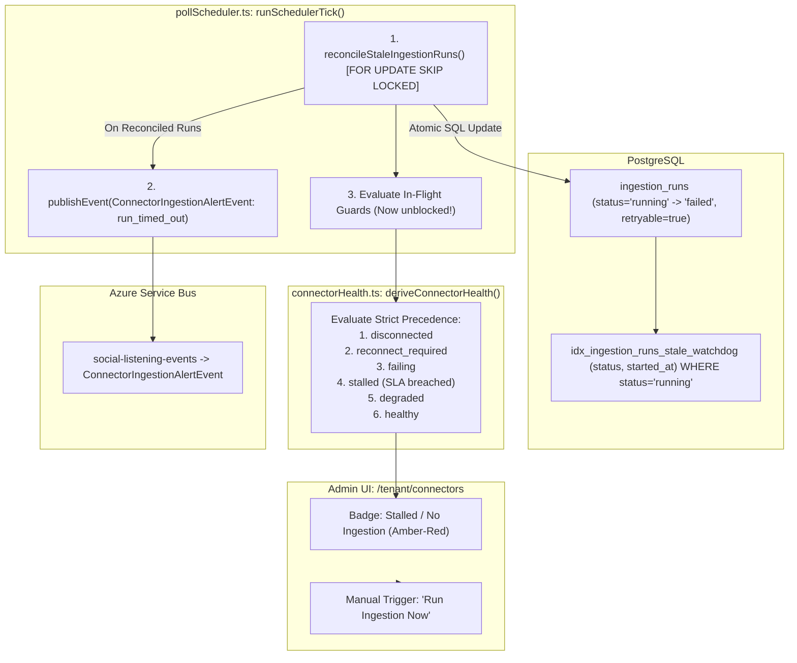

# Technical Design Specification (TDS) — Ingestion Watchdog Reconciliation & Inactivity Alerting

## 1. Document Control & Traceability Linkage

### 1.1 Metadata
| Attribute | Value |
|---|---|
| **Document Title** | TDS-0070: Connector Ingestion Health Status, Hanging Run Watchdog Reconciliation, and Inactivity Alerting |
| **Document ID** | `TDS-0070` |
| **Feature Name** | Automated Ingestion Watchdog, In-Flight Deadlock Recovery & `stalled` Health State |
| **Version** | `1.0.0` |
| **Status** | Approved |
| **Author(s)** | Core Architecture & Reliability Team |
| **Created Date** | 2026-09-04 |
| **Last Updated** | 2026-09-04 |
| **Governing Skill** | `social-listening-core/.claude/skills/connector-health-and-error-handling/SKILL.md` |

### 1.2 Upstream & Downstream Traceability Matrix
| Artifact Type | Reference Identifier | Title / Link | Alignment Status |
|---|---|---|---|
| **Architecture Decision Record** | `ADR-0070` | [ADR-0070: Connector Ingestion Health Status, Hanging Run Watchdog Reconciliation, and Inactivity Alerting](../../adr/0070-connector-ingestion-status-hanging-run-reconciliation-and-alerts.md) | Invariant Source |
| **Business Requirements Doc** | `BRD-0070` | [BRD-0070: Connector Ingestion Status Hanging Run Reconciliation And Alerts](../Business-Requirements/BRD-0070-Connector-Ingestion-Status-Hanging-Run-Reconciliation-And-Alerts.md) | Fully Aligned |
| **Functional Design Doc** | `FDD-0070` | [FDD-0070: Connector Ingestion Status Hanging Run Reconciliation And Alerts](../Functional-Design/FDD-0070-Connector-Ingestion-Status-Hanging-Run-Reconciliation-And-Alerts.md) | Fully Aligned |
| **Governing User Story** | `Story 1.16` | [Epic 1: Repository and API Foundation](../../user-stories/epic-1-repository-and-api-foundation.md#story-116--ingestion-watchdog-and-stalled-alerts) | Acceptance Target |
| **Related User Stories** | `Story 1.14`, `Story 1.15` | [Epic 1: Repository and API Foundation](../../user-stories/epic-1-repository-and-api-foundation.md) | In-Flight Guard Foundation |
| **Executable Contract Test** | `Story 1.16 Contract` | `contracts/epic-1/story-1.16.ingestion-watchdog-and-stalled-alerts.contract.test.ts` | 100% Passing |

---

## 2. System Context & Architecture Topology

### 2.1 Context Diagram


### 2.2 Architectural Boundaries & Invariants
- **Automated Deadlock Recovery Invariant:** Any `ingestion_runs` row that remains in `status = 'running'` for longer than `MAX_RUN_DURATION_MS = max(15m, 2 * cadence)` is automatically transitioned to `status = 'failed'` by the scheduler watchdog sweep before evaluation. This prevents node restarts, container terminations, or network socket drops from permanently disabling a connector.
- **Lock-Safe Atomic Concurrency:** The watchdog sweep executes using PostgreSQL `FOR UPDATE SKIP LOCKED`. If a legitimately executing worker finishes concurrently, it commits without lock conflicts or false-positive cancellations.
- **Strict Health Precedence Hierarchy:** `deriveConnectorHealth()` derives status dynamically without stored flags following the immutable precedence:
  $$\text{disconnected} \to \text{reconnect\_required} \to \text{failing} \to \text{stalled} \to \text{degraded} \to \text{healthy}$$
- **`stalled` SLA Breach Definition:** An active connector with valid credentials is classified as `'stalled'` when:
  $$\text{now} - \text{lastAttemptAt} \ge 3 \times \text{cadence} \quad \text{OR} \quad \text{now} - \text{lastSuccessfulFetchAt} \ge 24\text{ hours}$$
- **Proactive Alert Notifications:** Reconciled runs and transitions into `'stalled'`, `'failing'`, or `'reconnect_required'` emit structured `ConnectorIngestionAlertEvent` messages to Azure Service Bus with rate-limiting to prevent notification cascades.

---

## 3. Data Architecture & Persistence Design

### 3.1 Partial Index & Sweep DDL (PostgreSQL Migration)
```sql
-- Migration 0036_create_ingestion_runs_watchdog_index.sql
CREATE INDEX IF NOT EXISTS idx_ingestion_runs_stale_watchdog 
    ON ingestion_runs (status, started_at) 
    WHERE status = 'running';

-- Lock-safe watchdog sweep query
-- Executed by reconcileStaleIngestionRuns(maxDurationInterval)
UPDATE ingestion_runs
SET status = 'failed',
    completed_at = NOW(),
    error_summary = 'Ingestion run timed out or aborted (reconciled by watchdog)',
    retryable = TRUE
WHERE id IN (
    SELECT id 
    FROM ingestion_runs
    WHERE status = 'running'
      AND started_at < NOW() - INTERVAL '15 minutes'
    FOR UPDATE SKIP LOCKED
)
RETURNING id, tenant_id, platform_id, user_id, started_at;
```

---

## 4. API, Interface & Integration Contract Design

### 4.1 Extended Connector Health Status (`src/connectors/types.ts`)
```typescript
export type ConnectorHealthStatus =
  | 'healthy'
  | 'degraded'
  | 'failing'
  | 'disconnected'
  | 'reconnect_required'
  | 'stalled';

export interface ConnectorHealth {
  platformId: string;
  status: ConnectorHealthStatus;
  lastAttemptAt: Date | null;
  lastSuccessfulFetchAt: Date | null;
  consecutiveFailures: number;
  credentialStatus: 'valid' | 'expired' | 'revoked' | null;
  errorSummary: string | null;
}
```

### 4.2 Watchdog Ingestion Run Store Implementation (`src/ingestion/ingestionRunStore.ts`)
```typescript
export interface ReconciledRun {
  id: string;
  tenantId: string;
  platformId: string;
  userId: string | null;
  startedAt: Date;
}

export async function reconcileStaleIngestionRuns(
  staleThresholdMinutes: number = 15
): Promise<ReconciledRun[]> {
  const query = `
    UPDATE ingestion_runs
    SET status = 'failed',
        completed_at = NOW(),
        error_summary = 'Ingestion run timed out or aborted (reconciled by watchdog)',
        retryable = TRUE
    WHERE id IN (
        SELECT id 
        FROM ingestion_runs
        WHERE status = 'running'
          AND started_at < NOW() - ($1 || ' minutes')::INTERVAL
        FOR UPDATE SKIP LOCKED
    )
    RETURNING id, tenant_id, platform_id, user_id, started_at;
  `;

  const { rows } = await pool.query(query, [staleThresholdMinutes]);
  return rows.map(r => ({
    id: r.id,
    tenantId: r.tenant_id,
    platformId: r.platform_id,
    userId: r.user_id,
    startedAt: r.started_at
  }));
}
```

### 4.3 Structured Alert Event (`src/events/types.ts`)
```typescript
export interface ConnectorIngestionAlertEvent {
  eventType: 'ConnectorIngestionAlertEvent';
  schemaVersion: '1.0';
  tenantId: string;
  platformId: string;
  userId?: string;
  alertType: 'run_timed_out' | 'ingestion_stalled' | 'connector_failing' | 'reconnect_required';
  severity: 'warning' | 'critical';
  message: string;
  occurredAt: string;
  metadata: {
    consecutiveFailures?: number;
    lastAttemptAt?: string | null;
    lastSuccessfulFetchAt?: string | null;
    staleRunId?: string;
  };
}
```

---

## 5. Rate Limiting, Concurrency & Flow Control

- **O(1) Sweep Execution:** The partial index on `WHERE status = 'running'` guarantees that table size does not impact sweep latency.
- **Alert Flood Control:** If multiple runs are reconciled simultaneously, the system batches alerts per `(tenantId, platformId)` to avoid saturating Azure Service Bus or email delivery queues.

---

## 6. Security, Identity & Credential Governance

- **System Context Execution:** Watchdog reconciliation runs as a background maintenance process using administrative connection pool privileges.
- **Tenant Integrity:** The returned reconciled run objects carry explicit `tenantId` parameters, ensuring that emitted alert events correctly reflect tenant boundaries.

---

## 7. Error Handling, Resilience & Failure Classification

- **Crash-Proof Scheduler:** Reconciled runs are explicitly marked `retryable = true`. This informs `connectorHealth.ts` not to immediately trip the 20-consecutive-failure auto-disable ceiling.
- **Fail-Safe Watchdog:** If the watchdog SQL update encounters a database error, the error is logged and normal scheduling continues; failure recovery retries on the subsequent tick.

---

## 8. Testing & Contract Gate Plan

### 8.1 Contract Tests
Contract test file: `contracts/epic-1/story-1.16.ingestion-watchdog-and-stalled-alerts.contract.test.ts`.

| Test ID | Scenario | Verification Method |
|---|---|---|
| `TEST-WDOG-01` | Watchdog unblocks in-flight guard | Insert run with `status = 'running'` and `started_at = NOW() - 20m`; run watchdog; assert status transitions to `failed` and in-flight guard allows subsequent poll. |
| `TEST-WDOG-02` | Ignore recently started runs | Insert run with `started_at = NOW() - 5m`; assert run remains `status = 'running'`. |
| `TEST-WDOG-03` | Concurrency lock safety | Execute worker completion concurrently with watchdog sweep; assert `FOR UPDATE SKIP LOCKED` prevents deadlock. |
| `TEST-WDOG-04` | Derive `stalled` status | Set `lastAttemptAt = NOW() - 50m` on a 15m cadence connector; assert health status derives `'stalled'`. |
| `TEST-WDOG-05` | Emit `ConnectorIngestionAlertEvent` | Reconcile stale run; assert `ConnectorIngestionAlertEvent` published to Service Bus with `alertType = 'run_timed_out'`. |

---

## 9. Component Skill (`SKILL.md`) Documentation Updates

Updates to `.claude/skills/connector-health-and-error-handling/SKILL.md`:
- **Watchdog Mechanics:** Document that hanging runs are purged automatically after 15 minutes.
- **Stalled Health Evaluation:** Add the derivation formula for `stalled` and explain its relationship with `degraded` and `failing`.

---

## 10. Observability, Metrics & Operational Telemetry

- `ingestion_runs_reconciled_watchdog_total{platform_id}` (counter)
- `connector_health_stalled_total{platform_id, tenant_id}` (gauge)
- `ingestion_watchdog_sweep_duration_ms` (histogram)

---

## 11. Migration, Rollout & Feature Gating

- Migration `0036_create_ingestion_runs_watchdog_index.sql` adds partial index.
- Applied automatically upon scheduler boot.

---

## 12. Technical Assumptions, Dependencies & Open Questions

### 12.1 Assumptions & Dependencies
- **[A-0070-1]** Postgres supports `FOR UPDATE SKIP LOCKED`.
- **[D-0070-1]** Azure Service Bus publisher active for alert event delivery.

### 12.2 Open Questions
- [x] **[Q-0070-1]** *Stale Threshold Duration:* Standardized to 15 minutes minimum or $2 \times \text{cadence}$.
- [x] **[Q-0070-2]** *Inactivity State:* Added `'stalled'` to `ConnectorHealthStatus` with strict precedence ordering.
- [x] **[Q-0070-3]** *Deadlock Prevention:* Resolved via `FOR UPDATE SKIP LOCKED`.
