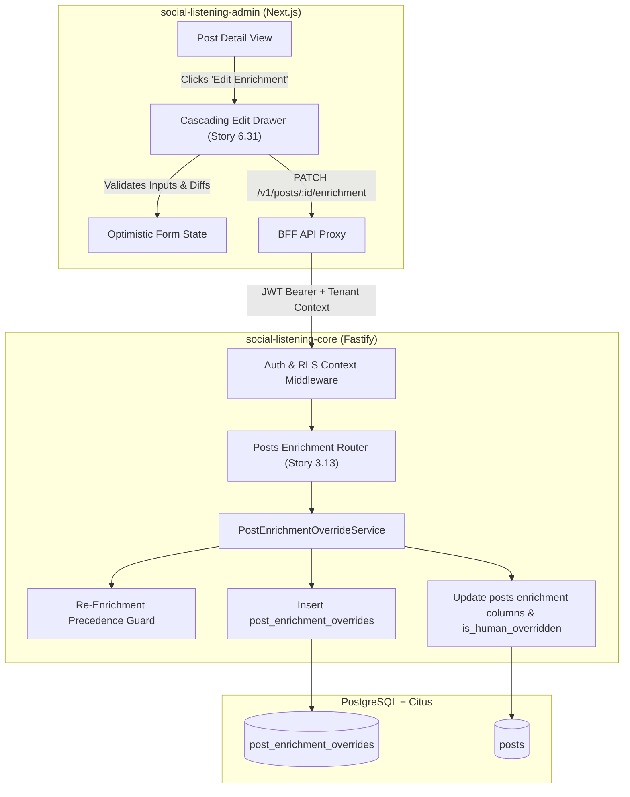
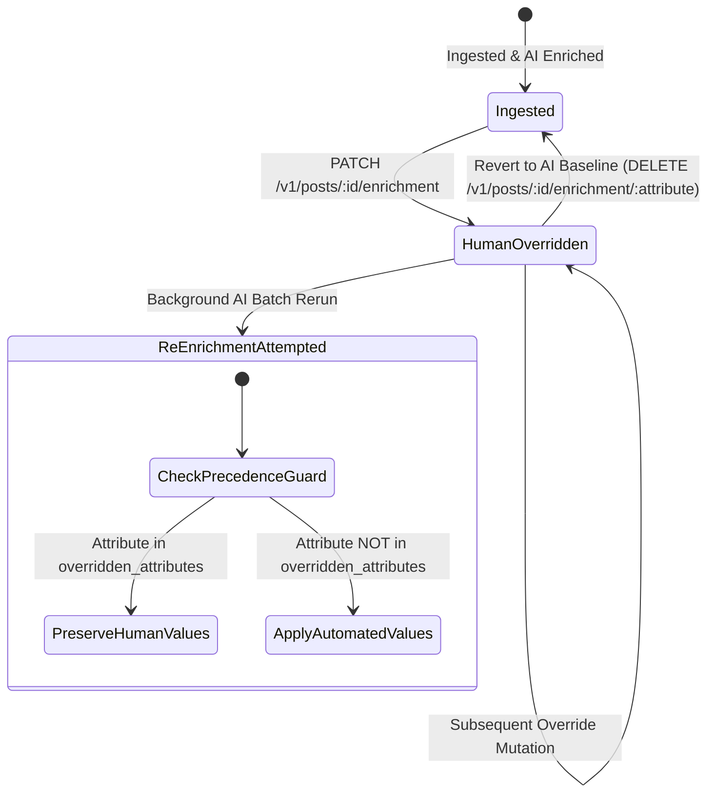

# TDS-0071: Human-in-the-Loop Post Enrichment Overrides and Cascading Drawer UI

**Status:** Approved  
**Date:** 2026-09-05  
**Governing ADR:** [ADR-0071](../../adr/0071-human-in-the-loop-post-enrichment-overrides-and-cascading-drawer-ui.md)  
**Related Epics/Stories:** [Epic 3 / Story 3.13](../../user-stories/epic-3-data-model-storage-and-archival.md), [Epic 6 / Story 6.31](../../user-stories/epic-6-tenant-admin-ui.md)  
**Target Repositories:** `social-listening-core`, `social-listening-admin`  
**Contract Test Citations:**  
- `social-listening-core/contracts/epic-3/story-3.13.post-enrichment-overrides.contract.test.ts`  
- `social-listening-admin/contracts/epic-6/story-6.31.post-enrichment-drawer.contract.test.ts`  

---

## 1. Architectural Context & Problem Statement

Automated AI and NLP pipeline enrichment (sentiment classification, entity extraction, topic assignment, language detection, and geospatial tagging) inevitably produces classification anomalies or domain-specific misjudgments. While automated enrichment operates at high throughput, enterprise users (e.g., `Tenant-Social-Care-Agent`, `Tenant-Brand-Reputation-Manager`, `Compliance-Officer`) require a deterministic mechanism to inspect, dispute, and overwrite automated tags directly from the operational UI.

Crucially, when background batch re-enrichment jobs or model upgrade pipelines re-evaluate historic posts, automated models must not silently overwrite explicit human corrections. 

This specification formalizes:
1. A backend audit-logging override model (`post_enrichment_overrides`) preserving complete provenance (`user_id`, `original_value`, `overridden_value`, `reason`, `created_at`).
2. An atomic re-enrichment precedence guard ensuring human overrides take precedence during automated pipeline reruns.
3. A cascading slide-over edit drawer UI in `social-listening-admin` enabling multi-attribute override submissions with live diff preview and optimistic UI updates.



---

## 2. Governing ADRs & Decision Log Reference

- [ADR-0071: Human-in-the-Loop Post Enrichment Overrides and Cascading Drawer UI](../../adr/0071-human-in-the-loop-post-enrichment-overrides-and-cascading-drawer-ui.md) — Mandates append-only override audit ledger, re-enrichment precedence flag, and slide-over drawer UI.
- [ADR-0017: Multi-Tenant Database Architecture & Row-Level Security](../../adr/0017-multi-tenant-database-architecture-and-row-level-security.md) — Enforces tenant isolation via PostgreSQL RLS and session context.
- [ADR-0038: AI Enrichment Provider Selection](../../adr/0038-ai-enrichment-provider-selection.md) — Specifies baseline enrichment output schema for sentiment, topics, and entities.
- [ADR-0020: Geospatial Enrichment and Coordinate Normalization](../../adr/0020-geospatial-enrichment-and-coordinate-normalization.md) — Defines geospatial coordinate structures subject to manual correction.

---

## 3. Scope, Precedence & Anti-Goals

### In Scope
- Append-only audit logging of all human enrichment mutations across `sentiment`, `topics`, `language`, `urgency`, and `geospatial` attributes.
- Direct update of denormalized enrichment fields on the `posts` record with an atomic flag `is_human_overridden = true` and `override_mask` bitfield/array.
- Re-enrichment pipeline protection ensuring background AI processors respect active overrides.
- Rollback/Revert capability allowing users to restore original AI enrichment.
- Frontend slide-over drawer in `social-listening-admin` showing original value, confidence score, suggested value, and reason input.

### Precedence Invariant
$$\text{Human Override} > \text{Active Prompt / Model Version} > \text{Baseline Ingested AI Classification}$$
If `is_human_overridden` is true for an attribute, background workers re-running NLP must retain the human value in `posts` and log a bypass notice.

### Anti-Goals
- Global model fine-tuning or zero-shot prompt rewriting triggered immediately on human edit (deferred to offline self-learning loops).
- Arbitrary schema modification beyond predefined enrichment attributes.
- Bypassing the core API from the admin interface.

---

## 4. Data Architecture & Storage Schema

The override history is stored in an append-only audit table `post_enrichment_overrides`, while the target `posts` table maintains fast read-path denormalized columns and override flags.

```sql
-- Migration: 0071_create_post_enrichment_overrides.sql

CREATE TABLE IF NOT EXISTS post_enrichment_overrides (
    id UUID PRIMARY KEY DEFAULT gen_random_uuid(),
    tenant_id UUID NOT NULL REFERENCES tenants(id) ON DELETE CASCADE,
    post_id UUID NOT NULL REFERENCES posts(id) ON DELETE CASCADE,
    user_id UUID NOT NULL,
    attribute_name TEXT NOT NULL CHECK (attribute_name IN ('sentiment', 'topics', 'language', 'urgency', 'geospatial')),
    original_value JSONB NOT NULL,
    overridden_value JSONB NOT NULL,
    reason TEXT,
    created_at TIMESTAMPTZ NOT NULL DEFAULT NOW()
);

-- Indexing for fast post audit trail and tenant scoping
CREATE INDEX IF NOT EXISTS idx_post_enrichment_overrides_post 
    ON post_enrichment_overrides(tenant_id, post_id, created_at DESC);

CREATE INDEX IF NOT EXISTS idx_post_enrichment_overrides_attribute 
    ON post_enrichment_overrides(tenant_id, attribute_name);

-- Alter posts table to track human override state
ALTER TABLE posts 
    ADD COLUMN IF NOT EXISTS is_human_overridden BOOLEAN NOT NULL DEFAULT FALSE,
    ADD COLUMN IF NOT EXISTS overridden_attributes TEXT[] NOT NULL DEFAULT '{}',
    ADD COLUMN IF NOT EXISTS last_override_at TIMESTAMPTZ;

CREATE INDEX IF NOT EXISTS idx_posts_human_overridden 
    ON posts(tenant_id, is_human_overridden) 
    WHERE is_human_overridden = TRUE;

-- Row Level Security
ALTER TABLE post_enrichment_overrides ENABLE ROW LEVEL SECURITY;

CREATE POLICY post_enrichment_overrides_tenant_isolation ON post_enrichment_overrides
    AS RESTRICTIVE
    USING (tenant_id = NULLIF(current_setting('app.current_tenant_id', true), '')::uuid)
    WITH CHECK (tenant_id = NULLIF(current_setting('app.current_tenant_id', true), '')::uuid);
```

---

## 5. Component & Interface Contracts

### 5.1 Backend TypeScript Interfaces (`social-listening-core`)

```typescript
export type EnrichmentAttribute = 'sentiment' | 'topics' | 'language' | 'urgency' | 'geospatial';

export interface EnrichmentOverridePayload {
  attribute: EnrichmentAttribute;
  overriddenValue: unknown;
  reason?: string;
}

export interface BatchEnrichmentOverrideRequest {
  overrides: EnrichmentOverridePayload[];
}

export interface PostEnrichmentOverrideRecord {
  id: string;
  tenantId: string;
  postId: string;
  userId: string;
  attributeName: EnrichmentAttribute;
  originalValue: unknown;
  overriddenValue: unknown;
  reason: string | null;
  createdAt: string;
}

export interface UpdatedPostEnrichmentResponse {
  postId: string;
  isHumanOverridden: boolean;
  overriddenAttributes: EnrichmentAttribute[];
  lastOverrideAt: string;
  currentEnrichment: {
    sentiment: { label: string; score: number };
    topics: string[];
    language: string;
    urgency: string;
    geospatial?: { latitude: number; longitude: number; placeName?: string };
  };
  appliedOverrides: PostEnrichmentOverrideRecord[];
}
```

### 5.2 API Route Specification

#### `PATCH /v1/posts/:id/enrichment`
- **Authentication:** JWT Bearer with scope `enrichment:write` or role `Tenant-Admin`, `Tenant-Social-Care-Agent`, `Tenant-Brand-Reputation-Manager`.
- **Headers:** `X-Tenant-ID: <uuid>`

**Request Body:**
```json
{
  "overrides": [
    {
      "attribute": "sentiment",
      "overriddenValue": { "label": "negative", "score": 1.0 },
      "reason": "Sarcastic customer comment misclassified by Azure AI Language"
    },
    {
      "attribute": "urgency",
      "overriddenValue": "high",
      "reason": "Executive escalation mentioned in thread"
    }
  ]
}
```

**Response (200 OK):**
```json
{
  "postId": "7c9e6679-7425-40de-944b-e07fc1f90ae7",
  "isHumanOverridden": true,
  "overriddenAttributes": ["sentiment", "urgency"],
  "lastOverrideAt": "2026-09-05T14:32:00.000Z",
  "currentEnrichment": {
    "sentiment": { "label": "negative", "score": 1.0 },
    "topics": ["pricing", "customer_service"],
    "language": "en",
    "urgency": "high"
  },
  "appliedOverrides": [
    {
      "id": "e9821db2-1f43-41bb-a00d-327ce47ef6b1",
      "tenantId": "f47ac10b-58cc-4372-a567-0e02b2c3d479",
      "postId": "7c9e6679-7425-40de-944b-e07fc1f90ae7",
      "userId": "9a38f7a6-91e8-466d-8152-476a6cfd7465",
      "attributeName": "sentiment",
      "originalValue": { "label": "positive", "score": 0.82 },
      "overriddenValue": { "label": "negative", "score": 1.0 },
      "reason": "Sarcastic customer comment misclassified by Azure AI Language",
      "createdAt": "2026-09-05T14:32:00.000Z"
    }
  ]
}
```

#### `GET /v1/posts/:id/enrichment/history`
Retrieves chronological audit entries of all overrides applied to post `:id`.

---

## 6. State Machine & Lifecycle Transitions



---

## 7. Security, Tenant Isolation & Authentication

1. **Row-Level Security:** `post_enrichment_overrides` and `posts` tables enforce strict RLS based on `app.current_tenant_id`. Cross-tenant updates are physically prohibited at database engine level.
2. **Permission RBAC:**
   - `Tenant-Admin`, `Tenant-Social-Care-Agent`, `Tenant-Brand-Reputation-Manager`: Full read/write override permission.
   - `Tenant-Viewer`: Read-only access to enrichment history.
3. **Audit Immutability:** Rows in `post_enrichment_overrides` cannot be updated or deleted via API. Rollback operations insert a new override record documenting the restoration of the AI baseline.

---

## 8. Performance, Scalability & Resource Boundaries

1. **Transaction Overhead:** Override submissions wrap the audit row insertion and `posts` update inside a single read-committed transaction (`latency < 25ms` at p95).
2. **Re-Enrichment Batch Throughput:** During model re-indexing, the worker queries `overridden_attributes` in the same fetch payload, skipping inference or discarding automated classifications for flagged keys without additional round-trips.
3. **Concurrent Edits:** Pessimistic row locking (`SELECT ... FOR UPDATE`) on the `posts` record prevents race conditions when two care agents edit the same post simultaneously.

---

## 9. Error Handling, Retries & Fallback Strategies

| Error Code | Trigger Condition | HTTP Status | Mitigation / Client Action |
|---|---|---|---|
| `ERR_POST_NOT_FOUND` | Post does not exist or belongs to another tenant | `404 Not Found` | Verify post ID and tenant session context |
| `ERR_INVALID_ATTRIBUTE` | Attribute not in allowed enum list | `400 Bad Request` | Validate attribute name against allowed schema |
| `ERR_CONCURRENT_MODIFICATION`| Lock timeout during concurrent edit | `409 Conflict` | Client refreshes drawer state and prompts user |
| `ERR_RLS_VIOLATION` | RLS session tenant ID mismatch | `403 Forbidden` | Terminate request and log security anomaly |

---

## 10. Observability, Telemetry & Audit Trail

- **Structured Log Entry:**
  ```json
  {
    "event": "enrichment_override_applied",
    "tenantId": "f47ac10b-58cc-4372-a567-0e02b2c3d479",
    "postId": "7c9e6679-7425-40de-944b-e07fc1f90ae7",
    "userId": "9a38f7a6-91e8-466d-8152-476a6cfd7465",
    "attributes": ["sentiment", "urgency"],
    "durationMs": 14.2
  }
  ```
- **Prometheus Metrics:**
  - `enrichment_overrides_total{tenant_id, attribute}` — Counter for manual corrections.
  - `re_enrichment_guard_bypasses_total{tenant_id, attribute}` — Counter for AI updates skipped due to human precedence.

---

## 11. Migration & Backward Compatibility Strategy

- **Database Migration:** Zero-downtime additive migration adding `post_enrichment_overrides` table and default empty array `overridden_attributes` to `posts`.
- **Existing Records:** Existing un-overridden posts have `is_human_overridden = FALSE` and `overridden_attributes = '{}'`. Backward-compatible with all existing search and analytics queries.
- **Rollback:** Dropping the foreign key and table if rolled back, leaving core post records intact.

---

## 12. Executable Contract Test Citations & Verification Matrix

### 12.1 Contract Test Specifications
1. `social-listening-core/contracts/epic-3/story-3.13.post-enrichment-overrides.contract.test.ts`:
   - `test('PATCH /v1/posts/:id/enrichment saves override record and updates post fields')`
   - `test('rejects override attempts across tenant boundary with 404/403')`
   - `test('re-enrichment pipeline worker ignores automated sentiment update when attribute is flagged in overridden_attributes')`
   - `test('records original value and user id in post_enrichment_overrides audit log')`
2. `social-listening-admin/contracts/epic-6/story-6.31.post-enrichment-drawer.contract.test.ts`:
   - `test('renders cascading drawer with current AI values and confidence levels')`
   - `test('submits optimistic PATCH payload and reflects updated badges in UI')`
   - `test('displays audit log history showing previous human corrections')`

### 12.2 Open Questions

- [x] ~~**[Q-0071-1]** Should human overrides be automatically incorporated into model fine-tuning queues?~~  
  *Decision:* No. Immediate inline re-training is prohibited. Overrides accumulate in `post_enrichment_overrides` and are extracted asynchronously by scheduled batch telemetry (ADR-0078/ADR-0122).
- [x] ~~**[Q-0071-2]** Can a user revert an override back to the machine value?~~  
  *Decision:* Yes. Deleting an attribute override writes an append-only audit event restoring the original machine value and clears the attribute from `overridden_attributes`.
