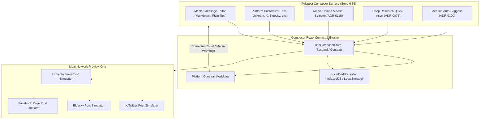
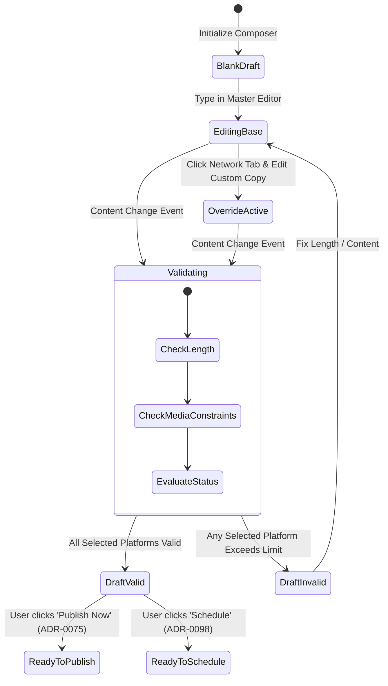

# TDS-0072: Cross-Platform Polypost Composer and Multi-Network Preview Engine

**Status:** Approved  
**Date:** 2026-09-05  
**Governing ADR:** [ADR-0072](../../adr/0072-cross-platform-polypost-composer-and-multi-network-preview-engine.md)  
**Related Epics/Stories:** [Epic 6 / Story 6.36](../../user-stories/epic-6-tenant-admin-ui.md), [Epic 11 / Story 11.7](../../user-stories/epic-11-adr-0095-to-0100.md)  
**Target Repositories:** `social-listening-admin`  
**Contract Test Citations:**  
- `social-listening-admin/contracts/epic-6/story-6.36.polypost-composer.contract.test.ts`  

---

## 1. Architectural Context & Problem Statement

Modern enterprise social media workflows require marketing and communications teams to author and distribute content across multiple disparate social networks simultaneously. However, each platform enforces distinct behavioral, formatting, and structural constraints:
- Character counts vary widely (X: 280, Bluesky: 300, Mastodon: 500, LinkedIn: 3,000, Facebook: 63,206).
- Media rules, aspect ratios, image counts, and video length constraints differ.
- Mentions, hashtags, link previews, and card rendering are network-specific.

Drafting individual posts per channel in isolation leads to messaging fragmentation, redundant copy-pasting, and publishing errors (such as exceeding character limits or broken link previews).

This technical design defines the **Polypost Composer & Multi-Network Preview Engine** in `social-listening-admin`:
1. A master authoring surface that maintains a base message while supporting network-specific override tabs.
2. A real-time client-side preview engine rendering platform-accurate mockups (typography, layout, card generation, and avatar wrapping) across all active target platforms.
3. Strict per-network constraint validation engines that update character progress meters, badge warnings, and disable invalid platform publish triggers.
4. Client draft autosave and session recovery backed by browser storage.



---

## 2. Governing ADRs & Decision Log Reference

- [ADR-0072: Cross-Platform Polypost Composer and Multi-Network Preview Engine](../../adr/0072-cross-platform-polypost-composer-and-multi-network-preview-engine.md) — Establishes core composer UI architecture, network override model, and preview fidelity requirements.
- [ADR-0075: Outbound Social Post Publishing via Platform APIs](../../adr/0075-outbound-social-post-publishing.md) — Dictates target platform connection models and publishing dispatch boundaries.
- [ADR-0076: Composer Deep Research Agent](../../adr/0076-composer-deep-research-agent.md) — Integrates research summary cards and citation pasting into the composer buffer.
- [ADR-0098: Publishing and Scheduling](../../adr/0098-publishing-and-scheduling.md) — Specifies the scheduling and queue dispatch contracts fed by the composer.
- [ADR-0100: Composed Post Author Mention Suggestions](../../adr/0100-composed-post-author-mention-suggestions.md) — Governs mention insertion contracts per network.
- [ADR-0115: Publishing — Media Upload and Asset Targeting](../../adr/0115-publishing-media-upload-and-asset-targeting.md) — Governs media constraints and multi-platform asset assignment.

---

## 3. Scope, Precedence & Anti-Goals

### In Scope
- Single-page / modal composer interface with base copy editor and network override tabs (`linkedin`, `facebook`, `x`, `bluesky`, `mastodon`, `instagram`, `threads`).
- Synchronous real-time constraint validation checking character length, link shortening impact, hashtag syntax, and media counts.
- Side-by-side or responsive tabbed preview cards faithfully mimicking real feed presentation.
- Client-side autosave to `IndexedDB` preventing draft loss during navigation or page reload.
- Extensible action bar integrating Deep Research (ADR-0076), Mention Suggestions (ADR-0100), and Asset Targeter (ADR-0115).

### Precedence Invariant
$$\text{Platform-Specific Override} > \text{Base Master Text}$$
When a target platform has custom text defined, that text is validated, previewed, and published for that platform. If no override exists, the master text is used.

### Anti-Goals
- Server-side rendering of static preview images (previews are generated 100% clientside via CSS/DOM components).
- Direct socket/API publishing to external networks from the browser (all outbound requests route through `social-listening-core`).

---

## 4. Data Architecture & Storage Schema

Drafts are persisted locally in client-side storage (`IndexedDB`) before server dispatch, with optional server-side draft storage for shared team queues (ADR-0098).

### 4.1 Client-Side Draft Storage Schema (`IndexedDB`)

```typescript
// Database Name: 'SocialEngageComposerDB'
// Object Store: 'drafts' (keyPath: 'id')

export interface LocalComposerDraft {
  id: string; // UUID
  tenantId: string;
  userId: string;
  baseText: string;
  platformOverrides: Record<string, {
    text?: string;
    mediaAssetIds?: string[];
  }>;
  selectedPlatforms: string[];
  mediaAssets: Array<{
    id: string;
    url: string;
    mimeType: string;
    sizeBytes: number;
    altText?: string;
  }>;
  scheduleAt?: string | null;
  updatedAt: number; // Unix timestamp
}
```

### 4.2 Platform Constraint Matrix (Static Definition)

```typescript
export interface PlatformConstraint {
  platformId: string;
  displayName: string;
  maxCharacters: number;
  urlCountAsChars: number; // e.g. 23 on X/Twitter (t.co)
  maxImages: number;
  maxVideos: number;
  maxVideoDurationSec: number;
  allowedMediaTypes: string[];
  supportsMarkdown: boolean;
  supportsAltText: boolean;
}

export const PLATFORM_CONSTRAINTS: Record<string, PlatformConstraint> = {
  x: {
    platformId: 'x',
    displayName: 'X / Twitter',
    maxCharacters: 280,
    urlCountAsChars: 23,
    maxImages: 4,
    maxVideos: 1,
    maxVideoDurationSec: 140,
    allowedMediaTypes: ['image/jpeg', 'image/png', 'image/gif', 'video/mp4'],
    supportsMarkdown: false,
    supportsAltText: true,
  },
  bluesky: {
    platformId: 'bluesky',
    displayName: 'Bluesky',
    maxCharacters: 300,
    urlCountAsChars: 0, // grapheme length
    maxImages: 4,
    maxVideos: 1,
    maxVideoDurationSec: 60,
    allowedMediaTypes: ['image/jpeg', 'image/png', 'video/mp4'],
    supportsMarkdown: false,
    supportsAltText: true,
  },
  mastodon: {
    platformId: 'mastodon',
    displayName: 'Mastodon',
    maxCharacters: 500,
    urlCountAsChars: 23,
    maxImages: 4,
    maxVideos: 1,
    maxVideoDurationSec: 300,
    allowedMediaTypes: ['image/jpeg', 'image/png', 'image/gif', 'video/mp4'],
    supportsMarkdown: false,
    supportsAltText: true,
  },
  linkedin: {
    platformId: 'linkedin',
    displayName: 'LinkedIn',
    maxCharacters: 3000,
    urlCountAsChars: 0,
    maxImages: 9,
    maxVideos: 1,
    maxVideoDurationSec: 600,
    allowedMediaTypes: ['image/jpeg', 'image/png', 'image/gif', 'video/mp4', 'application/pdf'],
    supportsMarkdown: false,
    supportsAltText: true,
  },
  facebook: {
    platformId: 'facebook',
    displayName: 'Facebook',
    maxCharacters: 63206,
    urlCountAsChars: 0,
    maxImages: 10,
    maxVideos: 1,
    maxVideoDurationSec: 14400,
    allowedMediaTypes: ['image/jpeg', 'image/png', 'image/gif', 'video/mp4'],
    supportsMarkdown: false,
    supportsAltText: false,
  }
};
```

---

## 5. Component & Interface Contracts

### 5.1 React Component Hierarchy (`social-listening-admin`)

```
src/components/composer/
├── PolypostComposerModal.tsx             -- Root modal / drawer container
├── ComposerHeader.tsx                    -- Tenant brand profile selector & action buttons
├── ComposerEditor.tsx                    -- Rich / plain text editor with @mentions hook
├── PlatformOverrideTabs.tsx              -- Switcher between Base and platform override tabs
├── AssetTray.tsx                         -- Media upload manager & thumbnail list
├── ValidationSummary.tsx                 -- Per-network character progress & warning chips
├── ResearchInsertPopover.tsx             -- Deep Research context insertion (ADR-0076)
└── preview/
    ├── MultiNetworkPreviewGrid.tsx       -- Grid / tabbed simulator host
    ├── LinkedInPreviewCard.tsx           -- LinkedIn card layout simulator
    ├── XPreviewCard.tsx                  -- X feed card simulator
    ├── BlueskyPreviewCard.tsx            -- Bluesky post simulator
    └── FacebookPreviewCard.tsx           -- Facebook Page card simulator
```

### 5.2 Composer State Hook Interface

```typescript
export interface ComposerState {
  baseText: string;
  selectedPlatforms: string[];
  platformOverrides: Record<string, string>;
  mediaAssets: MediaAssetItem[];
  isSubmitting: boolean;
  validationResults: Record<string, PlatformValidationStatus>;

  setBaseText: (text: string) => void;
  togglePlatform: (platformId: string) => void;
  setPlatformOverride: (platformId: string, text: string) => void;
  addMediaAsset: (asset: MediaAssetItem) => void;
  removeMediaAsset: (assetId: string) => void;
  resetDraft: () => void;
}

export interface PlatformValidationStatus {
  isValid: boolean;
  characterCount: number;
  maxCharacters: number;
  remainingCharacters: number;
  errors: string[];
  warnings: string[];
}
```

---

## 6. State Machine & Lifecycle Transitions



---

## 7. Security, Tenant Isolation & Authentication

1. **Client Isolation:** `IndexedDB` stores are scoped per `tenantId` and `userId` key prefix to prevent data bleeding between multiple active accounts in the same browser profile.
2. **XSS Protection:** Previews sanitize all user inputs using DOMPurify before injecting into simulation DOM trees; links are rendered as non-navigating mockup spans.
3. **Publishing Authorization:** The composer verifies active tenant connector permissions via `useTenantConnectors()` query. Only connected and authenticated platforms can be selected for publishing.

---

## 8. Performance, Scalability & Resource Boundaries

1. **Input Debouncing:** Character count computation, link parsing, and validation checks run synchronously on state change within 5ms.
2. **Preview Layout Thrashing:** Previews use lightweight CSS Flexbox/Grid structures with pure CSS avatars and inline SVGs, ensuring 60fps typing responsiveness without lag.
3. **Storage Quota:** Local draft cleanup evicts drafts older than 30 days automatically.

---

## 9. Error Handling, Retries & Fallback Strategies

| Scenario | UI Behavior | Mitigation |
|---|---|---|
| Text exceeds character limit | Progress bar turns red, excess characters highlighted in editor | Disable publish CTA for invalid network; suggest manual trim |
| Image dimensions incompatible | Warning badge on platform preview card | Alert user to aspect ratio clipping or recommend platform override |
| Network disconnect while composing | Offline banner shown in composer header | Draft safely persists to local `IndexedDB` with retry banner |
| Media upload failure | Inline retry button on failed asset thumbnail | Do not block text editing; isolate asset failure |

---

## 10. Observability, Telemetry & Audit Trail

- **Client Analytics Events:**
  - `composer_opened { source: 'nav' | 'post_detail' | 'research' }`
  - `composer_platform_toggled { platformId, enabled: boolean }`
  - `composer_override_created { platformId }`
  - `composer_validation_failed { platformId, reason: 'length' | 'media' }`
  - `composer_publish_initiated { platformsCount, hasMedia: boolean }`

---

## 11. Migration & Backward Compatibility Strategy

- **Client Storage Migration:** Versioned `IndexedDB` schema (`version: 1`). If schema changes, upgraded stores migrate existing drafts gracefully.
- **Backwards Compatibility:** Works seamlessly with text-only publishing (ADR-0075) while being forward-compatible with scheduling (ADR-0098) and media attachments (ADR-0115).

---

## 12. Executable Contract Test Citations & Verification Matrix

### 12.1 Contract Test Specifications
1. `social-listening-admin/contracts/epic-6/story-6.36.polypost-composer.contract.test.ts`:
   - `test('calculates accurate remaining character count per platform taking link shortening into account')`
   - `test('allows network-specific text override to supersede base master text in preview')`
   - `test('flags character overage as invalid and disables publish submission button')`
   - `test('persists draft content to browser storage on keystroke debounce')`
   - `test('renders platform-accurate card layout for LinkedIn, X, Bluesky, and Facebook')`

### 12.2 Open Questions

- [x] ~~**[Q-0072-1]** Should the preview engine generate pixel-identical social embeds via iframe?~~  
  *Decision:* No. Iframes require external authentication or embed scripts that slow down the UI and leak cookies. Lightweight CSS simulators provide immediate fidelity without latency.
- [x] ~~**[Q-0072-2]** What happens when the user types a link on X/Twitter?~~  
  *Decision:* Regardless of raw link length, any URL is counted as 23 characters matching the Twitter `t.co` shortening algorithm.
