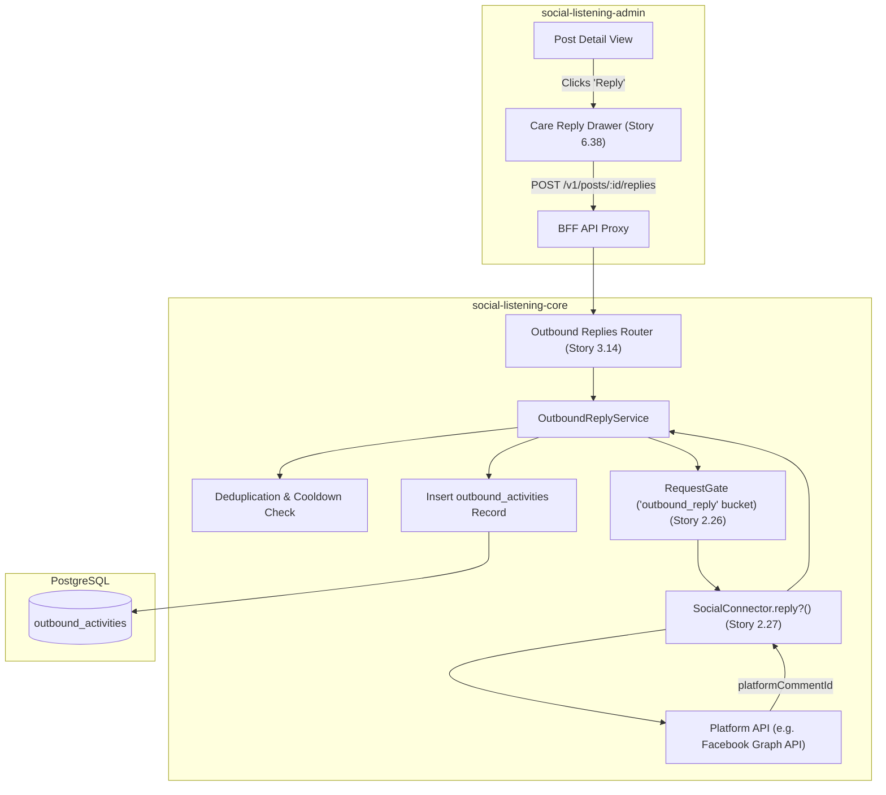
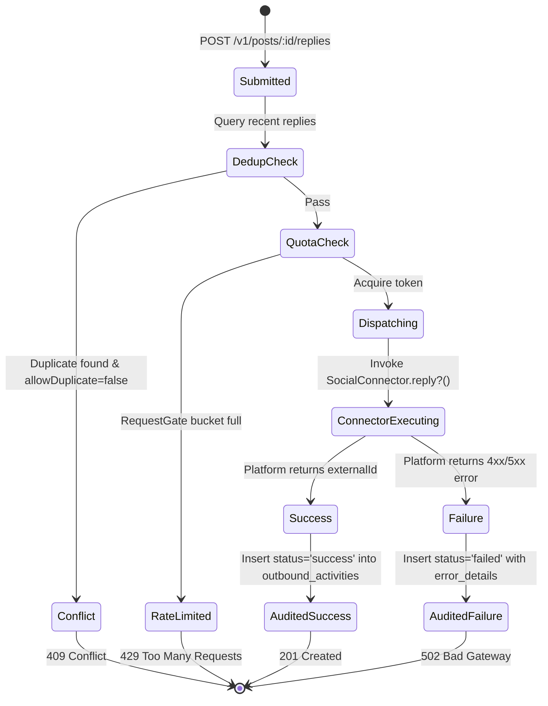

# TDS-0073: Outbound Reply to Ingested Posts via Platform APIs

**Status:** Approved  
**Date:** 2026-09-05  
**Governing ADR:** [ADR-0073](../../adr/0073-outbound-reply-to-ingested-posts.md)  
**Related Epics/Stories:** [Epic 2 / Story 2.26, 2.27](../../user-stories/epic-2-ingestion-connectors-and-rate-limits.md), [Epic 3 / Story 3.14](../../user-stories/epic-3-data-model-storage-and-archival.md), [Epic 6 / Story 6.38](../../user-stories/epic-6-tenant-admin-ui.md), [Epic 11 / Story 11.9, 11.10](../../user-stories/epic-11-adr-0095-to-0100.md)  
**Target Repositories:** `social-listening-core`, `social-listening-admin`  
**Contract Test Citations:**  
- `social-listening-core/contracts/epic-2/story-2.26.connector-reply-framework.contract.test.ts`  
- `social-listening-core/contracts/epic-2/story-2.27.facebook-page-reply.contract.test.ts`  
- `social-listening-core/contracts/epic-3/story-3.14.outbound-reply-audit.contract.test.ts`  
- `social-listening-admin/contracts/epic-6/story-6.38.post-reply-drawer.contract.test.ts`  

---

## 1. Architectural Context & Problem Statement

Social listening is traditionally passive: posts are ingested, enriched, and aggregated into analytic dashboards. However, customer care teams (`Tenant-Social-Care-Agent`) and brand reputation managers require an active engagement loop — directly replying to customer grievances, inquiries, and praise from within the SocialEngage console.

Directly executing outbound mutations against third-party social APIs introduces serious architectural hazards:
1. **Rate Limit Contention:** Ingestion polling must never be starved because an outbound care agent dispatched a burst of replies.
2. **Audit & Compliance Deficits:** Replies published by enterprise agents must be permanently recorded with agent identity, target post reference, platform post ID, and delivery receipt.
3. **Connector Heterogeneity:** Each social platform exposes divergent reply semantics (e.g., Facebook Graph API `/comments`, Twitter/X API `/tweets` with `in_reply_to_tweet_id`, Mastodon statuses with `in_reply_to_id`).

This specification establishes:
1. An extensible `reply?()` interface on `SocialConnector`.
2. Dedicated `RequestGate` rate-limit isolation under the key `(tenantId, providerId, 'outbound_reply')`.
3. The `outbound_activities` audit ledger tracking outbound replies with RLS.
4. The core API endpoint `POST /v1/posts/:id/replies` and the slide-over care composer in `social-listening-admin`.



---

## 2. Governing ADRs & Decision Log Reference

- [ADR-0073: Outbound Reply to Ingested Posts via Platform APIs](../../adr/0073-outbound-reply-to-ingested-posts.md) — Authorizes connector reply interface, audit logging, and core API routing.
- [ADR-0021: Rate Limiting and Backoff per Connector](../../adr/0021-rate-limiting-and-backoff-per-connector.md) — Establishes Redis `RequestGate` bucket isolation.
- [ADR-0051: Connector Activation and Credential Storage](../../adr/0051-connector-activation-and-credential-storage.md) — Dictates OAuth credential resolution for outbound operations.
- [ADR-0075: Outbound Social Post Publishing via Platform APIs](../../adr/0075-outbound-social-post-publishing.md) — Unifies outbound audit logging under `outbound_activities`.

---

## 3. Scope, Precedence & Anti-Goals

### In Scope
- Optional `reply?()` method on `SocialConnector` supporting text replies and parent-thread linkage.
- Dedicated outbound rate-limit gating isolating care replies from ingestion quota.
- Atomic insertion into `outbound_activities` with `activity_type = 'reply'`.
- Duplicate reply prevention: returning `409 Conflict` if an identical reply was dispatched to the same post within 15 minutes by the same tenant, unless `allowDuplicate: true` is passed.
- Operational reply drawer in `social-listening-admin` with thread preview, character meter, and success badge.

### Precedence Invariant
$$\text{Outbound Operational Limit} \le \text{Platform Tier Quota} \land \text{Tenant Isolation}$$
Outbound replies must use credentials belonging strictly to the initiating tenant's activated connector. No platform credentials may ever be shared across tenants.

### Anti-Goals
- Automated generative AI auto-replies without human agent review (strictly Human-in-the-Loop in v1).
- Private Direct Message (DM) / Messenger workflows (scoped exclusively to public post/comment replies).

---

## 4. Data Architecture & Storage Schema

Outbound replies are audited in the unified `outbound_activities` table.

```sql
-- Migration: 0073_create_outbound_activities.sql

CREATE TABLE IF NOT EXISTS outbound_activities (
    id UUID PRIMARY KEY DEFAULT gen_random_uuid(),
    tenant_id UUID NOT NULL REFERENCES tenants(id) ON DELETE CASCADE,
    activity_type TEXT NOT NULL CHECK (activity_type IN ('reply', 'publish', 'crm_handoff')),
    post_id UUID REFERENCES posts(id) ON DELETE SET NULL,
    author_id UUID REFERENCES authors(id) ON DELETE SET NULL,
    connector_id TEXT NOT NULL,
    user_id UUID NOT NULL,
    content TEXT,
    external_id TEXT,             -- Platform Comment ID / Tweet ID
    external_url TEXT,            -- Deep link to the live comment
    status TEXT NOT NULL CHECK (status IN ('pending', 'success', 'failed')),
    error_details JSONB,
    created_at TIMESTAMPTZ NOT NULL DEFAULT NOW(),
    updated_at TIMESTAMPTZ NOT NULL DEFAULT NOW()
);

-- Indexing for tenant lookup, post history, and deduplication
CREATE INDEX IF NOT EXISTS idx_outbound_activities_post 
    ON outbound_activities(tenant_id, post_id, created_at DESC);

CREATE INDEX IF NOT EXISTS idx_outbound_activities_dedup 
    ON outbound_activities(tenant_id, post_id, activity_type, created_at DESC)
    WHERE status = 'success';

-- Row Level Security
ALTER TABLE outbound_activities ENABLE ROW LEVEL SECURITY;

CREATE POLICY outbound_activities_tenant_isolation ON outbound_activities
    AS RESTRICTIVE
    USING (tenant_id = NULLIF(current_setting('app.current_tenant_id', true), '')::uuid)
    WITH CHECK (tenant_id = NULLIF(current_setting('app.current_tenant_id', true), '')::uuid);
```

---

## 5. Component & Interface Contracts

### 5.1 Connector Reply Interface (`social-listening-core`)

```typescript
export interface IngestedPostReference {
  platformPostId: string;
  nativeAuthorHandle?: string;
  nativeThreadId?: string;
  rawSourcePayload?: Record<string, unknown>;
}

export interface OutboundReplyResult {
  externalCommentId: string;
  externalCommentUrl: string;
  publishedAt: string;
  rawResponse?: Record<string, unknown>;
}

export interface SocialConnector {
  // Existing connector properties...
  readonly id: string;
  readonly platform: string;
  
  reply?(
    ctx: ConnectorContext,
    targetPost: IngestedPostReference,
    replyText: string
  ): Promise<OutboundReplyResult>;
}
```

### 5.2 API Route Specification

#### `POST /v1/posts/:id/replies`
- **Authentication:** JWT Bearer with scope `replies:write` or role `Tenant-Social-Care-Agent`, `Tenant-Admin`.
- **Headers:** `X-Tenant-ID: <uuid>`, `Idempotency-Key: <string>`

**Request Body:**
```json
{
  "text": "Thank you for reaching out @johndoe! Our support team has escalated ticket #4092 to resolve your issue.",
  "allowDuplicate": false
}
```

**Response (201 Created):**
```json
{
  "outboundActivityId": "8f12a321-4d56-42ab-9d10-8f921ab04721",
  "postId": "7c9e6679-7425-40de-944b-e07fc1f90ae7",
  "externalCommentId": "109823471029384_109823489123847",
  "externalCommentUrl": "https://www.facebook.com/permalink.php?story_fbid=109823471029384&id=1000&comment_id=109823489123847",
  "status": "success",
  "createdAt": "2026-09-05T15:10:00.000Z"
}
```

#### `GET /v1/posts/:id/replies`
Returns all logged replies associated with post `:id` for the current tenant.

---

## 6. State Machine & Lifecycle Transitions



---

## 7. Security, Tenant Isolation & Authentication

1. **Credential Resolution:** Connector credentials are authenticated exclusively via `ConnectorContext` using credentials mapped to the tenant's activated platform token (`owner_type = 'tenant'`).
2. **Access Control:** Only authenticated tenant users with care permissions (`Tenant-Social-Care-Agent`, `Tenant-Admin`) can dispatch replies.
3. **Idempotency Protection:** Requests support standard `Idempotency-Key` headers stored in Redis for 120 seconds to prevent double-click submissions.

---

## 8. Performance, Scalability & Resource Boundaries

1. **Rate Limit Keying:** Outbound replies are metered under Redis key:
   $$\text{ratelimit:}\{\text{tenantId}\}:\{\text{platformId}\}:\text{outbound\_reply}$$
   This completely isolates reply dispatching from continuous ingestion polling quotas.
2. **Execution Timeout:** Connector HTTP calls enforce a strict 10-second timeout before writing `status = 'failed'` and releasing worker connections.
3. **Database Write Speed:** Auditing is executed in a single atomic insert (`< 10ms` p99).

---

## 9. Error Handling, Retries & Fallback Strategies

| Error Condition | Response Code | System Action |
|---|---|---|
| Platform token expired / revoked | `401 Unauthorized` | Marks connector status as `degraded`, prompts re-auth in admin console |
| Platform rate limit hit | `429 Too Many Requests` | Returns `Retry-After` header matching platform backoff |
| Target post deleted on platform | `404 Not Found` | Logs activity with `error_details: 'parent_post_deleted'` |
| Transient platform 500 error | `502 Bad Gateway` | Activity stored with `status = 'failed'`, enabling agent manual retry |

---

## 10. Observability, Telemetry & Audit Trail

- **Structured Audit Logging:**
  ```json
  {
    "event": "outbound_reply_dispatched",
    "tenantId": "f47ac10b-58cc-4372-a567-0e02b2c3d479",
    "postId": "7c9e6679-7425-40de-944b-e07fc1f90ae7",
    "connectorId": "facebook-connector-1",
    "userId": "9a38f7a6-91e8-466d-8152-476a6cfd7465",
    "externalCommentId": "109823489123847",
    "status": "success",
    "latencyMs": 420.5
  }
  ```
- **Prometheus Metrics:**
  - `outbound_replies_total{tenant_id, platform, status}` — Counter of all reply attempts.
  - `outbound_reply_latency_seconds{platform}` — Histogram of external platform API round-trip latencies.

---

## 11. Migration & Backward Compatibility Strategy

- **Schema Evolution:** Additive creation of `outbound_activities` table.
- **Connector Compatibility:** The `reply?()` method is optional on `SocialConnector`. Connectors without reply capabilities (e.g., RSS, Brave Search) omit the method, causing the API to gracefully respond with `501 Not Implemented`.

---

## 12. Executable Contract Test Citations & Verification Matrix

### 12.1 Contract Test Specifications
1. `social-listening-core/contracts/epic-2/story-2.26.connector-reply-framework.contract.test.ts`:
   - `test('dispatches reply through connector and enforces isolated outbound rate limit')`
   - `test('rejects duplicate replies within cooldown window unless allowDuplicate is true')`
2. `social-listening-core/contracts/epic-2/story-2.27.facebook-page-reply.contract.test.ts`:
   - `test('formats Graph API POST to /{comment-id}/comments with valid page token')`
   - `test('returns canonical permalink to created Facebook comment')`
3. `social-listening-core/contracts/epic-3/story-3.14.outbound-reply-audit.contract.test.ts`:
   - `test('inserts complete audit row in outbound_activities with user_id and tenant_id')`
   - `test('enforces RLS preventing cross-tenant inspection of outbound replies')`
4. `social-listening-admin/contracts/epic-6/story-6.38.post-reply-drawer.contract.test.ts`:
   - `test('renders reply drawer with parent post context and character constraints')`
   - `test('disables submit button and shows loading spinner during dispatch')`
   - `test('updates post replies tab with newly published comment receipt')`

### 12.2 Open Questions

- [x] ~~**[Q-0073-1]** Should replies be allowed to include image attachments in v1?~~  
  *Decision:* No. ADR-0073 scopes v1 strictly to plain-text replies. Media upload support for outbound messages is standardized in ADR-0115.
- [x] ~~**[Q-0073-2]** How should duplicate replies be defined?~~  
  *Decision:* Exact text match against the same target `post_id` within a 15-minute rolling window for the same tenant.
