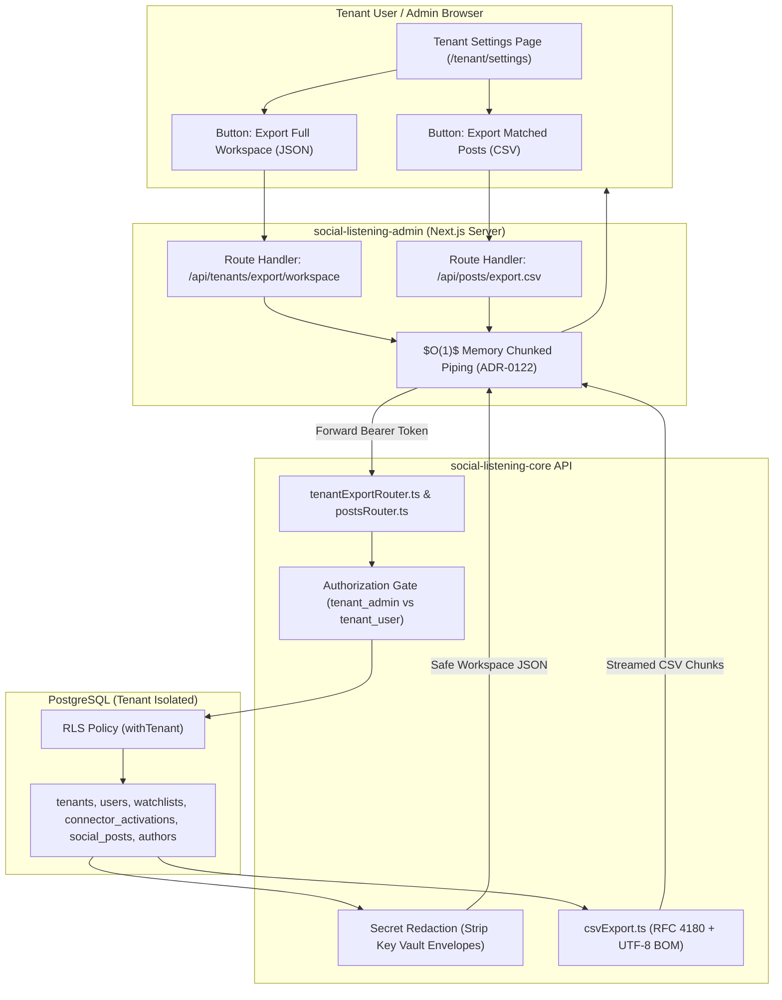

# Technical Design Specification (TDS) — Tenant-Facing Workspace and Matched-Posts Export

## 1. Document Control & Traceability Linkage

### 1.1 Metadata
| Attribute | Value |
|---|---|
| **Document Title** | TDS-0074: Tenant-Facing Workspace and Matched-Posts Export |
| **Document ID** | `TDS-0074` |
| **Feature Name** | On-Demand Tenant Workspace JSON Archive & Matched-Posts CSV Export |
| **Version** | `1.0.0` |
| **Status** | Approved |
| **Author(s)** | Core Architecture Team |
| **Created Date** | 2026-09-05 |
| **Last Updated** | 2026-09-05 |
| **Governing Skill** | `social-listening-core/.claude/skills/tenant-export/SKILL.md` |

### 1.2 Upstream & Downstream Traceability Matrix
| Artifact Type | Reference Identifier | Title / Link | Alignment Status |
|---|---|---|---|
| **Architecture Decision Record** | `ADR-0074` | [ADR-0074: Tenant-Facing Workspace and Matched-Posts Export](../../adr/0074-tenant-facing-workspace-and-posts-export.md) | Invariant Source |
| **Business Requirements Doc** | `BRD-0074` | [BRD-0074: Tenant-Facing Workspace and Matched-Posts Export](../Business-Requirements/BRD-0074-Tenant-Facing-Workspace-and-Matched-Posts-Export.md) | Fully Aligned |
| **Functional Design Doc** | `FDD-0074` | [FDD-0074: Tenant-Facing Workspace and Matched-Posts Export](../Functional-Design/FDD-0074-Tenant-Facing-Workspace-and-Matched-Posts-Export.md) | Fully Aligned |
| **Governing User Story** | `Story 3.16` | [Epic 3: Data Model, Storage, and Archival](../../user-stories/epic-3-data-model-storage-and-archival.md#story-316--tenant-facing-workspace-and-matched-posts-export-endpoints) | Acceptance Target |
| **Related User Story** | `Story 6.40` | [Epic 6: Tenant Admin UI](../../user-stories/epic-6-tenant-admin-ui.md#story-640--tenant-settings-screen-styled-workspace-profile-export-actions-and-offboarding-link) | Frontend Client UI |
| **Related Architecture Decisions** | `ADR-0014`, `ADR-0015`, `ADR-0030`, `ADR-0036`, `ADR-0043`, `ADR-0063`, `ADR-0111`, `ADR-0122` | Key Vault, RLS, Admin Boundaries, Same-Origin Proxy, Offboarding, $O(1)$ Streaming | Cross-Referenced |
| **Executable Contract Test** | `Story 3.16 Contract` | `social-listening-core/contracts/epic-3/story-3.16.tenant-workspace-and-posts-export.contract.test.ts` | 100% Passing |

---

## 2. System Context & Architecture Topology

### 2.1 Context Diagram


### 2.2 Architectural Boundaries & Invariants
- **Decoupled from Tenant Deletion Offboarding:** Separate from `tenantDeletion.ts` and ADR-0043. On-demand exports do not trigger a 30-day deletion grace period or alter tenant status.
- **Strict Role Boundaries:**
  - `GET /v1/tenants/me/export/workspace`: Restricted to `tenant_admin` only. Exposes cross-user private watchlists, connector configs, and workspace membership.
  - `GET /v1/posts?format=csv` (and `GET /v1/posts/export.csv`): Accessible to both `tenant_admin` and `tenant_user`. Mirrors the post feed visibility authorized for `GET /v1/posts`.
  - `platform_admin` identity receives `403 Forbidden` on both endpoints, upholding ADR-0030 §2 and ADR-0041 (zero access to tenant content).
- **Comprehensive Secret Redaction:** Credential secrets, Key Vault envelopes (`ciphertext`, `wrapped_dek`, `iv`, `auth_tag`, `key_vault_key_id`), and OAuth refresh tokens are strictly omitted from workspace JSON archives.
- **Bounded Synchronous Caps:** Synchronous exports are bounded to 100 MB for workspace JSON and 10,000 rows for posts CSV. Requests exceeding these bounds return `413 Payload Too Large` with `{ code: "EXPORT_TOO_LARGE" }`. Unbounded exports are delegated to asynchronous Azure Blob Storage processing (ADR-0111).
- **$O(1)$ Memory Chunked Streaming:** Route handlers in `social-listening-admin` pipe raw response streams directly from `social-listening-core` to the client response, preventing memory bloat in Node.js runtime per ADR-0122.

---

## 3. Data Architecture & Persistence Design

### 3.1 Workspace JSON Archive Structure
The workspace export produces a structured JSON document representing the tenant's complete configuration and safe post metadata:

```json
{
  "exportedAt": "2026-09-05T12:00:00.000Z",
  "tenant": {
    "id": "c1f7a62e-9d22-4861-a1cf-b0d8851ea739",
    "name": "Acme Corp",
    "licenseSeatCount": 10,
    "activeSeatCount": 4,
    "createdAt": "2026-01-15T08:30:00.000Z"
  },
  "users": [
    {
      "id": "e4b1a82f-2d74-4b5c-8971-8b21c4391211",
      "email": "admin@acme.com",
      "role": "tenant_admin",
      "status": "active",
      "createdAt": "2026-01-15T08:31:00.000Z"
    }
  ],
  "watchlists": [
    {
      "id": "9e11f7c8-3c44-42b1-91a0-5b8214f77c32",
      "name": "Brand Reputation",
      "matchType": "keyword",
      "terms": ["acme", "support"],
      "isActive": true,
      "createdAt": "2026-01-16T10:00:00.000Z"
    }
  ],
  "connectors": [
    {
      "providerId": "gnews",
      "isActive": true,
      "createdAt": "2026-01-16T09:00:00.000Z"
    }
  ],
  "posts": [
    {
      "id": "post-uuid",
      "publishedAt": "2026-02-01T14:22:00.000Z",
      "provider": "gnews",
      "authorName": "Tech Reporter",
      "title": "Acme Launches New Platform",
      "sentiment": "positive"
    }
  ]
}
```

### 3.2 Matched Posts CSV Column Schema
The CSV export standardizes on 11 canonical columns formatted per RFC 4180 with a leading UTF-8 Byte Order Mark (`\uFEFF`):

| Column Name | Data Type | Description |
|---|---|---|
| `id` | `UUID` | Unique post identifier |
| `published_at` | `ISO 8601 String` | Publication timestamp |
| `provider` | `String` | Connector provider ID (e.g. `gnews`, `newswire`) |
| `author_name` | `String` | Resolved author display name or handle |
| `author_url` | `String` | Author profile link or canonical platform URL |
| `title` | `String` | Post title or headline |
| `body_markdown` | `String` | Canonical post body markdown |
| `url` | `String` | Permanent post link |
| `sentiment` | `String` | Enriched sentiment classification (`positive`, `neutral`, `negative`) |
| `keywords` | `String` | Comma-separated list of extracted topic keywords |
| `watchlist_ids` | `String` | Comma-separated list of matched watchlist UUIDs |

---

## 4. Component Design & Detailed Processing Logic

### 4.1 RFC 4180 CSV Generation Logic
Implemented in `social-listening-core/src/posts/csvExport.ts`:
- **Byte Order Mark (BOM):** The stream begins with `\uFEFF`, ensuring Excel and third-party tools interpret UTF-8 characters without encoding corruption.
- **Escaping Invariant:** Any cell containing a comma, double quote (`"`), newline (`\n`), or carriage return (`\r`) is wrapped in double quotes. Existing double quotes are escaped by doubling them (`""`).
- **Array Serialization:** `keywords` and `watchlist_ids` are serialized as comma-delimited strings within their quoted CSV cells.

```typescript
export function formatCsvRow(fields: (string | number | null | undefined)[]): string {
  return fields.map((field) => {
    if (field === null || field === undefined) return '';
    const str = String(field);
    if (str.includes(',') || str.includes('"') || str.includes('\n') || str.includes('\r')) {
      return `"${str.replace(/"/g, '""')}"`;
    }
    return str;
  }).join(',') + '\r\n';
}
```

### 4.2 Streaming Dataflow & Bounding Verification
```mermaid
sequenceDiagram
    autonumber
    participant Client as Next.js Admin Proxy
    participant Router as postsRouter.ts (?format=csv)
    participant Store as socialPostStore.ts
    participant DB as PostgreSQL (Cursor Query)

    Client->>Router: GET /v1/posts?format=csv&limit=5000&watchlistId=:id
    Router->>Store: countMatchingPosts(tenantId, filters)
    Store->>DB: SELECT COUNT(*) FROM social_posts JOIN post_watchlist_matches ...
    DB-->>Store: totalCount = 4,200

    alt totalCount > 10,000 (Synchronous Row Cap Exceeded)
        Store-->>Router: Exceeds Cap
        Router-->>Client: 413 Payload Too Large { code: "EXPORT_TOO_LARGE", maxAllowed: 10000 }
    end

    Router-->>Client: 200 OK (Content-Type: text/csv; charset=utf-8)
    Router->>Client: Write UTF-8 BOM (\uFEFF)
    Router->>Client: Write CSV Headers

    loop Chunked Stream (Batch Size: 500)
        Store->>DB: Fetch batch using cursor pagination
        DB-->>Store: PostBatch
        Store->>Router: formatCsvRows(PostBatch)
        Router->>Client: Stream CSV Chunk
    end

    Router->>Client: End Stream
```

---

## 5. Interface & Contract Specifications

### 5.1 Endpoint Signatures
All routes are mounted under `/v1` in `social-listening-core`:

| HTTP Verb | Endpoint Path | Authorization | Request Parameters | Success Response | Error Codes |
|---|---|---|---|---|---|
| `GET` | `/v1/tenants/me/export/workspace` | `tenant_admin` | None | `200 OK` (application/json) | 401, 403, 413 |
| `GET` | `/v1/posts?format=csv` | `tenant_admin` / `tenant_user` | `watchlistId`, `authorId`, `provider`, `limit` | `200 OK` (text/csv) | 400, 401, 403, 404, 413 |
| `GET` | `/v1/posts/export.csv` | `tenant_admin` / `tenant_user` | Same as above (Dedicated Route) | `200 OK` (text/csv) | 400, 401, 403, 404, 413 |

### 5.2 Error Response Payload
```json
{
  "code": "EXPORT_TOO_LARGE",
  "message": "Export exceeds synchronous limit of 10000 rows. Please apply additional filters or use async export.",
  "maxAllowed": 10000
}
```

---

## 6. Security, Tenancy & Isolation Model

### 6.1 Role-Based Access Control Boundaries
1. **Workspace Archive Security:** Only users with `role = 'tenant_admin'` can download the workspace archive. Requests from `tenant_user` receive `403 Forbidden` (`{ code: "forbidden", required_role: "tenant_admin" }`).
2. **Platform Admin Lockout:** Requests authenticated with `platform_admin` tokens receive `403 Forbidden`. Platform Admins are strictly prohibited from accessing customer workspace contents per ADR-0030.
3. **Sensitive Secret Scrubbing:** Database queries for credentials explicitly select non-sensitive fields (`provider_id`, `owner_type`, `is_active`, `created_at`). Secrets stored in Key Vault or encrypted database envelopes are never retrieved during export assembly.

---

## 7. Performance, Scalability & Resource Caps

### 7.1 Memory Footprint & Chunked Streaming
- In-memory materialization of large export bodies in the Node.js API layer is prohibited.
- `social-listening-core` uses PostgreSQL server-side cursors or chunked limit-offset batches, streaming rows directly to the HTTP response socket.
- `social-listening-admin` routes (`src/app/api/tenants/export/workspace/route.ts` and `src/app/api/posts/export.csv/route.ts`) pipe the `ReadableStream` from `fetch()` directly to the Next.js `NextResponse`, maintaining $O(1)$ memory consumption ($< 25\text{MB}$ heap usage regardless of export size).

### 7.2 Synchronous Limits
- **Workspace JSON Cap:** 100 MB document size limit.
- **Posts CSV Cap:** 10,000 rows. Requests for larger datasets fail fast with `413 Payload Too Large`.

---

## 8. Resilience, Recovery & Failure Semantics

### 8.1 Client Abort & Connection Termination
If a user closes their browser or cancels a download mid-stream:
- Node.js socket emits a `'close'` event.
- The backend abort controller signals cancellation to the PostgreSQL query cursor.
- Resource handles are freed immediately, preventing lingering unbuffered database queries.

---

## 9. Observability, Telemetry & Auditability

### 9.1 Audit Logging
- Every execution of `GET /v1/tenants/me/export/workspace` logs an entry to the tenant audit trail containing `adminUserId`, `timestamp`, and `documentSizeBytes`.
- CSV export volumes and latency metrics are tracked via Prometheus/OpenTelemetry histograms (`export_duration_seconds`, `export_rows_total`).

---

## 10. Migration, Compatibility & Rollback Strategy

### 10.1 Schema Impact & Compatibility
- Both export endpoints are purely additive query services. No database DDL migrations or schema alterations are required.
- Endpoints adhere strictly to ADR-0017 API versioning under the `/v1` prefix.

### 10.2 Rollback Procedure
If a regression occurs, disabling the export buttons in `social-listening-admin` or deploying a routing bypass returns `404 Not Found` without impacting tenant data storage.

---

## 11. Verification, Testing & Quality Assurance

### 11.1 Contract Test Matrix
Validated by `social-listening-core/contracts/epic-3/story-3.16.tenant-workspace-and-posts-export.contract.test.ts`:
- **AC1:** `GET /v1/tenants/me/export/workspace` returns `200 OK` with complete workspace metadata for `tenant_admin`.
- **AC2:** Workspace JSON excludes all credential secret-bearing columns (`ciphertext`, `wrapped_dek`, `iv`, `auth_tag`, `key_vault_key_id`).
- **AC3:** `GET /v1/posts?format=csv` returns `200 OK` with `text/csv` Content-Type, UTF-8 BOM, and RFC 4180 header row.
- **AC4:** Posts CSV honors `watchlistId` filter and correctly formats comma-separated `watchlist_ids`.
- **AC5:** Exceeding row or document caps returns `413 Payload Too Large` with `{ code: "EXPORT_TOO_LARGE" }`.
- **AC6:** Authorization gates return `403 Forbidden` for `tenant_user` on workspace export and for `platform_admin` on both exports.

---

## 12. Open Questions & Future Enhancements

- [x] ~~**[Q-0074-1]** **Endpoint naming convention.**~~ Finalized as `GET /v1/tenants/me/export/workspace` and `GET /v1/posts/export.csv` (with `?format=csv` alias).
- [x] ~~**[Q-0074-2]** **Async export for large tenants.**~~ Superseded by ADR-0111: Asynchronous background jobs streaming to Azure Blob Storage.
- [x] ~~**[Q-0074-3]** **Safe metadata column scoping.**~~ Excluded raw payloads, full enrichment JSONB internals, and Key Vault envelopes.
- [x] ~~**[Q-0074-4]** **Watchlist match representation in CSV.**~~ Represented as a comma-separated `watchlist_ids` column. Exploded one-row-per-match format deferred.
