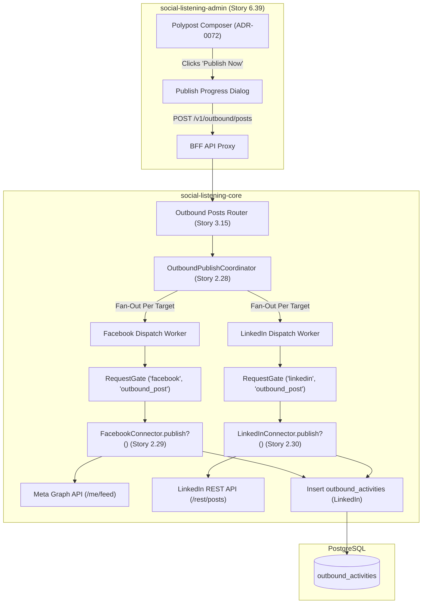
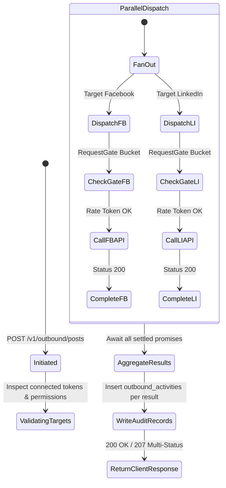

# TDS-0075: Outbound Social Post Publishing via Platform APIs

**Status:** Approved  
**Date:** 2026-09-05  
**Governing ADR:** [ADR-0075](../../adr/0075-outbound-social-post-publishing.md)  
**Related Epics/Stories:** [Epic 2 / Story 2.28, 2.29, 2.30](../../user-stories/epic-2-ingestion-connectors-and-rate-limits.md), [Epic 3 / Story 3.15](../../user-stories/epic-3-data-model-storage-and-archival.md), [Epic 6 / Story 6.39](../../user-stories/epic-6-tenant-admin-ui.md), [Epic 11 / Story 11.7, 11.8](../../user-stories/epic-11-adr-0095-to-0100.md), [Epic 14 / Story 14.1, 14.2](../../user-stories/epic-14-adr-0118-to-0122.md)  
**Target Repositories:** `social-listening-core`, `social-listening-admin`  
**Contract Test Citations:**  
- `social-listening-core/contracts/epic-2/story-2.28.connector-publish-framework.contract.test.ts`  
- `social-listening-core/contracts/epic-2/story-2.29.facebook-page-post-publishing.contract.test.ts`  
- `social-listening-core/contracts/epic-2/story-2.30.linkedin-post-publishing.contract.test.ts`  
- `social-listening-core/contracts/epic-3/story-3.15.outbound-post-publishing-audit.contract.test.ts`  
- `social-listening-admin/contracts/epic-6/story-6.39.polypost-publish-flow.contract.test.ts`  

---

## 1. Architectural Context & Problem Statement

In addition to passive listening and tactical comment replies (ADR-0073), enterprise brand marketing teams require a central hub to create and distribute primary outbound posts to brand social pages and profiles. The Polypost Composer (ADR-0072) provides the UI authoring surface, but requires a robust, audited, and isolated backend pipeline to dispatch posts to external network APIs.

Directly coupling UI publishing to heterogeneous platform APIs introduces operational vulnerabilities:
1. **Multi-Platform Fan-Out Failures:** When publishing to multiple networks simultaneously (e.g., LinkedIn and Facebook), a failure on one network must not silently corrupt or crash the overall transaction; each destination requires independent status tracking.
2. **Rate-Gate Collisions:** Ingestion polling must remain completely isolated from outbound posting rate limits.
3. **Audit Immutability:** Outbound posts authored under corporate brand handles must maintain complete provenance in `outbound_activities`.

This specification formalizes:
1. The `publish?()` interface on `SocialConnector` with Wave 1 implementations for **Facebook Page** and **LinkedIn Organization/Profile**.
2. A multi-target dispatch coordinator in `social-listening-core` executing per-platform rate-gated publishes.
3. Persistent audit records in `outbound_activities` (`activity_type = 'publish'`).
4. The core API endpoint `POST /v1/outbound/posts` and the real publish flow in `social-listening-admin`.



---

## 2. Governing ADRs & Decision Log Reference

- [ADR-0075: Outbound Social Post Publishing via Platform APIs](../../adr/0075-outbound-social-post-publishing.md) — Authorizes connector publish interface, multi-target dispatch coordinator, and audit logging.
- [ADR-0072: Cross-Platform Polypost Composer and Multi-Network Preview Engine](../../adr/0072-cross-platform-polypost-composer-and-multi-network-preview-engine.md) — Authoring UI supplying outbound payloads.
- [ADR-0073: Outbound Reply to Ingested Posts via Platform APIs](../../adr/0073-outbound-reply-to-ingested-posts.md) — Establishes foundational `outbound_activities` schema and rate-limit bucket taxonomy.
- [ADR-0118: Additional Social Platform Publishing Roadmap](../../adr/0118-additional-social-platform-publishing.md) — Defines Wave 2 sequencing (Mastodon, Bluesky, Instagram, Threads, X).
- [ADR-0119: Editing and Deleting Published Outbound Posts](../../adr/0119-editing-and-deleting-published-outbound-posts.md) — Defines post-dispatch lifecycle mutations.

---

## 3. Scope, Precedence & Anti-Goals

### In Scope
- Optional `publish?()` method on `SocialConnector` returning `{ platformPostId, url, publishedAt }`.
- Immediate publishing for Wave 1 platforms: **Facebook Pages** (Meta Graph API) and **LinkedIn** (UGC / Posts API).
- Atomic per-target logging in `outbound_activities` with `activity_type = 'publish'`.
- Isolated rate limiting on `RequestGate` using `(tenantId, providerId, 'outbound_post')`.
- Partial failure resilience: if a multi-platform publish succeeds on Facebook but fails on LinkedIn, individual statuses are returned with appropriate error codes.

### Precedence Invariant
$$\text{Per-Network Atomicity} > \text{Global All-or-Nothing}$$
Publishing across multiple networks is executed as independent, isolated calls. A failure on Platform B does not rollback or revoke a successful dispatch to Platform A.

### Anti-Goals
- Multi-party approval workflows and editorial gates in v1 (addressed in Epic 13).
- Direct scheduled delay execution inside the request loop (delegated to BullMQ scheduler in ADR-0098).
- Wave 2 platforms in baseline scope (Mastodon, Bluesky, Instagram, Threads, X are specified in ADR-0118).

---

## 4. Data Architecture & Storage Schema

Outbound publications leverage the `outbound_activities` audit table (established in ADR-0073) with `activity_type = 'publish'`.

```sql
-- Schema Reference: outbound_activities (established in 0073)
-- Key columns leveraged by ADR-0075:

-- activity_type: 'publish'
-- connector_id: 'facebook' | 'linkedin'
-- content: published post text
-- external_id: platform post ID (e.g., 'urn:li:share:718291029381', '1092834710_2093847102')
-- external_url: live post permalink
-- status: 'success' | 'failed'
-- error_details: error code and message from platform API if failed

CREATE INDEX IF NOT EXISTS idx_outbound_activities_publish 
    ON outbound_activities(tenant_id, connector_id, created_at DESC)
    WHERE activity_type = 'publish';
```

---

## 5. Component & Interface Contracts

### 5.1 Connector Publish Interface (`social-listening-core`)

```typescript
export interface OutboundPostPayload {
  text: string;
  linkUrl?: string;
  assetIds?: string[];
}

export interface OutboundPublishResult {
  platformPostId: string;
  url: string;
  publishedAt: string;
  rawResponse?: Record<string, unknown>;
}

export interface SocialConnector {
  // Core connector properties...
  readonly id: string;
  readonly platform: string;

  publish?(
    ctx: ConnectorContext,
    post: OutboundPostPayload
  ): Promise<OutboundPublishResult>;
}
```

### 5.2 API Route Specification

#### `POST /v1/outbound/posts`
- **Authentication:** JWT Bearer with scope `publish:write` or role `Tenant-Admin`, `Social-Selling-Strategist`, `Tenant-Social-Care-Agent`.
- **Headers:** `X-Tenant-ID: <uuid>`, `Idempotency-Key: <string>`

**Request Body:**
```json
{
  "baseText": "Excited to announce our new enterprise analytics suite! Learn more at https://example.com/suite",
  "targets": [
    {
      "connectorId": "facebook-page-main",
      "overrideText": "Excited to announce our new enterprise analytics suite! Check out the full breakdown below: https://example.com/suite"
    },
    {
      "connectorId": "linkedin-org-main"
    }
  ]
}
```

**Response (207 Multi-Status / 200 OK):**
```json
{
  "summary": {
    "total": 2,
    "successful": 2,
    "failed": 0
  },
  "results": [
    {
      "connectorId": "facebook-page-main",
      "platform": "facebook",
      "status": "success",
      "outboundActivityId": "4c9e6679-7425-40de-944b-e07fc1f90ae1",
      "platformPostId": "10092834710_2093847102",
      "url": "https://www.facebook.com/10092834710/posts/2093847102",
      "publishedAt": "2026-09-05T15:30:00.000Z"
    },
    {
      "connectorId": "linkedin-org-main",
      "platform": "linkedin",
      "status": "success",
      "outboundActivityId": "8f12a321-4d56-42ab-9d10-8f921ab04725",
      "platformPostId": "urn:li:share:718291029381029384",
      "url": "https://www.linkedin.com/feed/update/urn:li:share:718291029381029384",
      "publishedAt": "2026-09-05T15:30:01.000Z"
    }
  ]
}
```

---

## 6. State Machine & Lifecycle Transitions



---

## 7. Security, Tenant Isolation & Authentication

1. **Connector Token Scoping:** Access tokens for Facebook Pages (`pages_manage_posts`, `pages_read_engagement`) and LinkedIn Organizations (`w_organization_social`, `r_organization_social`) are decrypted per-request from `platform_credentials` under tenant isolation.
2. **Permission Guard:** Publishing requires explicit write permission; viewer and analyst roles cannot execute outbound post dispatches.
3. **Idempotency Safeguard:** Idempotency keys prevent accidental multi-posting if network timeouts occur during the HTTP round-trip.

---

## 8. Performance, Scalability & Resource Boundaries

1. **Parallel Execution:** Target dispatches are executed concurrently using `Promise.allSettled()`, ensuring total API latency is bounded by the slowest single network API call (p95 `< 1200ms`).
2. **Rate Limit Keys:** 
   $$\text{ratelimit:}\{\text{tenantId}\}:\{\text{platformId}\}:\text{outbound\_post}$$
   Configured with a token bucket enforcing standard platform publication burst and sustained limits (e.g., LinkedIn: 100 posts/day, Facebook: 50 posts/hour).

---

## 9. Error Handling, Retries & Fallback Strategies

| Failure Scenario | Target Status | Resolution & Feedback |
|---|---|---|
| Facebook token expired | Facebook: `failed` (401) | LinkedIn still publishes; Facebook shows error badge prompting re-auth |
| LinkedIn rate limit exceeded | LinkedIn: `failed` (429) | Response contains retry-after; activity stored as `failed` |
| Text exceeds platform limit | Target: `failed` (400) | Pre-publish client validator prevents submission; API returns validation error |
| Partial Success | Overall: `207 Multi-Status` | Client displays partial success toast with direct link to published platform |

---

## 10. Observability, Telemetry & Audit Trail

- **Structured Log Output:**
  ```json
  {
    "event": "outbound_post_published",
    "tenantId": "f47ac10b-58cc-4372-a567-0e02b2c3d479",
    "userId": "9a38f7a6-91e8-466d-8152-476a6cfd7465",
    "connectorId": "linkedin-org-main",
    "platform": "linkedin",
    "platformPostId": "urn:li:share:718291029381029384",
    "status": "success",
    "durationMs": 680
  }
  ```
- **Prometheus Metrics:**
  - `outbound_posts_published_total{tenant_id, platform, status}` — Counter of all publication dispatches.
  - `outbound_post_latency_seconds{platform}` — Latency histogram per social platform.

---

## 11. Migration & Backward Compatibility Strategy

- **Zero-Downtime Rollout:** Leverages existing `outbound_activities` schema without table alterations.
- **Forward Compatibility:** Schema cleanly accommodates media assets (ADR-0115) and scheduled queue execution (ADR-0098) as additive parameters.

---

## 12. Executable Contract Test Citations & Verification Matrix

### 12.1 Contract Test Specifications
1. `social-listening-core/contracts/epic-2/story-2.28.connector-publish-framework.contract.test.ts`:
   - `test('coordinates multi-target fan-out and aggregates success and failure results')`
   - `test('enforces independent RequestGate rate-limiting per provider for outbound posting')`
2. `social-listening-core/contracts/epic-2/story-2.29.facebook-page-post-publishing.contract.test.ts`:
   - `test('dispatches POST to /{page-id}/feed with page access token')`
   - `test('returns permalink and platform post ID on successful publish')`
3. `social-listening-core/contracts/epic-2/story-2.30.linkedin-post-publishing.contract.test.ts`:
   - `test('dispatches POST to /rest/posts with URN author and commentary')`
   - `test('handles 429 rate limit error gracefully and returns retryAfter seconds')`
4. `social-listening-core/contracts/epic-3/story-3.15.outbound-post-publishing-audit.contract.test.ts`:
   - `test('records individual audit rows in outbound_activities for each attempted target')`
   - `test('enforces tenant RLS on outbound_activities queries')`
5. `social-listening-admin/contracts/epic-6/story-6.39.polypost-publish-flow.contract.test.ts`:
   - `test('triggers POST /v1/outbound/posts from Polypost Composer')`
   - `test('displays progress modal and per-network status badges')`

### 12.2 Open Questions

- [x] ~~**[Q-0075-1]** Should we rollback posts if 1 out of 3 platforms fails?~~  
  *Decision:* No. External social networks do not support two-phase commit transactions. Partial failure returns 207 Multi-Status; successful posts remain published while failed targets can be retried independently.
- [x] ~~**[Q-0075-2]** Which platforms are prioritized in Wave 1?~~  
  *Decision:* Facebook Pages and LinkedIn Organizations/Profiles.
