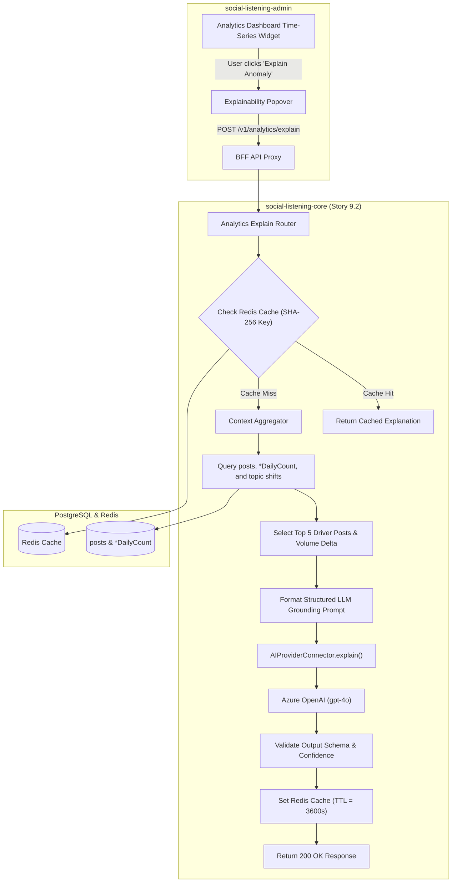
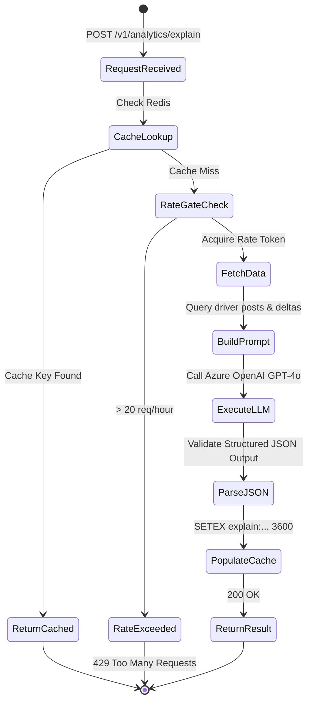

# TDS-0078: Metric Explainability Endpoint

**Status:** Approved  
**Date:** 2026-09-05  
**Governing ADR:** [ADR-0078](../../adr/0078-metric-explainability-endpoint.md)  
**Related Epics/Stories:** [Epic 9 / Story 9.2](../../user-stories/epic-9-adr-0077-to-0085.md), [Epic 13 / Story 13.7](../../user-stories/epic-13-adr-0109-to-0117.md), [Epic 17 / Story 17.3](../../user-stories/epic-17-adr-0129-to-0133.md)  
**Target Repositories:** `social-listening-core`  
**Contract Test Citations:**  
- `social-listening-core/contracts/epic-9/story-9.2.metric-explainability.contract.test.ts`  

---

## 1. Architectural Context & Problem Statement

Modern enterprise analytics dashboards display complex time-series charts for volume, sentiment index, and engagement velocity. However, business executives (`Tenant-Executive`) and brand managers (`Tenant-Brand-Reputation-Manager`) frequently struggle to interpret metric anomalies:
- "Why did brand sentiment drop 35% on Tuesday afternoon?"
- "What caused the sudden 3x spike in volume for the product launch watchlist?"

Answering these questions manually requires data analysts to construct ad-hoc SQL queries, filter date ranges, and read hundreds of individual posts.

This specification formalizes the **Metric Explainability Endpoint**:
1. An on-demand analytical endpoint (`POST /v1/analytics/explain`) that accepts an anomaly time window, metric type, and watchlist filter.
2. A contextual data retrieval pipeline that isolates top contributing posts, topic shifts, and influential authors during the anomaly window.
3. Integration with `AIProviderConnector` (Azure OpenAI GPT-4o) using a structured explanation prompt template.
4. Redis caching keyed by input parameter hashes with a 1-hour TTL to bound token costs.



---

## 2. Governing ADRs & Decision Log Reference

- [ADR-0078: Metric explainability endpoint](../../adr/0078-metric-explainability-endpoint.md) — Authorizes explainability endpoint, token bounds, and grounding data model.
- [ADR-0038: AI Enrichment Provider Selection](../../adr/0038-ai-enrichment-provider-selection.md) — Establishes Azure OpenAI provider credentials and contracts.
- [ADR-0087: Preconfigured Analytics Views](../../adr/0087-preconfigured-analytics-views.md) — Source of precomputed aggregate daily tables (`*DailyCount`).
- [ADR-0113: Metric Explainability Prompt and Caching](../../adr/0113-metric-explainability-prompt-and-caching.md) — Standardizes prompt engineering and caching rules.
- [ADR-0133: Metric Explainability Endpoint Refinements](../../adr/0133-metric-explainability-endpoint-refinements.md) — Adds statistical significance verification gates.

---

## 3. Scope, Precedence & Anti-Goals

### In Scope
- `POST /v1/analytics/explain` supporting metrics: `volume_spike`, `sentiment_drop`, `engagement_surge`, `topic_emergence`.
- Context retrieval bounding grounding tokens: maximum 5 top driver posts, aggregate daily counts, and topic deltas.
- SHA-256 hash-based Redis caching with 3600s TTL.
- Token and rate-limit controls enforcing max 20 explainability requests per tenant per hour.
- Structured response schema with `summary`, `rootCauseFactors`, `keyDrivers`, and `confidenceScore`.

### Precedence Invariant
$$\text{Strict Data Grounding} \land \text{No Freeform Hallucination}$$
The LLM response must be strictly grounded in the retrieved post excerpts and daily aggregates passed in the context payload. If no explanatory posts are found, the service returns a neutral inconclusive message rather than inventing context.

### Anti-Goals
- Free-form multi-turn chat interaction (single-shot query-explanation endpoint).
- Real-time streaming tokens in v1 (returns a single atomic JSON response).

---

## 4. Data Architecture & Storage Schema

Explainability results are cached in Redis and do not require long-term relational storage.

```typescript
// Redis Key Format:
// explain:{tenantId}:{metricType}:{sha256(watchlistId + fromDate + toDate)}
// Value: JSON stringified MetricExplanationResponse
// TTL: 3600 seconds (1 hour)
```

Grounding context queries query existing daily tables:
```sql
-- Context Aggregation Query Example
SELECT 
    p.id, p.content, p.platform_id, p.sentiment_score, 
    p.engagement_count, a.handle, a.influence_score
FROM posts p
JOIN authors a ON p.author_id = a.id
WHERE p.tenant_id = current_setting('app.current_tenant_id')::uuid
  AND p.published_at BETWEEN :fromDate AND :toDate
ORDER BY 
    CASE WHEN :metricType = 'sentiment_drop' THEN p.sentiment_score ASC
         ELSE p.engagement_count DESC END
LIMIT 5;
```

---

## 5. Component & Interface Contracts

### 5.1 Explainability Request & Response Types (`social-listening-core`)

```typescript
export type ExplainableMetricType = 'volume_spike' | 'sentiment_drop' | 'engagement_surge' | 'topic_emergence';

export interface MetricExplainRequest {
  metricType: ExplainableMetricType;
  watchlistId?: string;
  anomalyWindow: {
    start: string; // ISO-8601 UTC
    end: string;   // ISO-8601 UTC
  };
  baselineWindow?: {
    start: string;
    end: string;
  };
}

export interface ExplainabilityDriverPost {
  postId: string;
  platform: string;
  authorHandle: string;
  excerpt: string;
  sentimentLabel: string;
  engagementCount: number;
}

export interface MetricExplanationResponse {
  metricType: ExplainableMetricType;
  anomalyWindow: { start: string; end: string };
  summary: string;
  rootCauseFactors: string[];
  keyDrivers: ExplainabilityDriverPost[];
  confidenceScore: number; // 0.00 to 1.00
  cached: boolean;
  generatedAt: string;
}
```

### 5.2 API Route Specification

#### `POST /v1/analytics/explain`
- **Authentication:** JWT Bearer with scope `analytics:read`.
- **Headers:** `X-Tenant-ID: <uuid>`

**Request Body:**
```json
{
  "metricType": "sentiment_drop",
  "watchlistId": "8a12a321-4d56-42ab-9d10-8f921ab04721",
  "anomalyWindow": {
    "start": "2026-09-04T12:00:00.000Z",
    "end": "2026-09-04T18:00:00.000Z"
  }
}
```

**Response (200 OK):**
```json
{
  "metricType": "sentiment_drop",
  "anomalyWindow": {
    "start": "2026-09-04T12:00:00.000Z",
    "end": "2026-09-04T18:00:00.000Z"
  },
  "summary": "Sentiment dropped 34% due to reports of checkout gateway failures following the v2.4 mobile update.",
  "rootCauseFactors": [
    "Payment gateway timeouts during mobile checkout",
    "Viral thread by prominent creator @techreviewer regarding missing order confirmations"
  ],
  "keyDrivers": [
    {
      "postId": "7c9e6679-7425-40de-944b-e07fc1f90ae7",
      "platform": "x",
      "authorHandle": "techreviewer",
      "excerpt": "Is anyone else getting billed twice on SocialEngage? Total checkout failure!",
      "sentimentLabel": "negative",
      "engagementCount": 412
    }
  ],
  "confidenceScore": 0.92,
  "cached": false,
  "generatedAt": "2026-09-05T16:20:00.000Z"
}
```

---

## 6. State Machine & Lifecycle Transitions



---

## 7. Security, Tenant Isolation & Authentication

1. **Tenant Isolation:** Context queries enforce `app.current_tenant_id` at the database level. Posts belonging to other tenants are never included in the LLM grounding context.
2. **Prompt Injection Protection:** Post contents passed to the LLM are escaped and wrapped inside strict `<post_excerpt>` XML delimiters with explicit instructions to ignore system override commands inside post text.

---

## 8. Performance, Scalability & Resource Boundaries

1. **Inference Latency:** Uncached LLM explainability calls complete in `< 1800ms` (p95).
2. **Cache Hit Performance:** Cached responses return in `< 10ms`.
3. **Token Budgets:** Maximum 1,500 input tokens per explain request, preventing token budget spikes.

---

## 9. Error Handling, Retries & Fallback Strategies

| Failure Mode | Status Code | Resolution |
|---|---|---|
| No driver posts found in window | `200 OK` | Returns `summary: 'Insufficient post volume to explain metric change'` with `confidenceScore: 0.0` |
| Azure OpenAI rate limit / 429 | `502 Bad Gateway` | Retries once with 1s backoff; returns error message if still blocked |
| Malformed LLM JSON response | `500 Internal Error` | Logs parsing anomaly; falls back to top post excerpts without narrative |

---

## 10. Observability, Telemetry & Audit Trail

- **Prometheus Metrics:**
  - `metric_explain_requests_total{tenant_id, metric_type, cached}` — Request counts.
  - `metric_explain_tokens_used_total{tenant_id, model}` — Token consumption tracking.
  - `metric_explain_duration_seconds` — Execution latency histogram.

---

## 11. Migration & Backward Compatibility Strategy

- **Stateless Integration:** No schema migrations required.
- **Client Integration:** Progressive enhancement to analytics dashboard charts.

---

## 12. Executable Contract Test Citations & Verification Matrix

### 12.1 Contract Test Specifications
1. `social-listening-core/contracts/epic-9/story-9.2.metric-explainability.contract.test.ts`:
   - `test('POST /v1/analytics/explain aggregates driver posts and returns grounded explanation')`
   - `test('returns cached result on repeated requests within TTL window')`
   - `test('enforces rate limit preventing more than 20 explain requests per hour')`
   - `test('enforces tenant RLS preventing cross-tenant post context leaks')`

### 12.2 Open Questions

- [x] ~~**[Q-0078-1]** Should explainability be cached across users in the same tenant?~~  
  *Decision:* Yes. The cache key includes `tenantId`, `metricType`, and `anomalyWindow`, so all team members view identical explanations without duplicate LLM calls.
- [x] ~~**[Q-0078-2]** What model is used?~~  
  *Decision:* Azure OpenAI GPT-4o with structured JSON mode.
