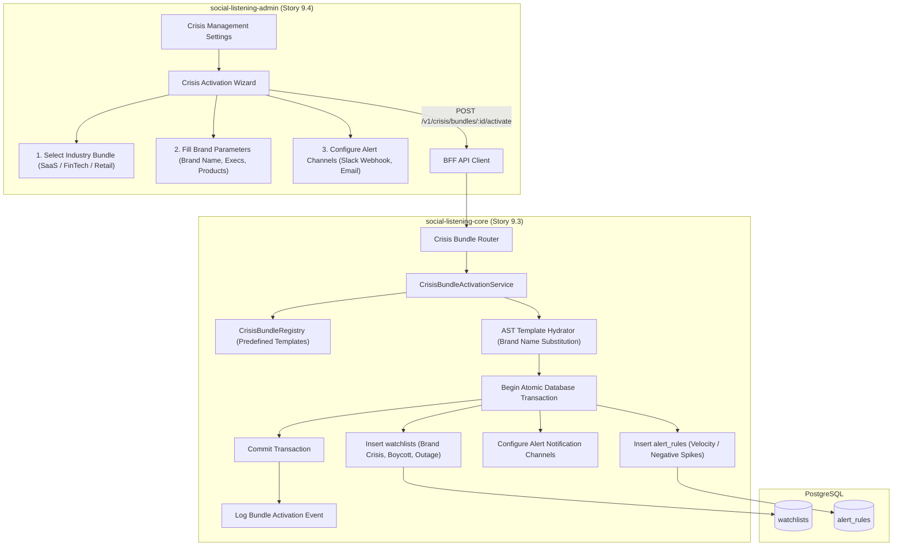
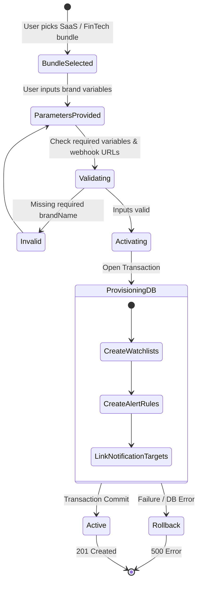

# TDS-0079: Crisis Template Bundle and Activation

**Status:** Approved  
**Date:** 2026-09-05  
**Governing ADR:** [ADR-0079](../../adr/0079-crisis-template-bundle-and-activation.md)  
**Related Epics/Stories:** [Epic 9 / Story 9.3, 9.4](../../user-stories/epic-9-adr-0077-to-0085.md), [Epic 10 / Story 10.9](../../user-stories/epic-10-adr-0086-to-0094.md), [Epic 17 / Story 17.3](../../user-stories/epic-17-adr-0129-to-0133.md)  
**Target Repositories:** `social-listening-core`, `social-listening-admin`  
**Contract Test Citations:**  
- `social-listening-core/contracts/epic-9/story-9.3.crisis-template-bundle.contract.test.ts`  
- `social-listening-admin/contracts/epic-9/story-9.4.crisis-threshold-wizard.contract.test.ts`  

---

## 1. Architectural Context & Problem Statement

Setting up comprehensive crisis monitoring from scratch is daunting for brand reputation teams (`Tenant-Brand-Reputation-Manager`). Crafting complex boolean AST queries covering product recalls, security breaches, executive misconduct, and regulatory inquiries requires extensive domain knowledge and hours of manual configuration.

New tenants require instant, turnkey time-to-value:
1. **Industry-Specific Crisis Packs:** Curated templates covering SaaS, Healthcare, FinTech, and Retail with proven boolean search patterns.
2. **Atomic One-Click Activation:** Provisioning watchlists, alert rules, and delivery channels in a single coordinated transaction.
3. **Template Parameterization:** Substituting tenant brand names, executive handles, and competitor aliases into curated AST query skeletons.
4. **Interactive Setup Wizard:** A guided multi-step wizard in `social-listening-admin` allowing users to preview matched keywords and set notification webhooks.

This specification formalizes:
1. The static crisis bundle registry and schema in `social-listening-core`.
2. The atomic activation endpoint `POST /v1/crisis/bundles/:bundleId/activate`.
3. The interactive Crisis Threshold Wizard in `social-listening-admin`.



---

## 2. Governing ADRs & Decision Log Reference

- [ADR-0079: Crisis Template Bundle and Activation](../../adr/0079-crisis-template-bundle-and-activation.md) — Authorizes crisis bundle taxonomy, activation endpoint, and wizard UX.
- [ADR-0044: Watchlist API Design and Database Schema Standardization](../../adr/0044-watchlist-api-design-and-database-schema-standardization.md) — Watchlist creation contracts.
- [ADR-0091: Real-Time Alert Rules and Delivery](../../adr/0091-real-time-alert-rules-and-delivery.md) — Alert rule engine and notification channels.
- [ADR-0131: Crisis Template Bundle Refinements](../../adr/0131-crisis-template-bundle-and-activation-refinements.md) — Dynamic baseline calibration extensions.

---

## 3. Scope, Precedence & Anti-Goals

### In Scope
- Static catalog of industry bundles: `saas_cloud`, `fintech_banking`, `healthcare_pharma`, `retail_ecommerce`.
- Atomic instantiation of 3–5 specialized watchlists per bundle with hydrated boolean queries.
- Pre-configured real-time alert rules with default thresholds.
- Idempotent re-activation: re-running activation with new parameters updates or supplements existing watchlists without duplicate naming conflicts.
- Multi-step interactive wizard in `social-listening-admin`.

### Precedence Invariant
$$\text{Atomic Provisioning} \lor \text{Complete Rollback}$$
Bundle activation must succeed completely or fail completely. If an alert rule fails to validate, created watchlists must be rolled back.

### Anti-Goals
- Real-time LLM query generation during activation (queries are pre-validated expert templates).
- Modifying underlying connector poll intervals without admin consent.

---

## 4. Data Architecture & Storage Schema

Crisis bundles instantiate standard `watchlists` and `alert_rules` records with a tracking tag `bundle_id`.

```sql
-- Migration: 0079_add_bundle_tracking_column.sql

ALTER TABLE watchlists 
    ADD COLUMN IF NOT EXISTS origin_bundle_id TEXT;

ALTER TABLE alert_rules 
    ADD COLUMN IF NOT EXISTS origin_bundle_id TEXT;

CREATE INDEX IF NOT EXISTS idx_watchlists_origin_bundle 
    ON watchlists(tenant_id, origin_bundle_id) 
    WHERE origin_bundle_id IS NOT NULL;
```

---

## 5. Component & Interface Contracts

### 5.1 Crisis Bundle Catalog Types (`social-listening-core`)

```typescript
export interface CrisisTemplateVariable {
  key: string;
  label: string;
  description: string;
  required: boolean;
  example: string;
}

export interface CrisisWatchlistTemplate {
  nameTemplate: string; // e.g. "{brandName} - Service Outage & Security"
  queryTemplate: string; // e.g. "(\"{brandName}\") AND (outage OR down OR breach OR hack OR leak)"
  category: 'security' | 'boycott' | 'executive' | 'product_defect';
}

export interface CrisisBundleDefinition {
  id: string;
  industryName: string;
  displayName: string;
  description: string;
  variables: CrisisTemplateVariable[];
  watchlistTemplates: CrisisWatchlistTemplate[];
  defaultAlertConfig: {
    cooldownMinutes: number;
    velocityThreshold: number;
    negativeSentimentRatio: number;
  };
}

export interface ActivateCrisisBundleRequest {
  bundleId: string;
  variableValues: Record<string, string>; // e.g. { brandName: 'AcmeCorp', executiveNames: 'Jane Doe' }
  notificationChannels: Array<{
    type: 'slack_webhook' | 'email' | 'teams_webhook';
    destination: string;
  }>;
}
```

### 5.2 API Route Specification

#### `GET /v1/crisis/bundles`
Returns available pre-configured crisis bundles and their required variable schemas.

#### `POST /v1/crisis/bundles/:bundleId/activate`
- **Authentication:** JWT Bearer (`Tenant-Admin`, `Tenant-Brand-Reputation-Manager`).
- **Headers:** `X-Tenant-ID: <uuid>`

**Request Body:**
```json
{
  "variableValues": {
    "brandName": "SocialEngage",
    "executiveNames": "Menno Dresch",
    "primaryProduct": "Listening Platform"
  },
  "notificationChannels": [
    {
      "type": "slack_webhook",
      "destination": "https://hooks.slack.com/services/T00/B00/X00"
    }
  ]
}
```

**Response (201 Created):**
```json
{
  "bundleId": "saas_cloud",
  "activatedWatchlists": [
    { "id": "4c9e6679-7425-40de-944b-e07fc1f90ae1", "name": "SocialEngage - Service Outage & Security" },
    { "id": "8f12a321-4d56-42ab-9d10-8f921ab04722", "name": "SocialEngage - Boycott & PR Crisis" }
  ],
  "activatedAlertRules": [
    { "id": "1a12a321-4d56-42ab-9d10-8f921ab04723", "name": "SocialEngage Critical Crisis Alert" }
  ],
  "status": "active"
}
```

---

## 6. State Machine & Lifecycle Transitions



---

## 7. Security, Tenant Isolation & Authentication

1. **Transactional RLS Isolation:** All created watchlists and alert rules insert `tenant_id` resolved from session authentication context.
2. **Webhook URL Validation:** Webhook targets are sanitized and restricted to HTTPS endpoints, preventing Server-Side Request Forgery (SSRF) against internal private networks.

---

## 8. Performance, Scalability & Resource Boundaries

1. **Atomic Provisioning Latency:** Complete bundle creation executes in a single database transaction in `< 45ms`.
2. **Template Validation:** Templates are pre-parsed and validated during build-time CI, eliminating runtime AST compilation errors.

---

## 9. Error Handling, Retries & Fallback Strategies

| Error Condition | HTTP Code | Action |
|---|---|---|
| Missing mandatory template variable | `400 Bad Request` | Returns list of missing variable keys |
| Invalid webhook destination URL | `422 Unprocessable Entity` | Alerts user to enter valid HTTPS URL |
| Duplicate watchlist naming conflict | Handles gracefully | Appends numerical suffix (e.g. `(Copy 1)`) rather than failing |

---

## 10. Observability, Telemetry & Audit Trail

- **Audit Events:**
  - `crisis_bundle_activated { tenantId, bundleId, watchlistsCount, alertRulesCount }`
- **Prometheus Metrics:**
  - `crisis_bundles_activated_total{tenant_id, bundle_id}` — Adoption tracking by industry.

---

## 11. Migration & Backward Compatibility Strategy

- **Schema Evolution:** Adds `origin_bundle_id` to existing `watchlists` and `alert_rules`.
- **Existing Records:** Manually created watchlists have `origin_bundle_id = NULL`.

---

## 12. Executable Contract Test Citations & Verification Matrix

### 12.1 Contract Test Specifications
1. `social-listening-core/contracts/epic-9/story-9.3.crisis-template-bundle.contract.test.ts`:
   - `test('returns available industry crisis bundles with variable schemas')`
   - `test('atomically activates crisis bundle creating watchlists and alert rules')`
   - `test('hydrates query templates with provided brand variables')`
   - `test('rolls back all created entities if alert rule creation fails')`
2. `social-listening-admin/contracts/epic-9/story-9.4.crisis-threshold-wizard.contract.test.ts`:
   - `test('renders step-by-step crisis activation wizard')`
   - `test('validates required variable inputs before permitting submission')`
   - `test('displays success summary and links to generated watchlists')`

### 12.2 Open Questions

- [x] ~~**[Q-0079-1]** Can a tenant activate multiple crisis bundles?~~  
  *Decision:* Yes. An enterprise tenant with multiple business lines can activate distinct bundles for separate product brands.
- [x] ~~**[Q-0079-2]** Can bundle watchlists be edited after activation?~~  
  *Decision:* Yes. Activated watchlists are standard tenant watchlists and can be customized freely.
