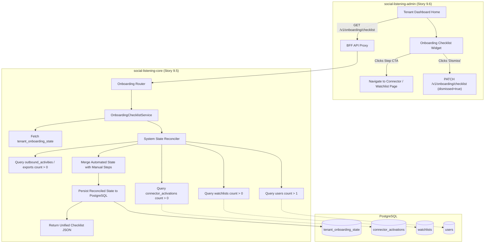
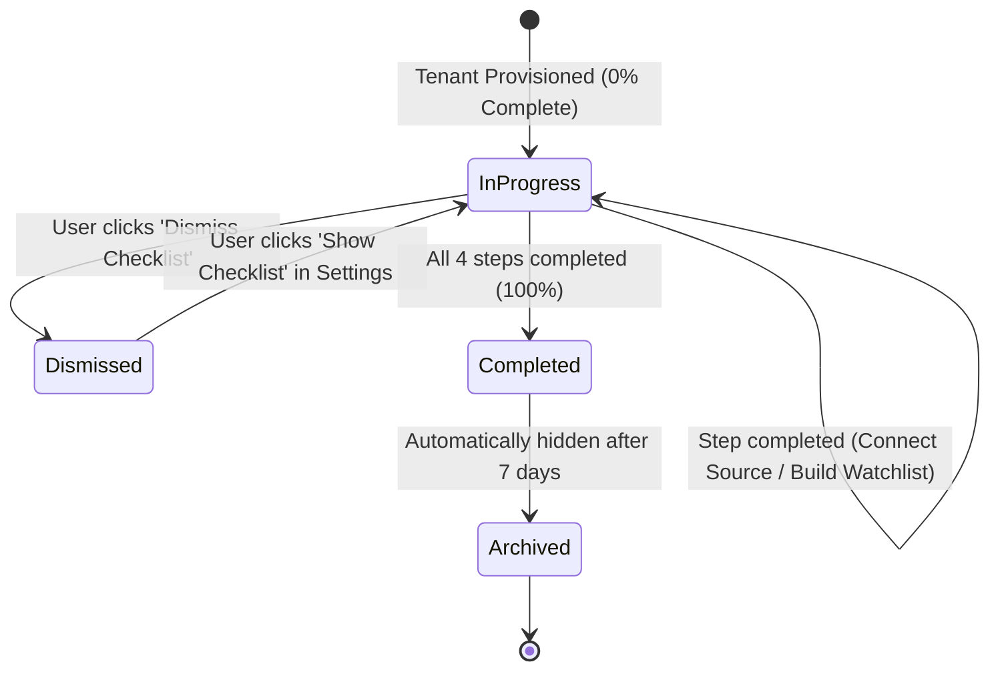

# TDS-0080: Onboarding Checklist State

**Status:** Approved  
**Date:** 2026-09-05  
**Governing ADR:** [ADR-0080](../../adr/0080-onboarding-checklist-state.md)  
**Related Epics/Stories:** [Epic 9 / Story 9.5, 9.6](../../user-stories/epic-9-adr-0077-to-0085.md), [Epic 5 / Story 5.15](../../user-stories/epic-5-tenant-identity-and-access.md), [Epic 17 / Story 17.2](../../user-stories/epic-17-adr-0129-to-0133.md)  
**Target Repositories:** `social-listening-core`, `social-listening-admin`  
**Contract Test Citations:**  
- `social-listening-core/contracts/epic-9/story-9.5.onboarding-checklist.contract.test.ts`  
- `social-listening-admin/contracts/epic-9/story-9.6.onboarding-checklist-ui.contract.test.ts`  

---

## 1. Architectural Context & Problem Statement

Initial tenant activation and time-to-first-value (TTFV) are the most critical predictors of long-term software adoption. When a new tenant signs up, administrators (`Tenant-Admin`) often face an empty console with no ingested posts, inactive connectors, and unconfigured watchlists. Without proactive guidance, users abandon the platform before completing essential setup tasks.

Enterprise onboarding requires a stateful, interactive guidance framework:
1. **Milestone Checklist Tracking:** Guiding users through core activation milestones (connect first social source, build first watchlist, invite a colleague, explore analytics).
2. **Automated State Reconciliation:** Automatically detecting when milestones have been accomplished by inspecting real system state rather than requiring tedious manual checkbox ticking.
3. **Persistent Progress State:** Maintaining checklist completion and dismissal status per tenant across browser sessions and devices.
4. **Engaging UI Widget:** A persistent, non-intrusive progress meter and guided checklist card on the main dashboard (`social-listening-admin`).

This specification formalizes:
1. The `tenant_onboarding_state` database schema in PostgreSQL with tenant RLS.
2. The dynamic reconciliation engine querying database anchors (`connector_activations`, `watchlists`, `users`).
3. The onboarding checklist APIs (`GET /v1/onboarding/checklist`, `PATCH /v1/onboarding/checklist`).
4. The onboarding checklist component and slide-over guide in `social-listening-admin`.



---

## 2. Governing ADRs & Decision Log Reference

- [ADR-0080: Onboarding checklist state](../../adr/0080-onboarding-checklist-state.md) — Authorizes onboarding state schema, dynamic reconciliation, and API contracts.
- [ADR-0037: Self-Service Tenant Signup and Provisioning](../../adr/0037-self-service-tenant-signup-and-first-tenant-admin-provisioning.md) — Seeds initial onboarding state on tenant creation.
- [ADR-0051: Connector Activation and Credential Storage](../../adr/0051-connector-activation-and-credential-storage.md) — State anchor for connector setup milestone.
- [ADR-0130: Onboarding Checklist State Refinements](../../adr/0130-onboarding-checklist-state-refinements.md) — Role-tailored step trees and automated probe extensions.

---

## 3. Scope, Precedence & Anti-Goals

### In Scope
- Persistent storage of checklist milestones in `tenant_onboarding_state`.
- Four primary milestone checks:
  1. `connect_first_source`: At least one active connector in `connector_activations`.
  2. `create_first_watchlist`: At least one active watchlist in `watchlists`.
  3. `invite_team_member`: More than one user registered in `users`.
  4. `review_initial_insights`: Viewing the analytics dashboard or post feed.
- Automatic milestone reconciliation on `GET` requests.
- Manual dismissal toggle (`dismissed = true`) hiding the widget from the dashboard.

### Precedence Invariant
$$\text{Live System State} \ge \text{Stored Checklist State}$$
If real database state demonstrates that a milestone was achieved (e.g. a connector was activated), the milestone is marked `completed: true` permanently, even if previously false.

### Anti-Goals
- Intrusive full-screen blocking modals that prevent user navigation.
- Irreversible dismissal (users can re-enable the checklist from Settings).

---

## 4. Data Architecture & Storage Schema

```sql
-- Migration: 0080_create_tenant_onboarding_state.sql

CREATE TABLE IF NOT EXISTS tenant_onboarding_state (
    id UUID PRIMARY KEY DEFAULT gen_random_uuid(),
    tenant_id UUID NOT NULL REFERENCES tenants(id) ON DELETE CASCADE,
    steps JSONB NOT NULL DEFAULT '{
        "connect_first_source": false,
        "create_first_watchlist": false,
        "invite_team_member": false,
        "review_initial_insights": false
    }',
    dismissed BOOLEAN NOT NULL DEFAULT FALSE,
    completed_at TIMESTAMPTZ,
    created_at TIMESTAMPTZ NOT NULL DEFAULT NOW(),
    updated_at TIMESTAMPTZ NOT NULL DEFAULT NOW(),
    CONSTRAINT uq_tenant_onboarding_state UNIQUE (tenant_id)
);

-- Row Level Security
ALTER TABLE tenant_onboarding_state ENABLE ROW LEVEL SECURITY;

CREATE POLICY tenant_onboarding_state_tenant_isolation ON tenant_onboarding_state
    AS RESTRICTIVE
    USING (tenant_id = NULLIF(current_setting('app.current_tenant_id', true), '')::uuid)
    WITH CHECK (tenant_id = NULLIF(current_setting('app.current_tenant_id', true), '')::uuid);
```

---

## 5. Component & Interface Contracts

### 5.1 Onboarding Types (`social-listening-core`)

```typescript
export interface OnboardingStepDetail {
  id: string;
  title: string;
  description: string;
  completed: boolean;
  actionUrl: string;
  actionLabel: string;
}

export interface OnboardingChecklistResponse {
  tenantId: string;
  isComplete: boolean;
  completionPercentage: number;
  dismissed: boolean;
  steps: OnboardingStepDetail[];
  completedAt: string | null;
}

export interface UpdateOnboardingStateRequest {
  stepId?: string;
  completed?: boolean;
  dismissed?: boolean;
}
```

### 5.2 API Route Specification

#### `GET /v1/onboarding/checklist`
- **Authentication:** JWT Bearer with any tenant role.
- **Behavior:** Dynamically reconciles live milestones against the database and returns current checklist status.

**Response (200 OK):**
```json
{
  "tenantId": "f47ac10b-58cc-4372-a567-0e02b2c3d479",
  "isComplete": false,
  "completionPercentage": 50,
  "dismissed": false,
  "steps": [
    {
      "id": "connect_first_source",
      "title": "Connect a Social Source",
      "description": "Authenticate a Facebook Page, LinkedIn account, or RSS feed.",
      "completed": true,
      "actionUrl": "/tenant/connectors",
      "actionLabel": "Manage Connectors"
    },
    {
      "id": "create_first_watchlist",
      "title": "Create Your First Watchlist",
      "description": "Define keyword queries to monitor brand mentions and industry topics.",
      "completed": true,
      "actionUrl": "/tenant/watchlists/new",
      "actionLabel": "Build Watchlist"
    },
    {
      "id": "invite_team_member",
      "title": "Invite a Team Member",
      "description": "Add analysts or social care agents to collaborate in your workspace.",
      "completed": false,
      "actionUrl": "/tenant/settings/users",
      "actionLabel": "Invite Users"
    },
    {
      "id": "review_initial_insights",
      "title": "Explore Mentions Feed",
      "description": "Inspect sentiment breakdown and discovered posts.",
      "completed": false,
      "actionUrl": "/tenant/posts",
      "actionLabel": "View Feed"
    }
  ],
  "completedAt": null
}
```

#### `PATCH /v1/onboarding/checklist`
Allows manually completing a subjective step (e.g. `review_initial_insights`) or dismissing the banner.

---

## 6. State Machine & Lifecycle Transitions



---

## 7. Security, Tenant Isolation & Authentication

1. **Strict Tenant RLS:** `tenant_onboarding_state` is partitioned strictly by `tenant_id`. Cross-tenant state inspection is prohibited.
2. **Access Rights:** All authenticated tenant users can view progress; only users with `Tenant-Admin` role can toggle `dismissed`.

---

## 8. Performance, Scalability & Resource Boundaries

1. **Lightweight Reconciliation:** Reconciliation queries execute count checks (`SELECT 1 FROM ... LIMIT 1`) against indexed primary keys, completing in `< 10ms`.
2. **Result Caching:** Reconciled state is persisted back to `tenant_onboarding_state` so subsequent reads within short intervals avoid repeated count queries.

---

## 9. Error Handling, Retries & Fallback Strategies

| Scenario | Behavior | Resolution |
|---|---|---|
| First read for tenant missing record | Auto-seeding | Automatically inserts default state row and reconciles |
| Transient DB error during reconciliation | Graceful fallback | Returns cached steps without blocking dashboard render |

---

## 10. Observability, Telemetry & Audit Trail

- **Telemetry Metrics:**
  - `onboarding_step_completed_total{tenant_id, step_id}` — Milestone completion funnel.
  - `onboarding_checklist_completed_total{tenant_id}` — Overall activation rate.
  - `onboarding_time_to_complete_hours` — Time-to-first-value histogram.

---

## 11. Migration & Backward Compatibility Strategy

- **Schema Migration:** Additive table `tenant_onboarding_state`.
- **Existing Tenants:** Existing active tenants automatically reconcile to 100% completed on first GET request.

---

## 12. Executable Contract Test Citations & Verification Matrix

### 12.1 Contract Test Specifications
1. `social-listening-core/contracts/epic-9/story-9.5.onboarding-checklist.contract.test.ts`:
   - `test('GET /v1/onboarding/checklist auto-reconciles completed steps based on database state')`
   - `test('marks connect_first_source completed when connector_activations row exists')`
   - `test('allows dismissing checklist via PATCH and respects dismissed flag')`
   - `test('enforces tenant RLS on onboarding state')`
2. `social-listening-admin/contracts/epic-9/story-9.6.onboarding-checklist-ui.contract.test.ts`:
   - `test('renders onboarding checklist card with progress bar on dashboard')`
   - `test('navigates to appropriate configuration route on step CTA click')`
   - `test('hides widget when user clicks dismiss')`

### 12.2 Open Questions

- [x] ~~**[Q-0080-1]** Is onboarding state user-scoped or tenant-scoped?~~  
  *Decision:* Tenant-scoped. Setup milestones (connecting sources, building watchlists) are collective workspace milestones. Role-specific personal journeys are refined in ADR-0130.
