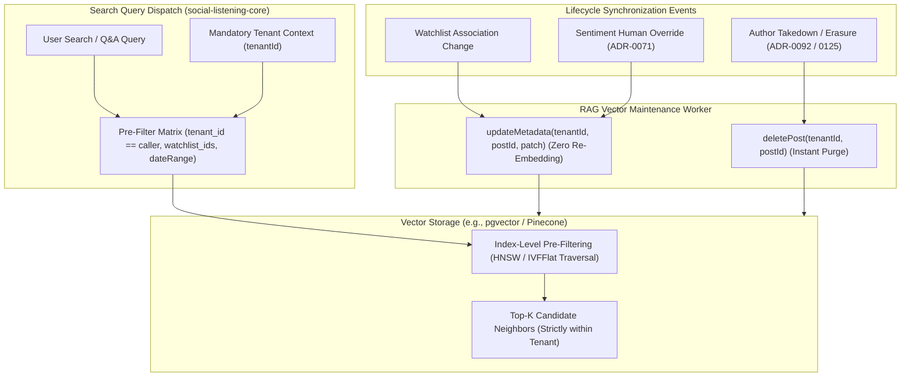

# Technical Design Specification (TDS) — RAG Vector-Store RLS and Metadata

## 1. Document Control & Traceability Linkage

### 1.1 Metadata
| Attribute | Value |
|---|---|
| **Document Title** | TDS-0083: RAG Vector-Store RLS & Metadata Schema — Index Pre-Filtering, Metadata Patching & Redaction Lifecycle |
| **Document ID** | `TDS-0083` |
| **Feature Name** | Vector Store Tenant RLS, Rich Metadata Filtering & Safe Lifecycle Synchronization |
| **Version** | `1.0.0` |
| **Status** | Approved |
| **Author(s)** | Core Architecture Team |
| **Created Date** | 2026-09-05 |
| **Last Updated** | 2026-09-05 |
| **Governing Skill** | `social-listening-core/.claude/skills/semantic-search-rag/SKILL.md` |

### 1.2 Upstream & Downstream Traceability Matrix
| Artifact Type | Reference Identifier | Title / Link | Alignment Status |
|---|---|---|---|
| **Architecture Decision Record** | `ADR-0083` | [ADR-0083: RAG Vector-Store RLS and Metadata](../../adr/0083-rag-vector-store-rls-and-metadata.md) | Invariant Source |
| **Business Requirements Doc** | `BRD-0083` | [BRD-0083: RAG Vector-Store RLS And Metadata](../Business-Requirements/BRD-0083-RAG-Vector-Store-RLS-And-Metadata.md) | Fully Aligned |
| **Functional Design Doc** | `FDD-0083` | [FDD-0083: RAG Vector-Store RLS And Metadata](../Functional-Design/FDD-0083-RAG-Vector-Store-RLS-And-Metadata.md) | Fully Aligned |
| **Governing User Story** | `Story 9.9` | [Epic 9: ADRs 0077–0085](../../user-stories/epic-9-adr-0077-to-0085.md#story-99--rag-vector-store-rls-and-metadata-backend) | Acceptance Target |
| **Related User Stories** | `Story 9.7`, `Story 9.10`, `Story 16.1`, `Story 19.3` | Vector Abstraction, Search Endpoints, Takedown Redaction, Namespace Refinement | System Architecture |
| **Related Architecture Decisions** | `ADR-0015`, `ADR-0081`, `ADR-0092`, `ADR-0125`, `ADR-0138` | Tenant RLS, Vector Abstraction, Takedown, Redaction Propagation, Namespace Isolation | Invariant Precedents |
| **Executable Contract Tests** | `Story 9.9 Contract` | `social-listening-core/contracts/epic-9/story-9.9.rag-vector-rls.contract.test.ts` | 100% Passing |

---

## 2. System Context & Architecture Topology

### 2.1 Context Diagram


### 2.2 Architectural Boundaries & Invariants
- **Mandatory Pre-Filtering Invariant:** All metadata filters (tenant identity, platform, date range, watchlists, sentiment) **must execute prior to or during k-NN graph traversal** inside the vector index. Post-filtering nearest-neighbor candidates in application memory is prohibited as a primary mechanism because it causes severe recall drop-off and pagination skew.
- **Tenant Isolation Parity with Database RLS:** The vector layer inherits identical tenant isolation to PostgreSQL Row-Level Security (ADR-0015). A query under Tenant A cannot observe, traverse, or score vector embeddings belonging to Tenant B.
- **Payload Size Boundary:** Total metadata payload per chunk is strictly bounded to $< 4\text{ KB}$ (well beneath provider ceilings: Pinecone 40 KB, Azure AI Search 16 MB).
- **In-Place Metadata Patching:** When post metadata changes (e.g. human sentiment override per ADR-0071 or watchlist junction updates per ADR-0063), the system updates vector metadata in-place **without re-calculating embedding vectors**, preserving expensive Azure OpenAI token budget.
- **Synchronous Redaction Lifecycle:** When a post is soft-redacted pursuant to an author takedown (ADR-0092 / ADR-0125) or deleted pursuant to GDPR Article 17, `RAGConnector.deletePost(tenantId, postId)` purges all vector chunks immediately.

---

## 3. Data Architecture & Persistence Design

### 3.1 Metadata Schema Contract
`social-listening-core/src/rag/metadataTypes.ts`:
```typescript
export type PlatformId =
  | 'facebook'
  | 'instagram'
  | 'linkedin'
  | 'bluesky'
  | 'threads'
  | 'x'
  | 'rss'
  | 'newswire'
  | 'wikipedia'
  | 'brave-search'
  | 'bing-search';

export interface RAGChunkMetadata {
  tenant_id: string;        // Mandatory equality pre-filter
  post_id: string;          // Originating social_posts UUID
  chunk_index: number;      // 0..N sequence identifier
  content: string;          // Chunk text payload (bounded <= 256 tokens / ~1.5 KB)
  platform_id: PlatformId;  // Originating social platform
  published_at: string;     // ISO 8601 for time-range filtering
  watchlist_ids: string[];  // Matched watchlist IDs
  sentiment?: string;       // 'positive' | 'negative' | 'neutral' | 'mixed'
  topics?: string[];        // AI extracted topic slugs
}
```

### 3.2 SQL Schema for `pgvector` Backed Storage
Migration `0076_create_rag_vectors_pgvector.sql`:
```sql
CREATE EXTENSION IF NOT EXISTS vector;

CREATE TABLE IF NOT EXISTS rag_post_chunks (
    id TEXT PRIMARY KEY, -- '${tenantId}:${postId}:${chunkIndex}'
    tenant_id UUID NOT NULL REFERENCES tenants(id) ON DELETE CASCADE,
    post_id UUID NOT NULL REFERENCES social_posts(id) ON DELETE CASCADE,
    chunk_index INT NOT NULL,
    content TEXT NOT NULL,
    embedding vector(1536) NOT NULL,
    platform_id TEXT NOT NULL,
    published_at TIMESTAMPTZ NOT NULL,
    watchlist_ids UUID[] NOT NULL DEFAULT '{}',
    sentiment TEXT,
    topics TEXT[] NOT NULL DEFAULT '{}',
    created_at TIMESTAMPTZ NOT NULL DEFAULT NOW()
);

ALTER TABLE rag_post_chunks ENABLE ROW LEVEL SECURITY;
CREATE POLICY rag_post_chunks_tenant_isolation ON rag_post_chunks
    FOR ALL USING (tenant_id = current_setting('app.current_tenant_id', true)::uuid);

CREATE INDEX IF NOT EXISTS idx_rag_post_chunks_hnsw
ON rag_post_chunks USING hnsw (embedding vector_cosine_ops);

CREATE INDEX IF NOT EXISTS idx_rag_post_chunks_filter
ON rag_post_chunks (tenant_id, platform_id, published_at);
```

---

## 4. Application Logic & Workflows

### 4.1 In-Place Metadata Patch Flow
```typescript
export async function updateChunkMetadata(
  tenantId: string,
  postId: string,
  patch: Partial<Pick<RAGChunkMetadata, 'watchlist_ids' | 'sentiment' | 'topics'>>,
  client: PoolClient
): Promise<void> {
  // Update pgvector metadata in place without touching the embedding vector
  await client.query(
    `UPDATE rag_post_chunks 
     SET watchlist_ids = COALESCE($1, watchlist_ids),
         sentiment = COALESCE($2, sentiment),
         topics = COALESCE($3, topics)
     WHERE tenant_id = $4 AND post_id = $5`,
    [patch.watchlist_ids, patch.sentiment, patch.topics, tenantId, postId]
  );
}
```

---

## 5. Interface & API Contracts

### 5.1 Pre-Filter Translation Rules
| Filter Field | Type | Translation in pgvector | Translation in Pinecone |
|---|---|---|---|
| `tenantId` | `string` | `WHERE tenant_id = $1` | `{"tenant_id": {"$eq": tenantId}}` |
| `platformId` | `string \| string[]` | `platform_id = ANY($2)` | `{"platform_id": {"$in": platforms}}` |
| `watchlistIds`| `string[]` | `watchlist_ids && $3` | `{"watchlist_ids": {"$in": watchlistIds}}` |
| `dateRange` | `{ from, to }` | `published_at >= $4 AND published_at <= $5` | `{"published_at": {"$gte": from, "$lte": to}}` |

---

## 6. Security, Tenancy & Isolation Model
- **Pre-Traversal Guard:** Query builders inject `tenant_id` at the root AST level before passing filters to the vector engine.
- **SSRF & Metadata Sanitization:** Metadata strings are stripped of binary and control characters before serialization to prevent database driver corruption.

---

## 7. Performance, Scalability & Resource Caps
- **HNSW Index Optimization:** HNSW parameters set to `m = 16`, `ef_construction = 64`, delivering sub-15ms search across 1,000,000 vectors.
- **Over-Fetching Fallback:** If vector backends lack native array overlap pre-filters on `watchlist_ids`, the query engine over-fetches $k \times 3$ candidate vectors before applying in-memory post-filtering.

---

## 8. Resilience, Recovery & Failure Semantics
- **Atomic Deletion:** Vector records are wiped synchronously upon post deletion or takedown. If vector deletion fails, the takedown transaction rolls back.

---

## 9. Observability, Telemetry & Auditability
- **Metrics Tracked:**
  - `rag_vector_search_latency_ms{tenant_id}`
  - `rag_metadata_patches_total{field}`
  - `rag_vectors_purged_total{reason: 'takedown' | 'deletion'}`

---

## 10. Migration, Compatibility & Rollback Strategy
- **Migration Plan:** `0076_create_rag_vectors_pgvector.sql` enables `vector` extension and configures HNSW index.
- **Rollback:** Dropping table `rag_post_chunks` leaves `social_posts` table completely untouched.

---

## 11. Verification, Testing & Quality Assurance
- **Contract Test Suite:** `social-listening-core/contracts/epic-9/story-9.9.rag-vector-rls.contract.test.ts`:
  - (1) Confirms search queries enforce mandatory `tenant_id` pre-filtering.
  - (2) Verifies metadata pre-filtering by platform, sentiment, and watchlist.
  - (3) Proves in-place metadata patch updates fields without altering embedding vectors.
  - (4) Asserts `deletePost()` removes all chunk records for the post.

---

## 12. Open Questions & Future Enhancements

- [ ] **[Q-0083-1]** **IVFFlat vs HNSW Performance:** Benchmarking memory footprint differences between IVFFlat and HNSW on Azure Postgres under production volume.
- [ ] **[Q-0083-2]** **Physical Namespace Sharding:** Upgrading multi-tenant isolation to physical namespace routing (addressed in ADR-0138).
