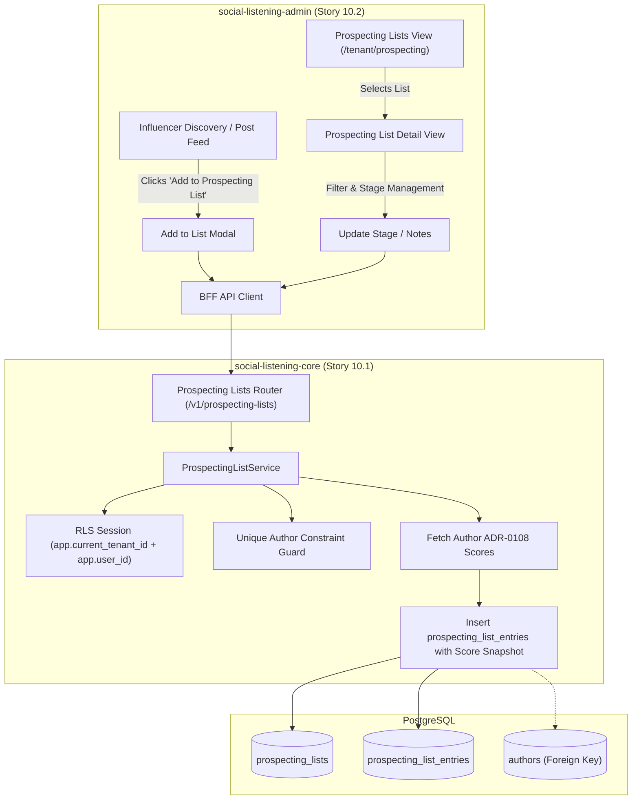
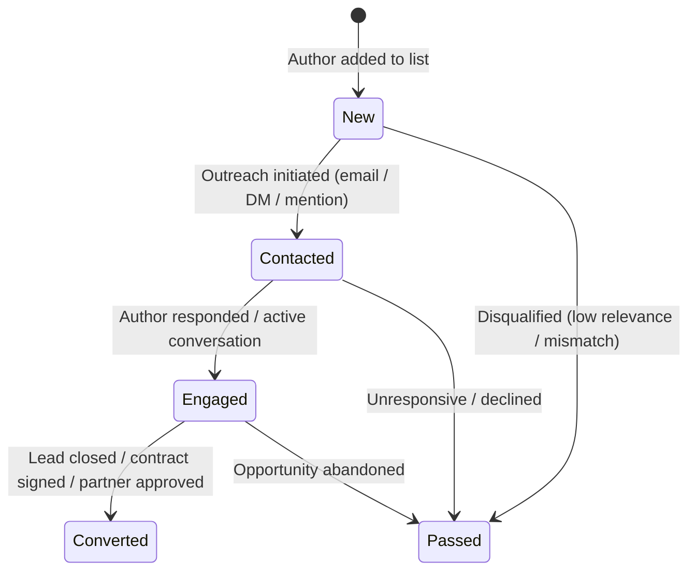

# TDS-0086: Prospecting List Model and Sharing

**Status:** Approved  
**Date:** 2026-09-05  
**Governing ADR:** [ADR-0086](../../adr/0086-prospecting-list-model-and-sharing.md)  
**Related Epics/Stories:** [Epic 10 / Story 10.1, 10.2](../../user-stories/epic-10-adr-0086-to-0094.md), [Epic 11 / Story 11.1](../../user-stories/epic-11-adr-0095-to-0100.md), [Epic 13 / Story 13.13, 13.14](../../user-stories/epic-13-adr-0109-to-0117.md), [Epic 17 / Story 17.1](../../user-stories/epic-17-adr-0129-to-0133.md)  
**Target Repositories:** `social-listening-core`, `social-listening-admin`  
**Contract Test Citations:**  
- `social-listening-core/contracts/epic-10/story-10.1.prospecting-list-model.contract.test.ts`  
- `social-listening-admin/contracts/epic-10/story-10.2.prospecting-list-ui.contract.test.ts`  

---

## 1. Architectural Context & Problem Statement

Social selling strategists (`Social-Selling-Strategist`) and business analysts (`Tenant-Business-Analyst`) monitor brand topics, competitor keywords, and industry discussions to discover high-value prospects, authoritative creators, and key opinion leaders (KOLs). While `Author` (ADR-0004) captures normalized profile metadata and ADR-0108 provides four quantitative scores (`engagement_score`, `authenticity_score`, `influence_score`, `reach_score`), commercial teams require a dedicated qualification workbench to:
1. Save discovered authors into named, purpose-built prospecting lists.
2. Freeze add-time score snapshots so qualification context is preserved even as live social signals drift.
3. Track commercial relationship lifecycle stages (`new` $\rightarrow$ `contacted` $\rightarrow$ `engaged` $\rightarrow$ `converted` $\rightarrow$ `passed`).
4. Share lists across the tenant with granular, owner-controlled, read-only permissions without leaking uncurated personal drafts.

Furthermore, prospecting lists must enforce strict PII protection: they reference public author handles and platform identifiers rather than scraping private contact details, establishing a clean boundary for CSV export and CRM handoff (ADR-0095 / ADR-0117).



---

## 2. Governing ADRs & Decision Log Reference

- [ADR-0086: Prospecting List Model and Sharing](../../adr/0086-prospecting-list-model-and-sharing.md) — Authorizes data model, snapshot semantics, deduplication rules, and owner-only mutation RLS policies.
- [ADR-0004: Author Normalized Separately from Post](../../adr/0004-author-normalized-separately-from-post.md) — Canonical `Author` entity referenced by foreign key without cascading deletes.
- [ADR-0044: Watchlist API Design and Database Schema Standardization](../../adr/0044-watchlist-api-design-and-database-schema-standardization.md) — Precedent for personal resource ownership, sharing toggles, and RLS error conventions (returning `404` for non-owner mutations).
- [ADR-0095: Case and Lead Handoff to CRM](../../adr/0095-case-handoff-to-crm.md) — Downstream consumer of prospecting lists for lead creation.
- [ADR-0108: Influencer Discovery and Scoring](../../adr/0108-influencer-discovery-and-scoring.md) — Source of four-score taxonomy (`engagement`, `authenticity`, `influence`, `reach`).
- [ADR-0117: Prospecting List Export and CRM Push](../../adr/0117-prospecting-list-export-and-crm-push.md) — CSV export and batch CRM dispatch specifications.
- [ADR-0129: Prospecting List Model Refinements](../../adr/0129-prospecting-list-model-and-sharing-refinements.md) — Deduplicated cross-platform sync refinements.

---

## 3. Scope, Precedence & Anti-Goals

### In Scope
- CRUD endpoints for `prospecting_lists` and `prospecting_list_entries`.
- Point-in-time snapshotting of all four ADR-0108 scores (`engagement_score`, `authenticity_score`, `influence_score`, `reach_score`) upon addition.
- Unique constraint preventing duplicate authors in the same list (`409 Conflict` on duplicate addition).
- Owner-only write permissions; teammates receive read-only visibility when `shared = true`.
- Zero-row matching under RLS returning `404 Not Found` for unauthorized mutations (no `403` leakage).
- Responsive management UI in `social-listening-admin` with stage dropdowns and tag editing.

### Precedence Invariant
$$\text{Owner-Only Modification} \land \text{Tenant Isolation}$$
Even if `shared = true`, only `owner_id` can mutate the list metadata or entries. Teammates cannot add, edit, or remove authors, nor can `tenant_admin` override list ownership.

### Anti-Goals
- Automated workflow automation or drip sequences in v1 (relationship stage is a metadata label).
- Storing scraped private PII (emails, phone numbers) not publicly present in canonical author metadata.
- Recomputing snapshot scores automatically on author signal updates.

---

## 4. Data Architecture & Storage Schema

```sql
-- Migration: 0086_create_prospecting_lists.sql

CREATE TABLE IF NOT EXISTS prospecting_lists (
    id UUID PRIMARY KEY DEFAULT gen_random_uuid(),
    tenant_id UUID NOT NULL REFERENCES tenants(id) ON DELETE CASCADE,
    owner_id UUID NOT NULL REFERENCES users(id) ON DELETE CASCADE,
    name TEXT NOT NULL,
    description TEXT,
    shared BOOLEAN NOT NULL DEFAULT FALSE,
    created_at TIMESTAMPTZ NOT NULL DEFAULT NOW(),
    updated_at TIMESTAMPTZ NOT NULL DEFAULT NOW()
);

CREATE TABLE IF NOT EXISTS prospecting_list_entries (
    id UUID PRIMARY KEY DEFAULT gen_random_uuid(),
    prospecting_list_id UUID NOT NULL REFERENCES prospecting_lists(id) ON DELETE CASCADE,
    tenant_id UUID NOT NULL REFERENCES tenants(id) ON DELETE CASCADE,
    author_id UUID NOT NULL REFERENCES authors(id), -- No ON DELETE CASCADE: fail-closed to preserve sales audit
    platform_id TEXT NOT NULL,
    topic TEXT,
    engagement_score NUMERIC(5,2),
    authenticity_score NUMERIC(5,2),
    influence_score NUMERIC(5,2),
    reach_score NUMERIC(5,2),
    relationship_stage TEXT NOT NULL DEFAULT 'new'
        CHECK (relationship_stage IN ('new', 'contacted', 'engaged', 'converted', 'passed')),
    notes TEXT,
    tags TEXT[] NOT NULL DEFAULT '{}',
    custom_attributes JSONB NOT NULL DEFAULT '{}',
    added_by_user_id UUID NOT NULL REFERENCES users(id) ON DELETE CASCADE,
    added_at TIMESTAMPTZ NOT NULL DEFAULT NOW(),
    updated_at TIMESTAMPTZ NOT NULL DEFAULT NOW(),
    CONSTRAINT uq_prospecting_list_author UNIQUE (prospecting_list_id, author_id)
);

-- Indexing Strategy
CREATE INDEX IF NOT EXISTS idx_prospecting_lists_tenant_owner 
    ON prospecting_lists(tenant_id, owner_id, shared);

CREATE INDEX IF NOT EXISTS idx_prospecting_entries_list 
    ON prospecting_list_entries(prospecting_list_id, relationship_stage);

CREATE INDEX IF NOT EXISTS idx_prospecting_entries_tenant_author 
    ON prospecting_list_entries(tenant_id, author_id);

-- Row Level Security
ALTER TABLE prospecting_lists ENABLE ROW LEVEL SECURITY;
ALTER TABLE prospecting_list_entries ENABLE ROW LEVEL SECURITY;

-- Lists RLS: Select if owner OR (shared AND same tenant)
CREATE POLICY prospecting_lists_select_policy ON prospecting_lists
    FOR SELECT
    USING (
        tenant_id = NULLIF(current_setting('app.current_tenant_id', true), '')::uuid
        AND (
            owner_id = NULLIF(current_setting('app.user_id', true), '')::uuid
            OR shared = TRUE
        )
    );

-- Lists RLS: Mutations permitted exclusively by owner_id
CREATE POLICY prospecting_lists_modify_policy ON prospecting_lists
    FOR ALL
    USING (
        tenant_id = NULLIF(current_setting('app.current_tenant_id', true), '')::uuid
        AND owner_id = NULLIF(current_setting('app.user_id', true), '')::uuid
    )
    WITH CHECK (
        tenant_id = NULLIF(current_setting('app.current_tenant_id', true), '')::uuid
        AND owner_id = NULLIF(current_setting('app.user_id', true), '')::uuid
    );

-- Entries RLS: Inherits list visibility for SELECT
CREATE POLICY prospecting_entries_select_policy ON prospecting_list_entries
    FOR SELECT
    USING (
        tenant_id = NULLIF(current_setting('app.current_tenant_id', true), '')::uuid
        AND EXISTS (
            SELECT 1 FROM prospecting_lists pl
            WHERE pl.id = prospecting_list_entries.prospecting_list_id
              AND (pl.owner_id = NULLIF(current_setting('app.user_id', true), '')::uuid OR pl.shared = TRUE)
        )
    );

-- Entries RLS: Mutations permitted exclusively if parent list owned by user
CREATE POLICY prospecting_entries_modify_policy ON prospecting_list_entries
    FOR ALL
    USING (
        tenant_id = NULLIF(current_setting('app.current_tenant_id', true), '')::uuid
        AND EXISTS (
            SELECT 1 FROM prospecting_lists pl
            WHERE pl.id = prospecting_list_entries.prospecting_list_id
              AND pl.owner_id = NULLIF(current_setting('app.user_id', true), '')::uuid
        )
    )
    WITH CHECK (
        tenant_id = NULLIF(current_setting('app.current_tenant_id', true), '')::uuid
        AND EXISTS (
            SELECT 1 FROM prospecting_lists pl
            WHERE pl.id = prospecting_list_entries.prospecting_list_id
              AND pl.owner_id = NULLIF(current_setting('app.user_id', true), '')::uuid
        )
    );
```

---

## 5. Component & Interface Contracts

### 5.1 Backend TypeScript Models (`social-listening-core`)

```typescript
export type RelationshipStage = 'new' | 'contacted' | 'engaged' | 'converted' | 'passed';

export interface ProspectingList {
  id: string;
  tenantId: string;
  ownerId: string;
  name: string;
  description: string | null;
  shared: boolean;
  entryCount?: number;
  createdAt: string;
  updatedAt: string;
}

export interface ProspectingListEntry {
  id: string;
  prospectingListId: string;
  tenantId: string;
  authorId: string;
  platformId: string;
  topic: string | null;
  engagementScore: number | null;
  authenticityScore: number | null;
  influenceScore: number | null;
  reachScore: number | null;
  relationshipStage: RelationshipStage;
  notes: string | null;
  tags: string[];
  customAttributes: Record<string, unknown>;
  addedByUserId: string;
  addedAt: string;
  updatedAt: string;
  author?: {
    handle: string;
    displayName: string;
    avatarUrl?: string;
    followerCount?: number;
  };
}

export interface CreateProspectingListRequest {
  name: string;
  description?: string;
  shared?: boolean;
}

export interface AddProspectingListEntryRequest {
  authorId: string;
  platformId: string;
  topic?: string;
  relationshipStage?: RelationshipStage;
  notes?: string;
  tags?: string[];
  customAttributes?: Record<string, unknown>;
}
```

### 5.2 API Route Specification

#### `POST /v1/prospecting-lists`
Creates a new personal prospecting list. Defaults to `shared: false`.

#### `GET /v1/prospecting-lists`
Lists all lists owned by the calling user or marked `shared: true` within the same tenant.

#### `POST /v1/prospecting-lists/:id/entries`
Adds an author to the list. Looks up current ADR-0108 scores on `authors` and writes snapshot values. Returns `409 Conflict` if the author already exists on the list.

#### `GET /v1/prospecting-lists/:id/entries?limit=50&cursor=...`
Returns cursor-paginated list entries joined with current author presentation metadata.

#### `PATCH /v1/prospecting-lists/:id/entries/:entryId`
Updates `relationshipStage`, `notes`, `tags`, or `customAttributes`. Restricted to `owner_id`.

---

## 6. State Machine & Lifecycle Transitions



---

## 7. Security, Tenant Isolation & Authentication

1. **Strict RLS Enforcement:** Enforced at the SQL engine level using `app.current_tenant_id` and `app.user_id`.
2. **Read-Only Sharing Model:** Teammates have `SELECT` privileges only. Attempted `PATCH` or `DELETE` commands by non-owners affect zero rows and trigger `404 Not Found`, mirroring ADR-0044 §2 convention without role-branch leakage.
3. **Fail-Closed Author Integrity:** `author_id` intentionally lacks `ON DELETE CASCADE`. If an author request occurs, profile redaction (ADR-0092) preserves author IDs for historical qualification audit.

---

## 8. Performance, Scalability & Resource Boundaries

1. **Snapshot Efficiency:** Score snapshotting runs as a single `INSERT INTO ... SELECT` query joining `authors` in `< 15ms`.
2. **Cursor Pagination:** Entry retrieval enforces cursor pagination (`limit` default 50, max 200) indexed by `(prospecting_list_id, relationship_stage, id)`.
3. **No Per-List Artificial Cap:** Avoids arbitrary size limits, relying on database indexes and cursor streaming for large lists.

---

## 9. Error Handling, Retries & Fallback Strategies

| Condition | HTTP Status | Detail / Action |
|---|---|---|
| Duplicate author addition | `409 Conflict` | Returns `{ error: 'Author already exists on prospecting list', entryId: '...' }` |
| Author does not exist | `404 Not Found` | Validates `authorId` prior to insertion |
| Mutation by non-owner | `404 Not Found` | RLS filters out rows; returns 404 to prevent resource enumeration |
| Invalid relationship stage | `400 Bad Request` | Enforces check constraint validation |

---

## 10. Observability, Telemetry & Audit Trail

- **Audit Events:**
  - `prospecting_list_created { listId, ownerId, shared }`
  - `prospecting_list_shared_toggled { listId, shared: boolean }`
  - `prospecting_author_added { listId, authorId, scoresSnapshot }`
  - `prospecting_stage_updated { listId, entryId, oldStage, newStage }`
- **Prometheus Metrics:**
  - `prospecting_lists_total{tenant_id}` — Count of active lists.
  - `prospecting_entries_total{tenant_id, relationship_stage}` — Distribution of leads across stages.

---

## 11. Migration & Backward Compatibility Strategy

- **Schema Setup:** `0086_create_prospecting_lists.sql` creates tables and RLS policies cleanly without impacting existing ingestion tables.
- **Future Revisions:** Built to support ADR-0117 CSV/CRM export and ADR-0129 deduplicated cross-network handles without schema breaks.

---

## 12. Executable Contract Test Citations & Verification Matrix

### 12.1 Contract Test Specifications
1. `social-listening-core/contracts/epic-10/story-10.1.prospecting-list-model.contract.test.ts`:
   - `test('creates prospecting list with owner_id and default shared=false')`
   - `test('adds author entry with point-in-time snapshot of ADR-0108 scores')`
   - `test('returns 409 Conflict when attempting to add duplicate author to same list')`
   - `test('allows teammates to SELECT shared list but rejects PATCH/DELETE with 404')`
   - `test('enforces cursor-based pagination on list entries')`
2. `social-listening-admin/contracts/epic-10/story-10.2.prospecting-list-ui.contract.test.ts`:
   - `test('renders list management table with owned and shared badges')`
   - `test('renders entry table with author scores and relationship stage dropdown')`
   - `test('disables editing controls when viewing a shared list owned by a teammate')`

### 12.2 Open Questions

- [x] ~~**[Q-0086-1]** Should scores be recomputed on demand or snapshotted?~~  
  *Decision:* Snapshotted at add-time (`numeric(5,2)`) to preserve qualification context regardless of future signal drift.
- [x] ~~**[Q-0086-2]** Can non-owners edit shared lists?~~  
  *Decision:* No. Sharing provides read-only visibility across the tenant. Only `owner_id` can mutate the list or its entries.
- [ ] **[Q-0086-4]** **Is a maximum entries-per-list ceiling needed?** No fixed ceiling is enforced; reads are bounded by cursor pagination (default 50, max 200). Revisit only if real usage metrics justify a cap.
