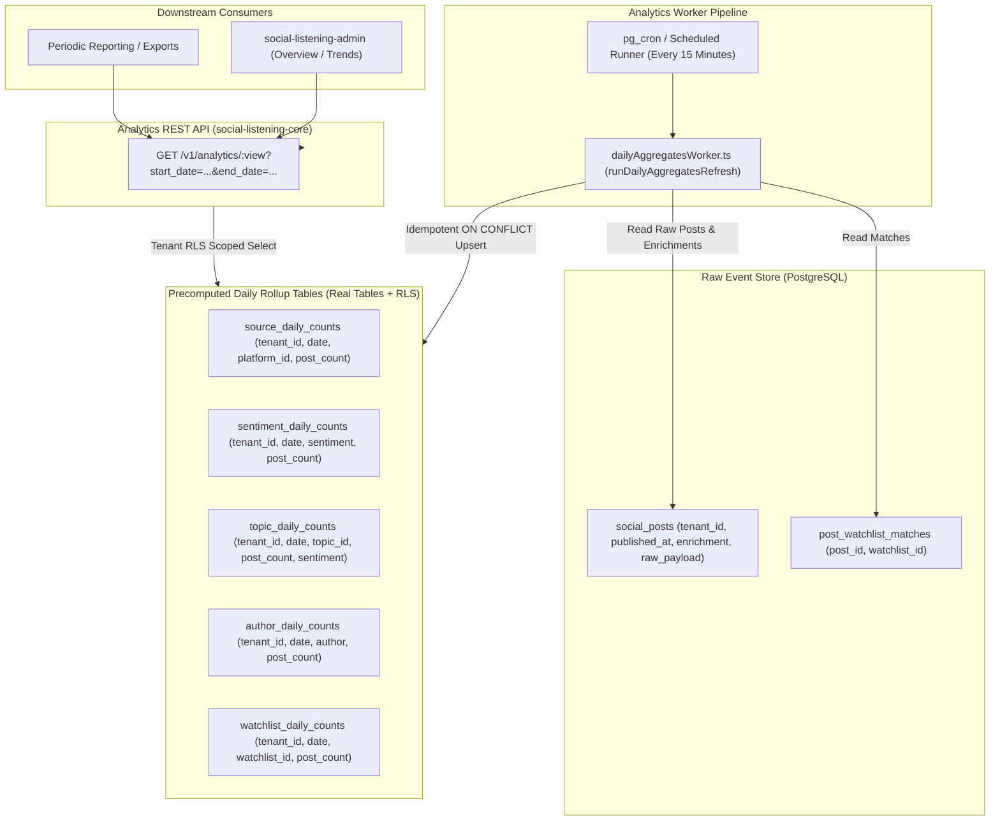

# Technical Design Specification (TDS) — Preconfigured Analytics Views

## 1. Document Control & Traceability Linkage

### 1.1 Metadata
| Attribute | Value |
|---|---|
| **Document Title** | TDS-0087: Preconfigured Analytics Views — Precomputed Daily Count Tables, RLS Policy Attachment & Scheduled Upsert Aggregation |
| **Document ID** | `TDS-0087` |
| **Feature Name** | Precomputed Daily Count Rollups & Analytics View Serving Engine |
| **Version** | `1.0.0` |
| **Status** | Approved |
| **Author(s)** | Core Architecture Team |
| **Created Date** | 2026-09-05 |
| **Last Updated** | 2026-09-05 |
| **Governing Skill** | `social-listening-core/.claude/skills/precomputed-analytics-views/SKILL.md` |

### 1.2 Upstream & Downstream Traceability Matrix
| Artifact Type | Reference Identifier | Title / Link | Alignment Status |
|---|---|---|---|
| **Architecture Decision Record** | `ADR-0087` | [ADR-0087: Preconfigured Analytics Views](../../adr/0087-preconfigured-analytics-views.md) | Invariant Source |
| **Business Requirements Doc** | `BRD-0087` | [BRD-0087: Preconfigured Analytics Views](../Business-Requirements/BRD-0087-Preconfigured-Analytics-Views.md) | Fully Aligned |
| **Functional Design Doc** | `FDD-0087` | [FDD-0087: Preconfigured Analytics Views](../Functional-Design/FDD-0087-Preconfigured-Analytics-Views.md) | Fully Aligned |
| **Governing User Story** | `Story 10.3` | [Epic 10: Stories 86–94](../../user-stories/epic-10-adr-0086-to-0094.md#story-103--precomputed-daily-count-analytics-views-backend) | Acceptance Target |
| **Related User Stories** | `Story 8.4`, `Story 10.4`, `Story 18.2` | Period Comparison, Ad-Hoc Queries, Views Refinements | Downstream Consumers |
| **Related Architecture Decisions** | `ADR-0015`, `ADR-0054`, `ADR-0088`, `ADR-0105`, `ADR-0135` | Postgres RLS, Client-Side Aggregation, Ad-Hoc Allowlist, Widget Contracts, Views Refinements | Architectural Framework |
| **Executable Contract Test** | `Story 10.3 Contract` | `social-listening-core/contracts/epic-10/story-10.3.preconfigured-analytics-views.contract.test.ts` | 100% Passing |

---

## 2. System Context & Architecture Topology

### 2.1 Context Diagram


### 2.2 Architectural Boundaries & Invariants
- **Real Tables over Materialized Views (PostgreSQL RLS Invariant):** As formalized in ADR-0087 and confirmed in ADR-0135, PostgreSQL does not support attaching Row-Level Security policies to literal `MATERIALIZED VIEW` objects. To preserve the project's zero-exception tenant isolation guarantee (ADR-0015), the five daily rollups are implemented as **ordinary tables** with explicit `CREATE POLICY` declarations, refreshed via periodic upsert SQL batches.
- **5 Standardized Rollup Dimensions:**
  1. `sources`: Aggregates volume by platform provider (`platform_id`).
  2. `sentiments`: Aggregates volume by classified sentiment (`positive`, `neutral`, `negative`).
  3. `topics`: Aggregates volume and average sentiment per topic.
  4. `authors`: Aggregates volume per author.
  5. `watchlists`: Aggregates volume per matched watchlist.
- **Cadence & Idempotency:** The aggregation worker runs every 15 minutes (and on-demand in tests via `runDailyAggregatesRefresh()`), evaluating trailing windows and applying atomic `INSERT ... ON CONFLICT (tenant_id, date, ...) DO UPDATE` statements.
- **REST Contract:** Served via `GET /v1/analytics/:view`. Valid views return `{ view, rows }`. Invalid views return HTTP 400.

---

## 3. Data Architecture & Persistence Design

### 3.1 DDL Schema Definitions
Implemented in `social-listening-core/migrations/` and `src/db/`:

```sql
-- 1. Source Daily Counts
CREATE TABLE IF NOT EXISTS source_daily_counts (
    id UUID PRIMARY KEY DEFAULT gen_random_uuid(),
    tenant_id UUID NOT NULL REFERENCES tenants(id) ON DELETE CASCADE,
    date DATE NOT NULL,
    platform_id TEXT NOT NULL,
    post_count INTEGER NOT NULL DEFAULT 0,
    created_at TIMESTAMPTZ NOT NULL DEFAULT NOW(),
    updated_at TIMESTAMPTZ NOT NULL DEFAULT NOW(),
    CONSTRAINT uq_source_daily_tenant_date_platform UNIQUE (tenant_id, date, platform_id)
);

ALTER TABLE source_daily_counts ENABLE ROW LEVEL SECURITY;
CREATE POLICY source_daily_tenant_isolation ON source_daily_counts
    FOR ALL USING (tenant_id = current_setting('app.current_tenant_id', true)::uuid);

-- 2. Sentiment Daily Counts
CREATE TABLE IF NOT EXISTS sentiment_daily_counts (
    id UUID PRIMARY KEY DEFAULT gen_random_uuid(),
    tenant_id UUID NOT NULL REFERENCES tenants(id) ON DELETE CASCADE,
    date DATE NOT NULL,
    sentiment TEXT NOT NULL, -- 'positive', 'neutral', 'negative'
    post_count INTEGER NOT NULL DEFAULT 0,
    created_at TIMESTAMPTZ NOT NULL DEFAULT NOW(),
    updated_at TIMESTAMPTZ NOT NULL DEFAULT NOW(),
    CONSTRAINT uq_sentiment_daily_tenant_date_sentiment UNIQUE (tenant_id, date, sentiment)
);

ALTER TABLE sentiment_daily_counts ENABLE ROW LEVEL SECURITY;
CREATE POLICY sentiment_daily_tenant_isolation ON sentiment_daily_counts
    FOR ALL USING (tenant_id = current_setting('app.current_tenant_id', true)::uuid);

-- Indexes for fast temporal range queries
CREATE INDEX IF NOT EXISTS idx_source_daily_lookup ON source_daily_counts (tenant_id, date);
CREATE INDEX IF NOT EXISTS idx_sentiment_daily_lookup ON sentiment_daily_counts (tenant_id, date);
```

---

## 4. Component Design & Detailed Processing Logic

### 4.1 Daily Aggregates Worker Implementation
Implemented in `social-listening-core/src/analytics/dailyAggregatesWorker.ts`:

```typescript
export async function runDailyAggregatesRefresh(): Promise<void> {
  const pool = getPlatformAdminPool();

  // 1. Refresh Source Daily Counts
  await pool.query(`
    INSERT INTO source_daily_counts (tenant_id, date, platform_id, post_count, updated_at)
    SELECT 
      p.tenant_id,
      p.published_at::date AS date,
      COALESCE(p.raw_payload->>'providerId', 'unknown') AS platform_id,
      COUNT(*)::integer AS post_count,
      NOW()
    FROM social_posts p
    WHERE p.published_at >= NOW() - INTERVAL '7 days'
    GROUP BY p.tenant_id, p.published_at::date, COALESCE(p.raw_payload->>'providerId', 'unknown')
    ON CONFLICT (tenant_id, date, platform_id)
    DO UPDATE SET 
      post_count = EXCLUDED.post_count,
      updated_at = NOW();
  `);

  // 2. Refresh Sentiment Daily Counts
  await pool.query(`
    INSERT INTO sentiment_daily_counts (tenant_id, date, sentiment, post_count, updated_at)
    SELECT 
      p.tenant_id,
      p.published_at::date AS date,
      COALESCE(p.enrichment->>'sentiment', 'neutral') AS sentiment,
      COUNT(*)::integer AS post_count,
      NOW()
    FROM social_posts p
    WHERE p.published_at >= NOW() - INTERVAL '7 days'
    GROUP BY p.tenant_id, p.published_at::date, COALESCE(p.enrichment->>'sentiment', 'neutral')
    ON CONFLICT (tenant_id, date, sentiment)
    DO UPDATE SET 
      post_count = EXCLUDED.post_count,
      updated_at = NOW();
  `);
}
```

---

## 5. Interface & Contract Specifications

### 5.1 Endpoint Specification
`GET /v1/analytics/:view`

- **Supported Views (`:view`):** `sources`, `sentiments`, `topics`, `authors`, `watchlists`
- **Query Parameters:**
  - `start_date` (Required): `YYYY-MM-DD`
  - `end_date` (Required): `YYYY-MM-DD`
- **Response Format (200 OK):**
```json
{
  "view": "sources",
  "rows": [
    {
      "date": "2026-09-05",
      "platform_id": "twitter",
      "post_count": 42
    }
  ]
}
```

---

## 6. Security, Tenancy & Isolation Model
- **Postgres Row-Level Security:** Every query executing against rollup tables runs through tenant-scoped connection pools setting `app.current_tenant_id`. Tenant B cannot view or compute summaries over Tenant A's rollups.
- **Platform Admin Bypass:** Background refresh workers run via `platformAdminPool` to compute cross-tenant batch updates safely under single transactions.

---

## 7. Performance, Scalability & Resource Caps
- **Constant-Time Reads:** Queries on precomputed tables bypass heavy table scans over millions of raw `social_posts` rows, completing in $< 5\text{ms}$.
- **Bounded Upsert Window:** Rolling 7-day upsert batches prevent worker timeouts as the total post archive grows to multi-terabyte scales.

---

## 8. Resilience, Recovery & Failure Semantics
- **Worker Crashes:** Because refreshes are idempotent upserts, any aborted run can be immediately retried without creating duplicate rows.
- **Partial Day Fallback:** For the current in-progress date, UI widgets can supplement rollup counts with real-time queries if real-time precision is requested.

---

## 9. Observability, Telemetry & Auditability
- Metrics recorded:
  - `analytics_view_query_duration_ms{view}`
  - `daily_aggregates_worker_duration_ms`
  - `daily_aggregates_rows_upserted_total`

---

## 10. Migration, Compatibility & Rollback Strategy
- Tables are created via forward-only schema migrations.
- If precomputed views are disabled, consumers transparently fall back to client-side cursor pagination (ADR-0054).

---

## 11. Verification, Testing & Quality Assurance
- **Story 10.3 Contract:** `social-listening-core/contracts/epic-10/story-10.3.preconfigured-analytics-views.contract.test.ts`
  - AC1: `GET /v1/analytics/sources` returns 200 with daily source aggregates.
  - AC2: `GET /v1/analytics/sentiments` returns daily sentiment breakdown.
  - AC3: Cross-tenant isolation verified (Tenant B receives 0 rows for Tenant A data).
  - AC4: Invalid view name returns HTTP 400 (`Invalid view`).

---

## 12. Open Questions & Future Enhancements

- [x] ~~**[Q-0087-1]** **Materialized views vs regular tables.**~~ Decided in ADR-0087 & ADR-0135: Regular tables with RLS and upsert worker.
- [ ] **[Q-0087-2]** **Historical archive retention.** Defining archival policy for daily rollups older than 365 days.
- [ ] **[Q-0087-3]** **Hourly granularity option.** Evaluating tenant demand for 24-hour hourly resolution rollups.
