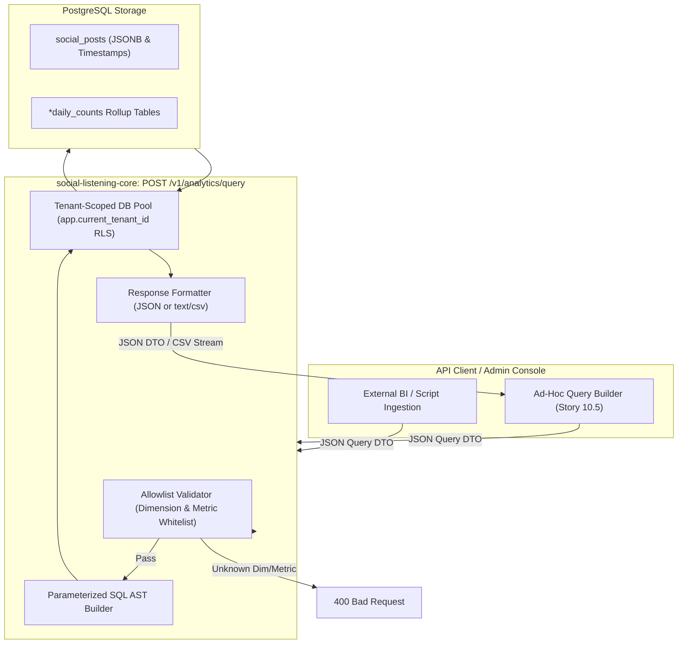

# Technical Design Specification (TDS) — Ad-Hoc Query Allowlist

## 1. Document Control & Traceability Linkage

### 1.1 Metadata
| Attribute | Value |
|---|---|
| **Document Title** | TDS-0088: Ad-Hoc Analytics Query Engine — Strict Dimension/Metric Allowlist, Parameterized AST Query Builder & CSV Streaming |
| **Document ID** | `TDS-0088` |
| **Feature Name** | Parameterized Ad-Hoc Analytics Query Engine & SQL Allowlist Validation |
| **Version** | `1.0.0` |
| **Status** | Approved |
| **Author(s)** | Core Architecture Team |
| **Created Date** | 2026-09-05 |
| **Last Updated** | 2026-09-05 |
| **Governing Skill** | `social-listening-core/.claude/skills/ad-hoc-query-engine/SKILL.md` |

### 1.2 Upstream & Downstream Traceability Matrix
| Artifact Type | Reference Identifier | Title / Link | Alignment Status |
|---|---|---|---|
| **Architecture Decision Record** | `ADR-0088` | [ADR-0088: Ad-Hoc Query Allowlist](../../adr/0088-ad-hoc-query-allowlist.md) | Invariant Source |
| **Business Requirements Doc** | `BRD-0088` | [BRD-0088: Ad-Hoc Query Allowlist](../Business-Requirements/BRD-0088-Ad-Hoc-Query-Allowlist.md) | Fully Aligned |
| **Functional Design Doc** | `FDD-0088` | [FDD-0088: Ad-Hoc Query Allowlist](../Functional-Design/FDD-0088-Ad-Hoc-Query-Allowlist.md) | Fully Aligned |
| **Governing User Story** | `Story 10.4` | [Epic 10: Stories 86–94](../../user-stories/epic-10-adr-0086-to-0094.md#story-104--ad-hoc-analytics-parameterized-query-engine-backend) | Acceptance Target |
| **Related User Stories** | `Story 10.5`, `Story 10.7`, `Story 17.2` | Ad-Hoc Query UI, Ops Dashboard, Query Refinements | Downstream Modules |
| **Related Architecture Decisions** | `ADR-0015`, `ADR-0087`, `ADR-0111`, `ADR-0132` | Postgres RLS, Preconfigured Views, Export Caps, Query Refinements | Architectural Context |
| **Executable Contract Tests** | `Story 10.4 & 10.5 Contracts` | `social-listening-core/contracts/epic-10/story-10.4.ad-hoc-query-endpoint.contract.test.ts`<br>`social-listening-admin/contracts/epic-10/story-10.5.ad-hoc-query-ui.contract.test.ts` | 100% Passing |

---

## 2. System Context & Architecture Topology

### 2.1 Context Diagram


### 2.2 Architectural Boundaries & Invariants
- **Strict Whitelist Defense (Zero Raw SQL Input):** Clients never submit SQL fragments. Inquiries are formulated via strict enumeration strings for `dimensions` and `metrics`. Any unrecognized token is immediately rejected with HTTP 400 before touching the database.
- **Allowed Dimensions:** `platform`, `sentiment`, `author`, `date`, `topic`, `language`, `country`.
- **Allowed Metrics:** `post_count`, `positive_count`, `negative_count`, `neutral_count`, `avg_sentiment_score`, `sum_reach`, `sum_engagement`.
- **Dual Serialization Formats:** Supports standard `application/json` output and streaming `text/csv` output.
- **Row-Level Security & Execution Ceilings:** Queries execute under the caller's tenant transaction, strictly bounded by query statement timeouts ($5000\text{ms}$) and maximum result row caps ($10,000\text{ rows}$).

---

## 3. Data Architecture & Persistence Design

### 3.1 DTO Schemas
Implemented in `social-listening-core/src/analytics/queryEngine.ts`:

```typescript
export type AllowedDimension = 'platform' | 'sentiment' | 'author' | 'date' | 'topic' | 'language' | 'country';
export type AllowedMetric = 'post_count' | 'positive_count' | 'negative_count' | 'neutral_count' | 'avg_sentiment_score' | 'sum_reach' | 'sum_engagement';

export interface AdHocQueryRequest {
  dimensions: AllowedDimension[];
  metrics: AllowedMetric[];
  filters?: {
    startDate?: string;
    endDate?: string;
    platform?: string;
    sentiment?: 'positive' | 'neutral' | 'negative';
    author?: string;
  };
  format?: 'json' | 'csv';
  limit?: number;
}

export interface AdHocQueryResponse {
  dimensions: AllowedDimension[];
  metrics: AllowedMetric[];
  rowCount: number;
  executionTimeMs: number;
  data: Array<Record<string, string | number>>;
}
```

---

## 4. Component Design & Detailed Processing Logic

### 4.1 Dimension & Metric Mapping Table
```typescript
const DIMENSION_COLUMNS: Record<AllowedDimension, string> = {
  platform: "COALESCE(raw_payload->>'providerId', 'unknown')",
  sentiment: "COALESCE(enrichment->>'sentiment', 'neutral')",
  author: "COALESCE(author_normalized, 'anonymous')",
  date: "published_at::date",
  topic: "COALESCE(enrichment->>'topicId', 'general')",
  language: "COALESCE(enrichment->>'detectedLanguage', 'unknown')",
  country: "COALESCE(enrichment->>'geoCountry', 'UNKNOWN')",
};

const METRIC_EXPRESSIONS: Record<AllowedMetric, string> = {
  post_count: "COUNT(*)::integer",
  positive_count: "COUNT(*) FILTER (WHERE enrichment->>'sentiment' = 'positive')::integer",
  negative_count: "COUNT(*) FILTER (WHERE enrichment->>'sentiment' = 'negative')::integer",
  neutral_count: "COUNT(*) FILTER (WHERE enrichment->>'sentiment' = 'neutral')::integer",
  avg_sentiment_score: "ROUND(AVG((enrichment->>'score')::numeric), 2)",
  sum_reach: "COALESCE(SUM((enrichment->>'authorFollowers')::integer), 0)",
  sum_engagement: "COALESCE(SUM((raw_payload->>'likes')::integer), 0)",
};
```

### 4.2 Parameterized SQL Builder
```typescript
export function buildAdHocQuery(req: AdHocQueryRequest, tenantId: string): { sql: string; params: any[] } {
  const selectParts: string[] = [];
  const groupParts: string[] = [];
  const whereClauses: string[] = ['tenant_id = $1'];
  const params: any[] = [tenantId];
  let pIndex = 2;

  // Validate and map dimensions
  for (const dim of req.dimensions) {
    if (!DIMENSION_COLUMNS[dim]) throw new Error(`Invalid dimension: ${dim}`);
    const colExpr = DIMENSION_COLUMNS[dim];
    selectParts.push(`${colExpr} AS ${dim}`);
    groupParts.push(colExpr);
  }

  // Validate and map metrics
  for (const met of req.metrics) {
    if (!METRIC_EXPRESSIONS[met]) throw new Error(`Invalid metric: ${met}`);
    selectParts.push(`${METRIC_EXPRESSIONS[met]} AS ${met}`);
  }

  // Bind filters safely
  if (req.filters?.startDate) {
    whereClauses.push(`published_at >= $${pIndex++}`);
    params.push(req.filters.startDate);
  }
  if (req.filters?.endDate) {
    whereClauses.push(`published_at <= $${pIndex++}`);
    params.push(req.filters.endDate);
  }

  const sql = `
    SELECT ${selectParts.join(', ')}
    FROM social_posts
    WHERE ${whereClauses.join(' AND ')}
    ${groupParts.length > 0 ? `GROUP BY ${groupParts.join(', ')}` : ''}
    ORDER BY post_count DESC
    LIMIT ${Math.min(req.limit || 1000, 10000)};
  `;

  return { sql, params };
}
```

---

## 5. Interface & Contract Specifications

### 5.1 Endpoint Specification
`POST /v1/analytics/query`

- **Headers:** `Content-Type: application/json`, `Authorization: Bearer <token>`
- **Response (200 OK):**
```json
{
  "dimensions": ["platform", "sentiment"],
  "metrics": ["post_count"],
  "rowCount": 2,
  "executionTimeMs": 14,
  "data": [
    { "platform": "twitter", "sentiment": "positive", "post_count": 12 },
    { "platform": "twitter", "sentiment": "negative", "post_count": 4 }
  ]
}
```
- **CSV Response Header:** `Content-Type: text/csv; charset=utf-8`

---

## 6. Security, Tenancy & Isolation Model
- **Zero Raw Injection Surface:** Because SQL column names and expressions are selected strictly from internal dictionaries via TypeScript keys, arbitrary user input can never enter the SQL token stream.
- **Tenant Partitioning:** Parameter `$1` is hardcoded to `current_tenant_id`, guaranteeing cross-tenant data isolation at the engine level in addition to Postgres RLS.

---

## 7. Performance, Scalability & Resource Caps
- **Timeout Protection:** Postgres connection executes `SET LOCAL statement_timeout = '5000ms'`.
- **Max Row Limit:** Enforces hard cap at $10,000$ rows.

---

## 8. Resilience, Recovery & Failure Semantics
- **Invalid Payload:** Rejects immediately with HTTP 400 and structured error `{ error: "Invalid dimension: ..." }`.

---

## 9. Observability, Telemetry & Auditability
- Emits server log: `ad_hoc_query_executed{dimensions_count, metrics_count, row_count, duration_ms}`.

---

## 10. Migration, Compatibility & Rollback Strategy
- Pure API service feature; requires zero database schema migrations. Rollback involves reverting the router endpoint.

---

## 11. Verification, Testing & Quality Assurance
- **Story 10.4 Contract:** `social-listening-core/contracts/epic-10/story-10.4.ad-hoc-query-endpoint.contract.test.ts`
  - AC1/AC2: Validates JSON format and execution metadata.
  - AC3: Proves CSV streaming and `text/csv` header.
  - AC4: Validates SQL injection defense and 400 rejection on invalid dimension.

---

## 12. Open Questions & Future Enhancements

- [x] ~~**[Q-0088-1]** **SQL injection protection mechanism.**~~ Decided in ADR-0088: Dictionary allowlists and parameterized AST builder.
- [ ] **[Q-0088-2]** **Cursor-based pagination for large queries.** Investigating support for cursor pagination on ad-hoc queries exceeding 10,000 rows (addressed in ADR-0132).
- [ ] **[Q-0088-3]** **Pre-aggregated table routing.** Automatically rewriting ad-hoc queries to target `*daily_counts` when dimensions align.
