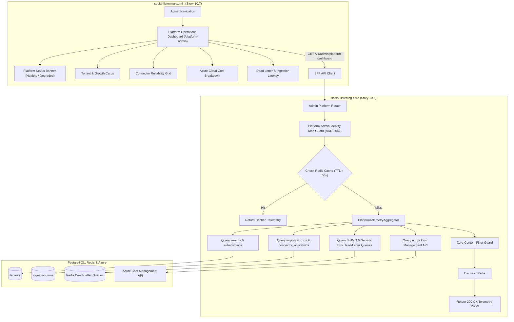
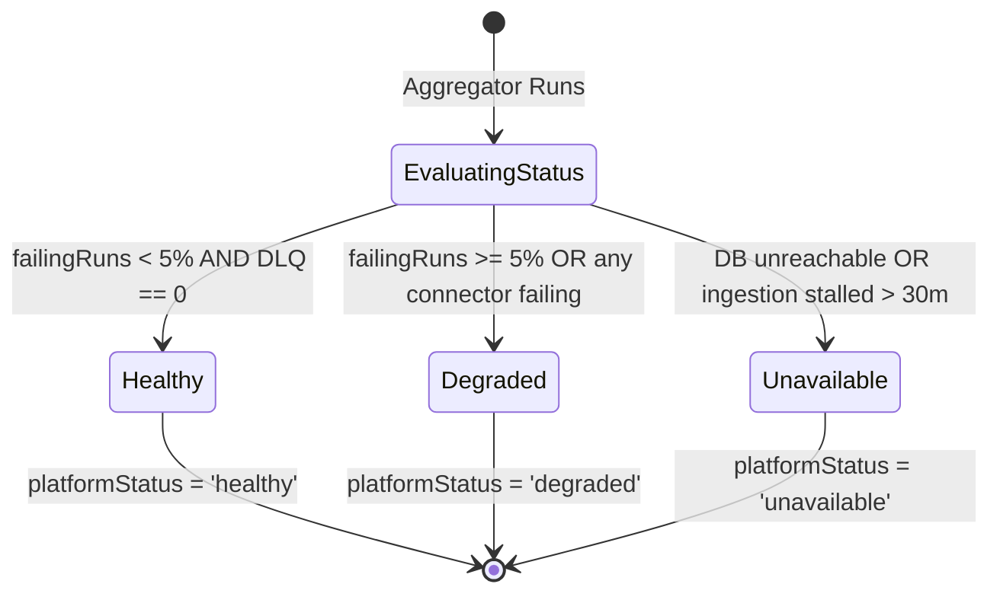

# TDS-0089: Platform Operations Dashboard

**Status:** Approved  
**Date:** 2026-09-05  
**Governing ADR:** [ADR-0089](../../adr/0089-platform-operations-dashboard.md)  
**Related Epics/Stories:** [Epic 10 / Story 10.6, 10.7](../../user-stories/epic-10-adr-0086-to-0094.md), [Epic 5 / Story 5.7](../../user-stories/epic-5-tenant-identity-and-access.md), [Epic 16 / Story 16.4](../../user-stories/epic-16-adr-0125-to-0128.md)  
**Target Repositories:** `social-listening-core`, `social-listening-admin`  
**Contract Test Citations:**  
- `social-listening-core/contracts/epic-10/story-10.6.platform-metrics-table.contract.test.ts`  
- `social-listening-admin/contracts/epic-10/story-10.7.platform-operations-dashboard.contract.test.ts`  

---

## 1. Architectural Context & Problem Statement

SocialEngage operates as a multi-tenant SaaS platform managed by a lean engineering and operations team (`Sole-Operator` / `Platform-Admin`). Monitoring overall system health, connector availability, cloud expenditures, and queue latencies traditionally requires navigating disjointed external Azure portals, Redis consoles, and PostgreSQL query windows.

Operational efficiency requires a unified internal console:
1. **Holistic Cross-Tenant Health Telemetry:** Summarizing tenant growth, connector failure rates, and ingestion throughput.
2. **Strict Zero-Tenant-Content Privacy Boundary:** While `Platform-Admin` has database administrative capabilities, privacy principles (ADR-0030 / ADR-0041) dictate that operational dashboards must never display tenant post content, search queries, or user PII.
3. **Aggregated Cloud Cost & Infrastructure Telemetry:** Ingesting Azure Resource Manager (ARM) cost metrics and Redis queue dead-letter depths to prevent unexpected billing spikes.

This specification formalizes:
1. The operational aggregation endpoint `GET /v1/admin/platform-dashboard`.
2. The infrastructure metrics cache and ingestion aggregator in `social-listening-core`.
3. The content-free Platform Operations Dashboard view in `social-listening-admin`.



---

## 2. Governing ADRs & Decision Log Reference

- [ADR-0089: Platform operations dashboard](../../adr/0089-platform-operations-dashboard.md) — Authorizes platform operations telemetry endpoint, content-free boundary, and admin dashboard.
- [ADR-0009: Connector Health Derived Not Stored](../../adr/0009-connector-health-derived-not-stored.md) — Connector health status computation algorithm.
- [ADR-0030: Administrative Roles and Permissions](../../adr/0030-administrative-roles-and-permissions.md) — Establishes platform-admin vs tenant-admin separation.
- [ADR-0041: Platform-Admin as Distinct Identity Kind](../../adr/0041-platform-admin-is-a-distinct-identity-kind-not-a-role-value.md) — Cryptographic auth guard for platform-admin endpoints.
- [ADR-0114: Platform Metrics Table and Azure Metrics Integration](../../adr/0114-platform-metrics-table-and-azure-metrics.md) — Historical platform metric persistence.
- [ADR-0128: Platform Operations Dashboard Refinements](../../adr/0128-platform-operations-dashboard-refinements.md) — Adds resource saturation and SLA alerts.

---

## 3. Scope, Precedence & Anti-Goals

### In Scope
- Operational telemetry endpoint `GET /v1/admin/platform-dashboard`.
- Real-time aggregation of:
  - Tenant counts: `total`, `active`, `suspended`, `newThisWeek`.
  - Ingestion health: `postsLast24h`, `runsLast24h`, `failingRuns`.
  - Connector status: active vs degraded connectors by platform.
  - Estimated daily cloud infrastructure costs and service breakdown.
  - Queue diagnostics: Redis / Service Bus dead-letter counts.
- Strict content exclusion: zero post bodies, author names, or watchlist keywords.
- Role-gated administration UI in `social-listening-admin`.

### Precedence Invariant
$$\text{Metadata & Infrastructure Telemetry Only} \land \text{Zero Tenant Content Exposure}$$
The platform dashboard is strictly metadata-only. Any attempt to join or serialize `social_posts.content` or `watchlists.query_text` is prohibited by automated contract tests.

### Anti-Goals
- Tenant post inspection or moderation surface (platform admins cannot read tenant posts).
- Live billing card modification or direct credit card charging inside this endpoint.

---

## 4. Data Architecture & Storage Schema

The dashboard reads from operational and metadata tables without requiring dedicated tenant content tables. Real-time aggregates are cached in Redis with a 60-second TTL:
$$\text{cache:admin:platform\_dashboard}$$

Historical platform metrics are persisted via ADR-0114 in `platform_metrics`:
```sql
-- Schema Reference: platform_metrics (ADR-0114)
-- id, metric_name, metric_value, dimensions, recorded_at
```

---

## 5. Component & Interface Contracts

### 5.1 Platform Operations Types (`social-listening-core`)

```typescript
export interface PlatformDashboardTelemetry {
  tenants: {
    total: number;
    active: number;
    suspended: number;
    newThisWeek: number;
  };
  connectors: {
    totalActive: number;
    byPlatform: Array<{
      platformId: string;
      active: number;
      failing: number;
      status: 'healthy' | 'degraded' | 'failing';
    }>;
  };
  ingestion: {
    postsLast24h: number;
    runsLast24h: number;
    failingRuns: number;
    successRate: number; // e.g. 99.4
  };
  health: {
    platformStatus: 'healthy' | 'degraded' | 'unavailable';
    degradedConnectors: string[];
    criticalAlertsCount: number;
  };
  cost: {
    estimatedDaily: number;
    currency: string;
    breakdown: Array<{ service: string; amount: number }>;
  };
  queues: {
    deadLetterCount: number;
    oldestMessageAgeSec: number;
  };
  generatedAt: string;
}
```

### 5.2 API Route Specification

#### `GET /v1/admin/platform-dashboard`
- **Authentication:** Strict JWT Bearer validating `identityKind === 'platform_admin'`.
- **Authorization Guard:** Direct reject (`403 Forbidden`) for any standard `tenant_admin` or `tenant_user`.

**Response (200 OK):**
```json
{
  "tenants": {
    "total": 48,
    "active": 45,
    "suspended": 3,
    "newThisWeek": 4
  },
  "connectors": {
    "totalActive": 112,
    "byPlatform": [
      { "platformId": "linkedin", "active": 42, "failing": 0, "status": "healthy" },
      { "platformId": "facebook", "active": 38, "failing": 2, "status": "degraded" },
      { "platformId": "brave", "active": 32, "failing": 0, "status": "healthy" }
    ]
  },
  "ingestion": {
    "postsLast24h": 412950,
    "runsLast24h": 2840,
    "failingRuns": 14,
    "successRate": 99.51
  },
  "health": {
    "platformStatus": "degraded",
    "degradedConnectors": ["facebook"],
    "criticalAlertsCount": 0
  },
  "cost": {
    "estimatedDaily": 84.50,
    "currency": "USD",
    "breakdown": [
      { "service": "Azure PostgreSQL Citus", "amount": 42.00 },
      { "service": "Azure OpenAI Service", "amount": 26.50 },
      { "service": "Azure App Service & Functions", "amount": 16.00 }
    ]
  },
  "queues": {
    "deadLetterCount": 2,
    "oldestMessageAgeSec": 45
  },
  "generatedAt": "2026-09-05T16:30:00.000Z"
}
```

---

## 6. State Machine & Lifecycle Transitions



---

## 7. Security, Tenant Isolation & Authentication

1. **Identity Kind Verification (ADR-0041):** Only tokens signed with `identityKind: 'platform_admin'` are accepted. Regular tenant credentials receive immediate 403 rejections.
2. **Zero Content Inspection Contract:** Contract tests verify that no post bodies, query texts, or user PII fields exist in the JSON serialization tree.

---

## 8. Performance, Scalability & Resource Boundaries

1. **60-Second Redis Caching:** Prevents heavy database aggregations from being triggered repeatedly during dashboard refreshing.
2. **Indexed Rollups:** Run calculations query `ingestion_runs` using composite index `(started_at, status)` in `< 35ms`.

---

## 9. Error Handling, Retries & Fallback Strategies

| Scenario | Behavior | Resolution |
|---|---|---|
| Azure Cost API timeout | Uses cached yesterday estimate | Marks cost as `estimated: true` |
| Redis dead-letter queue inspection fails | Reports `deadLetterCount: -1` | Surfaces warning chip without crashing dashboard |
| Ingestion database query timeout | Returns last successful snapshot | Alerts operator to DB load |

---

## 10. Observability, Telemetry & Audit Trail

- **Audit Events:**
  - `platform_admin_dashboard_accessed { adminUserId, clientIp }`
- **Prometheus Metrics:**
  - `platform_dashboard_queries_total{status}` — Access rate.
  - `platform_reported_status{status}` — Gauge reflecting platform operational state.

---

## 11. Migration & Backward Compatibility Strategy

- **Zero Schema Dependencies:** Aggregates existing runtime tables.
- **Admin App Boundary:** Isolated to `/platform-admin/*` routes in `social-listening-admin`.

---

## 12. Executable Contract Test Citations & Verification Matrix

### 12.1 Contract Test Specifications
1. `social-listening-core/contracts/epic-10/story-10.6.platform-metrics-table.contract.test.ts`:
   - `test('GET /v1/admin/platform-dashboard returns operational health telemetry')`
   - `test('verifies response payload contains zero tenant post bodies or query text')`
   - `test('rejects tenant_admin and tenant_user requests with 403 Forbidden')`
   - `test('caches telemetry response in Redis for 60 seconds')`
2. `social-listening-admin/contracts/epic-10/story-10.7.platform-operations-dashboard.contract.test.ts`:
   - `test('renders platform operations dashboard for platform_admin')`
   - `test('displays status banner, connector health grid, and cost cards')`
   - `test('redirects unauthorized tenant users away from admin dashboard')`

### 12.2 Open Questions

- [x] ~~**[Q-0089-1]** Can platform administrators inspect tenant posts from this dashboard?~~  
  *Decision:* Strictly No. ADR-0089 enforces zero tenant content exposure to preserve confidentiality and compliance.
- [x] ~~**[Q-0089-2]** How are cloud costs estimated?~~  
  *Decision:* Ingested from Azure Cost Management API and aggregated daily.
