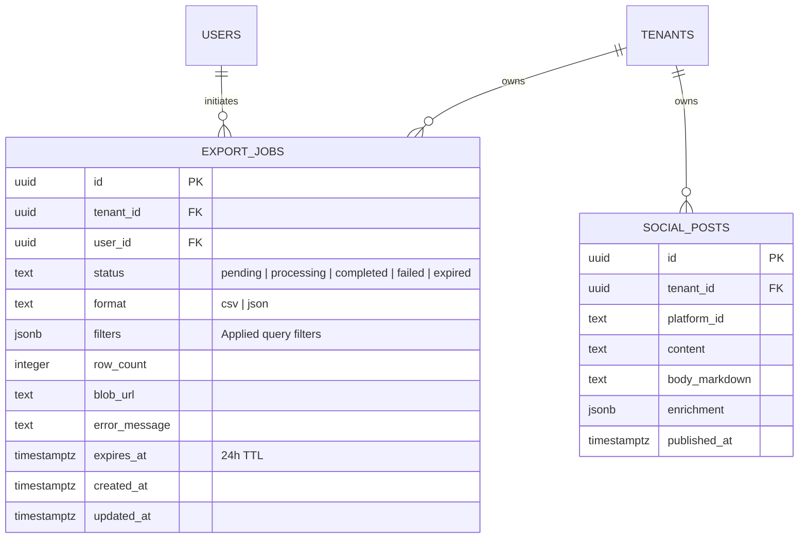
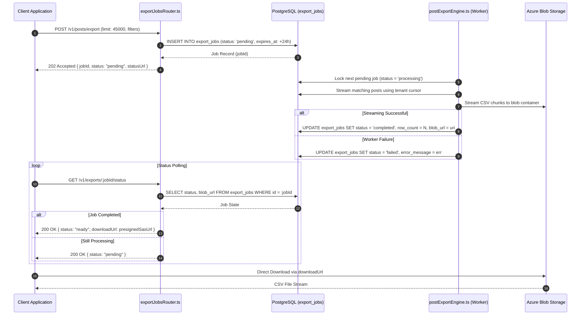

# Technical Design Specification (TDS) — Posts CSV Data Export

## 1. Document Control & Traceability Linkage

### 1.1 Metadata
| Attribute | Value |
|---|---|
| **Document Title** | TDS-0090: Posts CSV Data Export — Synchronous Streaming and Asynchronous Job Engine |
| **Document ID** | `TDS-0090` |
| **Feature Name** | Posts CSV Data Export & Background Export Worker Engine |
| **Version** | `1.0.0` |
| **Status** | Approved |
| **Author(s)** | Core Architecture Team |
| **Created Date** | 2026-09-05 |
| **Last Updated** | 2026-09-05 |
| **Governing Skill** | `social-listening-core/.claude/skills/posts-csv-export/SKILL.md` |

### 1.2 Upstream & Downstream Traceability Matrix
| Artifact Type | Reference Identifier | Title / Link | Alignment Status |
|---|---|---|---|
| **Architecture Decision Record** | `ADR-0090` | [ADR-0090: Data export — posts CSV](../../adr/0090-data-export-posts-csv.md) | Invariant Source |
| **Business Requirements Doc** | `BRD-0090` | [BRD-0090: Data Export Posts CSV](../Business-Requirements/BRD-0090-Data-Export-Posts-CSV.md) | Fully Aligned |
| **Functional Design Doc** | `FDD-0090` | [FDD-0090: Data Export Posts CSV](../Functional-Design/FDD-0090-Data-Export-Posts-CSV.md) | Fully Aligned |
| **Governing User Story** | `Story 10.8` | [Epic 10: ADRs 0086 to 0094](../../user-stories/epic-10-adr-0086-to-0094.md#story-108--posts-data-export-backend) | Acceptance Target |
| **Related Architecture Decisions** | `ADR-0015`, `ADR-0018`, `ADR-0074`, `ADR-0111`, `ADR-0122`, `ADR-0124` | Tenant RLS, Retention, Workspace Export, Export Bounding, Streaming Proxy, Sampling | Cross-Referenced |
| **Executable Contract Test** | `Story 10.8 Contract` | `social-listening-core/contracts/epic-10/story-10.8.data-export-posts-csv.contract.test.ts` | 100% Passing |

---

## 2. System Context & Architecture Topology

### 2.1 Context Diagram
```mermaid
flowchart TD
    subgraph Clients["API Consumers & Admin UI"]
        Browser["User Browser / Business Analyst"]
        AdminProxy["social-listening-admin (/api/posts/export.csv)"]
    end

    subgraph CoreService["social-listening-core (Export Engine)"]
        Router["postsRouter.ts (GET /v1/posts/export.csv)"]
        JobRouter["exportJobsRouter.ts (POST /v1/posts/export & GET /v1/exports/:id/status)"]
        Engine["postExportEngine.ts"]
        CSVFormatter["csvExport.ts (RFC 4180 Escaping & BOM)"]
    end

    subgraph StorageTier["Data & Object Storage"]
        Postgres["PostgreSQL (social_posts & export_jobs with RLS)"]
        AzureBlob["Azure Blob Storage (Temporary Export Staging, 24h TTL)"]
    end

    Browser --> AdminProxy
    AdminProxy --> Router
    AdminProxy --> JobRouter

    Router -->|Sync Request: limit <= 10,000| Engine
    Engine -->|Cursor-based Streaming| Postgres
    Engine --> CSVFormatter
    CSVFormatter -->|Chunked CSV Stream| AdminProxy
    AdminProxy --> Browser

    JobRouter -->|Async Request: limit > 10,000| Engine
    Engine -->|Create Job (status: pending)| Postgres
    Engine -->|Background Stream| AzureBlob
    JobRouter -->|Poll Status / Get SAS URL| Postgres
    Browser -->|Direct Download via SAS URL| AzureBlob
```

### 2.2 Architectural Boundaries & Invariants
- **Dual-Path Execution Architecture:**
  - *Synchronous Streaming Path:* For bounded exports (`limit <= 10,000`), the service streams rows row-by-row directly over HTTP with $O(1)$ memory consumption.
  - *Asynchronous Job Path:* For large exports (`limit > 10,000`), the API returns `202 Accepted` with a `jobId`. A background worker streams the dataset to Azure Blob Storage, making it available via a secure, time-limited presigned URL.
- **Strict Tenant RLS & User Isolation:** All database operations run inside the tenant session via `withTenant()`. A user cannot export posts outside their tenant, nor filter by watchlists they are not authorized to view.
- **Enterprise Secret & Internal Redaction:** Connector credentials, `rawPayload` JSONB internals, and raw AI prompt envelopes are strictly excluded. Only clean, analysis-ready metadata is included.
- **Standardized RFC 4180 Format with UTF-8 BOM:** Output includes leading Byte Order Mark (`\uFEFF`) to ensure seamless parsing in Microsoft Excel, Google Sheets, and enterprise BI tools without UTF-8 character corruption.

---

## 3. Data Architecture & Persistence Design

### 3.1 Entity Relationship Diagram


### 3.2 DDL Schema & State Machine
Implemented in `migrations/0040_create_export_jobs.sql`:

```sql
CREATE TABLE IF NOT EXISTS export_jobs (
    id UUID PRIMARY KEY DEFAULT gen_random_uuid(),
    tenant_id UUID NOT NULL REFERENCES tenants(id) ON DELETE CASCADE,
    user_id UUID NOT NULL REFERENCES users(id) ON DELETE CASCADE,
    status TEXT NOT NULL DEFAULT 'pending',
    format TEXT NOT NULL DEFAULT 'csv',
    filters JSONB NOT NULL DEFAULT '{}'::jsonb,
    row_count INTEGER NULL,
    blob_url TEXT NULL,
    error_message TEXT NULL,
    expires_at TIMESTAMPTZ NOT NULL DEFAULT (NOW() + INTERVAL '24 hours'),
    created_at TIMESTAMPTZ NOT NULL DEFAULT NOW(),
    updated_at TIMESTAMPTZ NOT NULL DEFAULT NOW(),
    CONSTRAINT chk_export_jobs_status CHECK (
        status IN ('pending', 'processing', 'completed', 'failed', 'expired')
    )
);

CREATE INDEX IF NOT EXISTS idx_export_jobs_tenant_status ON export_jobs(tenant_id, status);
CREATE INDEX IF NOT EXISTS idx_export_jobs_expires_at ON export_jobs(expires_at) WHERE status = 'completed';

ALTER TABLE export_jobs ENABLE ROW LEVEL SECURITY;
ALTER TABLE export_jobs FORCE ROW LEVEL SECURITY;

CREATE POLICY tenant_isolation ON export_jobs
    FOR ALL
    USING (tenant_id = NULLIF(current_setting('app.tenant_id', true), '')::uuid)
    WITH CHECK (tenant_id = NULLIF(current_setting('app.tenant_id', true), '')::uuid);
```

---

## 4. Component Design & Detailed Processing Logic

### 4.1 Synchronous CSV Streaming
When handling `GET /v1/posts/export.csv`:
1. Parse query parameters (`watchlistId`, `start`, `end`, `limit`, `platformId`).
2. Verify limit does not exceed synchronous cap (10,000). If exceeded, redirect to async path or reject with `413 Payload Too Large`.
3. Set HTTP headers: `Content-Type: text/csv; charset=utf-8` and `Content-Disposition: attachment; filename="<tenant>-posts-<timestamp>.csv"`.
4. Send UTF-8 BOM (`\uFEFF`) and CSV header row:
   `id,published_at,platform,sentiment,author_followers,content,url,watchlist_ids`
5. Execute cursor-based PostgreSQL query, iterating in chunks of 500 rows. Format each row using RFC 4180 rules and flush to client stream.

### 4.2 Asynchronous Job Lifecycle & Worker Engine


---

## 5. Interface & Contract Specifications

### 5.1 REST Endpoint Signatures

| HTTP Method | Endpoint | Auth Level | Description | Status Codes |
|---|---|---|---|---|
| `GET` | `/v1/posts/export.csv` | `tenant_admin` / `tenant_user` | Synchronous streaming CSV export | `200 OK`, `400 Bad Request`, `401 Unauthorized`, `413 Payload Too Large` |
| `POST` | `/v1/posts/export` | `tenant_admin` / `tenant_user` | Enqueue asynchronous export job | `202 Accepted`, `400 Bad Request`, `401 Unauthorized` |
| `GET` | `/v1/exports/:jobId/status` | `tenant_admin` / `tenant_user` | Poll export job status & retrieve download URL | `200 OK`, `401 Unauthorized`, `404 Not Found` |

### 5.2 JSON Payloads
```json
// POST /v1/posts/export Request
{
  "filters": {
    "watchlistId": "9e11f7c8-3c44-42b1-91a0-5b8214f77c32",
    "startDate": "2026-01-01T00:00:00Z",
    "endDate": "2026-08-01T00:00:00Z",
    "platformId": "linkedin"
  },
  "limit": 25000
}

// POST /v1/posts/export Response (202 Accepted)
{
  "jobId": "f78d91b2-3841-45a9-bc20-912837e411b0",
  "status": "pending",
  "expiresAt": "2026-09-06T14:30:00.000Z",
  "statusUrl": "/v1/exports/f78d91b2-3841-45a9-bc20-912837e411b0/status"
}

// GET /v1/exports/:jobId/status Response (Completed)
{
  "jobId": "f78d91b2-3841-45a9-bc20-912837e411b0",
  "status": "ready",
  "rowCount": 24850,
  "downloadUrl": "https://socialengagestorage.blob.core.windows.net/exports/...?sv=2024-05-04&se=...",
  "expiresAt": "2026-09-06T14:30:00.000Z"
}
```

---

## 6. Security, Tenancy & Isolation Model

### 6.1 Tenant Isolation
Both synchronous queries and asynchronous workers execute strictly with `app.tenant_id` session settings applied. Cross-tenant reads are prevented by PostgreSQL RLS.

### 6.2 Short-Lived Presigned Download URLs
- Asynchronous exports stored in Azure Blob Storage are private with no public read access.
- Download URLs returned by `/v1/exports/:jobId/status` use Azure Shared Access Signatures (SAS) with an expiry time capped at 15 minutes.
- The underlying blob object is automatically purged after 24 hours via Azure Blob Storage lifecycle management rules.

---

## 7. Performance, Scalability & Resource Caps

### 7.1 Resource Guarantees
- **Synchronous Limit:** Capped at 10,000 rows. Requests exceeding this limit return `413 Payload Too Large` or are routed to `POST /v1/posts/export`.
- **Hard Export Ceiling:** Asynchronous exports are capped at 50,000 rows in v1 to protect database connection pool bandwidth.
- **Node.js Memory Footprint:** Constant $O(1)$ memory usage. Rows are converted to CSV chunks and piped directly to the output stream without building an intermediate in-memory array.

---

## 8. Resilience, Recovery & Failure Semantics

### 8.1 Job Timeout and Cleanup
- If a background export job remains in `processing` status for $> 30$ minutes without completing, the watchdog cleaner transitions the job to `failed` (`error_message: "Job timed out"`).
- Graceful server shutdown invokes `drainActiveExportJobs()`, allowing active write streams up to 10 seconds to flush before terminating.

---

## 9. Observability, Telemetry & Auditability

### 9.1 Metrics & Telemetry
- Export metrics recorded: `export_jobs_created_total`, `export_jobs_completed_total`, `export_duration_seconds`, and `export_bytes_streamed_total`.
- Tenant audit logs capture all export downloads, noting user ID, row counts, and date filters applied.

---

## 10. Migration, Compatibility & Rollback Strategy

### 10.1 Schema Evolution
`migrations/0040_create_export_jobs.sql` introduces the `export_jobs` table. The synchronous endpoint operates independently of this table, ensuring backward compatibility.

### 10.2 Rollback Procedure
```sql
DROP TABLE IF EXISTS export_jobs CASCADE;
```
Disabling async export routes in the API gateway reverts export operations to synchronous mode.

---

## 11. Verification, Testing & Quality Assurance

### 11.1 Contract Test Execution
Validated by `social-listening-core/contracts/epic-10/story-10.8.data-export-posts-csv.contract.test.ts`:
- **AC1:** `GET /v1/posts/export.csv` returns synchronous streaming CSV with escaped quotes and commas.
- **AC2:** `POST /v1/posts/export` creates async export job and returns `202 Accepted` with `jobId`.
- **AC3:** `GET /v1/exports/:jobId/status` tracks `pending` through `ready` and provides valid `downloadUrl`.
- **AC4:** Strict tenant isolation prevents cross-tenant status checks and data leakage.

---

## 12. Open Questions & Future Enhancements

- [ ] **[Q-0090-1]** **Inclusion of media URLs in CSV.** v1 exports post text bodies; future iterations may add a `media_urls` column.
- [ ] **[Q-0090-2]** **Hard threshold for synchronous streaming.** Bound to 10,000 rows in v1; ADR-0111 refines synchronous/asynchronous thresholds.
- [ ] **[Q-0090-3]** **Tenant-Admin visibility over user exports.** Workspace-wide export job status listing is deferred to administrative portal stories.
- [ ] **[Q-0090-4]** **DSR access request reuse.** The export engine is designed to back automated GDPR/CCPA Subject Access Request bundles.
