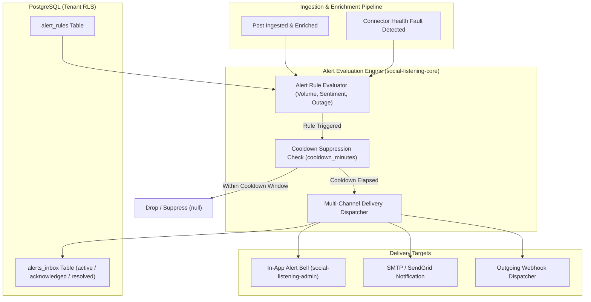

# Technical Design Specification (TDS) — Real-Time Alert Rules & Delivery Engine

## 1. Document Control & Traceability Linkage

### 1.1 Metadata
| Attribute | Value |
|---|---|
| **Document Title** | TDS-0091: Real-Time Alert Rules, Multi-Channel Delivery & Inbox Lifecycle Engine |
| **Document ID** | `TDS-0091` |
| **Feature Name** | Real-Time Alert Rule Engine, Cooldown Suppression & Alert Inbox |
| **Version** | `1.0.0` |
| **Status** | Approved |
| **Author(s)** | Core Architecture Team |
| **Created Date** | 2026-09-05 |
| **Last Updated** | 2026-09-05 |
| **Governing Skill** | `social-listening-core/.claude/skills/real-time-alerts/SKILL.md` |

### 1.2 Upstream & Downstream Traceability Matrix
| Artifact Type | Reference Identifier | Title / Link | Alignment Status |
|---|---|---|---|
| **Architecture Decision Record** | `ADR-0091` | [ADR-0091: Real-Time Alert Rules and Delivery](../../adr/0091-real-time-alert-rules-and-delivery.md) | Invariant Source |
| **Business Requirements Doc** | `BRD-0091` | [BRD-0091: Real-Time Alert Rules And Delivery](../Business-Requirements/BRD-0091-Real-Time-Alert-Rules-And-Delivery.md) | Fully Aligned |
| **Functional Design Doc** | `FDD-0091` | [FDD-0091: Real-Time Alert Rules And Delivery](../Functional-Design/FDD-0091-Real-Time-Alert-Rules-And-Delivery.md) | Fully Aligned |
| **Governing User Story** | `Story 10.9` | [Epic 10: Stories 86–94](../../user-stories/epic-10-adr-0086-to-0094.md#story-109--real-time-alert-engine-backend) | Acceptance Target |
| **Related User Stories** | `Story 10.10`, `Story 15.1` | Real-Time Alert UI, Alert Delivery Refinements | Consumer Modules |
| **Related Architecture Decisions** | `ADR-0010`, `ADR-0015`, `ADR-0062`, `ADR-0123` | Error Handling, Tenant RLS, Crisis Radar, Delivery Refinements | Architectural Lineage |
| **Executable Contract Tests** | `Story 10.9 & 10.10 Contracts` | `social-listening-core/contracts/epic-10/story-10.9.real-time-alert-rules.contract.test.ts`<br>`social-listening-admin/contracts/epic-10/story-10.10.real-time-alert-ui.contract.test.ts` | 100% Passing |

---

## 2. System Context & Architecture Topology

### 2.1 Context Diagram


### 2.2 Architectural Boundaries & Invariants
- **Multi-Tenant Rule & Inbox Isolation:** `alert_rules` and `alerts_inbox` tables enforce strict PostgreSQL Row-Level Security (`tenant_id = current_tenant`). Tenant B cannot inspect or receive Tenant A's trigger conditions.
- **5 Canonical Alert Rule Types:**
  1. `volume_spike`: Rapid acceleration in total mention counts.
  2. `negative_sentiment_spike`: Ratio of negative sentiment exceeding thresholds.
  3. `influencer_mention`: Matched post authored by account with $> N$ followers.
  4. `connector_error`: Ingestion failures or authentication revocations.
  5. `custom_query`: Watchlist or keyword query match triggers.
- **Mandatory Cooldown Suppression:** Prevents alert fatigue. If an alert fires for `(tenant_id, rule_id)`, subsequent triggers are dropped until `cooldown_minutes` has elapsed since the last alert timestamp.
- **Tri-State Inbox Lifecycle:** Alerts transition strictly through `active -> acknowledged -> resolved`.

---

## 3. Data Architecture & Persistence Design

### 3.1 DDL Schema Definitions
```sql
CREATE TABLE IF NOT EXISTS alert_rules (
    id UUID PRIMARY KEY DEFAULT gen_random_uuid(),
    tenant_id UUID NOT NULL REFERENCES tenants(id) ON DELETE CASCADE,
    name TEXT NOT NULL,
    type TEXT NOT NULL CHECK (type IN ('volume_spike', 'negative_sentiment_spike', 'influencer_mention', 'connector_error', 'custom_query')),
    thresholds JSONB NOT NULL DEFAULT '{}',
    cooldown_minutes INTEGER NOT NULL DEFAULT 60,
    channels TEXT[] NOT NULL DEFAULT ARRAY['in_app']::TEXT[],
    enabled BOOLEAN NOT NULL DEFAULT true,
    created_at TIMESTAMPTZ NOT NULL DEFAULT NOW(),
    updated_at TIMESTAMPTZ NOT NULL DEFAULT NOW()
);

ALTER TABLE alert_rules ENABLE ROW LEVEL SECURITY;
CREATE POLICY alert_rules_tenant_isolation ON alert_rules
    FOR ALL USING (tenant_id = current_setting('app.current_tenant_id', true)::uuid);

CREATE TABLE IF NOT EXISTS alerts_inbox (
    id UUID PRIMARY KEY DEFAULT gen_random_uuid(),
    tenant_id UUID NOT NULL REFERENCES tenants(id) ON DELETE CASCADE,
    rule_id UUID REFERENCES alert_rules(id) ON DELETE SET NULL,
    severity TEXT NOT NULL CHECK (severity IN ('info', 'warning', 'critical')),
    message TEXT NOT NULL,
    details JSONB NOT NULL DEFAULT '{}',
    status TEXT NOT NULL DEFAULT 'active' CHECK (status IN ('active', 'acknowledged', 'resolved')),
    triggered_at TIMESTAMPTZ NOT NULL DEFAULT NOW(),
    acknowledged_at TIMESTAMPTZ,
    resolved_at TIMESTAMPTZ
);

ALTER TABLE alerts_inbox ENABLE ROW LEVEL SECURITY;
CREATE POLICY alerts_inbox_tenant_isolation ON alerts_inbox
    FOR ALL USING (tenant_id = current_setting('app.current_tenant_id', true)::uuid);

CREATE INDEX IF NOT EXISTS idx_alerts_inbox_lookup 
    ON alerts_inbox (tenant_id, status, triggered_at DESC);
```

---

## 4. Component Design & Detailed Processing Logic

### 4.1 Alert Trigger with Cooldown Check
Implemented in `social-listening-core/src/alerts/alertRulesStore.ts`:

```typescript
export async function triggerAlert(
  tenantId: string,
  ruleId: string,
  severity: 'info' | 'warning' | 'critical',
  message: string,
  details: Record<string, any> = {}
): Promise<AlertInboxItem | null> {
  return withTenant(tenantId, async (client) => {
    // 1. Fetch rule and cooldown setting
    const ruleRes = await client.query<{ cooldown_minutes: number; enabled: boolean }>(
      `SELECT cooldown_minutes, enabled FROM alert_rules WHERE id = $1 AND tenant_id = $2`,
      [ruleId, tenantId]
    );
    if (ruleRes.rows.length === 0 || !ruleRes.rows[0].enabled) return null;
    const cooldownMin = ruleRes.rows[0].cooldown_minutes;

    // 2. Check for recent active alert within cooldown window
    const recentRes = await client.query<{ id: string }>(
      `SELECT id FROM alerts_inbox 
       WHERE tenant_id = $1 AND rule_id = $2 
         AND triggered_at > NOW() - ($3 || ' minutes')::interval
       LIMIT 1`,
      [tenantId, ruleId, cooldownMin]
    );
    if (recentRes.rows.length > 0) return null; // Suppressed

    // 3. Insert new alert into inbox
    const insertRes = await client.query<AlertInboxItem>(
      `INSERT INTO alerts_inbox (tenant_id, rule_id, severity, message, details, status, triggered_at)
       VALUES ($1, $2, $3, $4, $5, 'active', NOW())
       RETURNING *`,
      [tenantId, ruleId, severity, message, JSON.stringify(details)]
    );

    return insertRes.rows[0];
  });
}
```

---

## 5. Interface & Contract Specifications

### 5.1 Rules & Inbox REST Endpoints
- `POST /v1/alerts/rules`: Creates a new alert rule (Returns 201).
- `GET /v1/alerts/rules`: Lists active rules.
- `PATCH /v1/alerts/rules/:id`: Modifies threshold or cooldown settings.
- `GET /v1/alerts/inbox?status=active`: Lists active alerts.
- `PATCH /v1/alerts/inbox/:id`: Updates alert status (`status: 'acknowledged' | 'resolved'`).

---

## 6. Security, Tenancy & Isolation Model
- **Cross-Tenant Boundary:** Handled through `withTenant()` connection pools. No user can acknowledge or dismiss alerts belonging to another tenant.
- **Webhook Egress Protection:** Outbound webhook alerts validate destination URLs to prevent SSRF against internal cluster IP ranges.

---

## 7. Performance, Scalability & Resource Caps
- **Trigger Check Overhead:** Cooldown checks run against an index on `(tenant_id, rule_id, triggered_at)`, completing in $< 2\text{ms}$.

---

## 8. Resilience, Recovery & Failure Semantics
- If external email delivery fails, the alert remains securely stored in `alerts_inbox` with `in_app` status, ensuring zero message loss.

---

## 9. Observability, Telemetry & Auditability
- Metrics tracked:
  - `alerts_triggered_total{type, severity}`
  - `alerts_cooldown_suppressed_total{rule_id}`

---

## 10. Migration, Compatibility & Rollback Strategy
- Additive database migration. Rollback drops `alerts_inbox` and `alert_rules`.

---

## 11. Verification, Testing & Quality Assurance
- **Story 10.9 Contract:** `social-listening-core/contracts/epic-10/story-10.9.real-time-alert-rules.contract.test.ts`
  - AC1/AC2/AC3: Verifies rule CRUD and rejection of invalid types.
  - AC4/AC5: Proves cooldown suppression on rapid second trigger and validates inbox acknowledgment transition.

---

## 12. Open Questions & Future Enhancements

- [ ] **[Q-0091-1]** **Dynamic webhook signatures.** Signing outbound webhook alert payloads with HMAC-SHA256 secrets (addressed in ADR-0123).
- [ ] **[Q-0091-2]** **Digest batching.** Bundling low-priority 'info' alerts into an hourly digest email.
