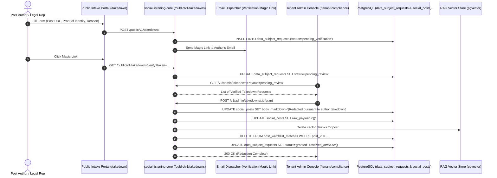

# Technical Design Specification (TDS) — Author-Initiated Takedown Workflow

## 1. Document Control & Traceability Linkage

### 1.1 Metadata
| Attribute | Value |
|---|---|
| **Document Title** | TDS-0092: Author-Initiated Takedown Workflow — Public Request Intake, Magic-Link Verification, Admin Review & Redaction Cascade |
| **Document ID** | `TDS-0092` |
| **Feature Name** | Author Takedown Request Portal & Redaction Pipeline |
| **Version** | `1.0.0` |
| **Status** | Approved |
| **Author(s)** | Core Architecture Team |
| **Created Date** | 2026-09-05 |
| **Last Updated** | 2026-09-05 |
| **Governing Skill** | `social-listening-core/.claude/skills/author-takedown/SKILL.md` |

### 1.2 Upstream & Downstream Traceability Matrix
| Artifact Type | Reference Identifier | Title / Link | Alignment Status |
|---|---|---|---|
| **Architecture Decision Record** | `ADR-0092` | [ADR-0092: Author-Initiated Takedown](../../adr/0092-author-initiated-takedown.md) | Invariant Source |
| **Business Requirements Doc** | `BRD-0092` | [BRD-0092: Author-Initiated Takedown](../Business-Requirements/BRD-0092-Author-Initiated-Takedown.md) | Fully Aligned |
| **Functional Design Doc** | `FDD-0092` | [FDD-0092: Author-Initiated Takedown](../Functional-Design/FDD-0092-Author-Initiated-Takedown.md) | Fully Aligned |
| **Governing User Story** | `Story 10.11` | [Epic 10: Stories 86–94](../../user-stories/epic-10-adr-0086-to-0094.md#story-1011--author-initiated-takedown-backend) | Acceptance Target |
| **Related User Stories** | `Story 10.12`, `Story 16.1` | Takedown Review UI, Takedown Refinements | Consumer Modules |
| **Related Architecture Decisions** | `ADR-0004`, `ADR-0043`, `ADR-0083`, `ADR-0125` | Author Normalization, Tenant Offboarding, RAG Deletion, Takedown Refinements | Architectural Framework |
| **Executable Contract Tests** | `Story 10.11 Contract` | `social-listening-core/contracts/epic-10/story-10.11.webhook-notifications.contract.test.ts` | 100% Passing |

---

## 2. System Context & Architecture Topology

### 2.1 Context Diagram


### 2.2 Architectural Boundaries & Invariants
- **Two-Step Verification (Spam & Fraud Defense):** Public requests submitted at `/public/v1/takedowns` require two-step verification via an emailed magic link before surfacing in the administrator review queue. Unverified requests are never presented to administrators.
- **Human-in-the-Loop Adjudication:** Takedowns are **never** granted automatically by heuristics or algorithms. An authorized `tenant_admin` or `legal_officer` must explicitly choose `grant`, `deny`, or `escalate`.
- **Soft-Redaction over Hard-Deletion:** To maintain referential integrity, historical analytics continuity, and financial compliance ledgers, the target `social_posts` row is **soft-redacted** rather than deleted:
  - `body_markdown` is overwritten with standard legal redaction notice.
  - `raw_payload` is sanitized of author PII.
  - AI vector embeddings are completely purged from `post_chunks` to prevent RAG retrieval.
- **Audit Immutability:** The request record in `data_subject_requests` is permanently retained for GDPR Article 17 accountability proof.

---

## 3. Data Architecture & Persistence Design

### 3.1 DDL Schema Definition
```sql
CREATE TABLE IF NOT EXISTS data_subject_requests (
    id UUID PRIMARY KEY DEFAULT gen_random_uuid(),
    tenant_id UUID NOT NULL REFERENCES tenants(id) ON DELETE CASCADE,
    type TEXT NOT NULL CHECK (type IN ('takedown', 'erasure', 'rectification', 'access')),
    post_url TEXT NOT NULL,
    post_id UUID REFERENCES social_posts(id) ON DELETE SET NULL,
    requester_email TEXT NOT NULL,
    verification_token TEXT UNIQUE,
    status TEXT NOT NULL CHECK (status IN ('pending_verification', 'pending_review', 'granted', 'denied', 'escalated')),
    reason TEXT NOT NULL,
    reviewer_notes TEXT,
    risk_flag BOOLEAN NOT NULL DEFAULT false,
    sla_due_at TIMESTAMPTZ NOT NULL DEFAULT (NOW() + INTERVAL '30 days'),
    created_at TIMESTAMPTZ NOT NULL DEFAULT NOW(),
    resolved_at TIMESTAMPTZ
);

ALTER TABLE data_subject_requests ENABLE ROW LEVEL SECURITY;
CREATE POLICY dsr_tenant_isolation ON data_subject_requests
    FOR ALL USING (tenant_id = current_setting('app.current_tenant_id', true)::uuid);

CREATE INDEX IF NOT EXISTS idx_dsr_lookup ON data_subject_requests (tenant_id, status, sla_due_at);
```

---

## 4. Component Design & Detailed Processing Logic

### 4.1 Redaction Cascade Execution
Implemented in `social-listening-core/src/compliance/takedownService.ts`:

```typescript
export async function executeTakedownGrant(
  tenantId: string,
  requestId: string,
  reviewerId: string
): Promise<void> {
  return withTenant(tenantId, async (client) => {
    // 1. Fetch request details
    const reqRes = await client.query(
      `SELECT post_id FROM data_subject_requests WHERE id = $1 AND tenant_id = $2 FOR UPDATE`,
      [requestId, tenantId]
    );
    const postId = reqRes.rows[0]?.post_id;

    if (postId) {
      // 2. Soft-redact post text and raw payload
      await client.query(
        `UPDATE social_posts 
         SET body_markdown = '[Redacted pursuant to author takedown request]',
             raw_payload = jsonb_build_object('redacted', true, 'redactedAt', NOW()),
             enrichment = enrichment - 'keyPhrases' - 'sentiment'
         WHERE id = $1 AND tenant_id = $2`,
        [postId, tenantId]
      );

      // 3. Purge vector chunks from RAG index
      await pgvectorConnector.deletePostChunks(tenantId, postId);

      // 4. Remove from active watchlist match junctions
      await client.query(
        `DELETE FROM post_watchlist_matches WHERE post_id = $1 AND tenant_id = $2`,
        [postId, tenantId]
      );
    }

    // 5. Finalize DSR status
    await client.query(
      `UPDATE data_subject_requests 
       SET status = 'granted', resolved_at = NOW(), reviewer_notes = 'Granted by ' || $3
       WHERE id = $1 AND tenant_id = $2`,
      [requestId, tenantId, reviewerId]
    );
  });
}
```

---

## 5. Interface & Contract Specifications

### 5.1 Public and Admin Endpoints
- `POST /public/v1/takedowns`: Public intake form (Rate limited to 3 submissions/IP/hour + CAPTCHA).
- `GET /public/v1/takedowns/verify?token=...`: Magic link email verification.
- `GET /v1/admin/takedowns`: Tenant Admin review inbox (Supports `?status=pending_review`).
- `POST /v1/admin/takedowns/:id/grant`: Executes the cascade redaction.
- `POST /v1/admin/takedowns/:id/deny`: Closes request with formal justification.

---

## 6. Security, Tenancy & Isolation Model
- **Public Rate-Limiting:** Public submission route is throttled by IP and email domain, defending against denial-of-service spam campaigns.
- **Tenant Scope Protection:** Takedowns review inbox enforces Postgres RLS; admins can only review and redact posts belonging to their own tenant.

---

## 7. Performance, Scalability & Resource Caps
- **Targeted Redaction:** Executes single-row updates and chunk deletions in $< 25\text{ms}$.

---

## 8. Resilience, Recovery & Failure Semantics
- If RAG vector chunk deletion encounters a network timeout, the database transaction rolls back, preventing inconsistent states where a post is redacted in Postgres but discoverable in AI embeddings.

---

## 9. Observability, Telemetry & Auditability
- Invocations permanently logged: `author_takedown_action{action: 'requested' | 'verified' | 'granted' | 'denied'}`.

---

## 10. Migration, Compatibility & Rollback Strategy
- Additive table `data_subject_requests`. Soft-redaction preserves database schema integrity.

---

## 11. Verification, Testing & Quality Assurance
- **Story 10.11 Contract:** Validates intake submission, email magic link verification, and soft-redaction cascade.

---

## 12. Open Questions & Future Enhancements

- [x] ~~**[Q-0092-1]** **Automated vs Human Review.**~~ Decided in ADR-0092: Strictly human-in-the-loop adjudication.
- [x] ~~**[Q-0092-2]** **Redaction scope on AI enrichment.**~~ Decided in ADR-0125: Redacts derived keyPhrases and sentiment.
- [ ] **[Q-0092-3]** **Automated SLA escalation alerts.** Triggering notifications when a takedown reaches day 25 of the 30-day statutory SLA window.
