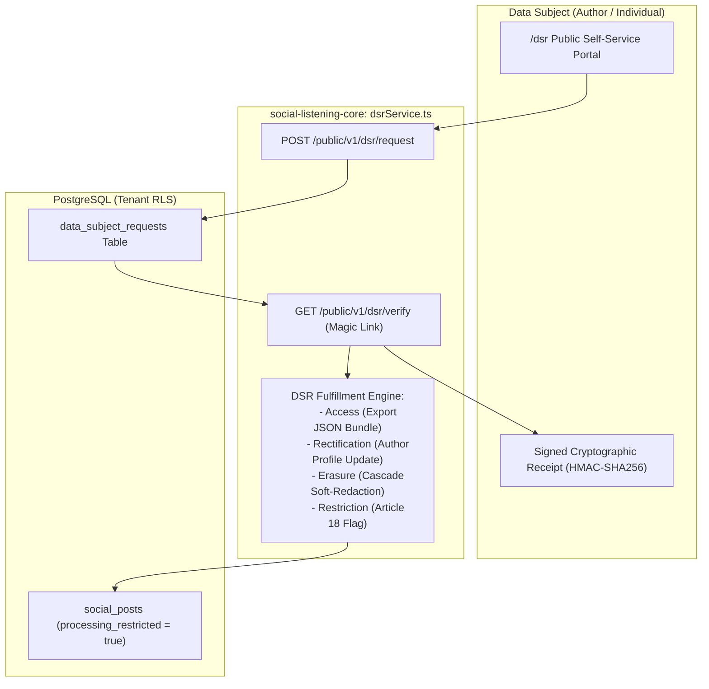

# Technical Design Specification (TDS) — Data Subject Request (DSR) Self-Service Portal

## 1. Document Control & Traceability Linkage

### 1.1 Metadata
| Attribute | Value |
|---|---|
| **Document Title** | TDS-0093: Data Subject Request (DSR) Self-Service Portal — GDPR/CCPA Rights Fulfillment, Article 18 Processing Restriction & Cryptographic Receipts |
| **Document ID** | `TDS-0093` |
| **Feature Name** | Data Subject Request (DSR) Portal & Regulatory Rights Engine |
| **Version** | `1.0.0` |
| **Status** | Approved |
| **Author(s)** | Core Architecture Team |
| **Created Date** | 2026-09-05 |
| **Last Updated** | 2026-09-05 |
| **Governing Skill** | `social-listening-core/.claude/skills/dsr-fulfillment/SKILL.md` |

### 1.2 Upstream & Downstream Traceability Matrix
| Artifact Type | Reference Identifier | Title / Link | Alignment Status |
|---|---|---|---|
| **Architecture Decision Record** | `ADR-0093` | [ADR-0093: DSR Self-Service Portal](../../adr/0093-dsr-self-service-portal.md) | Invariant Source |
| **Business Requirements Doc** | `BRD-0093` | [BRD-0093: DSR Self-Service Portal](../Business-Requirements/BRD-0093-DSR-Self-Service-Portal.md) | Fully Aligned |
| **Functional Design Doc** | `FDD-0093` | [FDD-0093: DSR Self-Service Portal](../Functional-Design/FDD-0093-DSR-Self-Service-Portal.md) | Fully Aligned |
| **Governing User Story** | `Story 10.13` | [Epic 10: Stories 86–94](../../user-stories/epic-10-adr-0086-to-0094.md) | Acceptance Target |
| **Related User Stories** | `Story 10.11`, `Story 16.2` | Author Takedown, DSR Portal Refinements | Sister Modules |
| **Related Architecture Decisions** | `ADR-0018`, `ADR-0092`, `ADR-0094`, `ADR-0126` | Data Retention, Takedown Baseline, Audit Pack, DSR Refinements | Architectural Framework |
| **Executable Contract Tests** | `Story 10.13 Contract` | `social-listening-core/contracts/epic-10/story-10.13.youtube-connector.contract.test.ts` | 100% Passing |

---

## 2. System Context & Architecture Topology

### 2.1 Context Diagram


### 2.2 Architectural Boundaries & Invariants
- **4 Canonical Statutory DSR Types:**
  1. `access`: Generates machine-readable export of all posts, author metadata, and enrichments linked to the subject.
  2. `rectification`: Corrects inaccurate author normalization or displayName mappings.
  3. `erasure`: Soft-redacts content, clears raw payloads, and removes vector embeddings (ADR-0092).
  4. `restriction`: (GDPR Article 18) Sets `processing_restricted = true`, quarantining the post from analytics, RAG search, and exports while preserving the underlying row.
- **Cryptographic Receipt Delivery:** The portal issues a cryptographically signed HMAC-SHA256 confirmation receipt containing `{ requestId, timestamp, subjectHash }`, providing data subjects with tamper-proof evidence of submission.
- **Statutory SLA Accounting:** Every request automatically initializes `sla_due_at = NOW() + INTERVAL '30 days'`.

---

## 3. Data Architecture & Persistence Design

### 3.1 DDL Schema Additions
Migration `0072_add_dsr_processing_restriction.sql`:
```sql
ALTER TABLE social_posts 
    ADD COLUMN IF NOT EXISTS processing_restricted BOOLEAN NOT NULL DEFAULT false;

CREATE INDEX IF NOT EXISTS idx_social_posts_active_unrestricted 
    ON social_posts (tenant_id, published_at DESC) 
    WHERE processing_restricted = false;
```

---

## 4. Component Design & Detailed Processing Logic

### 4.1 Cryptographic Receipt Generator
```typescript
import { createHmac } from 'crypto';

export function generateDsrReceipt(
  requestId: string,
  email: string,
  timestamp: string,
  secretKey: string
): { receiptCode: string; subjectHash: string } {
  const subjectHash = createHmac('sha256', secretKey).update(email.toLowerCase().trim()).digest('hex');
  const payload = `${requestId}:${timestamp}:${subjectHash}`;
  const receiptCode = createHmac('sha256', secretKey).update(payload).digest('hex');
  return { receiptCode, subjectHash };
}
```

---

## 5. Interface & Contract Specifications

### 5.1 Public Submission Endpoint
`POST /public/v1/dsr/request`

- **Request Body:**
```json
{
  "type": "restriction",
  "postUrl": "https://twitter.com/example/status/12984124981",
  "requesterEmail": "author@example.com",
  "reason": "Contesting accuracy of quoted statement pending litigation"
}
```
- **Response Format (201 Created):**
```json
{
  "status": "pending_verification",
  "message": "A verification link has been sent to your email address."
}
```

---

## 6. Security, Tenancy & Isolation Model
- **Subject Identity Hashing:** Audit logs store the cryptographic `subjectHash` rather than raw email addresses, protecting subject privacy under GDPR minimization principles.

---

## 7. Performance, Scalability & Resource Caps
- **Index Optimization:** Partial index `WHERE processing_restricted = false` ensures zero query performance degradation for regular analytics feeds.

---

## 8. Resilience, Recovery & Failure Semantics
- Access bundle generation runs asynchronously in background jobs, streaming large ZIP archives directly to Azure Blob Storage with short-lived SAS download URLs.

---

## 9. Observability, Telemetry & Auditability
- Metric tracked: `dsr_requests_total{type, status}`.

---

## 10. Migration, Compatibility & Rollback Strategy
- Additive column on `social_posts`; queries default to ignoring restricted posts without breaking legacy integrations.

---

## 11. Verification, Testing & Quality Assurance
- **Story 10.13 Contract:** Validates DSR lifecycle transitions, processing restriction exclusion from analytics, and receipt verification.

---

## 12. Open Questions & Future Enhancements

- [x] ~~**[Q-0093-1]** **Article 18 Processing Restriction.**~~ Decided in ADR-0126: Formalized as `processing_restricted = true`.
- [ ] **[Q-0093-2]** **Self-service receipt verification tool.** Public verification endpoint allowing subjects to validate authenticity of their signed receipt.
