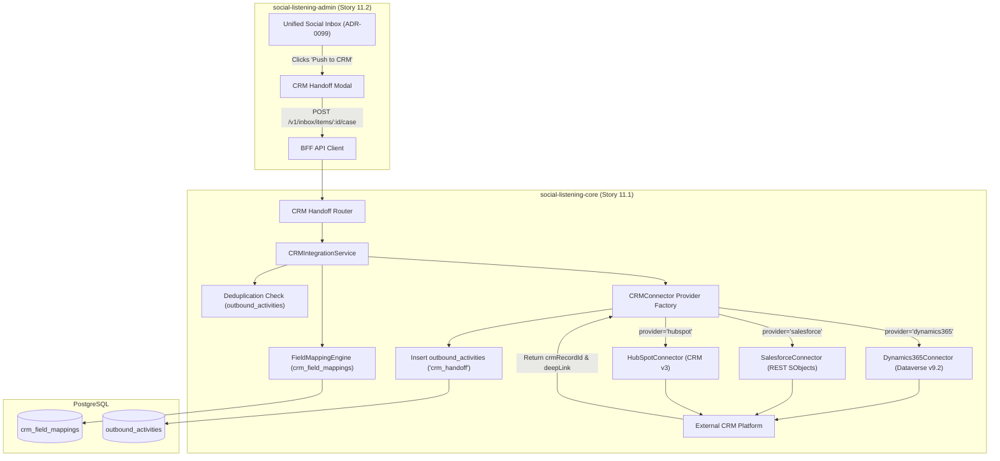
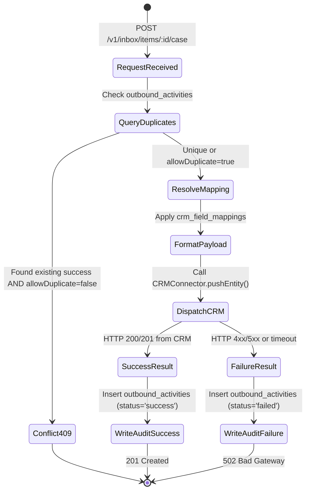

# TDS-0095: Case and Lead Handoff to CRM (Dynamics 365, Salesforce, HubSpot)

**Status:** Approved  
**Date:** 2026-09-05  
**Governing ADR:** [ADR-0095](../../adr/0095-case-handoff-to-crm.md)  
**Related Epics/Stories:** [Epic 11 / Story 11.1, 11.2](../../user-stories/epic-11-adr-0095-to-0100.md), [Epic 10 / Story 10.1](../../user-stories/epic-10-adr-0086-to-0094.md), [Epic 13 / Story 13.13, 13.14](../../user-stories/epic-13-adr-0109-to-0117.md)  
**Target Repositories:** `social-listening-core`, `social-listening-admin`  
**Contract Test Citations:**  
- `social-listening-core/contracts/epic-11/story-11.1.crm-connector-handoff.contract.test.ts`  
- `social-listening-admin/contracts/epic-11/story-11.2.case-handoff-crm-ui.contract.test.ts`  

---

## 1. Architectural Context & Problem Statement

When social listening detects customer support crises, severe service disruptions, or high-intent commercial opportunities, care agents (`Tenant-Social-Care-Agent`) and social sellers (`Social-Selling-Strategist`) must escalate these events into external enterprise CRM and ticketing systems.

Direct, ad-hoc integrations with external CRMs create significant architectural maintenance and compliance risks:
1. **API & Data Model Divergence:** Enterprise organizations utilize heterogeneous CRM systems—Microsoft Dynamics 365 (Dataverse Web API v9.2), Salesforce (REST API / SObjects), and HubSpot (CRM v3 API). Each uses radically different data schemas, object hierarchies, and authentication flows.
2. **Duplicate Record Creation:** Without idempotent safeguards, multiple agents triaging the same viral post or prospect can inadvertently flood the CRM with duplicate tickets and conflicting leads.
3. **Traceability Deficits:** Inbound support tickets and sales leads must maintain deep links back to the originating social post and vice-versa, with immutable auditing in `outbound_activities`.

This specification formalizes:
1. The `CRMConnector` provider abstraction supporting **Microsoft Dynamics 365**, **Salesforce**, and **HubSpot**.
2. Standardized entity mappings across generic types (`lead`, `opportunity`, `support`).
3. Tenant-configurable field mapping storage (`crm_field_mappings`).
4. Deduplication guards leveraging `outbound_activities` (`activity_type = 'crm_handoff'`).
5. Core API endpoints and the slide-over CRM escalation modal in `social-listening-admin`.



---

## 2. Governing ADRs & Decision Log Reference

- [ADR-0095: Case and Lead Handoff to CRM (Dynamics 365, Salesforce, HubSpot)](../../adr/0095-case-handoff-to-crm.md) — Authorizes `CRMConnector` interface, provider matrix, and `crm_field_mappings` schema.
- [ADR-0051: Connector Activation and Credential Storage](../../adr/0051-connector-activation-and-credential-storage.md) — Manages OAuth2 tokens and Entra ID service principals for CRM connectivity.
- [ADR-0073: Outbound Reply to Ingested Posts via Platform APIs](../../adr/0073-outbound-reply-to-ingested-posts.md) — Establishes `outbound_activities` audit framework.
- [ADR-0086: Prospecting List Model and Sharing](../../adr/0086-prospecting-list-model-and-sharing.md) — Source for author-centric CRM prospecting pushes.
- [ADR-0099: Unified Social Inbox and Reply](../../adr/0099-unified-social-inbox-and-reply.md) — Primary operational trigger surface for support case escalations.
- [ADR-0117: Prospecting List Export and CRM Push](../../adr/0117-prospecting-list-export-and-crm-push.md) — Batch export and CRM push extensions.

---

## 3. Scope, Precedence & Anti-Goals

### In Scope
- Canonical `CRMConnector` interface supporting three tier-1 providers: Microsoft Dynamics 365, Salesforce, and HubSpot.
- Standardized mapping of generic types (`lead`, `opportunity`, `support`) to native CRM objects.
- Tenant-scoped custom field translation via `crm_field_mappings`.
- Fail-closed deduplication returning `409 Conflict` if the post or prospect was already pushed by the tenant, unless `allowDuplicate: true` is passed.
- Recording external CRM record ID and deep-link permalink in `outbound_activities`.
- Administrative handoff modal in `social-listening-admin` with queue/assignee selection.

### Precedence Invariant
$$\text{Tenant CRM Credential Isolation} \land \text{One-Way Mutation Guard}$$
All CRM operations run exclusively within the tenant's authenticated OAuth/service principal context. v1 pushes data one-way from SocialEngage to CRM without inbound state reconciliation.

### Anti-Goals
- Two-way real-time webhook sync from CRM back to SocialEngage in v1.
- Generic ETL or mass historical data backfills into CRM.

---

## 4. Data Architecture & Storage Schema

```sql
-- Migration: 0095_create_crm_field_mappings.sql

CREATE TABLE IF NOT EXISTS crm_field_mappings (
    id UUID PRIMARY KEY DEFAULT gen_random_uuid(),
    tenant_id UUID NOT NULL REFERENCES tenants(id) ON DELETE CASCADE,
    crm_connector_id TEXT NOT NULL,
    entity_type TEXT NOT NULL CHECK (entity_type IN ('lead', 'opportunity', 'support')),
    source_field TEXT NOT NULL,        -- e.g. 'authorName', 'postExcerpt', 'notes'
    target_field TEXT NOT NULL,        -- e.g. 'subject' (Dynamics), 'Description' (Salesforce)
    is_required BOOLEAN NOT NULL DEFAULT FALSE,
    default_value TEXT,
    created_at TIMESTAMPTZ NOT NULL DEFAULT NOW(),
    updated_at TIMESTAMPTZ NOT NULL DEFAULT NOW(),
    CONSTRAINT uq_crm_field_mapping UNIQUE (tenant_id, crm_connector_id, entity_type, source_field)
);

CREATE INDEX IF NOT EXISTS idx_crm_field_mappings_lookup 
    ON crm_field_mappings(tenant_id, crm_connector_id, entity_type);

-- Row Level Security
ALTER TABLE crm_field_mappings ENABLE ROW LEVEL SECURITY;

CREATE POLICY crm_field_mappings_tenant_isolation ON crm_field_mappings
    AS RESTRICTIVE
    USING (tenant_id = NULLIF(current_setting('app.current_tenant_id', true), '')::uuid)
    WITH CHECK (tenant_id = NULLIF(current_setting('app.current_tenant_id', true), '')::uuid);
```

### Provider Entity Mapping Matrix

| Generic Type | Microsoft Dynamics 365 (Dataverse v9.2) | Salesforce | HubSpot (CRM v3) |
| :--- | :--- | :--- | :--- |
| **`lead`** | `leads` entity (`subject`, `description`, `lastname`, `leadsourcecode`) | `Lead` (`LastName`, `Company`, `Description`, `LeadSource`) | `contacts` + `deals` (`leadstatus`, `dealname`) |
| **`opportunity`** | `opportunities` entity (`name`, `description`, `customerid_contact@odata.bind`) | `Opportunity` (`Name`, `StageName`, `CloseDate`, `Description`) | `deals` (`dealname`, `pipeline`, `amount`) |
| **`support`** | `incidents` entity (`title`, `description`, `casetypecode`) | `Case` (`Subject`, `Description`, `Origin`, `Priority`) | `tickets` (`hs_ticket_subject`, `content`, `hs_pipeline_stage`) |

---

## 5. Component & Interface Contracts

### 5.1 CRM Connector Interface (`social-listening-core`)

```typescript
export type CRMProviderType = 'dynamics365' | 'salesforce' | 'hubspot';
export type CRMEntityType = 'lead' | 'opportunity' | 'support';

export interface CRMCasePayload {
  tenantId: string;
  authorId: string;
  authorName: string;
  authorHandle?: string;
  authorPublicUrl?: string;
  postId?: string;
  postExcerpt?: string;
  platformId: string;
  publishedAt?: string;
  sentiment?: string;
  watchlistId?: string;
  entityType: CRMEntityType;
  assignedTo?: string; // External Queue or User GUID
  notes?: string;
  customFields?: Record<string, unknown>;
}

export interface CRMPushResult {
  crmRecordId: string;
  crmRecordUrl: string;
  entityType: string;
  rawResponse?: Record<string, unknown>;
}

export interface CRMConnector {
  readonly id: string;
  readonly provider: CRMProviderType;

  pushEntity(
    ctx: ConnectorContext,
    payload: CRMCasePayload
  ): Promise<CRMPushResult>;

  validateCredentials(ctx: ConnectorContext): Promise<boolean>;
  status(ctx: ConnectorContext): Promise<ConnectorStatus>;
}
```

### 5.2 API Route Specification

#### `POST /v1/inbox/items/:id/case`
- **Authentication:** JWT Bearer with scope `crm:write` or role `Tenant-Admin`, `Tenant-Social-Care-Agent`, `Social-Selling-Strategist`.
- **Headers:** `X-Tenant-ID: <uuid>`, `Idempotency-Key: <string>`

**Request Body:**
```json
{
  "crmConnectorId": "dynamics-production",
  "entityType": "support",
  "assignedTo": "tier2-support-queue",
  "notes": "Customer experiencing repeated payment gateway failures on checkout.",
  "customFields": {
    "severity": "P1"
  },
  "allowDuplicate": false
}
```

**Response (201 Created):**
```json
{
  "outboundActivityId": "6c9e6679-7425-40de-944b-e07fc1f90ae9",
  "crmRecordId": "a827e891-12ab-49cd-90ef-182910293847",
  "crmRecordUrl": "https://tenantorg.crm.dynamics.com/main.aspx?etn=incident&id={a827e891-12ab-49cd-90ef-182910293847}&pagetype=entityrecord",
  "status": "success",
  "createdAt": "2026-09-05T16:00:00.000Z"
}
```

**Response (409 Conflict - Duplicate Item):**
```json
{
  "error": "Item already pushed to CRM",
  "crmRecordId": "a827e891-12ab-49cd-90ef-182910293847",
  "crmRecordUrl": "https://tenantorg.crm.dynamics.com/main.aspx?etn=incident&id={a827e891-12ab-49cd-90ef-182910293847}&pagetype=entityrecord",
  "outboundActivityId": "6c9e6679-7425-40de-944b-e07fc1f90ae9"
}
```

---

## 6. State Machine & Lifecycle Transitions



---

## 7. Security, Tenant Isolation & Authentication

1. **OAuth2 / Entra ID Tokens:** Credentials for Dynamics 365 (`https://<org>.crm.dynamics.com/.default`), Salesforce, and HubSpot are stored in `platform_credentials` encrypted with tenant-specific keys.
2. **Strict RLS on Mappings:** `crm_field_mappings` enforces database-level tenant isolation.
3. **Audit Trail Immutability:** Outbound activities (`activity_type = 'crm_handoff'`) track which agent initiated the handoff, the exact payload, the CRM record ID, and the generated canonical deep link.

---

## 8. Performance, Scalability & Resource Boundaries

1. **Deduplication Query:** Uses the partial index `idx_outbound_activities_dedup` on `(tenant_id, post_id, activity_type)` executing in `< 5ms`.
2. **Timeout Boundaries:** CRM REST endpoints enforce an 8-second HTTP timeout with exponential backoff on transient network faults.
3. **Rate Gate Isolation:** Pushes are gated by `(tenantId, providerId, 'crm_handoff')` preventing CRM API quota depletion.

---

## 9. Error Handling, Retries & Fallback Strategies

| Error Condition | Response Code | System Action |
|---|---|---|
| CRM token expired | `401 Unauthorized` | Triggers token refresh flow via ADR-0051; returns 502 if refresh fails |
| CRM validation error (missing required field) | `422 Unprocessable Entity` | Formats validation error with failing target field name |
| Duplicate handoff detected | `409 Conflict` | Returns existing CRM record ID and deep link |
| CRM system outage / 5xx | `502 Bad Gateway` | Writes `outbound_activities` with `status = 'failed'` enabling agent retry |

---

## 10. Observability, Telemetry & Audit Trail

- **Structured Log Entry:**
  ```json
  {
    "event": "crm_case_created",
    "tenantId": "f47ac10b-58cc-4372-a567-0e02b2c3d479",
    "provider": "dynamics365",
    "entityType": "support",
    "postId": "7c9e6679-7425-40de-944b-e07fc1f90ae7",
    "crmRecordId": "a827e891-12ab-49cd-90ef-182910293847",
    "durationMs": 490.2
  }
  ```
- **Prometheus Metrics:**
  - `crm_handoffs_total{tenant_id, provider, entity_type, status}` — Counter of all handoff attempts.
  - `crm_handoff_latency_seconds{provider}` — Latency histogram per CRM provider.

---

## 11. Migration & Backward Compatibility Strategy

- **Schema Setup:** `0095_create_crm_field_mappings.sql` establishes mapping structures without modifying core post or author tables.
- **Interoperability:** Shared by both individual inbox escalations (ADR-0099) and prospecting list batch exports (ADR-0117).

---

## 12. Executable Contract Test Citations & Verification Matrix

### 12.1 Contract Test Specifications
1. `social-listening-core/contracts/epic-11/story-11.1.crm-connector-handoff.contract.test.ts`:
   - `test('maps generic support case payload to Microsoft Dynamics 365 incident entity')`
   - `test('maps generic lead payload to Salesforce Lead SObject')`
   - `test('maps generic opportunity payload to HubSpot deal')`
   - `test('enforces deduplication returning 409 Conflict when post was already pushed')`
   - `test('bypasses deduplication when allowDuplicate is true')`
   - `test('writes success row to outbound_activities with external_id and external_url')`
2. `social-listening-admin/contracts/epic-11/story-11.2.case-handoff-crm-ui.contract.test.ts`:
   - `test('renders CRM escalation modal with connector and entity type dropdowns')`
   - `test('displays direct link to created CRM record upon successful handoff')`
   - `test('handles 409 Conflict by displaying existing CRM ticket link')`

### 12.2 Open Questions

- [x] ~~**[Q-0095-1]** Where should CRM handoffs be triggered?~~  
  *Decision:* All three primary surfaces: Unified Inbox post detail (Story 11.2), Post Detail drawer (Story 6.38), and Prospecting List detail (ADR-0117 / Story 13.14).
- [x] ~~**[Q-0095-2]** How are duplicate pushes handled?~~  
  *Decision:* Fail-closed with `409 Conflict`, returning the existing CRM record ID and permalink unless explicitly overridden by `allowDuplicate: true`.
