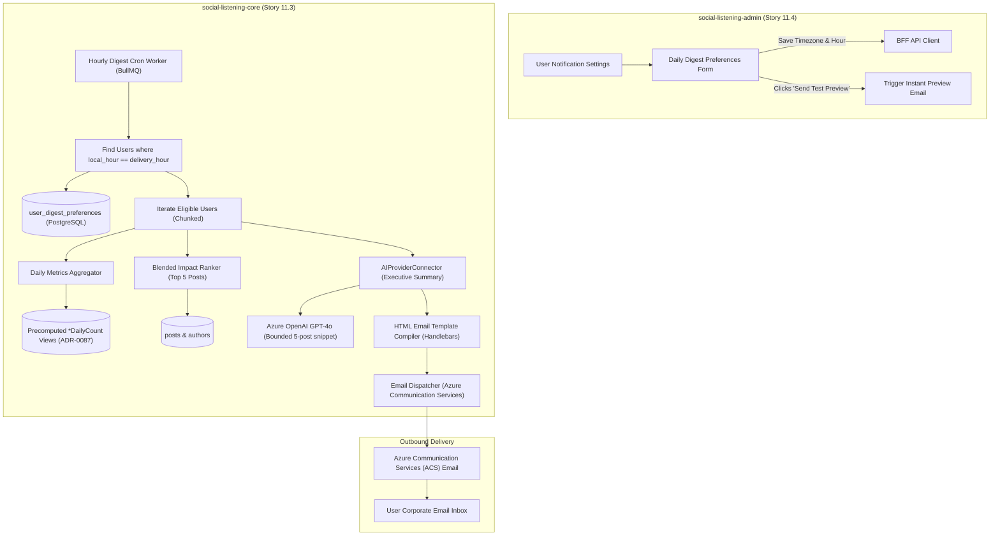
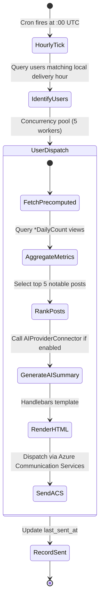

# TDS-0096: Daily Digest Email (Timezone-Aware, Precomputed Views & AI Summary)

**Status:** Approved  
**Date:** 2026-09-05  
**Governing ADR:** [ADR-0096](../../adr/0096-daily-digest-email.md)  
**Related Epics/Stories:** [Epic 11 / Story 11.3, 11.4](../../user-stories/epic-11-adr-0095-to-0100.md), [Epic 10 / Story 10.3](../../user-stories/epic-10-adr-0086-to-0094.md), [Epic 3 / Story 3.9](../../user-stories/epic-3-data-model-storage-and-archival.md)  
**Target Repositories:** `social-listening-core`, `social-listening-admin`  
**Contract Test Citations:**  
- `social-listening-core/contracts/epic-11/story-11.3.daily-digest-email.contract.test.ts`  
- `social-listening-admin/contracts/epic-11/story-11.4.daily-digest-ui.contract.test.ts`  

---

## 1. Architectural Context & Problem Statement

Executives (`Tenant-Executive`) and marketing directors (`Tenant-Brand-Reputation-Manager`) cannot continuously monitor operational listening feeds throughout the day. Instead, they require a clean, morning executive briefing delivered directly to their email inbox summarizing the preceding 24 hours of brand mentions, sentiment shifts, critical anomalies, and top influencer discussions.

Generating and delivering tens of thousands of daily digests introduces severe scaling and cost challenges:
1. **Timezone Alignment:** Delivering a morning digest at 08:00 local time across global users requires an hourly scheduler that computes timezone-shifted rolling 24-hour lookbacks.
2. **Database Load Protection:** Scanning millions of raw `social_posts` across all tenants during peak morning hours would degrade ingestion pipelines.
3. **LLM Cost Containment:** Generating bespoke AI summaries for each user can rapidly deplete token budgets without strict caching, context bounding, and execution caps.
4. **Email Deliverability & Compliance:** Automated digests must conform strictly to CAN-SPAM and RFC-8058 (`List-Unsubscribe`) standards to maintain domain reputation.

This specification formalizes:
1. The `user_digest_preferences` data model with user-bound ownership and tenant RLS.
2. An hourly timezone-aware scheduler worker leveraging precomputed analytics tables (`*DailyCount` from ADR-0087).
3. Deterministic blended impact scoring for notable post selection (ADR-0049).
4. Bounded AI executive summary generation and Azure Communication Services (ACS) email dispatch.
5. User preference settings and live test preview in `social-listening-admin`.



---

## 2. Governing ADRs & Decision Log Reference

- [ADR-0096: Daily Digest Email (Timezone-Aware, Precomputed Views & AI Summary)](../../adr/0096-daily-digest-email.md) — Authorizes preferences schema, timezone scheduler, precomputed views aggregation, and AI summary bounds.
- [ADR-0038: AI Enrichment Provider Selection](../../adr/0038-ai-enrichment-provider-selection.md) — AI connector provider contracts.
- [ADR-0049: Point-in-Time Author Follower Count Snapshot on SocialPost](../../adr/0049-point-in-time-author-follower-count-on-social-post.md) — Source for author follower weighting in impact ranking.
- [ADR-0087: Preconfigured Analytics Views](../../adr/0087-preconfigured-analytics-views.md) — Precomputed daily count aggregation source.
- [ADR-0091: Real-Time Alert Rules and Delivery](../../adr/0091-real-time-alert-rules-and-delivery.md) — Email delivery channel infrastructure.

---

## 3. Scope, Precedence & Anti-Goals

### In Scope
- Table `user_digest_preferences` tracking delivery hour, timezone, subscribed watchlists, and AI summary toggle.
- Hourly cron scheduler running at `:00` UTC identifying matching users via SQL timezone conversion:
  $$\text{EXTRACT(HOUR FROM NOW() AT TIME ZONE timezone)} = \text{delivery\_hour\_local}$$
- Aggregation against precomputed daily tables (`TopicDailyCount`, `SourceDailyCount`, `SentimentDailyCount`, `WatchlistDailyCount`).
- Deterministic impact score ranking top 5 notable posts:
  $$\text{Score} = \text{followers}^{0.6} \times \text{engagements} \times (1.0 + |\text{sentiment\_score}|)$$
- Bounded AI executive summary generation (maximum 1 LLM call per user per day; 500 token ceiling).
- CAN-SPAM compliant unsubscribe links with one-click RFC 8058 headers.
- User settings UI with test preview trigger.

### Precedence Invariant
$$\text{Precomputed Views Read} \land \text{Hard LLM Token Bound}$$
Digest generation must never perform full scans of `social_posts`. Volume and sentiment metrics are resolved from `*DailyCount` tables. AI summaries are strictly bounded to the top 5 notable posts.

### Anti-Goals
- Real-time notification blasts (scoped to consolidated 24-hour digests).
- Arbitrary custom cron schedules per user (delivery occurs on the hour: 06:00, 07:00, 08:00, 09:00).

---

## 4. Data Architecture & Storage Schema

```sql
-- Migration: 0096_create_user_digest_preferences.sql

CREATE TABLE IF NOT EXISTS user_digest_preferences (
    id UUID PRIMARY KEY DEFAULT gen_random_uuid(),
    tenant_id UUID NOT NULL REFERENCES tenants(id) ON DELETE CASCADE,
    user_id UUID NOT NULL REFERENCES users(id) ON DELETE CASCADE,
    enabled BOOLEAN NOT NULL DEFAULT TRUE,
    delivery_hour_local INT NOT NULL DEFAULT 8 CHECK (delivery_hour_local BETWEEN 0 AND 23),
    timezone TEXT NOT NULL DEFAULT 'UTC',
    watchlist_ids UUID[] NOT NULL DEFAULT '{}', -- Empty array = all accessible watchlists
    include_ai_summary BOOLEAN NOT NULL DEFAULT TRUE,
    last_sent_at TIMESTAMPTZ,
    created_at TIMESTAMPTZ NOT NULL DEFAULT NOW(),
    updated_at TIMESTAMPTZ NOT NULL DEFAULT NOW(),
    CONSTRAINT uq_user_digest_preference UNIQUE (tenant_id, user_id)
);

-- Index for hourly scheduler dispatch
CREATE INDEX IF NOT EXISTS idx_digest_preferences_schedule 
    ON user_digest_preferences(enabled, delivery_hour_local, timezone) 
    WHERE enabled = TRUE;

-- Row Level Security
ALTER TABLE user_digest_preferences ENABLE ROW LEVEL SECURITY;

CREATE POLICY user_digest_preferences_tenant_isolation ON user_digest_preferences
    AS RESTRICTIVE
    USING (tenant_id = NULLIF(current_setting('app.current_tenant_id', true), '')::uuid)
    WITH CHECK (tenant_id = NULLIF(current_setting('app.current_tenant_id', true), '')::uuid);
```

---

## 5. Component & Interface Contracts

### 5.1 Digest Preference Types (`social-listening-core`)

```typescript
export interface UserDigestPreferences {
  enabled: boolean;
  deliveryHourLocal: number; // 0 to 23
  timezone: string;          // e.g. 'America/New_York', 'Europe/Amsterdam'
  watchlistIds: string[];    // Empty array denotes all watchlists
  includeAiSummary: boolean;
  lastSentAt: string | null;
}

export interface DigestPreviewPayload {
  recipientEmail: string;
  digestDate: string;
  metrics: {
    totalMentions: number;
    sentimentScore: number;
    volumeChangePercent: number;
  };
  aiSummary: string;
  notablePosts: Array<{
    authorHandle: string;
    platform: string;
    content: string;
    sentiment: string;
    engagements: number;
    url: string;
  }>;
}
```

### 5.2 API Route Specification

#### `GET /v1/users/me/digest-preferences`
Returns current user's digest subscription configuration.

#### `PATCH /v1/users/me/digest-preferences`
Updates user delivery hour, timezone, selected watchlists, or enabled status.

#### `POST /v1/users/me/digest-preferences/test-preview`
Triggers an immediate test email containing real 24-hour digest data to the caller's email.

---

## 6. State Machine & Lifecycle Transitions



---

## 7. Security, Tenant Isolation & Authentication

1. **User Ownership Boundary:** Users can only query and mutate their own preferences (`user_id = app.user_id`).
2. **Watchlist Visibility Scoping:** The digest engine checks watchlist access permissions per user, ensuring private teammate watchlists are never leaked into another user's digest.
3. **One-Click Unsubscribe:** Generates signed HMAC unsubscribe tokens, allowing users to opt-out via `List-Unsubscribe` headers without requiring interactive browser login.

---

## 8. Performance, Scalability & Resource Boundaries

1. **Precomputed Rollups:** Using `*DailyCount` views avoids post table scans, reducing aggregation database query time from seconds to `< 25ms` per user.
2. **Batch Dispatch Throttling:** The hourly worker processes eligible users in chunks of 50 with connection pooling to prevent overwhelming the SMTP gateway.

---

## 9. Error Handling, Retries & Fallback Strategies

| Failure Scenario | Resolution |
|---|---|
| AI summary timeout ($> 4$s) | Digest sends with metric charts and notable posts, omitting the AI narrative section |
| Invalid user timezone string | Falls back to 'UTC' delivery schedule and logs warning |
| Email bounced by recipient server | Logs delivery failure; disables subscription after 3 consecutive hard bounces |

---

## 10. Observability, Telemetry & Audit Trail

- **Telemetry Metrics:**
  - `digest_emails_sent_total{tenant_id, status}` — Counter of delivered digests.
  - `digest_generation_duration_seconds` — Latency of end-to-end digest compilation.
  - `digest_ai_summaries_generated_total{status}` — Token consumption tracking.

---

## 11. Migration & Backward Compatibility Strategy

- **Schema Migration:** Creates `user_digest_preferences` table.
- **Default Enablement:** Enabled by default with delivery set to 08:00 local time upon user invitation.

---

## 12. Executable Contract Test Citations & Verification Matrix

### 12.1 Contract Test Specifications
1. `social-listening-core/contracts/epic-11/story-11.3.daily-digest-email.contract.test.ts`:
   - `test('identifies eligible users based on timezone conversion and local hour')`
   - `test('aggregates metrics from precomputed views without full post table scan')`
   - `test('ranks top 5 notable posts using blended follower and engagement formula')`
   - `test('generates bounded AI summary with structured schema')`
   - `test('dispatches email with valid RFC-8058 List-Unsubscribe headers')`
2. `social-listening-admin/contracts/epic-11/story-11.4.daily-digest-ui.contract.test.ts`:
   - `test('renders daily digest preferences form with timezone selector')`
   - `test('saves updated preferences via PATCH /v1/users/me/digest-preferences')`
   - `test('triggers test preview email and displays confirmation toast')`

### 12.2 Open Questions

- [x] ~~**[Q-0096-1]** What happens if a user is subscribed to no watchlists?~~  
  *Decision:* Empty `watchlist_ids` array defaults to aggregating all active tenant watchlists the user has permission to read.
- [x] ~~**[Q-0096-2]** How are AI token costs controlled?~~  
  *Decision:* Maximum 1 LLM summary call per user per day, grounded strictly in the top 5 notable post excerpts (bounded to 500 output tokens).
