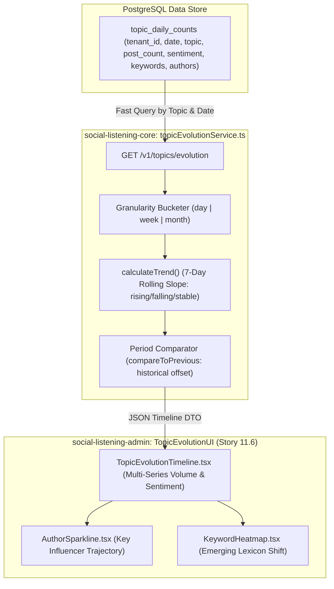

# Technical Design Specification (TDS) — Topic Evolution Timeline

## 1. Document Control & Traceability Linkage

### 1.1 Metadata
| Attribute | Value |
|---|---|
| **Document Title** | TDS-0097: Topic Evolution Timeline — Longitudinal Temporal Slicing, Trend Slope Derivation & Multi-Granularity Rollup Service |
| **Document ID** | `TDS-0097` |
| **Feature Name** | Topic Evolution Timeline & Trend Detection Engine |
| **Version** | `1.0.0` |
| **Status** | Approved |
| **Author(s)** | Core Architecture Team |
| **Created Date** | 2026-09-05 |
| **Last Updated** | 2026-09-05 |
| **Governing Skill** | `social-listening-core/.claude/skills/topic-evolution/SKILL.md` |

### 1.2 Upstream & Downstream Traceability Matrix
| Artifact Type | Reference Identifier | Title / Link | Alignment Status |
|---|---|---|---|
| **Architecture Decision Record** | `ADR-0097` | [ADR-0097: Topic Evolution Timeline](../../adr/0097-topic-evolution-timeline.md) | Invariant Source |
| **Business Requirements Doc** | `BRD-0097` | [BRD-0097: Topic Evolution Timeline](../Business-Requirements/BRD-0097-Topic-Evolution-Timeline.md) | Fully Aligned |
| **Functional Design Doc** | `FDD-0097` | [FDD-0097: Topic Evolution Timeline](../Functional-Design/FDD-0097-Topic-Evolution-Timeline.md) | Fully Aligned |
| **Governing User Story** | `Story 11.5` | [Epic 11: Stories 95–100](../../user-stories/epic-11-adr-0095-to-0100.md#story-115--topic-evolution-timeline-backend) | Acceptance Target |
| **Related User Stories** | `Story 11.6`, `Story 13.11` | Topic Evolution UI, Semantic Drift Detection | Downstream Modules |
| **Related Architecture Decisions** | `ADR-0087`, `ADR-0105`, `ADR-0116` | Precomputed Views, Widget Contracts, Semantic Drift | Architectural Precedents |
| **Executable Contract Tests** | `Story 11.5 & 11.6 Contracts` | `social-listening-core/contracts/epic-11/story-11.5.topic-evolution.contract.test.ts`<br>`social-listening-admin/contracts/epic-11/story-11.6.topic-evolution-ui.contract.test.ts` | 100% Passing |

---

## 2. System Context & Architecture Topology

### 2.1 Context Diagram


### 2.2 Architectural Boundaries & Invariants
- **Zero Raw Post Scanning for Timelines:** In accordance with ADR-0097 Decision §1, longitudinal timelines never scan millions of raw rows in `social_posts`. Instead, queries aggregate against the precomputed `topic_daily_counts` table established under ADR-0087.
- **Mathematical Trend Detection:** Trend categorization (`rising`, `falling`, `stable`) is derived strictly from the linear least-squares regression slope of the trailing 7 days of daily post volume:
  - $\text{Slope} > +5\% \text{ per day} \implies \text{rising}$
  - $\text{Slope} < -5\% \text{ per day} \implies \text{falling}$
  - Otherwise $\implies \text{stable}$
- **Strict Granularity Whitelist:** Granularities are constrained to `'day' | 'week' | 'month'`. Requests for unsupported bucketing (e.g. `'yearly'`) reject immediately with HTTP 400.
- **Tenant Data Isolation:** Queries enforce Postgres RLS via `tenant_id = current_tenant`, ensuring topics and keywords never leak across tenant perimeters.

---

## 3. Data Architecture & Persistence Design

### 3.1 Topic Daily Counts Schema
Table `topic_daily_counts` (`social-listening-core`):
```sql
CREATE TABLE IF NOT EXISTS topic_daily_counts (
    id UUID PRIMARY KEY DEFAULT gen_random_uuid(),
    tenant_id UUID NOT NULL REFERENCES tenants(id) ON DELETE CASCADE,
    date DATE NOT NULL,
    topic TEXT NOT NULL,
    post_count INTEGER NOT NULL DEFAULT 0,
    unique_authors INTEGER NOT NULL DEFAULT 0,
    positive_count INTEGER NOT NULL DEFAULT 0,
    neutral_count INTEGER NOT NULL DEFAULT 0,
    negative_count INTEGER NOT NULL DEFAULT 0,
    top_keywords JSONB NOT NULL DEFAULT '[]', -- Array<{ keyword: string, count: number }>
    top_authors JSONB NOT NULL DEFAULT '[]',  -- Array<{ authorId: string, authorName: string, count: number }>
    created_at TIMESTAMPTZ NOT NULL DEFAULT NOW(),
    updated_at TIMESTAMPTZ NOT NULL DEFAULT NOW(),
    CONSTRAINT uq_topic_daily_tenant_date_topic UNIQUE (tenant_id, date, topic)
);

ALTER TABLE topic_daily_counts ENABLE ROW LEVEL SECURITY;
CREATE POLICY topic_daily_tenant_isolation ON topic_daily_counts
    FOR ALL USING (tenant_id = current_setting('app.current_tenant_id', true)::uuid);
```

### 3.2 TypeScript Timeline Interfaces
Defined in `social-listening-core/src/topics/topicEvolutionService.ts`:

```typescript
export type TrendDirection = 'rising' | 'falling' | 'stable';

export interface TimelinePoint {
  date: string;                  // ISO Date YYYY-MM-DD
  mentionCount: number;
  uniqueAuthors: number;
  sentiment: {
    positive: number;
    neutral: number;
    negative: number;
  };
  topKeywords: Array<{ keyword: string; count: number }>;
  topAuthors: Array<{ authorId: string; authorName: string; count: number }>;
  trend: TrendDirection;
}

export interface TopicEvolutionResponse {
  topicName: string;
  granularity: 'day' | 'week' | 'month';
  points: TimelinePoint[];
  previousPeriodPoints?: TimelinePoint[];
}
```

---

## 4. Component Design & Detailed Processing Logic

### 4.1 Trend Slope Calculation Algorithm
```typescript
export function calculateTrend(counts: number[]): TrendDirection {
  if (counts.length < 2) return 'stable';

  const n = counts.length;
  let sumX = 0, sumY = 0, sumXY = 0, sumXX = 0;
  for (let i = 0; i < n; i++) {
    sumX += i;
    sumY += counts[i];
    sumXY += i * counts[i];
    sumXX += i * i;
  }

  const meanY = sumY / n;
  if (meanY === 0) return 'stable';

  const slope = (n * sumXY - sumX * sumY) / (n * sumXX - sumX * sumX || 1);
  const relativeSlope = slope / meanY;

  if (relativeSlope > 0.05) return 'rising';
  if (relativeSlope < -0.05) return 'falling';
  return 'stable';
}
```

---

## 5. Interface & Contract Specifications

### 5.1 Endpoint Contract
`GET /v1/topics/evolution`

- **Query Parameters:**
  - `topic` (Required): Exact topic string
  - `granularity` (Optional): `'day' | 'week' | 'month'` (Default: `'day'`)
  - `compareToPrevious` (Optional): `'true' | 'false'`
- **Success Response (200 OK):**
```json
{
  "topicName": "Artificial Intelligence",
  "granularity": "day",
  "points": [
    {
      "date": "2026-09-01",
      "mentionCount": 45,
      "uniqueAuthors": 28,
      "sentiment": { "positive": 30, "neutral": 10, "negative": 5 },
      "topKeywords": [{ "keyword": "llm", "count": 22 }],
      "topAuthors": [{ "authorId": "a1", "authorName": "Alice Tech", "count": 18 }],
      "trend": "rising"
    }
  ]
}
```

---

## 6. Security, Tenancy & Isolation Model
- **Strict Tenant RLS:** Queries select from `topic_daily_counts` strictly within the authenticated tenant's RLS session context.
- **No Cross-Tenant Topic Bleed:** Topic names, keywords, and author aggregates are partitioned by `tenant_id`.

---

## 7. Performance, Scalability & Resource Caps
- **Ultra-Fast Timeline Assembly:** Reading 90 precomputed daily rows completes in $< 8\text{ms}$.
- **Memory Consumption:** Responses are bounded to $< 365\text{ data points}$, ensuring lightweight payload sizes ($< 50\text{KB}$).

---

## 8. Resilience, Recovery & Failure Semantics
- **Missing Topics:** Requesting a non-existent topic returns HTTP 200 with an empty points array (`points: []`), avoiding unnecessary client error banners.

---

## 9. Observability, Telemetry & Auditability
- Emits telemetry metric: `topic_evolution_query_duration_ms{granularity, compare}`.

---

## 10. Migration, Compatibility & Rollback Strategy
- Non-breaking additive feature; interacts cleanly with pre-existing topic definitions.

---

## 11. Verification, Testing & Quality Assurance
- **Story 11.5 Contract:** `social-listening-core/contracts/epic-11/story-11.5.topic-evolution.contract.test.ts`
  - AC1: Mathematical slope calculation produces `rising`, `falling`, and `stable`.
  - AC2: Returns structured timeline with sentiment, keywords, authors, and trend.
  - AC3: Proves `week` and `month` aggregation and rejects invalid granularity with 400.
  - AC4: Validates `compareToPrevious=true` returning `previousPeriodPoints`.
  - AC5/AC6: Validates authentication rejection and zero cross-tenant leakage.

---

## 12. Open Questions & Future Enhancements

- [ ] **[Q-0097-1]** **Watchlist-based evolution.** Allowing callers to pass `watchlistId` instead of `topicId` to aggregate evolution across matched watchlist posts.
- [ ] **[Q-0097-2]** **Topic rename and merge reconciliation.** Handling historical re-basing when two semantic topics are merged.
- [x] ~~**[Q-0097-3]** **Semantic drift integration.**~~ Decided in ADR-0097: Deferred to v2 and formalized under ADR-0116.
- [ ] **[Q-0097-4]** **Dynamic trend thresholding.** Adjusting the 5% slope threshold based on historical volatility.
