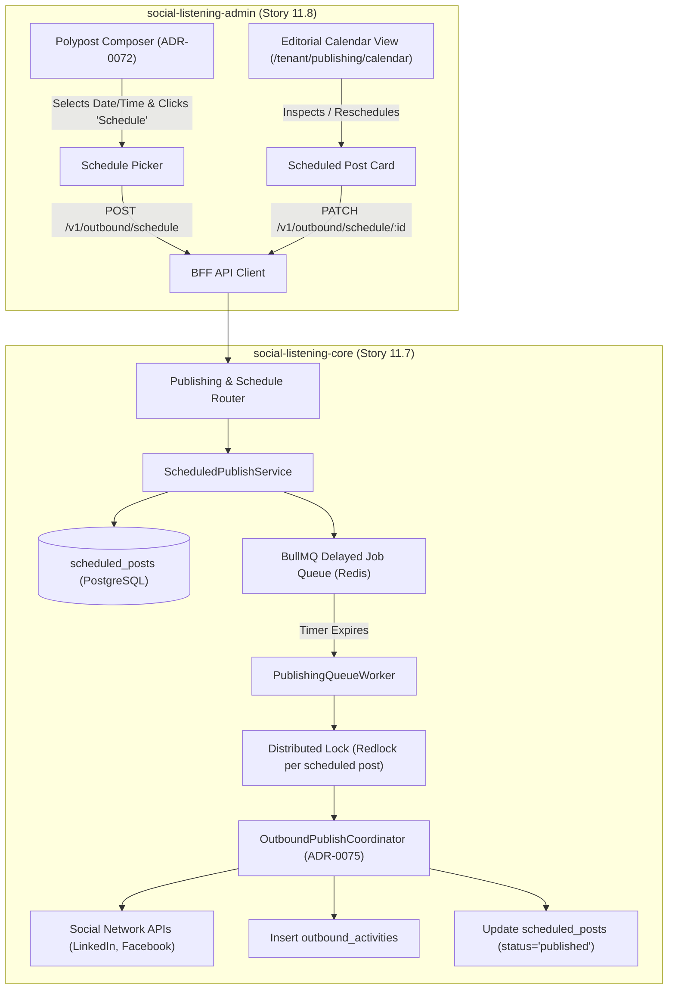
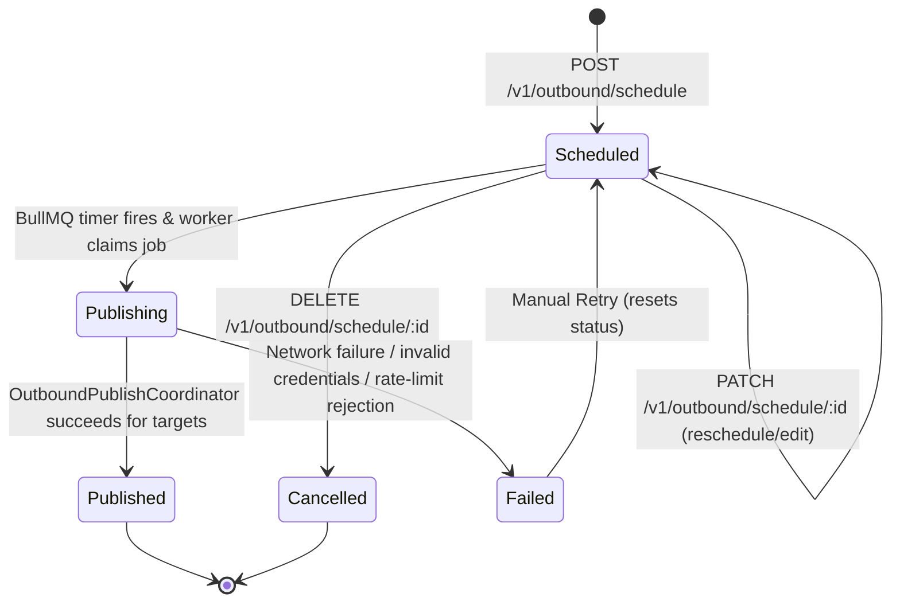

# TDS-0098: Publishing and Scheduling

**Status:** Approved  
**Date:** 2026-09-05  
**Governing ADR:** [ADR-0098](../../adr/0098-publishing-and-scheduling.md)  
**Related Epics/Stories:** [Epic 11 / Story 11.7, 11.8](../../user-stories/epic-11-adr-0095-to-0100.md), [Epic 2 / Story 2.28](../../user-stories/epic-2-ingestion-connectors-and-rate-limits.md), [Epic 6 / Story 6.39](../../user-stories/epic-6-tenant-admin-ui.md)  
**Target Repositories:** `social-listening-core`, `social-listening-admin`  
**Contract Test Citations:**  
- `social-listening-core/contracts/epic-11/story-11.7.publishing-and-scheduling.contract.test.ts`  
- `social-listening-admin/contracts/epic-11/story-11.8.publishing-scheduling-ui.contract.test.ts`  

---

## 1. Architectural Context & Problem Statement

While immediate outbound publishing (ADR-0075) enables real-time distribution, enterprise marketing teams operate on planned editorial calendars. Content campaigns, product announcements, and cross-time-zone community engagement require scheduling posts days or weeks in advance.

Executing scheduled publications directly in the application web process is prone to missed deadlines, worker crashes, race conditions, and timezone miscalculations.

This specification formalizes:
1. The `scheduled_posts` database schema in PostgreSQL with row-level security.
2. An asynchronous delayed job queue built on Redis and BullMQ ensuring reliable delivery at the designated `scheduled_at` timestamp.
3. Endpoints for creating, listing, modifying, and cancelling scheduled publications.
4. An interactive editorial calendar and scheduling modal in `social-listening-admin`.



---

## 2. Governing ADRs & Decision Log Reference

- [ADR-0098: Publishing and Scheduling](../../adr/0098-publishing-and-scheduling.md) — Authorizes scheduled publishing model, delayed execution architecture, and calendar API endpoints.
- [ADR-0072: Cross-Platform Polypost Composer and Multi-Network Preview Engine](../../adr/0072-cross-platform-polypost-composer-and-multi-network-preview-engine.md) — Frontend surface providing draft content and target networks.
- [ADR-0075: Outbound Social Post Publishing via Platform APIs](../../adr/0075-outbound-social-post-publishing.md) — Underlying publishing dispatch coordinator and rate gate framework.
- [ADR-0115: Publishing — Media Upload and Asset Targeting](../../adr/0115-publishing-media-upload-and-asset-targeting.md) — Governs media attachment linkage for scheduled posts.

---

## 3. Scope, Precedence & Anti-Goals

### In Scope
- Creating scheduled posts with future UTC timestamps (`scheduled_at > NOW()`).
- BullMQ delayed queue processing with Redis persistence.
- Modifying (`PATCH`) or cancelling (`DELETE`) pending scheduled posts before trigger time.
- Status transition lifecycle (`scheduled` $\rightarrow$ `publishing` $\rightarrow$ `published` | `failed` | `cancelled`).
- Full integration with `outbound_activities` audit ledger upon execution.
- Editorial calendar grid view in `social-listening-admin` supporting day/week/month aggregation.

### Precedence Invariant
$$\text{Execution Time UTC} \ge \text{scheduled\_at} \land \text{Queue Idempotency}$$
A scheduled post executes exactly once when its timestamp is reached. Redlock distributed locking prevents concurrent workers from double-publishing the same job.

### Anti-Goals
- Recurring or cron-style repeating posts in v1 (single-shot scheduled publications only).
- Dynamic AI auto-rescheduling based on engagement heatmaps (deferred to telemetry batch).

---

## 4. Data Architecture & Storage Schema

```sql
-- Migration: 0098_create_scheduled_posts.sql

CREATE TABLE IF NOT EXISTS scheduled_posts (
    id UUID PRIMARY KEY DEFAULT gen_random_uuid(),
    tenant_id UUID NOT NULL REFERENCES tenants(id) ON DELETE CASCADE,
    owner_id UUID NOT NULL REFERENCES users(id) ON DELETE CASCADE,
    post_payload JSONB NOT NULL,     -- Contains baseText, platformOverrides, assetIds
    targets JSONB NOT NULL,          -- Array of target connector configs
    scheduled_at TIMESTAMPTZ NOT NULL,
    status TEXT NOT NULL DEFAULT 'scheduled'
        CHECK (status IN ('scheduled', 'publishing', 'published', 'failed', 'cancelled')),
    error_message TEXT,
    published_at TIMESTAMPTZ,
    created_at TIMESTAMPTZ NOT NULL DEFAULT NOW(),
    updated_at TIMESTAMPTZ NOT NULL DEFAULT NOW()
);

-- Indexing for worker polling and calendar queries
CREATE INDEX IF NOT EXISTS idx_scheduled_posts_due 
    ON scheduled_posts(scheduled_at, status)
    WHERE status = 'scheduled';

CREATE INDEX IF NOT EXISTS idx_scheduled_posts_calendar 
    ON scheduled_posts(tenant_id, scheduled_at, status);

-- Row Level Security
ALTER TABLE scheduled_posts ENABLE ROW LEVEL SECURITY;

CREATE POLICY scheduled_posts_tenant_isolation ON scheduled_posts
    AS RESTRICTIVE
    USING (tenant_id = NULLIF(current_setting('app.current_tenant_id', true), '')::uuid)
    WITH CHECK (tenant_id = NULLIF(current_setting('app.current_tenant_id', true), '')::uuid);
```

---

## 5. Component & Interface Contracts

### 5.1 Scheduling Types & Interfaces (`social-listening-core`)

```typescript
export type ScheduledPostStatus = 'scheduled' | 'publishing' | 'published' | 'failed' | 'cancelled';

export interface SchedulePostRequest {
  postPayload: {
    baseText: string;
    platformOverrides?: Record<string, string>;
    assetIds?: string[];
  };
  targets: Array<{
    connectorId: string;
    platform: string;
    overrideText?: string;
  }>;
  scheduledAt: string; // ISO-8601 UTC timestamp
}

export interface ScheduledPostRecord {
  id: string;
  tenantId: string;
  ownerId: string;
  postPayload: Record<string, unknown>;
  targets: Array<Record<string, unknown>>;
  scheduledAt: string;
  status: ScheduledPostStatus;
  errorMessage: string | null;
  publishedAt: string | null;
  createdAt: string;
  updatedAt: string;
}
```

### 5.2 API Route Specification

#### `POST /v1/outbound/schedule`
Schedules a post for future publication.
- **Validation:** `scheduledAt` must be at least 5 minutes in the future and within 90 days.
- **Queue Action:** Enqueues delayed job in BullMQ queue `publishing-delayed-queue` with delay `scheduledAt.getTime() - Date.now()`.

#### `GET /v1/outbound/schedule?from=...&to=...&status=...`
Lists scheduled posts for the tenant within a calendar date range.

#### `PATCH /v1/outbound/schedule/:id`
Updates content or reschedules execution time. Updates database record and re-times the BullMQ delayed job.

#### `DELETE /v1/outbound/schedule/:id`
Cancels the scheduled post (`status = 'cancelled'`) and removes the delayed job from Redis.

---

## 6. State Machine & Lifecycle Transitions



---

## 7. Security, Tenant Isolation & Authentication

1. **Queue Context Isolation:** BullMQ delayed job payloads store `tenant_id` and `user_id`. When the worker activates, it establishes the database RLS session context (`SET LOCAL app.current_tenant_id`) before initiating publish calls.
2. **Credential Freshness Guard:** Scheduled posts do not store serialized access tokens. Fresh OAuth tokens are resolved securely from `platform_credentials` at execution time. If token expiration occurred during the wait period, the job fails gracefully with an alerting notification.

---

## 8. Performance, Scalability & Resource Boundaries

1. **Delayed Queue Overhead:** BullMQ delayed sets store job IDs in a Redis sorted set (`zset`) scored by Unix execution timestamp. Memory footprint is `< 1 KB` per scheduled item.
2. **Worker Concurrency:** The publishing worker pool scales horizontally. Workers execute jobs using Redis redlock (`lock:scheduled-post:{id}`) with a 30-second TTL to guarantee single-dispatch semantics across cluster instances.

---

## 9. Error Handling, Retries & Fallback Strategies

| Failure Type | State Transition | Retry Behavior |
|---|---|---|
| Transient 5xx API network error | `failed` | Automatic BullMQ exponential backoff: 3 retries at 1m, 5m, 15m intervals |
| Permanent 401 Unauthorized token error | `failed` | Immediate terminal failure; alerts tenant admin to reconnect account |
| Redis queue node restart | Retained | BullMQ jobs are persisted to disk in Redis AOF/RDB; overdue jobs fire immediately on recovery |

---

## 10. Observability, Telemetry & Audit Trail

- **Queue & Audit Logging:**
  - `scheduled_post_enqueued { scheduledPostId, scheduledAt, delayMs }`
  - `scheduled_post_dispatched { scheduledPostId, actualDispatchAt, driftMs }`
  - `scheduled_post_completed { scheduledPostId, status, durationMs }`
- **Prometheus Metrics:**
  - `scheduled_posts_queue_depth{tenant_id, status}` — Gauge of pending scheduled jobs.
  - `scheduled_dispatch_drift_seconds` — Histogram of delta between target `scheduled_at` and actual dispatch time.

---

## 11. Migration & Backward Compatibility Strategy

- **Database Migration:** Zero-downtime additive migration creating `scheduled_posts` and indexes.
- **Polypost Composer Integration:** Seamlessly adds a "Schedule" CTA alongside the existing "Publish Now" button.

---

## 12. Executable Contract Test Citations & Verification Matrix

### 12.1 Contract Test Specifications
1. `social-listening-core/contracts/epic-11/story-11.7.publishing-and-scheduling.contract.test.ts`:
   - `test('schedules post in scheduled_posts table and enqueues delayed BullMQ job')`
   - `test('rejects scheduledAt timestamps in the past with 400 Bad Request')`
   - `test('updates scheduled time and payload via PATCH /v1/outbound/schedule/:id')`
   - `test('cancels scheduled job on DELETE and prevents worker dispatch')`
   - `test('worker claims job, executes OutboundPublishCoordinator, and updates status to published')`
2. `social-listening-admin/contracts/epic-11/story-11.8.publishing-scheduling-ui.contract.test.ts`:
   - `test('renders calendar view with scheduled post chips on specified dates')`
   - `test('opens schedule picker modal and sends ISO UTC timestamp')`
   - `test('allows drag-and-drop rescheduling in calendar view')`

### 12.2 Open Questions

- [x] ~~**[Q-0098-1]** What is the minimum and maximum scheduling horizon?~~  
  *Decision:* Minimum 5 minutes in the future; maximum 90 days.
- [x] ~~**[Q-0098-2]** How are token expirations handled during long waiting periods?~~  
  *Decision:* Tokens are resolved at execution time, not schedule time. If expired, automatic refresh is attempted; if refresh fails, status becomes `failed` and an alert is logged.
