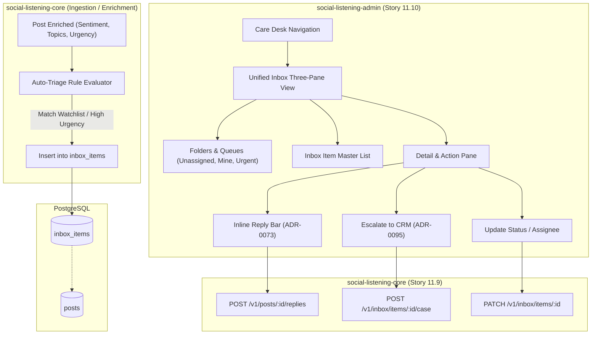
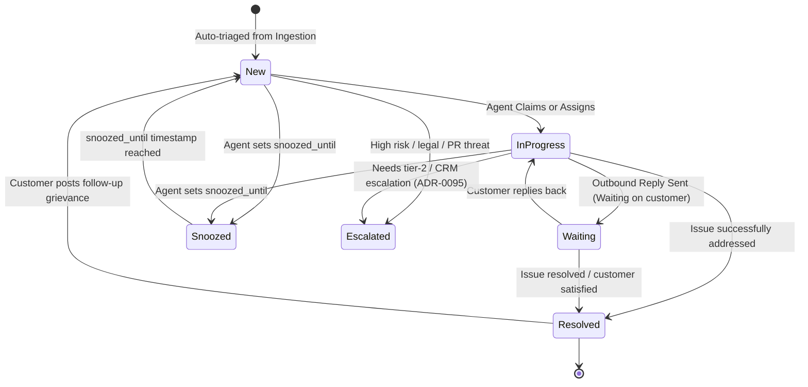

# TDS-0099: Unified Social Inbox and Reply

**Status:** Approved  
**Date:** 2026-09-05  
**Governing ADR:** [ADR-0099](../../adr/0099-unified-social-inbox-and-reply.md)  
**Related Epics/Stories:** [Epic 11 / Story 11.9, 11.10](../../user-stories/epic-11-adr-0095-to-0100.md), [Epic 2 / Story 2.26, 2.27](../../user-stories/epic-2-ingestion-connectors-and-rate-limits.md), [Epic 3 / Story 3.14](../../user-stories/epic-3-data-model-storage-and-archival.md), [Epic 6 / Story 6.38](../../user-stories/epic-6-tenant-admin-ui.md)  
**Target Repositories:** `social-listening-core`, `social-listening-admin`  
**Contract Test Citations:**  
- `social-listening-core/contracts/epic-11/story-11.9.unified-social-inbox.contract.test.ts`  
- `social-listening-admin/contracts/epic-11/story-11.10.unified-inbox-ui.contract.test.ts`  

---

## 1. Architectural Context & Problem Statement

Listening feeds capture high volumes of public social chatter, but customer care agents (`Tenant-Social-Care-Agent`) cannot triage issues effectively when scrolling through raw post streams. High-urgency customer complaints, product defects, and influencer inquiries get buried beneath background brand mentions.

Care operations require an actionable, shared workqueue:
1. **Automated Triage & Deduplication:** Posts matching critical watchlists or high-urgency/negative sentiment thresholds must be ingested into a managed inbox with initial priority tags.
2. **Assignment & Lifecycle Tracking:** Agents must be able to claim items, update statuses (`new` $\rightarrow$ `in_progress` $\rightarrow$ `resolved`), snooze low-priority items, or escalate severe crises.
3. **Integrated Action Loops:** Agents need immediate access to in-platform replies (ADR-0073) and CRM escalation tickets (ADR-0095) without leaving the conversation pane.

This specification defines the **Unified Social Inbox**:
1. The `inbox_items` operational schema with tenant RLS and assignment tracking.
2. Automated auto-triage rules during the post-ingestion enrichment pipeline.
3. Triage lifecycle state machines and bulk status APIs.
4. The three-pane operational care desk interface in `social-listening-admin`.



---

## 2. Governing ADRs & Decision Log Reference

- [ADR-0099: Unified Social Inbox and Reply](../../adr/0099-unified-social-inbox-and-reply.md) — Authorizes `inbox_items` data model, triage lifecycle, and care desk workflows.
- [ADR-0073: Outbound Reply to Ingested Posts via Platform APIs](../../adr/0073-outbound-reply-to-ingested-posts.md) — Governs outbound reply mechanics executed from the inbox.
- [ADR-0095: Case and Lead Handoff to CRM](../../adr/0095-case-handoff-to-crm.md) — Governs CRM ticket escalation from inbox items.
- [ADR-0038: AI Enrichment Provider Selection](../../adr/0038-ai-enrichment-provider-selection.md) — Supplies sentiment, urgency, and topic tags driving auto-triage.

---

## 3. Scope, Precedence & Anti-Goals

### In Scope
- Operational table `inbox_items` linked 1:1 with `posts` per tenant (`UNIQUE (tenant_id, post_id)`).
- Status workflow (`new`, `in_progress`, `waiting`, `resolved`, `snoozed`, `escalated`).
- Priority scoring (`urgent`, `high`, `normal`, `low`) calculated by auto-triage rules.
- Agent assignment (`assigned_to`) and snoozing (`snoozed_until`).
- Unified operational console in `social-listening-admin` with quick keyboard shortcuts (claim, resolve, next).

### Precedence Invariant
$$\text{Inbox Item Uniqueness} \land \text{Tenant Isolation}$$
A single social post maps to at most one inbox item per tenant. Auto-triage evaluates rules idempotently with `ON CONFLICT DO NOTHING`.

### Anti-Goals
- Private real-time chat / messaging (scoped to public posts and comment threads).
- Automated AI auto-replies without human review.

---

## 4. Data Architecture & Storage Schema

```sql
-- Migration: 0099_create_inbox_items.sql

CREATE TABLE IF NOT EXISTS inbox_items (
    id UUID PRIMARY KEY DEFAULT gen_random_uuid(),
    tenant_id UUID NOT NULL REFERENCES tenants(id) ON DELETE CASCADE,
    post_id UUID NOT NULL REFERENCES posts(id) ON DELETE CASCADE,
    watchlist_id UUID REFERENCES watchlists(id) ON DELETE SET NULL,
    priority TEXT NOT NULL DEFAULT 'normal'
        CHECK (priority IN ('urgent', 'high', 'normal', 'low')),
    status TEXT NOT NULL DEFAULT 'new'
        CHECK (status IN ('new', 'in_progress', 'waiting', 'resolved', 'snoozed', 'escalated')),
    assigned_to UUID REFERENCES users(id) ON DELETE SET NULL,
    snoozed_until TIMESTAMPTZ,
    notes TEXT,
    created_at TIMESTAMPTZ NOT NULL DEFAULT NOW(),
    updated_at TIMESTAMPTZ NOT NULL DEFAULT NOW(),
    CONSTRAINT uq_inbox_items_tenant_post UNIQUE (tenant_id, post_id)
);

-- Indexing Strategy
CREATE INDEX IF NOT EXISTS idx_inbox_items_triage 
    ON inbox_items(tenant_id, status, priority, created_at DESC);

CREATE INDEX IF NOT EXISTS idx_inbox_items_assigned 
    ON inbox_items(tenant_id, assigned_to, status) 
    WHERE status != 'resolved';

CREATE INDEX IF NOT EXISTS idx_inbox_items_snoozed 
    ON inbox_items(tenant_id, snoozed_until) 
    WHERE status = 'snoozed';

-- Row Level Security
ALTER TABLE inbox_items ENABLE ROW LEVEL SECURITY;

CREATE POLICY inbox_items_tenant_isolation ON inbox_items
    AS RESTRICTIVE
    USING (tenant_id = NULLIF(current_setting('app.current_tenant_id', true), '')::uuid)
    WITH CHECK (tenant_id = NULLIF(current_setting('app.current_tenant_id', true), '')::uuid);
```

---

## 5. Component & Interface Contracts

### 5.1 Inbox Types & Interfaces (`social-listening-core`)

```typescript
export type InboxPriority = 'urgent' | 'high' | 'normal' | 'low';
export type InboxStatus = 'new' | 'in_progress' | 'waiting' | 'resolved' | 'snoozed' | 'escalated';

export interface InboxItemRecord {
  id: string;
  tenantId: string;
  postId: string;
  watchlistId: string | null;
  priority: InboxPriority;
  status: InboxStatus;
  assignedTo: string | null;
  snoozedUntil: string | null;
  notes: string | null;
  createdAt: string;
  updatedAt: string;
  post?: {
    id: string;
    platformId: string;
    content: string;
    authorName: string;
    sentimentScore: number;
    sentimentLabel: string;
    publishedAt: string;
    url: string;
  };
}

export interface UpdateInboxItemRequest {
  status?: InboxStatus;
  priority?: InboxPriority;
  assignedTo?: string | null;
  snoozedUntil?: string | null;
  notes?: string;
}
```

### 5.2 API Route Specification

#### `GET /v1/inbox/items?status=...&priority=...&assignedTo=...&limit=50`
Queries inbox items matching filters with cursor pagination. Automatically handles unsnoozing (`snoozed_until <= NOW()` shifts status to `new`).

#### `PATCH /v1/inbox/items/:id`
Updates status, assignee, or notes for a single item.

#### `POST /v1/inbox/items/bulk`
Performs bulk assignment or status updates for multiple selected items.

---

## 6. State Machine & Lifecycle Transitions



---

## 7. Security, Tenant Isolation & Authentication

1. **Strict RLS:** All inbox queries and mutations are isolated to `app.current_tenant_id`.
2. **Role Authorization:**
   - `Tenant-Social-Care-Agent`, `Tenant-Admin`: Full triage, assignment, reply, and status update access.
   - `Tenant-Viewer`: Read-only access to inbox state.
3. **Audit Trail:** Status transitions update `updated_at` and log telemetry events for agent productivity reporting.

---

## 8. Performance, Scalability & Resource Boundaries

1. **Sub-second Queue Queries:** Composite indexing on `(tenant_id, status, priority, created_at DESC)` delivers inbox queries in `< 20ms` for queues with over 500,000 items.
2. **Snooze Unsnoozer:** A lightweight cron job runs every 60 seconds (`UPDATE inbox_items SET status = 'new', snoozed_until = NULL WHERE status = 'snoozed' AND snoozed_until <= NOW()`).

---

## 9. Error Handling, Retries & Fallback Strategies

| Scenario | Response / Behavior | Mitigation |
|---|---|---|
| Post already in inbox | `ON CONFLICT DO NOTHING` | Silently succeeds, preventing duplicate queue items |
| Assignee user deleted | `ON DELETE SET NULL` | Item automatically reverts to unassigned pool |
| Concurrent status update | `409 Conflict` | Optimistic locking via `updated_at` check |

---

## 10. Observability, Telemetry & Audit Trail

- **Triage Events:**
  - `inbox_item_created { itemId, postId, priority, watchlistId }`
  - `inbox_item_claimed { itemId, assignedTo }`
  - `inbox_item_resolved { itemId, resolutionTimeSec, repliesCount }`
- **Prometheus Metrics:**
  - `inbox_open_items_count{tenant_id, priority, status}` — Gauge of active workload.
  - `inbox_resolution_duration_seconds{tenant_id}` — Histogram of time-to-resolve.

---

## 11. Migration & Backward Compatibility Strategy

- **Schema Setup:** `0099_create_inbox_items.sql` adds the table without locking existing post storage.
- **Backfill Option:** Optional backfill query can seed the inbox from high-urgency historical posts.

---

## 12. Executable Contract Test Citations & Verification Matrix

### 12.1 Contract Test Specifications
1. `social-listening-core/contracts/epic-11/story-11.9.unified-social-inbox.contract.test.ts`:
   - `test('auto-triages incoming post into inbox_items with calculated priority')`
   - `test('enforces UNIQUE(tenant_id, post_id) preventing duplicate inbox entries')`
   - `test('allows assigning item to agent and updates status to in_progress')`
   - `test('automatically unsnoozes items when snoozed_until is in the past')`
2. `social-listening-admin/contracts/epic-11/story-11.10.unified-inbox-ui.contract.test.ts`:
   - `test('renders three-pane inbox layout with folder counts and item list')`
   - `test('displays conversation detail with sentiment badge and author profile')`
   - `test('allows quick-reply dispatch and updates item status to waiting')`

### 12.2 Open Questions

- [x] ~~**[Q-0099-1]** How are items automatically prioritized?~~  
  *Decision:* Based on AI urgency classification (`urgent` $\rightarrow$ Urgent, `high` $\rightarrow$ High) and negative sentiment score ($< -0.6 \rightarrow$ High).
- [x] ~~**[Q-0099-2]** Can multiple agents claim the same post?~~  
  *Decision:* No. Assignee field is singular; optimistic locking prevents race conditions on claiming.
