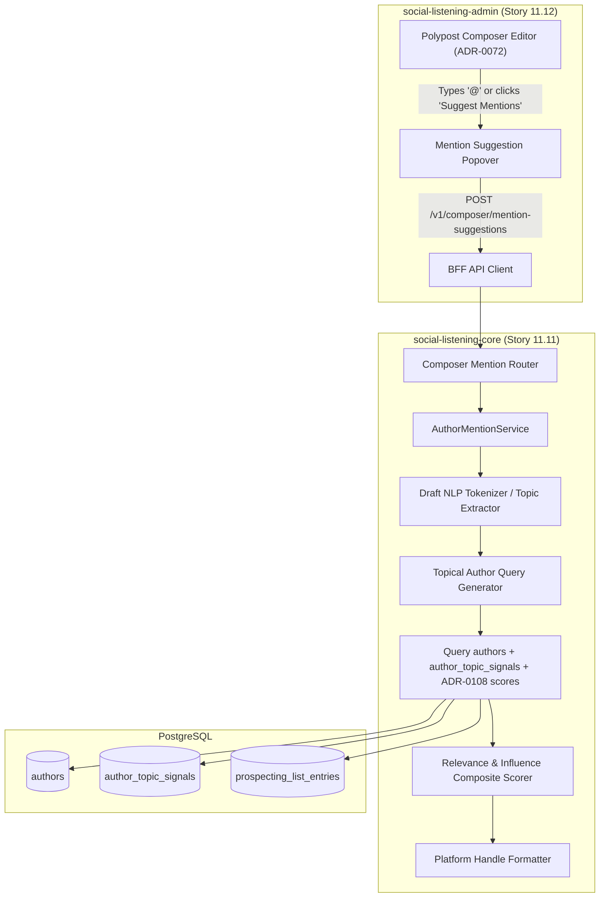
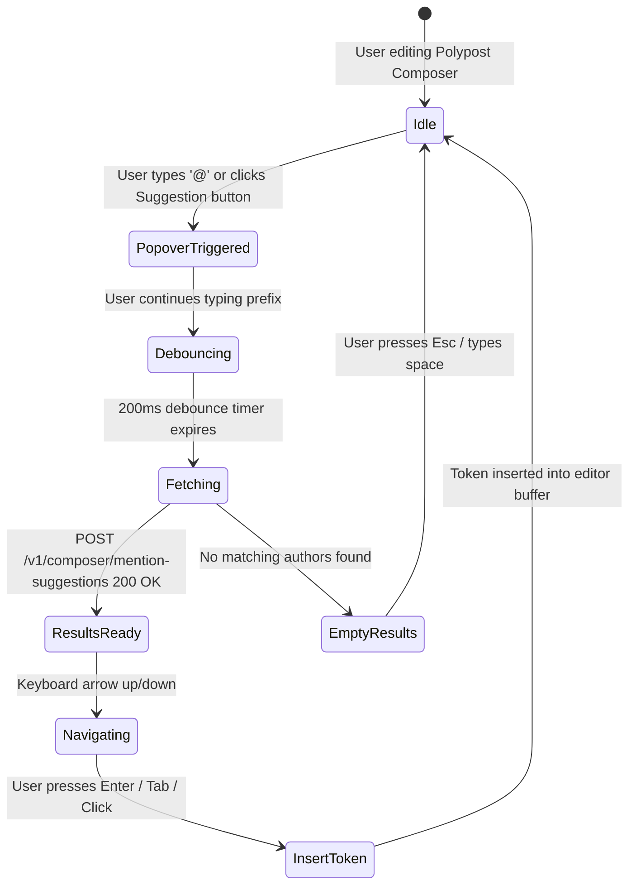

# TDS-0100: Composed Post Author Mention Suggestions

**Status:** Approved  
**Date:** 2026-09-05  
**Governing ADR:** [ADR-0100](../../adr/0100-composed-post-author-mention-suggestions.md)  
**Related Epics/Stories:** [Epic 11 / Story 11.11, 11.12](../../user-stories/epic-11-adr-0095-to-0100.md), [Epic 6 / Story 6.36](../../user-stories/epic-6-tenant-admin-ui.md), [Epic 12 / Story 12.15](../../user-stories/epic-12-adr-0101-to-0108.md)  
**Target Repositories:** `social-listening-core`, `social-listening-admin`  
**Contract Test Citations:**  
- `social-listening-core/contracts/epic-11/story-11.11.mention-suggestions.contract.test.ts`  
- `social-listening-admin/contracts/epic-11/story-11.12.mention-suggestions-ui.contract.test.ts`  

---

## 1. Architectural Context & Problem Statement

Tagging relevant domain experts, influencers, and partner organizations in outbound social posts dramatically amplifies distribution reach and engagement. However, authors composing content in the Polypost Composer face severe practical challenges:
1. **Handle Fragmentation:** An industry analyst or creator frequently operates under divergent handles across networks (e.g., `@johndoe` on X, `john-doe-phd` on LinkedIn, `@johndoe.bsky.social` on Bluesky).
2. **Contextual Discovery:** Content creators often remember an author's topic expertise (e.g., "AI infrastructure") but cannot recall their exact social handle.
3. **Platform Syntax Divergence:** Networks enforce distinct mention formatting (e.g., plain `@handle` on Twitter vs. URN person references on LinkedIn).

This specification formalizes the **Author Mention Suggestions Engine**:
1. A backend search and ranking service (`POST /v1/composer/mention-suggestions`) querying tenant-ingested authors, topical relevance signals (`author_topic_signals`), and influence scores (ADR-0108).
2. Network-specific handle resolution and mention token formatting.
3. An interactive auto-complete mention popover integrated into the Polypost Composer in `social-listening-admin`.



---

## 2. Governing ADRs & Decision Log Reference

- [ADR-0100: Composed Post Author Mention Suggestions](../../adr/0100-composed-post-author-mention-suggestions.md) — Authorizes mention suggestion endpoint, scoring heuristic, and editor popover behavior.
- [ADR-0004: Author Normalized Separately from Post](../../adr/0004-author-normalized-separately-from-post.md) — Source of author profile records.
- [ADR-0007: AuthorTopicSignal Minimal v1](../../adr/0007-author-topic-signal-minimal-v1.md) — Source of author topical affinity vectors.
- [ADR-0072: Cross-Platform Polypost Composer and Multi-Network Preview Engine](../../adr/0072-cross-platform-polypost-composer-and-multi-network-preview-engine.md) — Authoring surface host for mention auto-complete.
- [ADR-0108: Influencer Discovery and Scoring](../../adr/0108-influencer-discovery-and-scoring.md) — Quantitative scoring input (`influence_score`, `reach_score`).

---

## 3. Scope, Precedence & Anti-Goals

### In Scope
- Contextual mention suggestion API parsing draft text keywords and topics.
- Prefix-based handle and display name search triggered on `@` character typing.
- Composite ranking combining text similarity, topic signal overlap, and author influence score.
- Per-platform handle resolution matching selected target networks.
- Floating keyboard-navigable suggestion dropdown in `social-listening-admin`.

### Precedence Invariant
$$\text{Relevance Score} = 0.4 \times \text{PrefixMatch} + 0.3 \times \text{TopicRelevance} + 0.3 \times \text{InfluenceScore}$$
Authors matching the exact prefix query take precedence, followed by topically aligned and high-influence creators.

### Anti-Goals
- Real-time third-party network profile lookups (only authors previously ingested or saved by the tenant are suggested).
- Automatic silent insertion of mentions without user confirmation.

---

## 4. Data Architecture & Storage Schema

Mention suggestions operate over existing database structures (`authors`, `author_topic_signals`, and `prospecting_list_entries`) without requiring new database tables.

```sql
-- Query Optimization Indexing for Fast Mention Autocomplete
CREATE INDEX IF NOT EXISTS idx_authors_handle_trgm 
    ON authors USING gin (handle gin_trgm_ops);

CREATE INDEX IF NOT EXISTS idx_authors_name_trgm 
    ON authors USING gin (display_name gin_trgm_ops);

CREATE INDEX IF NOT EXISTS idx_authors_platform_influence 
    ON authors(platform_id, influence_score DESC NULLS LAST);
```

---

## 5. Component & Interface Contracts

### 5.1 Mention Types & Interfaces (`social-listening-core`)

```typescript
export interface MentionSuggestionRequest {
  text: string;
  prefix?: string; // Query following '@' character
  targetPlatforms: string[];
  watchlistId?: string;
  maxSuggestions?: number; // default 8, max 20
}

export interface AuthorMentionSuggestion {
  authorId: string;
  platformId: string;
  handle: string;
  displayName: string;
  avatarUrl: string | null;
  mentionToken: string; // Ready-to-insert string e.g. '@johndoe'
  influenceScore: number | null;
  relevanceScore: number;
  matchReason: string; // e.g. 'Topic match: Cloud Security', 'Prefix match'
}

export interface MentionSuggestionResponse {
  suggestions: AuthorMentionSuggestion[];
}
```

### 5.2 API Route Specification

#### `POST /v1/composer/mention-suggestions`
- **Authentication:** JWT Bearer with scope `composer:read`.
- **Headers:** `X-Tenant-ID: <uuid>`

**Request Body:**
```json
{
  "text": "Excited to share our insights on modern data architecture and streaming pipelines.",
  "prefix": "sarah",
  "targetPlatforms": ["linkedin", "x"],
  "maxSuggestions": 5
}
```

**Response (200 OK):**
```json
{
  "suggestions": [
    {
      "authorId": "9b12a321-4d56-42ab-9d10-8f921ab04729",
      "platformId": "x",
      "handle": "sarahdata",
      "displayName": "Sarah Chen, PhD",
      "avatarUrl": "https://pbs.twimg.com/profile_images/sarah.jpg",
      "mentionToken": "@sarahdata",
      "influenceScore": 88.5,
      "relevanceScore": 0.94,
      "matchReason": "Prefix match + Topic: Data Architecture"
    },
    {
      "authorId": "1c9e6679-7425-40de-944b-e07fc1f90ae5",
      "platformId": "linkedin",
      "handle": "sarah-chen-pipeline",
      "displayName": "Sarah Chen",
      "avatarUrl": "https://media.licdn.com/dms/image/sarah.jpg",
      "mentionToken": "@sarah-chen-pipeline",
      "influenceScore": 82.0,
      "relevanceScore": 0.89,
      "matchReason": "Prefix match + Topic: Streaming"
    }
  ]
}
```

---

## 6. State Machine & Lifecycle Transitions



---

## 7. Security, Tenant Isolation & Authentication

1. **Tenant RLS Isolation:** Suggestions filter authors whose posts or topic signals belong to the tenant's workspace or shared public author catalog. Private prospecting list context is restricted to the calling user.
2. **Handle Sanitization:** Mention tokens are sanitized to remove control characters and protect against HTML/Markdown injection in downstream previews.

---

## 8. Performance, Scalability & Resource Boundaries

1. **Trigram Index Acceleration:** Autocomplete queries use PostgreSQL `pg_trgm` GIN indexes delivering responses in `< 30ms` for collections exceeding 1,000,000 authors.
2. **Debounce Optimization:** The admin UI debounces API requests by 200ms during active keystrokes, avoiding superfluous backend load.

---

## 9. Error Handling, Retries & Fallback Strategies

| Scenario | Behavior | UI Fallback |
|---|---|---|
| Backend query timeout | Returns empty suggestion list | Popover hides gracefully without blocking typing |
| No topic match found | Falls back to pure handle/display name prefix match | Shows popular tenant authors |
| Cross-platform handle missing | Highlights platform badge with warning | User alerted that author is only registered on Platform A |

---

## 10. Observability, Telemetry & Audit Trail

- **Telemetry Metrics:**
  - `composer_mention_suggestions_requested_total{tenant_id}` — Total queries.
  - `composer_mention_suggestion_selected_total{platform, rank}` — Click-through tracking by rank.
- **Latency Monitoring:**
  - `mention_suggestion_duration_seconds` — Histogram of suggestion query execution times.

---

## 11. Migration & Backward Compatibility Strategy

- **Zero Migration Required:** Utilizes existing tables with additive trigram indexes.
- **Composer Enhancement:** Non-intrusive progressive enhancement to the existing editor text area.

---

## 12. Executable Contract Test Citations & Verification Matrix

### 12.1 Contract Test Specifications
1. `social-listening-core/contracts/epic-11/story-11.11.mention-suggestions.contract.test.ts`:
   - `test('returns topically relevant author suggestions matching prefix query')`
   - `test('ranks authors by combination of topic overlap and influence score')`
   - `test('formats platform-appropriate mention tokens')`
2. `social-listening-admin/contracts/epic-11/story-11.12.mention-suggestions-ui.contract.test.ts`:
   - `test('triggers suggestion popover when user types @ in master editor')`
   - `test('allows keyboard arrow navigation and inserts selected mention token')`
   - `test('updates remaining character count in Polypost Composer after token insertion')`

### 12.2 Open Questions

- [x] ~~**[Q-0100-1]** Should we query live external APIs during autocomplete?~~  
  *Decision:* No. External API queries introduce unpredictable latencies (500ms-2s) and rate-limit burn. Suggestions are strictly resolved against tenant-ingested author databases.
- [x] ~~**[Q-0100-2]** How are multi-network mentions handled when an author exists on only one platform?~~  
  *Decision:* The suggestion indicates the author's specific platform, inserting the mention into that platform's override tab while keeping the base post clean.
