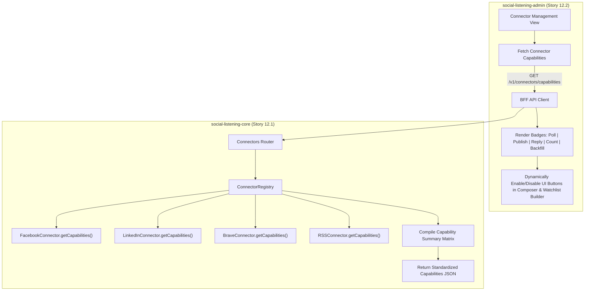
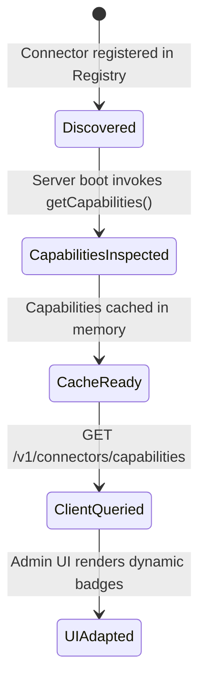

# TDS-0101: Multi-Source Connector Capability Matrix

**Status:** Approved  
**Date:** 2026-09-05  
**Governing ADR:** [ADR-0101](../../adr/0101-multi-source-connector-capability-matrix.md)  
**Related Epics/Stories:** [Epic 12 / Story 12.1, 12.2](../../user-stories/epic-12-adr-0101-to-0108.md), [Epic 2 / Story 2.10](../../user-stories/epic-2-ingestion-connectors-and-rate-limits.md), [Epic 6 / Story 6.36](../../user-stories/epic-6-tenant-admin-ui.md)  
**Target Repositories:** `social-listening-core`, `social-listening-admin`  
**Contract Test Citations:**  
- `social-listening-core/contracts/epic-12/story-12.1.connector-capability-matrix.contract.test.ts`  
- `social-listening-admin/contracts/epic-12/story-12.2.connector-capability-matrix-ui.contract.test.ts`  

---

## 1. Architectural Context & Problem Statement

SocialEngage ingests from diverse digital sources—traditional news aggregators (GNews, Direct Wire RSS), search engines (Brave, Bing), collaborative wikis (Wikipedia), and social networks (LinkedIn, Facebook, Bluesky, Mastodon, Instagram, Threads, X). 

Each connector fundamentally differs in functional capabilities:
- **Polling vs. Search vs. Stream:** News wires poll continuously on high-cadence schedules; search engines execute on-demand query batches.
- **Volume Estimation (`count`):** Some platforms support rapid volume estimation before ingestion; others require pulling full datasets.
- **Outbound Mutations (`publish` & `reply`):** Social platforms support direct publishing and comment replies; search engines and RSS feeds are strictly read-only.
- **Historical Backfill:** Certain APIs permit 30-day historical backfilling; others reject historical lookbacks.

Hardcoding capability flags in the admin UI creates severe frontend fragility and breaks the "Zero-Core-Pipeline-Change" invariant (ADR-0048).

This specification formalizes:
1. The `SocialConnectorCapabilities` strongly-typed interface on `SocialConnector`.
2. The central capability registry and discovery endpoint `GET /v1/connectors/capabilities`.
3. Capability badge chips and dynamic UI gating in `social-listening-admin`.



---

## 2. Governing ADRs & Decision Log Reference

- [ADR-0101: Multi-source connector capability matrix](../../adr/0101-multi-source-connector-capability-matrix.md) — Authorizes capability matrix schema, registry extensions, and discovery endpoint.
- [ADR-0048: Connector Registry and Zero-Pipeline-Change Ingestion](../../adr/0048-connector-registry-and-zero-pipeline-change-ingestion.md) — Foundation connector registry contract.
- [ADR-0073: Outbound Reply to Ingested Posts via Platform APIs](../../adr/0073-outbound-reply-to-ingested-posts.md) — Governs `reply` capability flag.
- [ADR-0075: Outbound Social Post Publishing via Platform APIs](../../adr/0075-outbound-social-post-publishing.md) — Governs `publish` capability flag.
- [ADR-0110: Per-connector query translation and validation](../../adr/0110-per-connector-query-translation-and-validation.md) — Cross-references query translation rules.

---

## 3. Scope, Precedence & Anti-Goals

### In Scope
- Core interface `SocialConnectorCapabilities` covering 5 functional dimensions:
  1. `poll`: Continuous automated background ingestion.
  2. `count`: Rapid volume estimation before ingestion.
  3. `publish`: Outbound original post creation.
  4. `reply`: Direct in-thread comment replies.
  5. `backfill`: Historical lookback ingestion.
- Central discovery endpoint `GET /v1/connectors/capabilities`.
- Connector card capability badges in `social-listening-admin`.
- Dynamic UI gating in Polypost Composer and Watchlist Builder.

### Precedence Invariant
$$\text{Connector Declared Capability} = \text{Ground Truth Action Boundary}$$
If a connector declares `reply: false`, the UI must disable the reply drawer, and the backend must return `501 Not Implemented` if a reply mutation is attempted.

### Anti-Goals
- Dynamic capability mutation at runtime (capabilities are intrinsic to the connector code and platform tier).
- Scraping third-party developer portal HTML pages to guess capabilities.

---

## 4. Data Architecture & Storage Schema

Capabilities are declared directly in code by connector implementations and registered in `ConnectorRegistry`. No relational database migrations are required.

---

## 5. Component & Interface Contracts

### 5.1 Connector Capability Types (`social-listening-core`)

```typescript
export type ConnectorSourceType = 'social' | 'news' | 'search' | 'reference' | 'community';

export interface SocialConnectorCapabilities {
  sourceType: ConnectorSourceType;
  poll: boolean | { cadenceMs: number; supportsTimeWindow: boolean };
  count?: { supportsExactCount: boolean };
  publish?: { supportsScheduling: boolean; supportedAssetTypes: string[] };
  reply?: boolean;
  backfill?: { supportsHistorical: boolean; maxLookbackDays: number };
}

export interface ConnectorCapabilitySummary {
  platformId: string;
  displayName: string;
  authMode: 'api_key' | 'oauth2' | 'app_password' | 'none';
  capabilities: SocialConnectorCapabilities;
}

export interface SocialConnector {
  // Existing connector contract...
  readonly id: string;
  readonly platform: string;
  getCapabilities(): SocialConnectorCapabilities;
}
```

### 5.2 API Route Specification

#### `GET /v1/connectors/capabilities`
- **Authentication:** JWT Bearer with scope `connectors:read`.
- **Response (200 OK):**
```json
[
  {
    "platformId": "facebook",
    "displayName": "Facebook Pages",
    "authMode": "oauth2",
    "capabilities": {
      "sourceType": "social",
      "poll": { "cadenceMs": 600000, "supportsTimeWindow": true },
      "publish": { "supportsScheduling": true, "supportedAssetTypes": ["image", "video", "link-card"] },
      "reply": true,
      "backfill": { "supportsHistorical": true, "maxLookbackDays": 14 }
    }
  },
  {
    "platformId": "brave",
    "displayName": "Brave Search",
    "authMode": "api_key",
    "capabilities": {
      "sourceType": "search",
      "poll": { "cadenceMs": 900000, "supportsTimeWindow": false },
      "count": { "supportsExactCount": false },
      "publish": undefined,
      "reply": false,
      "backfill": undefined
    }
  }
]
```

---

## 6. State Machine & Lifecycle Transitions



---

## 7. Security, Tenant Isolation & Authentication

1. **Information Protection:** Capability metadata is non-sensitive operational configuration and exposes no tenant secrets, tokens, or post content.
2. **Access Control:** Available to all authenticated tenant users to inform navigation and feature availability.

---

## 8. Performance, Scalability & Resource Boundaries

1. **In-Memory Registry Execution:** `GET /v1/connectors/capabilities` aggregates static in-memory objects and returns in `< 3ms`.
2. **Client-Side Caching:** The admin console caches capabilities in React Query for 1 hour.

---

## 9. Error Handling, Retries & Fallback Strategies

| Scenario | Behavior | Resolution |
|---|---|---|
| Connector omits `getCapabilities()` | Default conservative fallback | Assigns `{ poll: true, publish: false, reply: false }` |
| Unknown platform query | Returns 404 | Validates platform identifier against registry |

---

## 10. Observability, Telemetry & Audit Trail

- **Prometheus Metrics:**
  - `connector_capabilities_queried_total` — API query volume.
  - `registered_connectors_count{capability}` — Gauges of platform features across the fleet.

---

## 11. Migration & Backward Compatibility Strategy

- **Graceful Upgrade:** Connectors without explicit `getCapabilities()` implementations inherit sensible defaults.
- **Frontend Compatibility:** Old UI versions ignore unknown capability keys without breaking.

---

## 12. Executable Contract Test Citations & Verification Matrix

### 12.1 Contract Test Specifications
1. `social-listening-core/contracts/epic-12/story-12.1.connector-capability-matrix.contract.test.ts`:
   - `test('GET /v1/connectors/capabilities returns registered platform capabilities')`
   - `test('Facebook connector declares poll, publish, and reply capabilities')`
   - `test('Brave search connector declares search sourceType and disallows reply')`
2. `social-listening-admin/contracts/epic-12/story-12.2.connector-capability-matrix-ui.contract.test.ts`:
   - `test('renders capability badges for poll, publish, reply, and count')`
   - `test('disables reply action in UI when connector declares reply: false')`

### 12.2 Open Questions

- [x] ~~**[Q-0101-1]** Can capabilities vary per tenant tier?~~  
  *Decision:* In v1 capabilities represent platform API constraints. Feature gating by pricing plan is enforced separately via ADR-0112.
