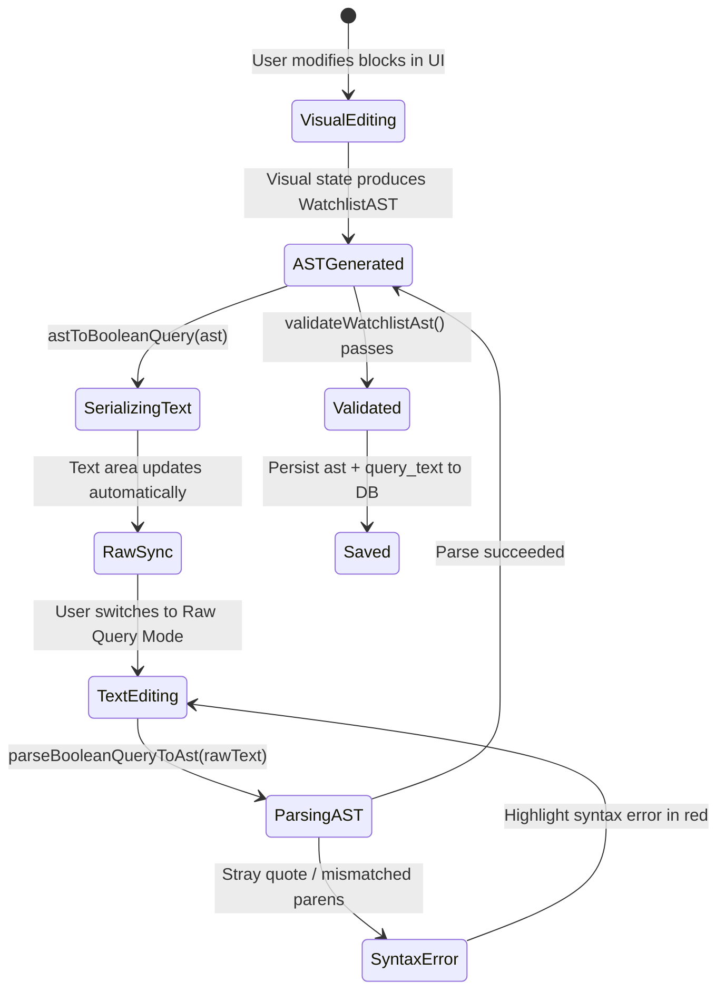

# TDS-0102: Boolean Query AST and Visual Builder

**Status:** Approved  
**Date:** 2026-09-05  
**Governing ADR:** [ADR-0102](../../adr/0102-boolean-query-ast-and-visual-builder.md)  
**Related Epics/Stories:** [Epic 12 / Story 12.3, 12.4](../../user-stories/epic-12-adr-0101-to-0108.md), [Epic 1 / Story 1.5](../../user-stories/epic-1-tenant-foundation-and-watchlists.md), [Epic 13 / Story 13.2](../../user-stories/epic-13-adr-0109-to-0117.md)  
**Target Repositories:** `social-listening-core`, `social-listening-admin`  
**Contract Test Citations:**  
- `social-listening-core/contracts/epic-12/story-12.3.boolean-query-ast.contract.test.ts`  
- `social-listening-admin/contracts/epic-12/story-12.4.boolean-query-visual-builder.contract.test.ts`  

---

## 1. Architectural Context & Problem Statement

Watchlists drive the entire social listening ingestion and matching pipeline. Historically, watchlists required users to type raw boolean string queries (e.g. `("cybersecurity" OR "infosec") AND (ransomware OR breach) -crypto`). Non-technical marketing and PR analysts frequently introduced syntax errors:
- Unbalanced parentheses or stray quotation marks causing ingestion query parser crashes.
- Ambiguous operator precedence leading to unintended post floods or false negatives.
- Platform-incompatible operators resulting in silent ingestion failures (ADR-0110).

This specification formalizes the **Canonical Boolean Query AST & Visual Builder**:
1. A strongly-typed Abstract Syntax Tree (`WatchlistAST`) schema governing boolean expressions across SocialEngage.
2. Bidirectional lossless transformation: parsing raw string queries to AST (`parseBooleanQueryToAst`) and serializing AST to canonical string format (`astToBooleanQuery`).
3. Save-time AST structural validation preventing invalid trees.
4. A visual block-based query builder in `social-listening-admin` supporting group nesting, negation toggles, and live text synchronization.

```mermaid
flowchart TD
    subgraph UI ["social-listening-admin (Story 12.4)"]
        Builder["Visual Query Builder (Block / Tree View)"]
        RawEditor["Raw Query Text Area"]
        
        Builder <-->|Bidirectional Sync (parse / serialize)| RawEditor
        Builder --> Validator["Live AST Validator"]
        Validator --> CapabilityCheck["Connector Query Capability Inspector (ADR-0110)"]
        Builder -->|Save Watchlist (ast + query_text)| BFF["BFF API Client"]
    end

    subgraph Core ["social-listening-core (Story 12.3)"]
        BFF --> Router["Watchlists Router (/v1/watchlists)"]
        Router --> ASTValidator["validateWatchlistAst()"]
        
        ASTValidator -->|Valid| Persist["Save watchlists record with ast and query_text"]
        ASTValidator -->|Invalid| Reject["400 Bad Request (MALFORMED_AST)"]
    end

    subgraph Ingestion ["Ingestion & Matching"]
        Persist --> TWatch[("watchlists (ast, query_text)")]
        TWatch --> Matcher["In-Process AST Matcher (matchesAst)"]
        TWatch --> Translator["ConnectorQueryTranslator (ADR-0110)"]
    end
```

---

## 2. Governing ADRs & Decision Log Reference

- [ADR-0102: Boolean query AST and visual builder](../../adr/0102-boolean-query-ast-and-visual-builder.md) — Authorizes canonical `WatchlistAST` JSON schema, bidirectional compilers, and visual builder UI.
- [ADR-0044: Watchlist API Design and Database Schema Standardization](../../adr/0044-watchlist-api-design-and-database-schema-standardization.md) — Base watchlist CRUD contract and RFC 7396 PATCH semantics.
- [ADR-0110: Per-connector query translation and validation](../../adr/0110-per-connector-query-translation-and-validation.md) — Translates `WatchlistAST` into platform-native queries.
- [ADR-0132: Parameterized AST Query Templates with Budget Governor](../../adr/0132-parameterized-ast-query-templates-with-budget-governor.md) — Reusable query template extensions.

---

## 3. Scope, Precedence & Anti-Goals

### In Scope
- Canonical AST specification with node types: `group`, `clause`, `negation`.
- Clause types: `keyword`, `phrase`, `author`, `has_media`, `language`.
- Parser supporting nested parentheses, boolean `AND`/`OR`, negation prefix `-` or `NOT`.
- Bidirectional round-trip invariant:
  $$\text{astToBooleanQuery}(\text{parseBooleanQueryToAst}(Q)) \equiv Q$$
- Visual block builder component supporting group creation, drag re-ordering, and clause insertion.

### Precedence Invariant
$$\text{AST Canonical Structure} \ge \text{Raw String Expression}$$
The AST represents the source of truth for query semantics. The string `query_text` is deterministically serialized from the AST upon save.

### Anti-Goals
- Natural language to query compilation in this tier (deferred to Deep Research agent).
- Infinite nesting depth (enforces a hard ceiling of 5 nesting levels).

---

## 4. Data Architecture & Storage Schema

```sql
-- Migration: 0102_add_ast_to_watchlists.sql

ALTER TABLE watchlists 
    ADD COLUMN IF NOT EXISTS ast JSONB NOT NULL DEFAULT '{"type":"group","operator":"AND","children":[]}';

-- Index for searching watchlists by clause contents
CREATE INDEX IF NOT EXISTS idx_watchlists_ast_gin 
    ON watchlists USING gin (ast);
```

---

## 5. Component & Interface Contracts

### 5.1 Canonical AST Types (`social-listening-core`)

```typescript
export type ASTClauseType = 'keyword' | 'phrase' | 'author' | 'has_media' | 'language';
export type ASTOperator = 'AND' | 'OR';

export interface ASTClauseNode {
  type: 'clause';
  clauseType: ASTClauseType;
  value: string;
  isExact?: boolean;
}

export interface ASTNegationNode {
  type: 'negation';
  child: ASTNode;
}

export interface ASTGroupNode {
  type: 'group';
  operator: ASTOperator;
  children: ASTNode[];
}

export type ASTNode = ASTGroupNode | ASTClauseNode | ASTNegationNode;

export interface WatchlistAST {
  version: '1.0';
  root: ASTGroupNode;
}

export interface ASTValidationResult {
  isValid: boolean;
  errors: Array<{ code: string; message: string; path: string }>;
  clauseCount: number;
  depth: number;
}
```

### 5.2 Core Compiler Functions

```typescript
export function parseBooleanQueryToAst(rawQuery: string): WatchlistAST;
export function astToBooleanQuery(ast: WatchlistAST): string;
export function validateWatchlistAst(ast: WatchlistAST, maxDepth?: number): ASTValidationResult;
export function matchesAst(ast: WatchlistAST, post: { content: string; authorHandle?: string; language?: string }): boolean;
```

---

## 6. State Machine & Lifecycle Transitions



---

## 7. Security, Tenant Isolation & Authentication

1. **ReDoS / Parsing Attack Guard:** The tokenizer limits maximum input length to 4,096 characters and bounds regex execution timeouts to 50ms, preventing Regular Expression Denial of Service (ReDoS).
2. **Depth Limiting:** Enforces `depth <= 5` and `clauseCount <= 100` to prevent stack overflow attacks.

---

## 8. Performance, Scalability & Resource Boundaries

1. **Microsecond Parsing:** Compiling typical queries (5–15 clauses) executes in `< 0.2ms`.
2. **In-Process Matcher Optimization:** `matchesAst()` short-circuits evaluation on boolean mismatches, processing over 50,000 posts per second per CPU core.

---

## 9. Error Handling, Retries & Fallback Strategies

| Parse Error Condition | Error Code | UI Behavior |
|---|---|---|
| Unmatched parenthesis | `UNMATCHED_PAREN` | Flags character index and highlights unmatched bracket |
| Unclosed quotation mark | `UNCLOSED_QUOTE` | Warns user that phrase string is unclosed |
| Empty group / no clauses | `EMPTY_GROUP` | Prompts user to add a clause or remove the group |

---

## 10. Observability, Telemetry & Audit Trail

- **Telemetry Metrics:**
  - `ast_parsing_invocations_total{status}` — Compilation tracking.
  - `ast_clause_complexity_distribution` — Histogram of clauses per query.

---

## 11. Migration & Backward Compatibility Strategy

- **Graceful Upgrade:** Existing string queries in `watchlists.query_text` are automatically compiled to AST on server startup or next edit.
- **Dual Storage:** Both `ast` and `query_text` are saved, ensuring older ingestion scripts remain fully functional.

---

## 12. Executable Contract Test Citations & Verification Matrix

### 12.1 Contract Test Specifications
1. `social-listening-core/contracts/epic-12/story-12.3.boolean-query-ast.contract.test.ts`:
   - `test('parses complex boolean string with AND, OR, NOT, and quotes into canonical AST')`
   - `test('serializes AST back to valid boolean query string maintaining operator precedence')`
   - `test('rejects malformed syntax with explicit error code and position')`
   - `test('evaluates matchesAst accurately against sample post text')`
2. `social-listening-admin/contracts/epic-12/story-12.4.boolean-query-visual-builder.contract.test.ts`:
   - `test('renders block tree with interactive operator and clause pills')`
   - `test('synchronizes visual edits bidirectionally with raw text editor')`
   - `test('displays syntax error alerts when typing invalid boolean syntax')`

### 12.2 Open Questions

- [x] ~~**[Q-0102-1]** What is the maximum AST nesting depth?~~  
  *Decision:* 5 levels of nested groups, preventing excessive complexity and engine memory bloat.
