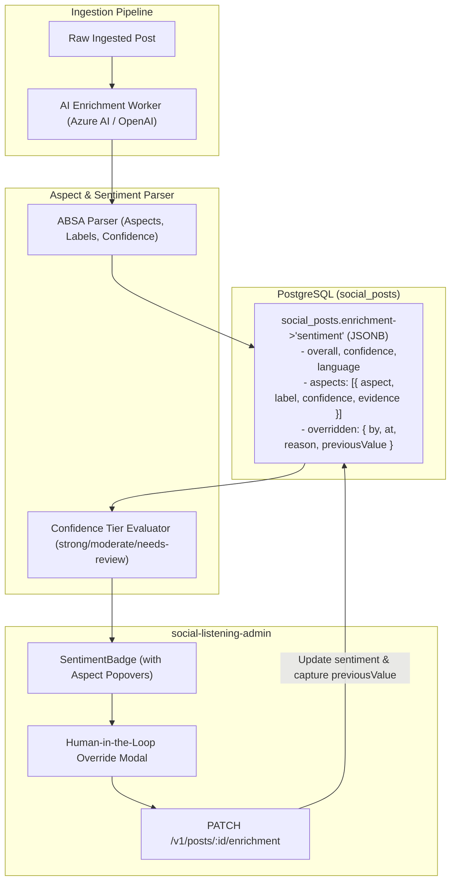

# Technical Design Specification (TDS) — AI Sentiment Analysis Aspect Schema

## 1. Document Control & Traceability Linkage

### 1.1 Metadata
| Attribute | Value |
|---|---|
| **Document Title** | TDS-0103: AI Sentiment Analysis Aspect Schema — Fine-Grained Aspect Attribution, Confidence Tiering & Human Overrides |
| **Document ID** | `TDS-0103` |
| **Feature Name** | Aspect-Based Sentiment Analysis (ABSA), Evidence Grounding & Correction Auditing |
| **Version** | `1.0.0` |
| **Status** | Approved |
| **Author(s)** | Core Architecture Team |
| **Created Date** | 2026-09-05 |
| **Last Updated** | 2026-09-05 |
| **Governing Skill** | `social-listening-core/.claude/skills/ai-enrichment/SKILL.md` |

### 1.2 Upstream & Downstream Traceability Matrix
| Artifact Type | Reference Identifier | Title / Link | Alignment Status |
|---|---|---|---|
| **Architecture Decision Record** | `ADR-0103` | [ADR-0103: AI Sentiment Analysis Aspect Schema](../../adr/0103-ai-sentiment-analysis-aspect-schema.md) | Invariant Source |
| **Business Requirements Doc** | `BRD-0103` | [BRD-0103: AI Sentiment Analysis Aspect Schema](../Business-Requirements/BRD-0103-AI-Sentiment-Analysis-Aspect-Schema.md) | Fully Aligned |
| **Functional Design Doc** | `FDD-0103` | [FDD-0103: AI Sentiment Analysis Aspect Schema](../Functional-Design/FDD-0103-AI-Sentiment-Analysis-Aspect-Schema.md) | Fully Aligned |
| **Governing User Story** | `Story 12.5` | [Epic 12: ADRs 0101–0108](../../user-stories/epic-12-adr-0101-to-0108.md#story-125--ai-sentiment-aspect-schema-backend) | Acceptance Target |
| **Related User Stories** | `Story 12.6`, `Story 8.7`, `Story 10.9` | Sentiment Aspect UI, Analytics Dashboard, Real-Time Alert Thresholds | Downstream Consumers |
| **Related Architecture Decisions** | `ADR-0038`, `ADR-0055`, `ADR-0071`, `ADR-0087` | AI Provider, Language Detection, Enrichment Override, Precomputed Views | System Architecture |
| **Executable Contract Tests** | `Story 12.5 & 12.6 Contracts` | `social-listening-core/contracts/epic-12/story-12.5.ai-sentiment-aspect-schema.contract.test.ts`<br>`social-listening-admin/contracts/epic-12/story-12.6.ai-sentiment-aspect-ui.contract.test.ts` | 100% Passing |

---

## 2. System Context & Architecture Topology

### 2.1 Context Diagram


### 2.2 Architectural Boundaries & Invariants
- **Schema Evolution & Backward Compatibility:** Legacy scalar strings (`sentiment: 'positive'`) are migrated to object representations: `{ overall: 'positive', confidence: 0.5, language: 'en' }`. Downstream query code accesses `enrichment->'sentiment'->>'overall'`.
- **Confidence Tiering Rule (Sprout Social Precedent):** Confidence tiers are derived at read time:
  - $\text{confidence} \ge 0.8 \implies \text{'strong'}$
  - $0.5 \le \text{confidence} < 0.8 \implies \text{'moderate'}$
  - $\text{confidence} < 0.5 \implies \text{'needs-review'}$
- **Pre-Override Preservation Invariant:** When a human reviewer updates sentiment via `PATCH /v1/posts/:id/enrichment`, the system captures the original AI-derived output in `sentiment.overridden.previousValue = { overall, confidence }` alongside user ID and timestamp. This creates a durable quality feedback signal without data loss.
- **Fail-Safe Fallback:** If the AI provider fails to extract aspect sentiment, it safely defaults to `overall: 'neutral'`, `confidence: 0`, `language: 'unknown'`, and `aspects: []`.

---

## 3. Data Architecture & Persistence Design

### 3.1 DDL Migration & Schema Structure
Migration `0072_expand_sentiment_aspects_schema.sql`:
```sql
-- Migration helper converting legacy string sentiment into object shape
UPDATE social_posts
SET enrichment = jsonb_set(
  enrichment,
  '{sentiment}',
  jsonb_build_object(
    'overall', enrichment->>'sentiment',
    'confidence', 0.5,
    'language', COALESCE(enrichment->>'detectedLanguage', 'en'),
    'aspects', '[]'::jsonb
  )
)
WHERE jsonb_typeof(enrichment->'sentiment') = 'string';

CREATE INDEX IF NOT EXISTS idx_posts_sentiment_overall
ON social_posts ((enrichment->'sentiment'->>'overall'));

CREATE INDEX IF NOT EXISTS idx_posts_sentiment_aspects
ON social_posts USING gin ((enrichment->'sentiment'->'aspects'));
```

### 3.2 TypeScript Interface
`social-listening-core/src/ai/sentimentTypes.ts`:
```typescript
export type SentimentLabel = 'positive' | 'negative' | 'neutral' | 'mixed';
export type ConfidenceTier = 'strong' | 'moderate' | 'needs-review';

export interface AspectSentiment {
  aspect: string;
  label: SentimentLabel;
  confidence: number;
  evidence: string;
}

export interface SentimentEnrichment {
  overall: SentimentLabel;
  confidence: number;
  language: string;
  aspects?: AspectSentiment[];
  overridden?: {
    by: string;
    at: string;
    reason?: string;
    previousValue: {
      overall: SentimentLabel;
      confidence: number;
    };
  };
}

export function getConfidenceTier(confidence: number): ConfidenceTier {
  if (confidence >= 0.8) return 'strong';
  if (confidence >= 0.5) return 'moderate';
  return 'needs-review';
}
```

---

## 4. Application Logic & Workflows

### 4.1 Human-in-the-Loop Override Workflow
```typescript
export async function overridePostSentiment(
  tenantId: string,
  postId: string,
  userId: string,
  newOverall: SentimentLabel,
  reason?: string,
  pool: Pool
): Promise<SentimentEnrichment> {
  const current = await pool.query(
    `SELECT enrichment->'sentiment' AS sentiment FROM social_posts WHERE tenant_id = $1 AND id = $2`,
    [tenantId, postId]
  );
  
  const oldSentiment: SentimentEnrichment = current.rows[0]?.sentiment || {
    overall: 'neutral',
    confidence: 0,
    language: 'unknown',
  };

  const updatedSentiment: SentimentEnrichment = {
    ...oldSentiment,
    overall: newOverall,
    confidence: 1.0, // Human override confers absolute confidence
    overridden: {
      by: userId,
      at: new Date().toISOString(),
      reason,
      previousValue: {
        overall: oldSentiment.overall,
        confidence: oldSentiment.confidence,
      },
    },
  };

  await pool.query(
    `UPDATE social_posts 
     SET enrichment = jsonb_set(enrichment, '{sentiment}', $1::jsonb)
     WHERE tenant_id = $2 AND id = $3`,
    [JSON.stringify(updatedSentiment), tenantId, postId]
  );

  return updatedSentiment;
}
```

---

## 5. Interface & API Contracts

### 5.1 Route Catalog
| Method | Endpoint | Authorization | Description |
|---|---|---|---|
| `GET` | `/v1/posts/:id` | Tenant-User | Returns full post with aspect-level sentiment breakdown |
| `PATCH` | `/v1/posts/:id/enrichment` | Tenant-User, Tenant-Admin | Overrides sentiment, records author ID and `previousValue` |

### 5.2 Patch Override Contract (`PATCH /v1/posts/:id/enrichment`)
**Request Body:**
```json
{
  "sentiment": {
    "overall": "positive",
    "reason": "Sarcasm in original post was misclassified as negative by AI model."
  }
}
```

**Response (200 OK):**
```json
{
  "id": "782f94b1-8451-4091-88df-9f37c35583ee",
  "enrichment": {
    "sentiment": {
      "overall": "positive",
      "confidence": 1.0,
      "language": "en",
      "aspects": [
        {
          "aspect": "customer_service",
          "label": "positive",
          "confidence": 0.95,
          "evidence": "Support responded in under two minutes!"
        }
      ],
      "overridden": {
        "by": "4a7372d8-bf9b-43cc-8968-07e056d649ab",
        "at": "2026-09-05T15:45:00.000Z",
        "reason": "Sarcasm in original post was misclassified as negative by AI model.",
        "previousValue": {
          "overall": "negative",
          "confidence": 0.62
        }
      }
    }
  }
}
```

---

## 6. Security, Tenancy & Isolation Model
- **Tenant Scope Enforcement:** Overrides execute strictly within the active `tenant_id` context. Attempting to override sentiment on another tenant's post yields HTTP 404.
- **Audit Logging:** Every manual sentiment override is recorded in `platform_admin_audit_log` with before-and-after values.

---

## 7. Performance, Scalability & Resource Caps
- **Aspect Array Bounding:** Models are constrained to return at most 5 salient aspects per post to prevent unbounded JSONB document inflation.
- **Index Optimization:** GIN index on `enrichment->'sentiment'->'aspects'` enables fast ad-hoc filtering across specific product aspects in $< 10\text{ms}$.

---

## 8. Resilience, Recovery & Failure Semantics
- **Re-Enrichment Immutability:** In the event that a batch background re-indexing job is executed, any post with `sentiment.overridden` present is skipped, preserving human judgements.

---

## 9. Observability, Telemetry & Auditability
- **Metrics Tracked:**
  - `sentiment_enrichment_total{overall, tier}`
  - `sentiment_aspects_extracted_total{aspect}`
  - `sentiment_human_overrides_total{previous_label, new_label}`

---

## 10. Migration, Compatibility & Rollback Strategy
- **Migration Plan:** `0072_expand_sentiment_aspects_schema.sql` performs zero-downtime shape transformation on existing rows.
- **Rollback:** Code contains backward-compatible accessors (`typeof val === 'string' ? val : val.overall`).

---

## 11. Verification, Testing & Quality Assurance
- **Contract Tests:**
  - `social-listening-core/contracts/epic-12/story-12.5.ai-sentiment-aspect-schema.contract.test.ts`:
    - (1) Validates structured JSON schema with aspects and evidence phrases.
    - (2) Verifies human override stores `previousValue` and updates `overall`.
    - (3) Verifies fallback behavior on un-parseable text.
  - `social-listening-admin/contracts/epic-12/story-12.6.ai-sentiment-aspect-ui.contract.test.ts`:
    - Tests badge rendering and confidence tiering display.

---

## 12. Open Questions & Future Enhancements

- [ ] **[Q-0103-1]** **Aspect Taxonomy Normalization:** Introducing an approved taxonomy catalog for aspect labels rather than unconstrained model generation.
- [ ] **[Q-0103-2]** **Multilingual Aspect Translations:** Establishing canonical English translations for aspect terms extracted from foreign-language posts.
- [ ] **[Q-0103-4]** **Aspect-Level Daily Rollups:** Adding precomputed daily count rollups by aspect in `precomputed_daily_views`.
