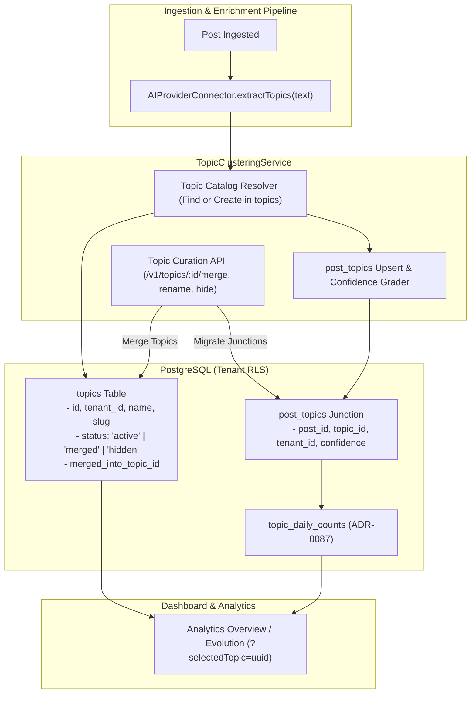

# Technical Design Specification (TDS) — AI Topic Clustering Post Topics Schema

## 1. Document Control & Traceability Linkage

### 1.1 Metadata
| Attribute | Value |
|---|---|
| **Document Title** | TDS-0104: AI Topic Clustering Post Topics Schema — Normalized Topic Catalog, Confidence Junction & Lifecycle Curation |
| **Document ID** | `TDS-0104` |
| **Feature Name** | AI Topic Clustering Engine, Normalized Catalog, Merge/Rename Workflows & Dashboard Filtering |
| **Version** | `1.0.0` |
| **Status** | Approved |
| **Author(s)** | Core Architecture Team |
| **Created Date** | 2026-09-05 |
| **Last Updated** | 2026-09-05 |
| **Governing Skill** | `social-listening-core/.claude/skills/ai-enrichment/SKILL.md` |

### 1.2 Upstream & Downstream Traceability Matrix
| Artifact Type | Reference Identifier | Title / Link | Alignment Status |
|---|---|---|---|
| **Architecture Decision Record** | `ADR-0104` | [ADR-0104: AI Topic Clustering Post Topics Schema](../../adr/0104-ai-topic-clustering-post-topics-schema.md) | Invariant Source |
| **Business Requirements Doc** | `BRD-0104` | [BRD-0104: AI Topic Clustering Post Topics Schema](../Business-Requirements/BRD-0104-AI-Topic-Clustering-Post-Topics-Schema.md) | Fully Aligned |
| **Functional Design Doc** | `FDD-0104` | [FDD-0104: AI Topic Clustering Post Topics Schema](../Functional-Design/FDD-0104-AI-Topic-Clustering-Post-Topics-Schema.md) | Fully Aligned |
| **Governing User Story** | `Story 12.7` | [Epic 12: ADRs 0101–0108](../../user-stories/epic-12-adr-0101-to-0108.md#story-127--ai-topic-clustering-post-topics-schema-backend) | Acceptance Target |
| **Related User Stories** | `Story 12.8`, `Story 10.3`, `Story 11.5` | Topic Curation UI, Preconfigured Views, Topic Evolution Timeline | Consumer Modules |
| **Related Architecture Decisions** | `ADR-0007`, `ADR-0015`, `ADR-0087`, `ADR-0097` | Topic Signal V1, Postgres RLS, Precomputed Views, Topic Evolution | System Architecture |
| **Executable Contract Tests** | `Story 12.7 & 12.8 Contracts` | `social-listening-core/contracts/epic-12/story-12.7.ai-topic-clustering-post-topics-schema.contract.test.ts`<br>`social-listening-admin/contracts/epic-12/story-12.8.topic-curation-selected-topic-ui.contract.test.ts` | 100% Passing |

---

## 2. System Context & Architecture Topology

### 2.1 Context Diagram


### 2.2 Architectural Boundaries & Invariants
- **Normalized Persistence Invariant:** Topic clusters are persisted as discrete rows in the `topics` catalog and linked to posts via the `post_topics` junction table, rather than relying exclusively on unindexed JSONB arrays.
- **Tenant Scope & RLS Invariant:** `topics` and `post_topics` strictly enforce PostgreSQL Row-Level Security via `tenant_id`. Cross-tenant topic discovery or sharing is prohibited.
- **Topic Lifecycle States:**
  - `active`: Standard discoverable topic surfaced in feeds and filters.
  - `merged`: Historical alias redirected to `merged_into_topic_id`. Posts linked to merged topics have their `post_topics.topic_id` repointed to the canonical target.
  - `hidden`: Suppressed from default UI dropdowns and auto-suggest, but historical post associations remain intact.
- **Merge Accounting Invariant:** When Topic A is merged into Topic B, historical `topic_daily_counts` rollups are **not** retroactively altered. Aggregations for Topic B begin accumulating newly merged posts from the merge timestamp onward (ADR-0104 §6).

---

## 3. Data Architecture & Persistence Design

### 3.1 DDL Schema Definition
Migration `0073_create_topics_and_post_topics.sql`:
```sql
CREATE TABLE IF NOT EXISTS topics (
    id UUID PRIMARY KEY DEFAULT gen_random_uuid(),
    tenant_id UUID NOT NULL REFERENCES tenants(id) ON DELETE CASCADE,
    name TEXT NOT NULL,
    slug TEXT NOT NULL,
    description TEXT,
    status TEXT NOT NULL DEFAULT 'active' CHECK (status IN ('active', 'merged', 'hidden')),
    merged_into_topic_id UUID REFERENCES topics(id) ON DELETE SET NULL,
    created_at TIMESTAMPTZ NOT NULL DEFAULT NOW(),
    updated_at TIMESTAMPTZ NOT NULL DEFAULT NOW(),
    CONSTRAINT uq_tenant_topic_slug UNIQUE (tenant_id, slug)
);

ALTER TABLE topics ENABLE ROW LEVEL SECURITY;
CREATE POLICY topics_tenant_isolation ON topics
    FOR ALL USING (tenant_id = current_setting('app.current_tenant_id', true)::uuid);

CREATE TABLE IF NOT EXISTS post_topics (
    post_id UUID NOT NULL REFERENCES social_posts(id) ON DELETE CASCADE,
    topic_id UUID NOT NULL REFERENCES topics(id) ON DELETE CASCADE,
    tenant_id UUID NOT NULL REFERENCES tenants(id) ON DELETE CASCADE,
    confidence NUMERIC(3,2) NOT NULL CHECK (confidence >= 0.0 AND confidence <= 1.0),
    extracted_at TIMESTAMPTZ NOT NULL DEFAULT NOW(),
    PRIMARY KEY (post_id, topic_id)
);

ALTER TABLE post_topics ENABLE ROW LEVEL SECURITY;
CREATE POLICY post_topics_tenant_isolation ON post_topics
    FOR ALL USING (tenant_id = current_setting('app.current_tenant_id', true)::uuid);

CREATE INDEX IF NOT EXISTS idx_post_topics_topic ON post_topics (tenant_id, topic_id);
CREATE INDEX IF NOT EXISTS idx_post_topics_post ON post_topics (tenant_id, post_id);
```

### 3.2 TypeScript Contracts
`social-listening-core/src/topics/types.ts`:
```typescript
export type TopicStatus = 'active' | 'merged' | 'hidden';

export interface Topic {
  id: string;
  tenantId: string;
  name: string;
  slug: string;
  description: string | null;
  status: TopicStatus;
  mergedIntoTopicId: string | null;
  createdAt: string;
  updatedAt: string;
}

export interface PostTopicMatch {
  postId: string;
  topicId: string;
  tenantId: string;
  confidence: number;
  extractedAt: string;
}

export interface ExtractedTopicCandidate {
  name: string;
  confidence: number;
}
```

---

## 4. Application Logic & Workflows

### 4.1 Topic Extraction & Normalization Flow
```typescript
export async function linkPostTopics(
  tenantId: string,
  postId: string,
  candidates: ExtractedTopicCandidate[],
  client: PoolClient
): Promise<void> {
  for (const candidate of candidates) {
    if (candidate.confidence < 0.6) continue; // Noise floor filter

    const slug = slugify(candidate.name);

    // 1. Find or create topic in tenant catalog
    const topicResult = await client.query(
      `INSERT INTO topics (tenant_id, name, slug)
       VALUES ($1, $2, $3)
       ON CONFLICT (tenant_id, slug) 
       DO UPDATE SET updated_at = NOW()
       RETURNING id, status, merged_into_topic_id`,
      [tenantId, candidate.name, slug]
    );

    let targetTopicId = topicResult.rows[0].id;
    if (topicResult.rows[0].status === 'merged' && topicResult.rows[0].merged_into_topic_id) {
      targetTopicId = topicResult.rows[0].merged_into_topic_id;
    }

    // 2. Upsert into junction
    await client.query(
      `INSERT INTO post_topics (post_id, topic_id, tenant_id, confidence)
       VALUES ($1, $2, $3, $4)
       ON CONFLICT (post_id, topic_id) 
       DO UPDATE SET confidence = EXCLUDED.confidence`,
      [postId, targetTopicId, tenantId, candidate.confidence]
    );
  }
}
```

### 4.2 Topic Merge Workflow
```typescript
export async function mergeTopics(
  tenantId: string,
  sourceTopicId: string,
  targetTopicId: string,
  client: PoolClient
): Promise<void> {
  // 1. Mark source as merged
  await client.query(
    `UPDATE topics 
     SET status = 'merged', merged_into_topic_id = $1, updated_at = NOW() 
     WHERE tenant_id = $2 AND id = $3`,
    [targetTopicId, tenantId, sourceTopicId]
  );

  // 2. Re-point post_topics junction rows
  await client.query(
    `INSERT INTO post_topics (post_id, topic_id, tenant_id, confidence)
     SELECT post_id, $1, tenant_id, confidence 
     FROM post_topics 
     WHERE tenant_id = $2 AND topic_id = $3
     ON CONFLICT (post_id, topic_id) DO NOTHING`,
    [targetTopicId, tenantId, sourceTopicId]
  );

  // 3. Delete old junction mappings
  await client.query(
    `DELETE FROM post_topics WHERE tenant_id = $1 AND topic_id = $2`,
    [tenantId, sourceTopicId]
  );
}
```

---

## 5. Interface & API Contracts

### 5.1 Route Catalog
| Method | Endpoint | Authorization | Description |
|---|---|---|---|
| `GET` | `/v1/topics` | Tenant-User | Lists active topics in the catalog |
| `POST` | `/v1/topics/:id/rename` | Tenant-Admin | Renames topic and updates slug |
| `POST` | `/v1/topics/:id/merge` | Tenant-Admin | Merges source topic into target topic |
| `POST` | `/v1/topics/:id/hide` | Tenant-Admin | Sets topic status to hidden |

### 5.2 Merge Request Contract (`POST /v1/topics/:id/merge`)
**Request Body:**
```json
{
  "targetTopicId": "b1a2c3d4-e5f6-7890-abcd-1234567890ab"
}
```

**Response (200 OK):**
```json
{
  "id": "a9b8c7d6-e5f4-3210-fedc-ba9876543210",
  "status": "merged",
  "mergedIntoTopicId": "b1a2c3d4-e5f6-7890-abcd-1234567890ab",
  "migratedPostCount": 142
}
```

---

## 6. Security, Tenancy & Isolation Model
- **Cross-Tenant Guard:** `post_topics` and `topics` queries filter strictly by `tenant_id = current_setting('app.current_tenant_id', true)::uuid`. An attempt to merge into a topic belonging to another tenant is blocked with HTTP 400 (`CROSS_TENANT_MERGE_FORBIDDEN`).

---

## 7. Performance, Scalability & Resource Caps
- **Junction Query Overhead:** Index `idx_post_topics_topic` allows finding all posts under a `selectedTopic` filter in $< 5\text{ms}$.
- **Candidate Cap:** Max 5 topics assigned per post during initial ingestion to preserve cluster separation and bound junction rows.

---

## 8. Resilience, Recovery & Failure Semantics
- **Atomic Curation:** Topic merges execute inside single database transactions (`BEGIN ... COMMIT`), preventing dangling pointers or orphaned junction rows.

---

## 9. Observability, Telemetry & Auditability
- **Metrics Tracked:**
  - `topics_extracted_total{tenant_id}`
  - `topics_merged_total{tenant_id}`
  - `topics_hidden_total{tenant_id}`

---

## 10. Migration, Compatibility & Rollback Strategy
- **Migration Plan:** `0073_create_topics_and_post_topics.sql` introduces normalized tables without interrupting existing JSONB enrichment storage.
- **Rollback:** Dropping `post_topics` and `topics` restores ingestion to JSONB-only clustering.

---

## 11. Verification, Testing & Quality Assurance
- **Contract Tests:**
  - `social-listening-core/contracts/epic-12/story-12.7.ai-topic-clustering-post-topics-schema.contract.test.ts`:
    - (1) Confirms `topics` and `post_topics` record creation from AI candidates.
    - (2) Proves `POST /v1/topics/:id/merge` updates junctions and status.
    - (3) Verifies `POST /v1/topics/:id/rename` updates slug.
  - `social-listening-admin/contracts/epic-12/story-12.8.topic-curation-selected-topic-ui.contract.test.ts`:
    - Validates `selectedTopic` dashboard header filtering and deep-link preservation.

---

## 12. Open Questions & Future Enhancements

- [ ] **[Q-0104-1]** **Hierarchical Topic Taxonomies:** Supporting parent/child relationship pointers in `topics.parent_topic_id`.
- [ ] **[Q-0104-2]** **Automated Near-Duplicate Clustering:** Scheduling an AI background job to propose candidate topic merges based on embedding similarity.
- [ ] **[Q-0104-4]** **Topic Visual Badges:** Adding `color` and `icon` properties to `topics` table for dashboard visualization.
