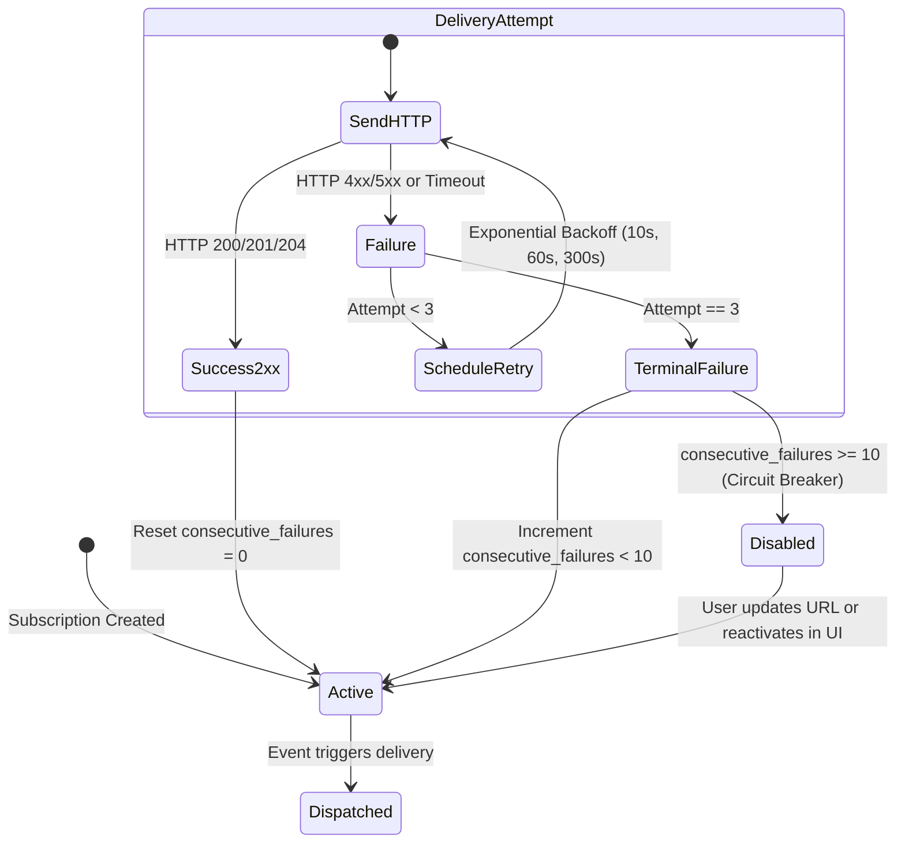

# TDS-0106: API and Integrations — Versioning and Webhooks

**Status:** Approved  
**Date:** 2026-09-05  
**Governing ADR:** [ADR-0106](../../adr/0106-api-and-integrations-versioning-and-webhooks.md)  
**Related Epics/Stories:** [Epic 12 / Story 12.11, 12.12](../../user-stories/epic-12-adr-0101-to-0108.md), [Epic 1 / Story 1.3](../../user-stories/epic-1-tenant-foundation-and-watchlists.md), [Epic 10 / Story 10.9](../../user-stories/epic-10-adr-0086-to-0094.md)  
**Target Repositories:** `social-listening-core`, `social-listening-admin`  
**Contract Test Citations:**  
- `social-listening-core/contracts/epic-12/story-12.11.public-api-and-webhooks.contract.test.ts`  
- `social-listening-admin/contracts/epic-12/story-12.12.webhook-management-ui.contract.test.ts`  

---

## 1. Architectural Context & Problem Statement

As enterprise tenants integrate SocialEngage into their operational workflows (Slack, Microsoft Teams, Zapier, internal SIEM/SOAR platforms, and bespoke BI pipelines), relying on polling the core REST API creates unacceptable latency and API rate-limit exhaustion.

Enterprise developer integrations require:
1. **Governed Public API Surface:** Exposing key read-path resources (`/v1/posts`, `/v1/watchlists`, `/v1/analytics/query`) with strict per-tenant sliding-window rate limiting.
2. **Real-Time Webhook Event Delivery:** Pushing events (`post.ingested`, `alert.triggered`, `connector.health.changed`) to external customer HTTPS endpoints immediately upon occurrence.
3. **Cryptographic Payload Verification:** Signing all outbound webhook payloads using HMAC-SHA256 to ensure data integrity and prevent spoofing.
4. **Resilient Retry & Circuit Breaking:** Automatic exponential backoff retries and auto-disable policies for repeatedly failing subscriber endpoints.
5. **Self-Service Developer Console:** An administrative UI in `social-listening-admin` to configure subscriptions, test ping endpoints, and inspect delivery logs.

This specification formalizes:
1. The `webhook_subscriptions` and `webhook_delivery_logs` PostgreSQL schemas with tenant RLS.
2. The asynchronous `WebhookDeliveryWorker` consuming event buses and executing signed HTTP deliveries.
3. Public API rate-limiting middleware in Fastify.
4. The Webhook Management developer console in `social-listening-admin`.

```mermaid
flowchart TD
    subgraph UI ["social-listening-admin (Story 12.12)"]
        DevConsole["Developer Settings (/tenant/settings/webhooks)"] --> WebhookForm["New Webhook Modal"]
        WebhookForm -->|POST /v1/webhooks/subscriptions| BFF["BFF API Client"]
        DevConsole -->|Clicks 'Send Test Ping'| TestPing["POST /v1/webhooks/subscriptions/:id/ping"]
    end

    subgraph Core ["social-listening-core (Story 12.11)"]
        EventStream["Internal Event Bus (ServiceBus / Ingestion Engine)"] --> WebhookDispatcher["WebhookDispatcherService"]
        WebhookDispatcher --> FindSubs["Query active subscriptions for eventType"]
        FindSubs --> TSubs[("webhook_subscriptions (PostgreSQL)")]
        
        WebhookDispatcher --> EnqueueDelivery["Enqueue WebhookJob (BullMQ)"]
        EnqueueDelivery --> Worker["WebhookDeliveryWorker"]
        
        Worker --> Signer["HMAC-SHA256 Signature Generator"]
        Signer --> HTTPPost["HTTP POST with X-Signature-SHA256"]
        
        HTTPPost --> CustomerEndpoint["External Customer Webhook Endpoint"]
        CustomerEndpoint -->|200 OK| LogSuccess["Log status='delivered'"]
        CustomerEndpoint -->|4xx / 5xx / Timeout| LogRetry["Retry with Backoff / Auto-Disable after 10 fails"]
        
        LogSuccess --> TLogs[("webhook_delivery_logs")]
        LogRetry --> TLogs
    end
```



---

## 2. Governing ADRs & Decision Log Reference

- [ADR-0106: API and integrations — versioning and webhooks](../../adr/0106-api-and-integrations-versioning-and-webhooks.md) — Authorizes public API surface, sliding-window rate limits, and HMAC-signed webhook delivery.
- [ADR-0017: Multi-Tenant Database Architecture & Row-Level Security](../../adr/0017-multi-tenant-database-architecture-and-row-level-security.md) — Multi-tenant database boundary.
- [ADR-0019: Event Schema Versioning Policy](../../adr/0019-event-schema-versioning-policy.md) — CloudEvents schema compliance for webhook payloads.
- [ADR-0091: Real-Time Alert Rules and Delivery](../../adr/0091-real-time-alert-rules-and-delivery.md) — Alert event emission source.

---

## 3. Scope, Precedence & Anti-Goals

### In Scope
- Public API rate limiting: 1,000 requests/minute per tenant globally; 100 requests/minute on compute-heavy query endpoints (`/v1/posts`, `/v1/analytics/query`).
- Standard rate-limit headers: `X-RateLimit-Limit`, `X-RateLimit-Remaining`, `X-RateLimit-Reset`.
- CRUD management for `webhook_subscriptions`.
- Event taxonomy: `post.ingested`, `alert.triggered`, `connector.health.changed`, `mention.threshold.crossed`.
- HMAC-SHA256 cryptographic signature header: `X-Signature-SHA256`.
- Delivery worker with 3 retries (intervals: 10s, 60s, 300s); auto-disable upon 10 consecutive failures.
- Webhook management console in `social-listening-admin`.

### Precedence Invariant
$$\text{HMAC-SHA256 Signature} \land \text{Tenant RLS Isolation}$$
Every webhook payload must be signed using the subscription's unique secret key. A tenant can only receive events originating from their own workspace.

### Anti-Goals
- Inbound webhook receivers for arbitrary third-party payloads (scoped exclusively to outbound event webhooks).
- Indefinite retry loops (failing endpoints terminate after 3 retries per event).

---

## 4. Data Architecture & Storage Schema

```sql
-- Migration: 0106_create_webhook_tables.sql

CREATE TABLE IF NOT EXISTS webhook_subscriptions (
    id UUID PRIMARY KEY DEFAULT gen_random_uuid(),
    tenant_id UUID NOT NULL REFERENCES tenants(id) ON DELETE CASCADE,
    url TEXT NOT NULL,
    events TEXT[] NOT NULL,
    secret TEXT NOT NULL,
    active BOOLEAN NOT NULL DEFAULT TRUE,
    consecutive_failures INT NOT NULL DEFAULT 0,
    created_at TIMESTAMPTZ NOT NULL DEFAULT NOW(),
    updated_at TIMESTAMPTZ NOT NULL DEFAULT NOW()
);

CREATE TABLE IF NOT EXISTS webhook_delivery_logs (
    id UUID PRIMARY KEY DEFAULT gen_random_uuid(),
    subscription_id UUID NOT NULL REFERENCES webhook_subscriptions(id) ON DELETE CASCADE,
    tenant_id UUID NOT NULL REFERENCES tenants(id) ON DELETE CASCADE,
    event_type TEXT NOT NULL,
    payload JSONB NOT NULL,
    response_status INT,
    response_body TEXT,
    duration_ms INT NOT NULL,
    status TEXT NOT NULL CHECK (status IN ('delivered', 'failed', 'retrying')),
    attempt_number INT NOT NULL DEFAULT 1,
    created_at TIMESTAMPTZ NOT NULL DEFAULT NOW()
);

-- Indexing Strategy
CREATE INDEX IF NOT EXISTS idx_webhook_subscriptions_tenant 
    ON webhook_subscriptions(tenant_id, active);

CREATE INDEX IF NOT EXISTS idx_webhook_delivery_logs_sub 
    ON webhook_delivery_logs(tenant_id, subscription_id, created_at DESC);

-- Row Level Security
ALTER TABLE webhook_subscriptions ENABLE ROW LEVEL SECURITY;
ALTER TABLE webhook_delivery_logs ENABLE ROW LEVEL SECURITY;

CREATE POLICY webhook_subs_tenant_isolation ON webhook_subscriptions
    AS RESTRICTIVE
    USING (tenant_id = NULLIF(current_setting('app.current_tenant_id', true), '')::uuid)
    WITH CHECK (tenant_id = NULLIF(current_setting('app.current_tenant_id', true), '')::uuid);

CREATE POLICY webhook_logs_tenant_isolation ON webhook_delivery_logs
    AS RESTRICTIVE
    USING (tenant_id = NULLIF(current_setting('app.current_tenant_id', true), '')::uuid)
    WITH CHECK (tenant_id = NULLIF(current_setting('app.current_tenant_id', true), '')::uuid);
```

---

## 5. Component & Interface Contracts

### 5.1 Webhook Types (`social-listening-core`)

```typescript
export type WebhookEventType = 
  | 'post.ingested' 
  | 'alert.triggered' 
  | 'connector.health.changed' 
  | 'mention.threshold.crossed';

export interface WebhookSubscriptionRecord {
  id: string;
  tenantId: string;
  url: string;
  events: WebhookEventType[];
  secret: string;
  active: boolean;
  consecutiveFailures: number;
  createdAt: string;
  updatedAt: string;
}

export interface WebhookEventPayload<T = unknown> {
  id: string; // UUID of event
  specversion: '1.0';
  type: WebhookEventType;
  source: string; // e.g. '/tenants/{tenantId}/watchlists/{watchlistId}'
  time: string;   // ISO-8601 UTC
  datacontenttype: 'application/json';
  data: T;
}
```

### 5.2 API Route Specification

#### `POST /v1/webhooks/subscriptions`
Registers a new webhook subscription. Generates a secure random 32-byte hexadecimal secret if not provided.

#### `GET /v1/webhooks/subscriptions`
Lists all active and inactive webhook subscriptions for the calling tenant.

#### `POST /v1/webhooks/subscriptions/:id/ping`
Dispatches an immediate synthetic `test.ping` event to verify endpoint connectivity.

---

## 6. State Machine & Lifecycle Transitions



---

## 7. Security, Tenant Isolation & Authentication

1. **HMAC-SHA256 Signing:** Outbound HTTP requests calculate the HMAC signature of the exact request body string:
   $$\text{Signature} = \text{HMAC-SHA256}(\text{rawBody}, \text{secret})$$
   Sent in the header `X-Signature-SHA256: sha256={hexHash}`.
2. **SSRF Guard:** Webhook target URLs are validated using DNS resolution filters, blocking private RFC 1918 IPs (`10.0.0.0/8`, `172.16.0.0/12`, `192.168.0.0/16`) and cloud metadata services (`169.254.169.254`).

---

## 8. Performance, Scalability & Resource Boundaries

1. **Asynchronous BullMQ Pipeline:** Deliveries are offloaded to Redis BullMQ worker queues (`webhook-delivery-queue`), ensuring that API response latency is completely unaffected by slow customer endpoints.
2. **HTTP Timeout:** Delivery worker requests enforce a strict 5-second socket connection and response timeout.

---

## 9. Error Handling, Retries & Fallback Strategies

| Event | Status Code | System Action |
|---|---|---|
| Customer endpoint returns 500 | `retrying` | Schedules retry 1 in 10s; retry 2 in 60s; retry 3 in 300s |
| Customer endpoint returns 404 / 410 | `failed` | Skips retries; immediately increments `consecutive_failures` |
| 10 consecutive failed deliveries | `disabled` | Marks `active = false`; emails tenant admin with notification |

---

## 10. Observability, Telemetry & Audit Trail

- **Telemetry Metrics:**
  - `webhooks_dispatched_total{tenant_id, event_type, status}` — Counter of delivery attempts.
  - `webhook_delivery_latency_seconds` — Histogram of external endpoint round-trip latencies.
  - `rate_limit_exceeded_total{tenant_id, endpoint}` — Public API throttling counter.

---

## 11. Migration & Backward Compatibility Strategy

- **Additive Schema:** Creates `webhook_subscriptions` and `webhook_delivery_logs`.
- **Public API Continuity:** Transparently enhances existing endpoints with standard rate-limit headers.

---

## 12. Executable Contract Test Citations & Verification Matrix

### 12.1 Contract Test Specifications
1. `social-listening-core/contracts/epic-12/story-12.11.public-api-and-webhooks.contract.test.ts`:
   - `test('enforces sliding-window rate limit on public endpoints with rate-limit headers')`
   - `test('dispatches webhook with valid HMAC-SHA256 signature in X-Signature-SHA256 header')`
   - `test('retries failed webhook delivery with exponential backoff')`
   - `test('disables webhook subscription after 10 consecutive delivery failures')`
   - `test('blocks SSRF attempts to private loopback and metadata IP addresses')`
2. `social-listening-admin/contracts/epic-12/story-12.12.webhook-management-ui.contract.test.ts`:
   - `test('renders webhook subscriptions list and subscription creation form')`
   - `test('generates and displays signing secret with copy button')`
   - `test('triggers test ping and renders delivery status badge')`

### 12.2 Open Questions

- [x] ~~**[Q-0106-1]** How are webhooks signed?~~  
  *Decision:* HMAC-SHA256 over raw JSON payload sent in header `X-Signature-SHA256: sha256=<hex>`.
- [x] ~~**[Q-0106-2]** When is a failing webhook disabled?~~  
  *Decision:* Automatically after 10 consecutive delivery failures to prevent network waste.
