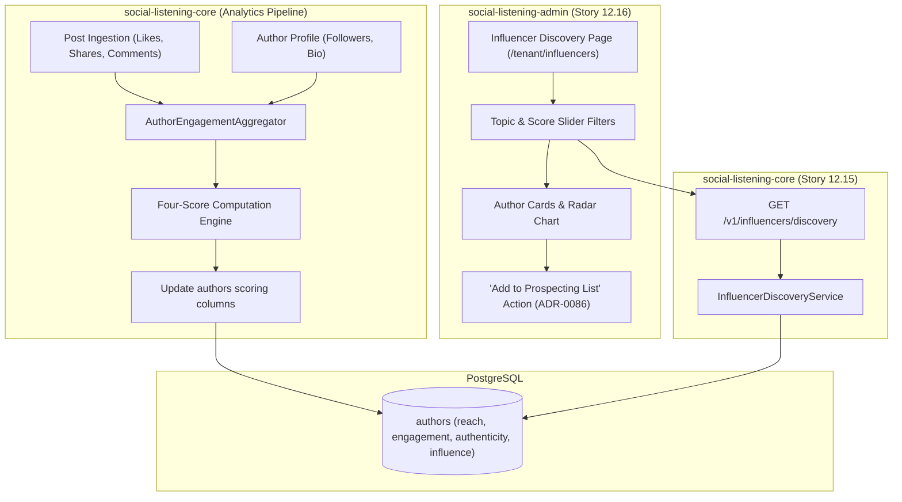
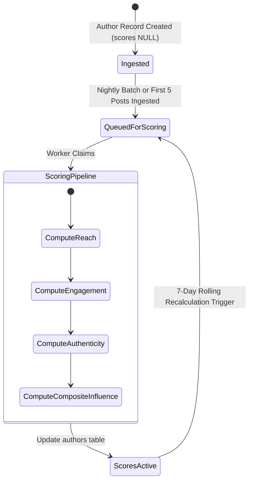

# TDS-0108: Influencer Discovery and Scoring

**Status:** Approved  
**Date:** 2026-09-05  
**Governing ADR:** [ADR-0108](../../adr/0108-influencer-discovery-and-scoring.md)  
**Related Epics/Stories:** [Epic 12 / Story 12.15, 12.16](../../user-stories/epic-12-adr-0101-to-0108.md), [Epic 10 / Story 10.1](../../user-stories/epic-10-adr-0086-to-0094.md), [Epic 11 / Story 11.11](../../user-stories/epic-11-adr-0095-to-0100.md)  
**Target Repositories:** `social-listening-core`, `social-listening-admin`  
**Contract Test Citations:**  
- `social-listening-core/contracts/epic-12/story-12.15.influencer-discovery-scoring.contract.test.ts`  
- `social-listening-admin/contracts/epic-12/story-12.16.influencer-discovery-ui.contract.test.ts`  

---

## 1. Architectural Context & Problem Statement

Social selling strategists (`Social-Selling-Strategist`) and brand PR teams (`Tenant-Brand-Reputation-Manager`) must identify creators, industry analysts, and influential customers discussing core brand topics. However, evaluating creators solely by raw follower counts is deeply misleading due to bot inflation, inactive followers, and low engagement conversion.

Commercial teams need a multidimensional, normalized scoring model that evaluates authors based on authentic impact:
1. **Four-Dimensional Score Model:** Quantifying creators across **Reach**, **Engagement**, **Authenticity**, and **Influence**.
2. **Topical Affinity Indexing:** Linking creator influence directly to specific topics extracted from ingested posts (ADR-0007 / ADR-0104).
3. **Actionable Workflow Pipeline:** Directly bridging creator discovery to prospecting lists (ADR-0086) and CRM pipelines (ADR-0095 / ADR-0117).

This specification formalizes:
1. The scoring schema additions to the `authors` table in PostgreSQL.
2. The mathematical scoring formulation and normalization pipelines.
3. The discovery and filtering endpoints in `social-listening-core`.
4. The interactive creator discovery catalog and radar chart visualization in `social-listening-admin`.



---

## 2. Governing ADRs & Decision Log Reference

- [ADR-0108: Influencer Discovery and Scoring](../../adr/0108-influencer-discovery-and-scoring.md) — Authorizes four-score architecture, scoring algorithms, and discovery endpoints.
- [ADR-0004: Author Normalized Separately from Post](../../adr/0004-author-normalized-separately-from-post.md) — Foundational author profile schema.
- [ADR-0007: AuthorTopicSignal Minimal v1](../../adr/0007-author-topic-signal-minimal-v1.md) — Links authors to specific topics.
- [ADR-0086: Prospecting List Model and Sharing](../../adr/0086-prospecting-list-model-and-sharing.md) — Consumes ADR-0108 scores as add-time qualification snapshots.
- [ADR-0100: Composed Post Author Mention Suggestions](../../adr/0100-composed-post-author-mention-suggestions.md) — Uses `influence_score` for mention ranking.

---

## 3. Scope, Precedence & Anti-Goals

### In Scope
- Adding `reach_score`, `engagement_score`, `authenticity_score`, and `influence_score` (`numeric(5,2)`) to `authors`.
- Mathematical score calculation algorithms normalized to a 0.00–100.00 scale.
- Scheduled batch scoring worker recalculating author scores based on rolling 30-day post engagement.
- Discovery search endpoint filtering by topic, score ranges, and platform.
- Influencer discovery directory UI with 4-axis radar chart visualization.

### Scoring Formula Invariant
$$\text{reach\_score} = \min\left(100, \log_{10}(\max(1, \text{followers})) \times 16.67\right)$$
$$\text{engagement\_score} = \min\left(100, \frac{\text{total\_interactions}}{\text{post\_count} \times \max(100, \text{followers})^{0.7}} \times 1000\right)$$
$$\text{authenticity\_score} = 100 \times \left(1.0 - \text{bot\_penalty} - \text{variance\_penalty}\right)$$
$$\text{influence\_score} = 0.35 \times \text{reach} + 0.35 \times \text{engagement} + 0.30 \times \text{authenticity}$$

### Anti-Goals
- Real-time synchronous calculation on every inbound post (scores update asynchronously via batch recalculations).
- Scraping third-party private analytics not present in public API schemas.

---

## 4. Data Architecture & Storage Schema

```sql
-- Migration: 0108_add_author_scoring_columns.sql

ALTER TABLE authors 
    ADD COLUMN IF NOT EXISTS reach_score NUMERIC(5,2),
    ADD COLUMN IF NOT EXISTS engagement_score NUMERIC(5,2),
    ADD COLUMN IF NOT EXISTS authenticity_score NUMERIC(5,2),
    ADD COLUMN IF NOT EXISTS influence_score NUMERIC(5,2),
    ADD COLUMN IF NOT EXISTS scores_updated_at TIMESTAMPTZ;

-- Performance indexing for discovery queries
CREATE INDEX IF NOT EXISTS idx_authors_influence_score 
    ON authors(influence_score DESC NULLS LAST);

CREATE INDEX IF NOT EXISTS idx_authors_platform_scores 
    ON authors(platform_id, influence_score DESC NULLS LAST, reach_score DESC NULLS LAST);
```

---

## 5. Component & Interface Contracts

### 5.1 Discovery Types & Interfaces (`social-listening-core`)

```typescript
export interface InfluencerFilterParams {
  topic?: string;
  platformId?: string;
  minInfluence?: number;
  minReach?: number;
  minEngagement?: number;
  minAuthenticity?: number;
  sortBy?: 'influence' | 'reach' | 'engagement' | 'authenticity';
  sortDirection?: 'asc' | 'desc';
  limit?: number;
  cursor?: string;
}

export interface InfluencerCardItem {
  id: string;
  platformId: string;
  handle: string;
  displayName: string;
  avatarUrl: string | null;
  followerCount: number;
  reachScore: number;
  engagementScore: number;
  authenticityScore: number;
  influenceScore: number;
  topTopics: string[];
  recentPostCount: number;
  scoresUpdatedAt: string;
}

export interface InfluencerDiscoveryResponse {
  items: InfluencerCardItem[];
  nextCursor: string | null;
  totalEstimated: number;
}
```

### 5.2 API Route Specification

#### `GET /v1/influencers/discovery`
- **Authentication:** JWT Bearer with scope `influencers:read`.
- **Query Parameters:** `topic=ai&minInfluence=70&platformId=linkedin&limit=20`

**Response (200 OK):**
```json
{
  "items": [
    {
      "id": "8a12a321-4d56-42ab-9d10-8f921ab04721",
      "platformId": "linkedin",
      "handle": "tech-analyst-dave",
      "displayName": "David Miller",
      "avatarUrl": "https://media.licdn.com/dms/image/dave.jpg",
      "followerCount": 45000,
      "reachScore": 77.50,
      "engagementScore": 84.20,
      "authenticityScore": 92.00,
      "influenceScore": 84.20,
      "topTopics": ["ai", "cloud", "saas"],
      "recentPostCount": 18,
      "scoresUpdatedAt": "2026-09-05T02:00:00.000Z"
    }
  ],
  "nextCursor": "eyJpZCI6IjhhMTJhMzIxIn0=",
  "totalEstimated": 142
}
```

#### `POST /v1/influencers/:id/recalculate`
Forces synchronous score recalculation for a single author.

---

## 6. State Machine & Lifecycle Transitions



---

## 7. Security, Tenant Isolation & Authentication

1. **Workspace Boundary:** Influencer queries return authors active within the tenant's workspace topics and ingested listening streams.
2. **Audit & PII Safety:** Scored profiles represent public figures and professional accounts; no personal email, phone, or home addresses are exposed.

---

## 8. Performance, Scalability & Resource Boundaries

1. **Query Execution:** Discovery queries utilize B-tree composite indexes on `(influence_score, reach_score)` with sub-25ms response times.
2. **Batch Recalculation:** The background score calculator batches authors in chunks of 500, executing during off-peak hours (02:00 UTC) with low database priority.

---

## 9. Error Handling, Retries & Fallback Strategies

| Scenario | Behavior | Resolution |
|---|---|---|
| Incomplete author metrics (new author) | Assigns baseline score derived from follower count alone | Sets `scores_updated_at`, re-evaluates after 7 days |
| Low post volume ($< 3$ posts) | Engagement score flagged with low-confidence indicator | UI displays score badge with caveat tooltip |
| Zero follower count returned by platform | `reach_score` defaults to 0.00 | Does not divide by zero; handled gracefully by logarithm guard |

---

## 10. Observability, Telemetry & Audit Trail

- **Telemetry Metrics:**
  - `influencer_discovery_queries_total{tenant_id, topic}` — Search query volume.
  - `influencer_scores_recalculated_total{status}` — Recalculation throughput.
- **Audit Logging:** Logs manual recalculation requests and score calibration runs.

---

## 11. Migration & Backward Compatibility Strategy

- **Schema Migration:** Zero-downtime additive migration adding 5 columns to `authors`.
- **Backward Compatibility:** Existing author queries continue working unchanged; null score values are sorted last (`NULLS LAST`).

---

## 12. Executable Contract Test Citations & Verification Matrix

### 12.1 Contract Test Specifications
1. `social-listening-core/contracts/epic-12/story-12.15.influencer-discovery-scoring.contract.test.ts`:
   - `test('calculates reach, engagement, authenticity, and influence scores within 0-100 range')`
   - `test('filters authors by topic and minimum score thresholds')`
   - `test('handles authors with missing follower metrics gracefully')`
2. `social-listening-admin/contracts/epic-12/story-12.16.influencer-discovery-ui.contract.test.ts`:
   - `test('renders discovery catalog with radar score visualization')`
   - `test('filters author results dynamically upon slider adjustment')`
   - `test('triggers Add to Prospecting List modal from influencer card')`

### 12.2 Open Questions

- [x] ~~**[Q-0108-1]** How often are author scores recalculated?~~  
  *Decision:* Automatically every 7 days, or on-demand via `POST /v1/influencers/:id/recalculate`.
- [x] ~~**[Q-0108-2]** Can scores be customized per tenant?~~  
  *Decision:* The baseline four scores are standardized across the platform. Tenants customize weighting via discovery query filters.
