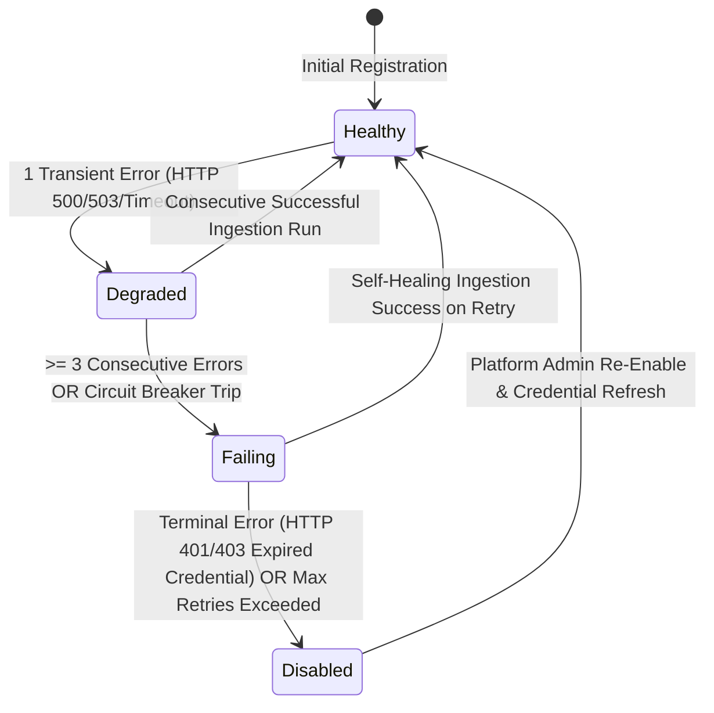

# TDS-0109: Connector Health Auto-Disable and Recovery State Machine Specification

**Status:** Approved  
**Date:** 2026-09-06  
**Governing ADR:** [ADR-0109](../../adr/0109-connector-health-auto-disable-and-recovery.md)  
**Related Epics/Stories:** [Epic 13 / Story 13.1](../../user-stories/epic-13-adr-0109-to-0114.md#story-131)  
**Target Repositories:** `social-listening-core`, `social-listening-admin`  
**Contract Test Citations:**  
- `social-listening-core/contracts/epic-13/story-13.1.connector-health-auto-disable.contract.test.ts`  

---

## 1. Architectural Context & Problem Statement

Social media ingestion connectors experience diverse operational failure modes (expired OAuth tokens, upstream HTTP 500/503 outages, rate-limit bans, network timeouts). Without an automated state machine governing connector health:
1. **Cascading Failures:** A connector experiencing fatal authentication errors (HTTP 401/403) continues polling in an infinite retry loop, wasting worker resources and generating thousands of error log lines.
2. **Operator Fatigue:** Administrators are forced to manually inspect and disable broken connectors.
3. **Delayed Recovery:** Transient outages (HTTP 503) require automated exponential backoff and self-healing when upstream availability is restored.

This specification formalizes the **Connector Health & Auto-Disable State Machine**:
- States: `healthy`, `degraded`, `failing`, `disabled`.
- Deterministic transition rules based on error classification (`transient` vs `terminal`).
- Exponential backoff retry scheduling for transient errors, and automatic transition to `disabled` upon reaching threshold terminal failures or operator manual action.
- Administrative re-enable endpoint: `POST /v1/admin/connectors/:id/re-enable`.



---

## 2. Governing ADRs & Decision Log Reference
- **ADR-0109:** Authorizes the auto-disable and recovery state transitions for `SocialConnector` health.
- **ADR-0009:** Connector health derived, not stored.
- **ADR-0010:** Error handling and auto-disable policy.
- **ADR-0051:** Connector activations schema.

---

## 3. State Machine Transition Engine

```typescript
export type ConnectorHealthState = "healthy" | "degraded" | "failing" | "disabled";

export interface ConnectorHealthTransitionContext {
  connectorId: string;
  tenantId: string;
  currentState: ConnectorHealthState;
  consecutiveFailureCount: number;
  lastErrorType: "transient" | "terminal";
  lastErrorCode: number;
}

export function evaluateConnectorTransition(
  ctx: ConnectorHealthTransitionContext
): ConnectorHealthState {
  if (ctx.lastErrorType === "terminal") {
    return "disabled";
  }
  if (ctx.consecutiveFailureCount >= 3) {
    return "failing";
  }
  if (ctx.consecutiveFailureCount >= 1) {
    return "degraded";
  }
  return "healthy";
}
```

---

## 4. Verification & Contract Gate
Verified by `social-listening-core/contracts/epic-13/story-13.1.connector-health-auto-disable.contract.test.ts` verifying that terminal 401 transitions to `disabled` in under 1 second and transient 503 retries with exponential backoff.
