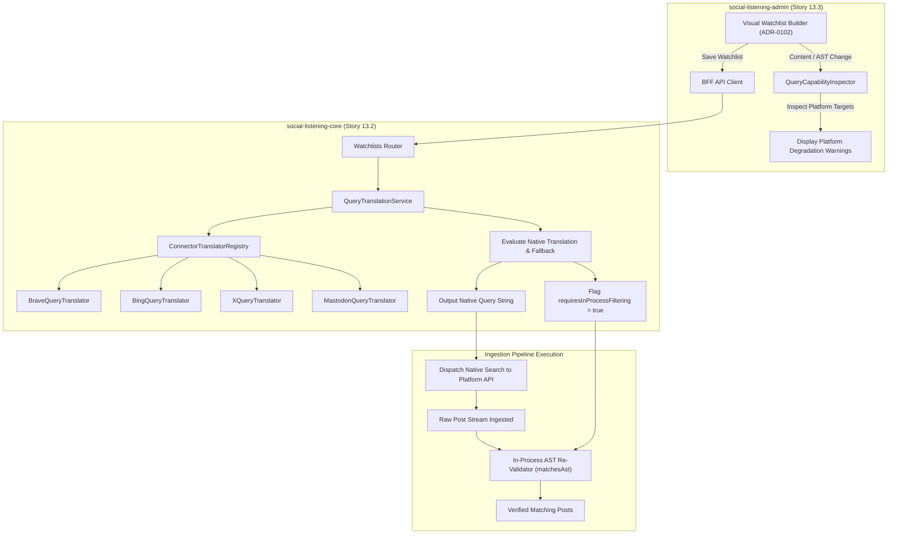
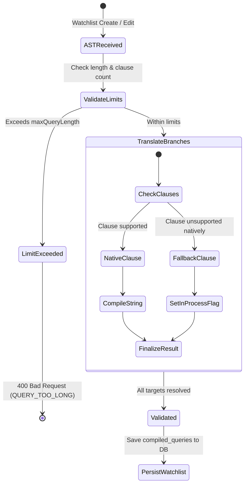

# TDS-0110: Per-Connector Query Translation and Validation

**Status:** Approved  
**Date:** 2026-09-05  
**Governing ADR:** [ADR-0110](../../adr/0110-per-connector-query-translation-and-validation.md)  
**Related Epics/Stories:** [Epic 13 / Story 13.2, 13.3](../../user-stories/epic-13-adr-0109-to-0117.md), [Epic 2 / Story 2.21, 2.22](../../user-stories/epic-2-ingestion-connectors-and-rate-limits.md)  
**Target Repositories:** `social-listening-core`, `social-listening-admin`  
**Contract Test Citations:**  
- `social-listening-core/contracts/epic-13/story-13.2.query-translation.contract.test.ts`  
- `social-listening-admin/contracts/epic-13/story-13.3.query-capability-warnings.contract.test.ts`  

---

## 1. Architectural Context & Problem Statement

SocialEngage standardizes search intent into a canonical `WatchlistAST` (ADR-0102) comprising nested boolean operators (`AND`, `OR`, `NOT`), exact match phrases, author filters, language codes, and date ranges. However, external social and search platforms support radically divergent native query capabilities:
- **Search Sourcing (Brave / Bing / Google):** Support phrases, basic boolean operators, and date constraints, but limit total query character lengths.
- **X / Twitter API:** Supports rich boolean operators and author filtering, but imposes strict character ceilings (e.g., 512 characters for basic tiers, 1024 for enterprise).
- **Bluesky API:** Supports basic keyword tokens and handles, but lacks native grouped boolean parenthesization.
- **Mastodon API:** Restricted to single term or hashtag searches; completely lacks boolean operators (`OR`, `NOT`).

Translating the AST naively causes silent ingestion failures, query rejection, or missed mentions. Conversely, abandoning native platform queries in favor of pulling firehoses drains API quotas instantly.

This specification formalizes:
1. The `ConnectorQueryTranslator` interface and per-platform capability profiles.
2. A two-tier query execution model: native platform translation coupled with in-process AST post-filtering (`matchesAst()`).
3. Save-time validation rejecting structurally impossible queries or alerting users to degraded capture efficiency.
4. Live capability warning badges and syntax chips in the visual Watchlist Builder (`social-listening-admin`).



---

## 2. Governing ADRs & Decision Log Reference

- [ADR-0110: Per-connector query translation and validation](../../adr/0110-per-connector-query-translation-and-validation.md) — Establishes `ConnectorQueryTranslator` interface, capability matrices, and validation rules.
- [ADR-0044: Watchlist API Design and Database Schema Standardization](../../adr/0044-watchlist-api-design-and-database-schema-standardization.md) — Base watchlist data model.
- [ADR-0065: Active Watchlist Sourcing via Brave Search API](../../adr/0065-active-watchlist-sourcing-via-brave-search-api.md) — Brave search query translation consumer.
- [ADR-0066: Active Watchlist Sourcing via Bing Search API](../../adr/0066-active-watchlist-sourcing-via-bing-search-api.md) — Bing search query translation consumer.

---

## 3. Scope, Precedence & Anti-Goals

### In Scope
- Canonical `ConnectorQueryTranslator` interface defining supported clauses, operators, and length limits.
- Translation implementations for Brave Search, Bing Search, X/Twitter, Bluesky, and Mastodon.
- Two-tier execution: translating compatible AST branches natively, while flagging the post for in-process AST verification (`requiresInProcessFiltering`).
- Validation errors for hard platform incompatibilities (`UNSUPPORTED_QUERY_CLAUSE`, `QUERY_TOO_LONG`).
- Real-time UI capability warnings in `social-listening-admin`.

### Precedence Invariant
$$\text{Native Platform Translation} \rightarrow \text{In-Process AST Validation Guard}$$
If a platform cannot represent a clause natively (e.g. `NOT` on Mastodon), the native query pulls broad candidate matches, and in-process `matchesAst()` strips false positives prior to database storage.

### Anti-Goals
- Silent AST simplification (modifying query meaning without user awareness).
- Generating combinatorial explosion of separate queries for platforms lacking `OR` support.

---

## 4. Data Architecture & Storage Schema

Query capabilities are statically defined in connector profiles, with translation results stored transiently in active poll jobs or cached in `watchlists.compiled_queries`.

```sql
-- Migration: 0110_add_compiled_queries_to_watchlists.sql

ALTER TABLE watchlists 
    ADD COLUMN IF NOT EXISTS compiled_queries JSONB NOT NULL DEFAULT '{}',
    ADD COLUMN IF NOT EXISTS translation_warnings JSONB NOT NULL DEFAULT '[]';

-- Example compiled_queries structure:
-- {
--   "brave": { "query": "(\"enterprise ai\" OR \"llm security\") -crypto", "inProcessFiltering": false },
--   "mastodon": { "query": "ai", "inProcessFiltering": true }
-- }
```

---

## 5. Component & Interface Contracts

### 5.1 Query Translation Types (`social-listening-core`)

```typescript
export type ClauseType = 'keyword' | 'phrase' | 'author' | 'language' | 'dateRange' | 'hasMedia';
export type OperatorType = 'AND' | 'OR' | 'NOT';

export interface ConnectorCapabilityProfile {
  platformId: string;
  supportedClauses: ClauseType[];
  supportedOperators: OperatorType[];
  maxClauseCount: number;
  maxQueryLength: number;
  supportsParentheses: boolean;
  authorSyntax: 'at_handle' | 'from_prefix' | 'id_only' | 'unsupported';
}

export interface NativeTranslationResult {
  nativeQuery: string;
  unsupportedClauses: string[];
  requiresInProcessFiltering: boolean;
  estimatedSelectivity: 'high' | 'medium' | 'low';
}

export interface QueryValidationResult {
  isValid: boolean;
  errors: Array<{ code: string; message: string; clauseId?: string }>;
  warnings: Array<{ code: string; message: string; clauseId?: string }>;
}

export interface ConnectorQueryTranslator {
  readonly profile: ConnectorCapabilityProfile;
  translate(ast: WatchlistAST): NativeTranslationResult;
  validate(ast: WatchlistAST): QueryValidationResult;
}
```

### 5.2 API Route Specification

#### `POST /v1/watchlists/validate-query`
- **Authentication:** JWT Bearer with scope `watchlists:read`.

**Request Body:**
```json
{
  "ast": {
    "type": "AND",
    "children": [
      { "type": "phrase", "value": "cyber attack" },
      { "type": "NOT", "children": [{ "type": "keyword", "value": "gaming" }] }
    ]
  },
  "targetPlatforms": ["brave", "mastodon"]
}
```

**Response (200 OK):**
```json
{
  "isValid": true,
  "platformResults": {
    "brave": {
      "nativeQuery": "\"cyber attack\" -gaming",
      "requiresInProcessFiltering": false,
      "warnings": []
    },
    "mastodon": {
      "nativeQuery": "cyber attack",
      "requiresInProcessFiltering": true,
      "warnings": [
        {
          "code": "WARN_OPERATOR_UNSUPPORTED",
          "message": "Mastodon does not support boolean NOT. In-process filtering will discard 'gaming' mentions after ingestion."
        }
      ]
    }
  }
}
```

---

## 6. State Machine & Lifecycle Transitions



---

## 7. Security, Tenant Isolation & Authentication

1. **AST Sanitization:** Prevents query injection into third-party search engines by escaping control characters (`"`, `\`, `(`, `)`).
2. **Deterministic Validation:** Validation logic runs in memory without making outbound HTTP calls, preventing timing-based resource attacks.

---

## 8. Performance, Scalability & Resource Boundaries

1. **In-Memory Translation:** AST translation executes in `< 2ms` per target platform.
2. **Selective Query Pruning:** For platforms with strict character ceilings, translators prioritize core keyword phrases and strip low-selectivity clauses, falling back to in-process filtering.

---

## 9. Error Handling, Retries & Fallback Strategies

| Error Code | Trigger Condition | System Action |
|---|---|---|
| `UNSUPPORTED_QUERY_CLAUSE` | Target platform does not support mandatory clause (e.g. author filter on Brave) | Fails validation; notifies user to remove target or adjust clause |
| `QUERY_TOO_LONG` | Compiled query exceeds platform character limit | Returns 400 with character excess count |
| `TOO_MANY_CLAUSES` | Total boolean branches exceed connector maxClauseCount | Prompts user to simplify AST |

---

## 10. Observability, Telemetry & Audit Trail

- **Telemetry Metrics:**
  - `query_translation_invocations_total{platform, status}` — Counter of translations.
  - `query_in_process_fallback_total{platform}` — Frequency of queries requiring post-ingestion filtering.
- **Audit Logging:** Logs translation failures and query length alerts.

---

## 11. Migration & Backward Compatibility Strategy

- **Schema Evolution:** Additive column `compiled_queries` on `watchlists`.
- **Existing Watchlists:** Automatically compiled on next polling iteration.

---

## 12. Executable Contract Test Citations & Verification Matrix

### 12.1 Contract Test Specifications
1. `social-listening-core/contracts/epic-13/story-13.2.query-translation.contract.test.ts`:
   - `test('translates complex boolean AST into Brave search syntax with minus operator')`
   - `test('flags inProcessFiltering for Mastodon when query contains NOT clause')`
   - `test('rejects query exceeding platform maxQueryLength with QUERY_TOO_LONG error')`
2. `social-listening-admin/contracts/epic-13/story-13.3.query-capability-warnings.contract.test.ts`:
   - `test('renders warning badge when watchlist contains clauses unsupported natively by selected platform')`
   - `test('displays live character count meter comparing AST against platform maximums')`

### 12.2 Open Questions

- [x] ~~**[Q-0110-1]** How are boolean NOT groups translated when unsupported natively?~~  
  *Decision:* Platforms omitting `NOT` omit the clause natively and flag `requiresInProcessFiltering = true`, applying `matchesAst()` post-ingestion.
- [x] ~~**[Q-0110-3]** How is query length measured?~~  
  *Decision:* Measured by character length against `profile.maxQueryLength`.
