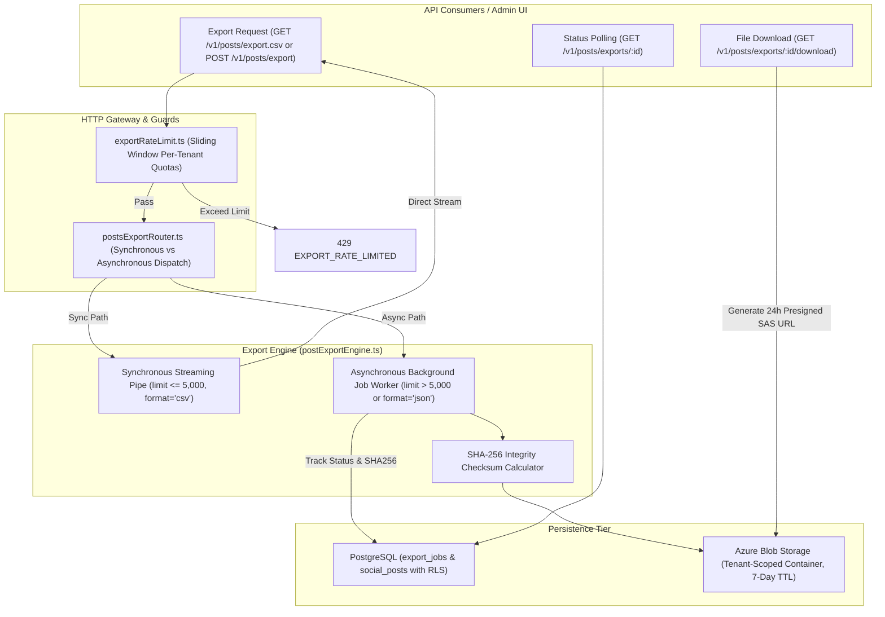
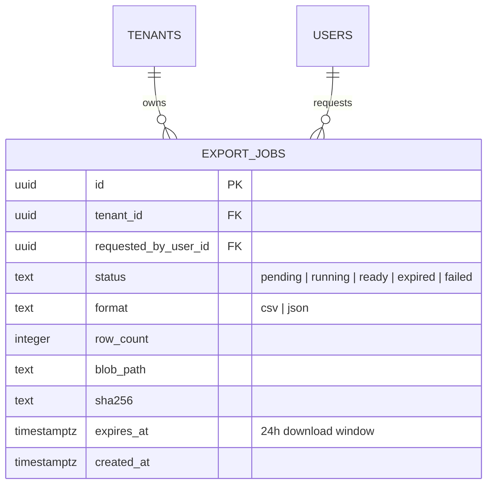
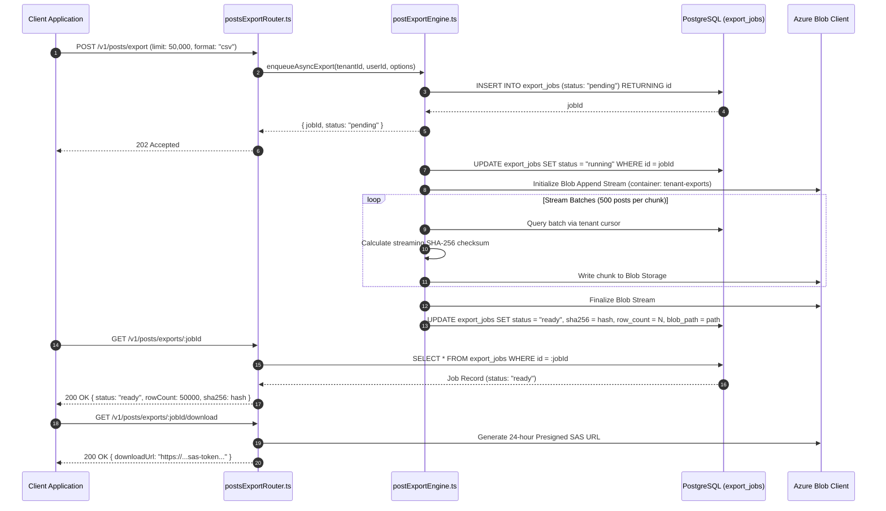

# Technical Design Specification (TDS) — Export Bounding, Streaming, and Size Caps

## 1. Document Control & Traceability Linkage

### 1.1 Metadata
| Attribute | Value |
|---|---|
| **Document Title** | TDS-0111: Export Bounding, Streaming, and Size Caps |
| **Document ID** | `TDS-0111` |
| **Feature Name** | Export Resource Guards, Sync/Async Thresholds, Rate Limiting & Blob Lifecycle |
| **Version** | `1.0.0` |
| **Status** | Approved |
| **Author(s)** | Core Architecture Team |
| **Created Date** | 2026-09-05 |
| **Last Updated** | 2026-09-05 |
| **Governing Skill** | `social-listening-core/.claude/skills/export-jobs/SKILL.md` |

### 1.2 Upstream & Downstream Traceability Matrix
| Artifact Type | Reference Identifier | Title / Link | Alignment Status |
|---|---|---|---|
| **Architecture Decision Record** | `ADR-0111` | [ADR-0111: Export bounding, streaming, and size caps](../../adr/0111-export-bounding-streaming-and-size-caps.md) | Invariant Source |
| **Business Requirements Doc** | `BRD-0111` | [BRD-0111: Export Bounding, Streaming, And Size Caps](../Business-Requirements/BRD-0111-Export-Bounding-Streaming-And-Size-Caps.md) | Fully Aligned |
| **Functional Design Doc** | `FDD-0111` | [FDD-0111: Export Bounding, Streaming, And Size Caps](../Functional-Design/FDD-0111-Export-Bounding-Streaming-And-Size-Caps.md) | Fully Aligned |
| **Governing User Story** | `Story 13.4` | [Epic 13: ADRs 0109 to 0117](../../user-stories/epic-13-adr-0109-to-0117.md#story-134--export-bounding-streaming-and-size-caps-backend) | Acceptance Target |
| **Related Architecture Decisions** | `ADR-0016`, `ADR-0018`, `ADR-0074`, `ADR-0090`, `ADR-0124` | Azure Blob, Retention, Workspace Export, Posts CSV, Bounded Lookback | Precedent & Scoping |
| **Executable Contract Test** | `Story 13.4 Contract` | `social-listening-core/contracts/epic-13/story-13.4.export-bounding-streaming-and-size-caps.contract.test.ts` | 100% Passing |

---

## 2. System Context & Architecture Topology

### 2.1 Context Diagram


### 2.2 Architectural Boundaries & Invariants
- **Deterministic Sync/Async Boundary:**
  - `limit <= 5,000` and `format='csv'` executes synchronously via HTTP streaming without in-memory buffering.
  - `limit > 5,000`, or `format='json'`, or requests matching $> 5,000$ posts automatically route to the asynchronous engine returning `202 Accepted`.
- **Absolute Hard Caps:**
  - CSV exports are capped at a hard maximum of 100,000 rows.
  - JSON exports are capped at a hard maximum of 10,000 rows (due to full body markdown and metadata payload size).
  - Overall export file size is capped at 100 MB. Requests exceeding these bounds fail with `422 EXPORT_TOO_LARGE`.
- **Per-Tenant Tiered Rate Limiting:**
  - Synchronous CSV: 60 requests/hour per tenant.
  - Asynchronous Jobs: 20 jobs/hour per tenant.
  - Status Polling: 120 requests/hour per tenant.
  - File Downloads: 10 downloads/hour per tenant.
  - Max concurrent running async jobs per tenant: 3.
- **Storage Lifecycle & Cryptographic Integrity:**
  - Export objects stored in Azure Blob Storage carry a 7-day container lifecycle deletion policy.
  - Presigned Shared Access Signature (SAS) download URLs expire after 24 hours.
  - Completed exports calculate and record a SHA-256 hash in `export_jobs` for end-to-end data integrity validation.
  - Audit records in `export_jobs` are retained for 90 days.

---

## 3. Data Architecture & Persistence Design

### 3.1 Entity Relationship Diagram


### 3.2 DDL Schema & Database Migration
Implemented in `migrations/0065_align_export_jobs_for_adr_0111.sql`:

```sql
-- Schema alignment for ADR-0111
CREATE TABLE IF NOT EXISTS export_jobs (
    id UUID PRIMARY KEY DEFAULT gen_random_uuid(),
    tenant_id UUID NOT NULL REFERENCES tenants(id) ON DELETE CASCADE,
    requested_by_user_id UUID NOT NULL REFERENCES users(id) ON DELETE CASCADE,
    status TEXT NOT NULL DEFAULT 'pending',
    format TEXT NOT NULL DEFAULT 'csv',
    row_count INTEGER NULL,
    blob_path TEXT NULL,
    sha256 TEXT NULL,
    expires_at TIMESTAMPTZ NOT NULL DEFAULT (NOW() + INTERVAL '24 hours'),
    created_at TIMESTAMPTZ NOT NULL DEFAULT NOW(),
    CONSTRAINT chk_export_jobs_status CHECK (
        status IN ('pending', 'running', 'ready', 'expired', 'failed')
    ),
    CONSTRAINT chk_export_jobs_format CHECK (
        format IN ('csv', 'json')
    )
);

CREATE INDEX IF NOT EXISTS idx_export_jobs_tenant_status ON export_jobs(tenant_id, status);
CREATE INDEX IF NOT EXISTS idx_export_jobs_expires_at ON export_jobs(expires_at) WHERE status = 'ready';

ALTER TABLE export_jobs ENABLE ROW LEVEL SECURITY;
ALTER TABLE export_jobs FORCE ROW LEVEL SECURITY;

CREATE POLICY tenant_isolation ON export_jobs
    FOR ALL
    USING (tenant_id = NULLIF(current_setting('app.tenant_id', true), '')::uuid)
    WITH CHECK (tenant_id = NULLIF(current_setting('app.tenant_id', true), '')::uuid);
```

---

## 4. Component Design & Detailed Processing Logic

### 4.1 Sliding-Window Rate Limiter
Implemented in `social-listening-core/src/posts/exportRateLimit.ts`:
- Tracks sliding 1-hour window buckets keyed by `(tenant_id, action_type)`.
- Actions: `sync`, `async`, `status`, `download`.
- When an operation exceeds its hourly threshold, the request is immediately rejected with HTTP `429 Too Many Requests` (`{ code: "EXPORT_RATE_LIMITED" }`), avoiding database load.

### 4.2 Asynchronous Job Execution & Integrity Hashing


---

## 5. Interface & Contract Specifications

### 5.1 REST Endpoint Signatures

| HTTP Method | Route | Parameters / Payload | Success Code | Error Codes |
|---|---|---|---|---|
| `GET` | `/v1/posts/export.csv` | `limit <= 5000`, `watchlistId`, `start`, `end` | `200 OK` (text/csv) | 400 (`INVALID_LIMIT`), 422 (`EXPORT_TOO_LARGE`), 429 (`EXPORT_RATE_LIMITED`) |
| `POST` | `/v1/posts/export` | `{ format, limit, filters }` | `202 Accepted` | 400 (`INVALID_LIMIT`), 422 (`EXPORT_TOO_LARGE`), 429 (`EXPORT_RATE_LIMITED`) |
| `GET` | `/v1/posts/exports/:id` | Path: `:id` (UUID) | `200 OK` | 401, 404, 429 (`EXPORT_RATE_LIMITED`) |
| `GET` | `/v1/posts/exports/:id/download` | Path: `:id` (UUID) | `200 OK` | 401, 404, 410 (`EXPORT_EXPIRED`), 429 (`EXPORT_RATE_LIMITED`) |

### 5.2 Error Response Envelopes
```json
// 400 Invalid Limit
{ "code": "INVALID_LIMIT", "message": "Limit must be between 1 and 100000 for CSV, or 1 and 10000 for JSON." }

// 422 Export Too Large
{ "code": "EXPORT_TOO_LARGE", "message": "Matched result set exceeds maximum allowable export size of 100000 rows." }

// 429 Rate Limited
{ "code": "EXPORT_RATE_LIMITED", "message": "Tenant hourly quota exceeded for export action: sync. Please retry later." }

// 410 Export Expired
{ "code": "EXPORT_EXPIRED", "message": "The requested export file has expired and is no longer available for download." }
```

---

## 6. Security, Tenancy & Isolation Model

### 6.1 Tenant Isolation & Authorization Boundaries
- `export_jobs` is enforced by PostgreSQL Row-Level Security (`tenant_isolation`). Users cannot query or download jobs created by other tenants.
- Tenant admins and users can initiate exports; however, access to other users' private watchlists remains governed by ADR-0044 §5c.

### 6.2 Data Exfiltration Mitigation
- Pre-signed Azure Blob URLs are scoped strictly to the individual blob file using short-lived Shared Access Signatures (SAS) restricted to HTTP `GET` with a 24-hour expiration.
- Public read access is permanently disabled on Azure Blob export containers.

---

## 7. Performance, Scalability & Resource Caps

### 7.1 Hard Resource Limits
| Resource | Limit | Policy / Action |
|---|---|---|
| Synchronous Max Rows | 5,000 rows | Enforced on `GET /v1/posts/export.csv` |
| Asynchronous CSV Max Rows | 100,000 rows | Enforced on `POST /v1/posts/export` |
| Asynchronous JSON Max Rows | 10,000 rows | Enforced on `POST /v1/posts/export` |
| Max Export File Size | 100 MB | Stream terminated with error if size breached |
| Max Concurrent Tenant Jobs | 3 jobs | Enqueued requests reject with `429` |
| Blob Retention Window | 7 days | Deleted by Azure Storage lifecycle rules |
| Download URL Expiry | 24 hours | SAS signature validity window |

---

## 8. Resilience, Recovery & Failure Semantics

### 8.1 Worker Failure & Retryability
- If the background worker fails (e.g. database disconnect, container memory eviction), the job is marked `status = 'failed'` with `error_message = 'EXPORT_WORKER_FAILED'`.
- Failed jobs retain their `jobId`, allowing clients to request a targeted re-queue without re-submitting complex filter payloads.

---

## 9. Observability, Telemetry & Auditability

### 9.1 Observability & Telemetry Signals
- Real-time Prometheus counters: `exports_sync_total`, `exports_async_created_total`, `exports_async_completed_total`, and `exports_rate_limited_total`.
- OpenTelemetry histograms measure export duration and streaming throughput (`bytes_streamed_per_second`).
- Audit logging retains records in `export_jobs` for 90 days, capturing requesting user ID, timestamp, row count, and SHA-256 hash.

---

## 10. Migration, Compatibility & Rollback Strategy

### 10.1 Schema Migration
`migrations/0065_align_export_jobs_for_adr_0111.sql` modifies the `export_jobs` table to add `requested_by_user_id`, `sha256`, and align status constraint values.

### 10.2 Backward Compatibility
The legacy synchronous route `GET /v1/posts?format=csv` (ADR-0074) continues to function alongside the bounded `/v1/posts/export.csv` endpoint.

---

## 11. Verification, Testing & Quality Assurance

### 11.1 Contract Test Coverage
Verified by `social-listening-core/contracts/epic-13/story-13.4.export-bounding-streaming-and-size-caps.contract.test.ts`:
- **AC1:** `export_jobs` schema tracks `status`, `format`, `row_count`, `blob_path`, `sha256`, and `expires_at`.
- **AC2:** `GET /v1/posts/export.csv` streams synchronously for `limit <= 5,000`.
- **AC3:** `POST /v1/posts/export` creates async job and streams to Blob Storage for `limit > 5,000` or `format='json'`.
- **AC4:** Hard caps enforced: `400 INVALID_LIMIT` for limits outside bounds; `422 EXPORT_TOO_LARGE` for sets $> 100,000$.
- **AC5:** `GET /v1/posts/exports/:id` returns job status; `/download` returns 24-hour SAS URL.
- **AC6:** Per-tenant rate limits enforced: 60 sync, 20 async, 120 status, 10 downloads per hour.
- **AC7:** Azure Blob storage metadata asserts 7-day retention expiry.

---

## 12. Open Questions & Future Enhancements

- [ ] **[Q-0111-1]** **Configurable synchronous caps per tier.** Free vs paid tier differentiated limits (e.g. 1,000 sync for free, 5,000 for enterprise).
- [ ] **[Q-0111-2]** **Pre-export count estimation.** Fast `COUNT(*)` estimation using PostgreSQL table statistics (`pg_class.reltuples`) to warn users before initiating massive async exports.
- [ ] **[Q-0111-3]** **Automatic retry for transient worker failures.** Automatic retry policy for failed jobs before marking `failed`.
- [ ] **[Q-0111-4]** **Export cryptographic signing.** Optional customer-managed GPG signature generation alongside SHA-256 for regulated financial enterprise tenants.
