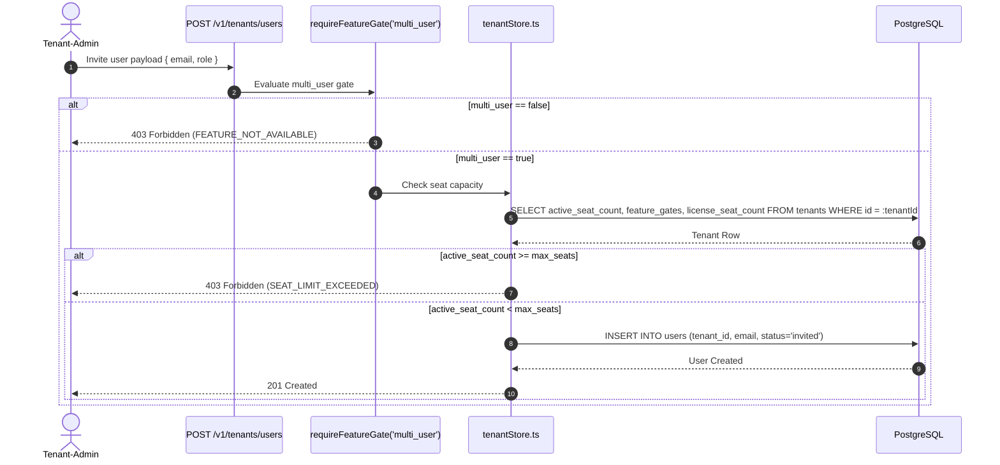

# Technical Design Specification (TDS) — Feature Gating & Seat-Limit Enforcement

## 1. Document Control & Traceability Linkage

### 1.1 Metadata
| Attribute | Value |
|---|---|
| **Document Title** | TDS-0112: Feature Gating, Plan Tiers & Active Seat-Limit Enforcement Engine |
| **Document ID** | `TDS-0112` |
| **Feature Name** | Per-Plan Feature Gates, Dynamic Quota Enforcement & Workspace Seat Management |
| **Version** | `1.0.0` |
| **Status** | Approved |
| **Author(s)** | Core Architecture Team |
| **Created Date** | 2026-09-05 |
| **Last Updated** | 2026-09-05 |
| **Governing Skill** | `social-listening-core/.claude/skills/feature-gating/SKILL.md` |

### 1.2 Upstream & Downstream Traceability Matrix
| Artifact Type | Reference Identifier | Title / Link | Alignment Status |
|---|---|---|---|
| **Architecture Decision Record** | `ADR-0112` | [ADR-0112: Feature Gating and Seat-Limit Enforcement](../../adr/0112-feature-gating-and-seat-limit-enforcement.md) | Invariant Source |
| **Business Requirements Doc** | `BRD-0112` | [BRD-0112: Feature Gating And Seat-Limit Enforcement](../Business-Requirements/BRD-0112-Feature-Gating-And-Seat-Limit-Enforcement.md) | Fully Aligned |
| **Functional Design Doc** | `FDD-0112` | [FDD-0112: Feature Gating And Seat-Limit Enforcement](../Functional-Design/FDD-0112-Feature-Gating-And-Seat-Limit-Enforcement.md) | Fully Aligned |
| **Governing User Story** | `Story 13.5` | [Epic 13: Sub-decisions & V2 Features](../../user-stories/epic-13-adr-0109-to-0117.md#story-135--feature-gating-and-seat-limit-enforcement-backend) | Acceptance Target |
| **Related User Stories** | `Story 13.6`, `Story 12.13` | Plan Read & Management UI, Multi-User RBAC | Consumer Modules |
| **Related Architecture Decisions** | `ADR-0015`, `ADR-0030`, `ADR-0032`, `ADR-0107` | Tenant RLS, Platform-Admin Boundary, User Invites, RBAC | Architectural Precedents |
| **Executable Contract Tests** | `Story 13.5 & 13.6 Contracts` | `social-listening-core/contracts/epic-13/story-13.5.feature-gating-and-seat-limit-enforcement.contract.test.ts`<br>`social-listening-core/contracts/epic-13/story-13.6.admin-tenant-plan-read.contract.test.ts` | 100% Passing |

---

## 2. System Context & Architecture Topology

### 2.1 Context Diagram
```mermaid
flowchart TD
    subgraph ClientLayer["Client Layer (social-listening-admin)"]
        TenantAdmin["Tenant-Admin (Settings / Users)"]
        PlatformAdmin["Platform-Admin (Tenant Plan Management)"]
        RegularUser["Tenant-User"]
    end

    subgraph CoreService["social-listening-core API Engine"]
        AuthMiddleware["tenantAuthMiddleware / resolveIdentity"]
        GateMiddleware["requireFeatureGate(feature)"]
        SeatGuard["Seat Limit Enforcement Guard"]
        TenantPlanRouter["GET /v1/tenants/plan<br/>PATCH /v1/admin/tenants/:id"]
    end

    subgraph Storage["PostgreSQL (Tenants System Table)"]
        TenantsTable["tenants Table
        - plan ('starter' | 'pro' | 'enterprise')
        - feature_gates (JSONB: max_seats, multi_user, etc.)
        - active_seat_count (INT)
        - license_seat_count (INT fallback)"]
        UsersTable["users Table (tenant_id, status: 'invited' | 'active')"]
    end

    TenantAdmin -->|Invite User (POST /v1/tenants/users)| GateMiddleware
    GateMiddleware -->|Check multi_user=true| SeatGuard
    SeatGuard -->|Verify active_seat_count < max_seats| UsersTable
    
    PlatformAdmin -->|Change Plan / Override Gates| TenantPlanRouter
    TenantPlanRouter --> TenantsTable

    RegularUser -->|Access Feature Endpoint (e.g., Export/Connectors)| GateMiddleware
    GateMiddleware -->|Read feature_gates from Context| TenantsTable
```

### 2.2 Architectural Boundaries & Invariants
- **Plan Hierarchy & Tiers:** Three platform-level tiers define initial feature configurations:
  - `starter`: `max_seats: 3`, `multi_user: false`, `api_access: false`, `webhooks: false`, `compliance_packs: false`, `dsr_portal: false`.
  - `pro`: `max_seats: 25`, `multi_user: true`, `api_access: true`, `webhooks: true`, `crisis_templates: true`.
  - `enterprise`: `max_seats: 100`, `multi_user: true`, `api_access: true`, `webhooks: true`, `compliance_packs: true`, `dsr_portal: true`, `rag_search: true`.
- **Seat Enforcement Invariant:** A tenant cannot invite new users (`POST /v1/tenants/users`) or activate invited users if `active_seat_count >= max_seats`. Requests hitting this capacity are rejected with HTTP 403 (`SEAT_LIMIT_EXCEEDED`).
- **No Auto-Deactivation Invariant:** When `Platform-Admin` downgrades a plan or reduces `max_seats` below the current `active_seat_count`, existing active users remain operational. Future invites and user activations are blocked until attrition brings `active_seat_count <= max_seats`.
- **Backward Compatibility Guarantee:** Legacy seeded tenants without explicit `max_seats` inside `feature_gates` transparently fall back to evaluating against `license_seat_count` (returning legacy 409).
- **Administrative Ownership Boundary:** Only `Platform-Admin` can modify `tenants.plan` and mutate arbitrary flags in `tenants.feature_gates`. `Tenant-Admin` possesses read-only access via `GET /v1/tenants/plan` unless granted explicit self-service configuration.

---

## 3. Data Architecture & Persistence Design

### 3.1 DDL Schema Definition
Migration `0066_add_tenant_plan_and_feature_gates_defaults.sql`:
```sql
ALTER TABLE tenants 
ADD COLUMN IF NOT EXISTS plan TEXT NOT NULL DEFAULT 'starter',
ADD COLUMN IF NOT EXISTS feature_gates JSONB NOT NULL DEFAULT '{
  "ai_assist": true,
  "analytics_dashboard": true,
  "multi_user": true,
  "api_access": true,
  "webhooks": false,
  "crisis_templates": false,
  "compliance_packs": false,
  "dsr_portal": false,
  "rag_search": false,
  "connectors": true,
  "watchlists": true,
  "exports": true,
  "max_seats": 5
}'::jsonb;

CREATE INDEX IF NOT EXISTS idx_tenants_plan ON tenants (plan);
CREATE INDEX IF NOT EXISTS idx_tenants_feature_gates ON tenants USING gin (feature_gates);
```

### 3.2 TypeScript Contracts & Plan Configuration
`social-listening-core/src/tenants/featureGates.ts`:
```typescript
export type PlanTier = 'starter' | 'pro' | 'enterprise';

export interface FeatureGates {
  ai_assist?: boolean;
  analytics_dashboard?: boolean;
  multi_user?: boolean;
  api_access?: boolean;
  webhooks?: boolean;
  crisis_templates?: boolean;
  compliance_packs?: boolean;
  dsr_portal?: boolean;
  rag_search?: boolean;
  connectors?: boolean;
  watchlists?: boolean;
  exports?: boolean;
  max_seats?: number;
  [customGate: string]: boolean | number | undefined;
}

export interface PlanDefinition {
  name: PlanTier;
  maxSeats: number;
  featureGates: FeatureGates;
}

export const PLATFORM_PLANS: Record<PlanTier, PlanDefinition> = {
  starter: {
    name: 'starter',
    maxSeats: 3,
    featureGates: {
      ai_assist: true,
      analytics_dashboard: true,
      multi_user: false,
      api_access: false,
      webhooks: false,
      crisis_templates: false,
      compliance_packs: false,
      dsr_portal: false,
      rag_search: false,
      connectors: true,
      watchlists: true,
      exports: false,
      max_seats: 3,
    },
  },
  pro: {
    name: 'pro',
    maxSeats: 25,
    featureGates: {
      ai_assist: true,
      analytics_dashboard: true,
      multi_user: true,
      api_access: true,
      webhooks: true,
      crisis_templates: true,
      compliance_packs: false,
      dsr_portal: false,
      rag_search: false,
      connectors: true,
      watchlists: true,
      exports: true,
      max_seats: 25,
    },
  },
  enterprise: {
    name: 'enterprise',
    maxSeats: 100,
    featureGates: {
      ai_assist: true,
      analytics_dashboard: true,
      multi_user: true,
      api_access: true,
      webhooks: true,
      crisis_templates: true,
      compliance_packs: true,
      dsr_portal: true,
      rag_search: true,
      connectors: true,
      watchlists: true,
      exports: true,
      max_seats: 100,
    },
  },
};
```

---

## 4. Application Logic & Workflows

### 4.1 Gate Evaluation Middleware Logic
Route protection executes synchronously before route handlers:
```typescript
export function requireFeatureGate(feature: keyof FeatureGates) {
  return (req: Request, res: Response, next: NextFunction) => {
    const featureGates: FeatureGates = req.tenantContext?.featureGates || {};
    const isAllowed = Boolean(featureGates[feature]);
    
    if (!isAllowed) {
      return res.status(403).json({
        error: {
          code: 'FEATURE_NOT_AVAILABLE',
          message: `The feature '${String(feature)}' is not enabled on the current tenant plan.`,
          feature,
        },
      });
    }
    next();
  };
}
```

### 4.2 Seat Capacity Validation Flow


---

## 5. Interface & API Contracts

### 5.1 Route Catalog
| Method | Endpoint | Authorization | Description |
|---|---|---|---|
| `GET` | `/v1/tenants/plan` | Tenant-User, Tenant-Admin | Retrieves current tenant plan, seats, and active gates |
| `GET` | `/v1/admin/tenants/:id/plan` | Platform-Admin | Retrieves target tenant plan, seat allocation, and feature gates |
| `PATCH` | `/v1/admin/tenants/:id` | Platform-Admin | Updates plan tier or overrides `feature_gates` |
| `PATCH` | `/v1/tenants/me/features` | Tenant-Admin (Test/Dev) | Updates feature gate settings or max seats |

### 5.2 Plan Read Contract (`GET /v1/tenants/plan`)
**Response (200 OK):**
```json
{
  "plan": "pro",
  "maxSeats": 25,
  "usedSeats": 12,
  "licenseSeatCount": 25,
  "featureGates": {
    "ai_assist": true,
    "analytics_dashboard": true,
    "multi_user": true,
    "api_access": true,
    "webhooks": true,
    "crisis_templates": true,
    "compliance_packs": false,
    "dsr_portal": false,
    "rag_search": false,
    "connectors": true,
    "watchlists": true,
    "exports": true,
    "max_seats": 25
  }
}
```

### 5.3 Error Code Specifications
| HTTP Code | Error Code | Circumstance |
|---|---|---|
| `403` | `FEATURE_NOT_AVAILABLE` | Tenant plan lacks entitlement to requested feature route |
| `403` | `SEAT_LIMIT_EXCEEDED` | Invite or activation rejected due to `active_seat_count >= max_seats` |
| `404` | `TENANT_NOT_FOUND` | Target tenant identifier not found on admin read |
| `401` | `UNAUTHORIZED` | Request missing valid identity token or tenant context |

---

## 6. Security, Tenancy & Isolation Model
- **Platform-Admin Segregation:** Cross-tenant plan reads (`/v1/admin/tenants/:id/plan`) mandate `platform_admin` token verification and route through dedicated `closePlatformAdminPool()`. Tenant credentials querying admin routes receive HTTP 403.
- **Tenant Context Propagation:** During tenant user authentication, `tenants.feature_gates` is loaded into request context `req.tenantContext.featureGates` without permitting client injection or forgery.
- **Fail-Closed Policy:** If `feature_gates` JSONB is corrupt or absent, `requireFeatureGate` evaluates undefined gates as `false`, denying execution.

---

## 7. Performance, Scalability & Resource Caps
- **In-Memory Gating Checks:** Route gate checks evaluate directly against the parsed request tenant context in $< 0.1\text{ms}$.
- **Connection Pool Overhead:** Tenant plan read queries execute indexed single-row lookups (`idx_tenants_plan`), with p95 latency $< 3\text{ms}$.
- **Concurrency Protection:** Seat count increments execute atomically within PostgreSQL transactions (`UPDATE tenants SET active_seat_count = active_seat_count + 1 WHERE id = :id AND active_seat_count < max_seats`) to prevent race conditions during concurrent user activations.

---

## 8. Resilience, Recovery & Failure Semantics
- **Seat Downgrade Grace Period:** Reducing `max_seats` below `active_seat_count` never terminates active sessions or invalidates existing team access, preventing operational disruption for existing tenant staff.
- **Fallback Recovery:** In instances where `max_seats` is deleted from JSONB, the system transparently falls back to `license_seat_count`.

---

## 9. Observability, Telemetry & Auditability
- **Structured Log Events:**
  - `gate_blocked`: Logged on every 403 `FEATURE_NOT_AVAILABLE` containing `{ tenant_id, feature, route }`.
  - `seat_limit_blocked`: Logged on every 403 `SEAT_LIMIT_EXCEEDED` containing `{ tenant_id, active_seats, max_seats }`.
- **Metrics Tracked:**
  - `feature_gate_evaluations_total{feature, status}`
  - `seat_limit_exceeded_total{tenant_id}`

---

## 10. Migration, Compatibility & Rollback Strategy
- **Migration Plan:** `0066_add_tenant_plan_and_feature_gates_defaults.sql` populates default `starter` plan and baseline JSONB without requiring downtime.
- **Rollback Strategy:** Columns can be dropped or ignored; core routes fall back to un-gated behavior if middleware is removed.

---

## 11. Verification, Testing & Quality Assurance
- **Executable Contract Tests:**
  - `social-listening-core/contracts/epic-13/story-13.5.feature-gating-and-seat-limit-enforcement.contract.test.ts`:
    - (1) Default `starter` plan and `feature_gates` population verified.
    - (2) `GET /v1/tenants/plan` verifies exposure of plan and gates.
    - (3) `requireFeatureGate` denies access when feature flag is `false`.
    - (4) `POST /v1/tenants/users` verifies seat limit enforcement and 403 `SEAT_LIMIT_EXCEEDED`.
    - (5) Downgrading `max_seats` below active seats does not deactivate current users.
  - `social-listening-core/contracts/epic-13/story-13.6.admin-tenant-plan-read.contract.test.ts`:
    - Proves `platform_admin` can read tenant plan, while `tenant_user` receives 403.

---

## 12. Open Questions & Future Enhancements

- [ ] **[Q-0112-1]** **Tenant-Admin UI Upgrade CTA:** Exposing direct self-serve upgrade CTA modals inside `social-listening-admin` when hitting a feature gate or seat limit.
- [ ] **[Q-0112-2]** **Seat Grandfathering Policy:** Formalizing an expiration horizon for grandfathered excess active users following a plan downgrade.
- [ ] **[Q-0112-3]** **Single-Gate Platform Overrides:** Allowing `Platform-Admin` to toggle a specific gate on a tenant without altering their assigned plan tier.
- [ ] **[Q-0112-4]** **OpenAPI Spec Feature Annotations:** Decorating OpenAPI 3.1 route operation objects with `x-feature-gate: string` extensions for automated client SDK generation.
