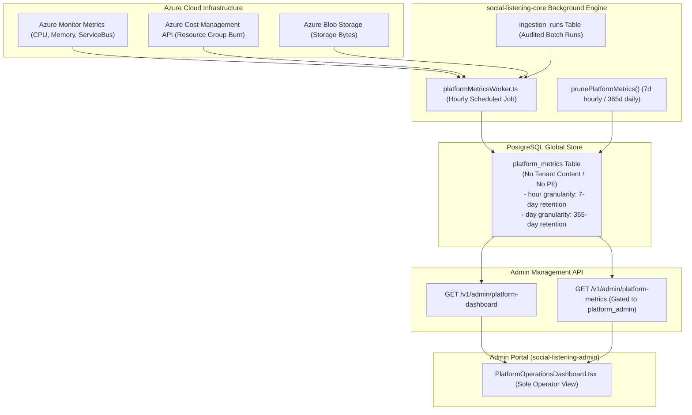

# Technical Design Specification (TDS) — Platform Metrics Table & Azure Metrics Integration

## 1. Document Control & Traceability Linkage

### 1.1 Metadata
| Attribute | Value |
|---|---|
| **Document Title** | TDS-0114: Platform Metrics Storage & Azure Infrastructure Telemetry — Global Metrics Table, Ingestion Worker Telemetry & Automated Retention Pruning |
| **Document ID** | `TDS-0114` |
| **Feature Name** | Platform Operations Telemetry Store & Azure Monitor Integration |
| **Version** | `1.0.0` |
| **Status** | Approved |
| **Author(s)** | Core Architecture Team |
| **Created Date** | 2026-09-05 |
| **Last Updated** | 2026-09-05 |
| **Governing Skill** | `social-listening-core/.claude/skills/platform-metrics/SKILL.md` |

### 1.2 Upstream & Downstream Traceability Matrix
| Artifact Type | Reference Identifier | Title / Link | Alignment Status |
|---|---|---|---|
| **Architecture Decision Record** | `ADR-0114` | [ADR-0114: Platform Metrics Table and Azure Metrics](../../adr/0114-platform-metrics-table-and-azure-metrics.md) | Invariant Source |
| **Business Requirements Doc** | `BRD-0114` | [BRD-0114: Platform Metrics Table And Azure Metrics](../Business-Requirements/BRD-0114-Platform-Metrics-Table-And-Azure-Metrics.md) | Fully Aligned |
| **Functional Design Doc** | `FDD-0114` | [FDD-0114: Platform Metrics Table And Azure Metrics](../Functional-Design/FDD-0114-Platform-Metrics-Table-And-Azure-Metrics.md) | Fully Aligned |
| **Governing User Stories** | `Story 10.6`, `Story 13.8` | [Epic 10: Stories 86–94](../../user-stories/epic-10-adr-0086-to-0094.md) / [Epic 13: Stories 109–117](../../user-stories/epic-13-adr-0109-to-0117.md#story-138--platform-metrics-table-and-azure-metrics-integration-backend) | Acceptance Target |
| **Related User Stories** | `Story 10.7`, `Story 16.4` | Platform Operations Dashboard, Dashboard Refinements | Downstream Consumers |
| **Related Architecture Decisions** | `ADR-0016`, `ADR-0052`, `ADR-0089`, `ADR-0128` | Azure Architecture, Ingestion Scheduler, Platform Dashboard, Ops Refinements | System Family |
| **Executable Contract Test** | `Story 13.8 Contract` | `social-listening-core/contracts/epic-13/story-13.8.platform-metrics-table-and-azure-metrics.contract.test.ts` | 100% Passing |

---

## 2. System Context & Architecture Topology

### 2.1 Context Diagram


### 2.2 Architectural Boundaries & Invariants
- **Content-Free Telemetry Invariant:** The `platform_metrics` table is a global infrastructure ledger. Dimensions **must never** store tenant post content, raw payloads, watchlist search expressions, or user PII. It stores only resource identifiers, HTTP codes, and operational counters.
- **Worker-Decoupled Dashboard Serving:** `GET /v1/admin/platform-dashboard` reads exclusively from the local `platform_metrics` table. It **never** invokes live Azure Monitor or Cost Management APIs synchronously during an administrative HTTP request, avoiding API throttling and multi-second page render delays.
- **Swappable Azure Provider Interface:** Integrates via an `AzureMetricsProvider` interface with a production client and test double, enabling comprehensive contract verification in offline CI environments.
- **Dual Granularity & Automated Retention Pruning:**
  - `hour` granularity: retained for exactly $7\text{ days}$.
  - `day` granularity: retained for $365\text{ days}$.
  - Older entries are pruned via scheduled `prunePlatformMetrics()` routines.

---

## 3. Data Architecture & Persistence Design

### 3.1 DDL Schema Definition
Migration `0068_align_platform_metrics_granularity_and_indexes.sql`:
```sql
CREATE TABLE IF NOT EXISTS platform_metrics (
    id UUID PRIMARY KEY DEFAULT gen_random_uuid(),
    metric_name TEXT NOT NULL,
    metric_type TEXT NOT NULL CHECK (metric_type IN ('counter', 'gauge', 'histogram')),
    value NUMERIC(18, 4) NOT NULL,
    dimensions JSONB NOT NULL DEFAULT '{}',
    source TEXT NOT NULL CHECK (source IN ('ingestion_worker', 'azure_metrics', 'api_gateway', 'platform_service')),
    granularity TEXT NOT NULL CHECK (granularity IN ('hour', 'day')),
    timestamp TIMESTAMPTZ NOT NULL,
    created_at TIMESTAMPTZ NOT NULL DEFAULT NOW()
);

-- Compound index for fast time-series queries
CREATE INDEX IF NOT EXISTS idx_platform_metrics_query 
    ON platform_metrics (metric_name, granularity, timestamp DESC);

-- Index for retention pruning
CREATE INDEX IF NOT EXISTS idx_platform_metrics_prune 
    ON platform_metrics (granularity, timestamp);
```

### 3.2 Metric Record Interface
Defined in `social-listening-core/src/platform/platformMetricsStore.ts`:
```typescript
export interface PlatformMetricRecord {
  id?: string;
  metric_name: string;
  metric_type: 'counter' | 'gauge' | 'histogram';
  value: number;
  dimensions?: Record<string, string | number>;
  source: 'ingestion_worker' | 'azure_metrics' | 'api_gateway' | 'platform_service';
  granularity: 'hour' | 'day';
  timestamp: string;
}
```

---

## 4. Component Design & Detailed Processing Logic

### 4.1 Hourly Worker Execution Sequence
Implemented in `social-listening-core/src/platform/platformMetricsWorker.ts`:

```typescript
export async function runPlatformMetricsWorker(now: Date = new Date()): Promise<void> {
  const currentHour = new Date(now);
  currentHour.setMinutes(0, 0, 0);
  const hourIso = currentHour.toISOString();

  // 1. Derive ingestion counters from ingestion_runs
  const internalCounts = await queryIngestionStats(currentHour);
  await recordPlatformMetric({
    metric_name: 'posts_ingested',
    metric_type: 'counter',
    value: internalCounts.postsIngested,
    source: 'ingestion_worker',
    granularity: 'hour',
    timestamp: hourIso,
  });
  await recordPlatformMetric({
    metric_name: 'ingestion_runs',
    metric_type: 'counter',
    value: internalCounts.runsCount,
    source: 'ingestion_worker',
    granularity: 'hour',
    timestamp: hourIso,
  });

  // 2. Fetch Azure infrastructure telemetry
  const azureProvider = getAzureMetricsProvider();
  const azureTelemetry = await azureProvider.fetchTelemetry(currentHour);

  for (const sample of azureTelemetry) {
    await recordPlatformMetric({
      metric_name: sample.name,
      metric_type: sample.type,
      value: sample.value,
      dimensions: sample.dimensions,
      source: 'azure_metrics',
      granularity: 'hour',
      timestamp: hourIso,
    });
  }

  // 3. Trigger retention pruning
  await prunePlatformMetrics(now);
}
```

### 4.2 Retention Pruning Logic
```typescript
export async function prunePlatformMetrics(asOf: Date = new Date()): Promise<{ deletedHours: number; deletedDays: number }> {
  const pool = getPlatformAdminPool();
  
  const hourCutoff = new Date(asOf.getTime() - 7 * 24 * 60 * 60 * 1000);
  const dayCutoff = new Date(asOf.getTime() - 365 * 24 * 60 * 60 * 1000);

  const resHours = await pool.query(
    `DELETE FROM platform_metrics WHERE granularity = 'hour' AND timestamp < $1`,
    [hourCutoff.toISOString()]
  );
  const resDays = await pool.query(
    `DELETE FROM platform_metrics WHERE granularity = 'day' AND timestamp < $1`,
    [dayCutoff.toISOString()]
  );

  return {
    deletedHours: resHours.rowCount ?? 0,
    deletedDays: resDays.rowCount ?? 0,
  };
}
```

---

## 5. Interface & Contract Specifications

### 5.1 Platform Operations REST APIs
- `GET /v1/admin/platform-dashboard`:
  - Scope: `platform_admin`
  - Returns aggregated telemetry over 24 hours and 7 days.
```json
{
  "summary": {
    "totalPostsIngested24h": 45120,
    "activeConnectors": 8,
    "avgContainerCpuPercent": 24.5,
    "estimatedDailyCostUsd": 14.80
  },
  "charts": {
    "ingestionThroughput": [{ "timestamp": "2026-09-05T14:00:00Z", "value": 1850 }],
    "cpuUtilization": [{ "timestamp": "2026-09-05T14:00:00Z", "value": 26.2 }]
  }
}
```

---

## 6. Security, Tenancy & Isolation Model
- **Cross-Tenant Exclusion:** This table does not contain a `tenant_id` column because it represents global system telemetry. It is strictly inaccessible to standard `tenant_user` and `tenant_admin` roles.
- **RBAC Guard:** All routes under `/v1/admin/platform-*` enforce `role === 'platform_admin'`, rejecting unauthorized users with HTTP 403.

---

## 7. Performance, Scalability & Resource Caps
- **Compact Storage:** 24 hourly rows per metric $\times 10 \text{ metrics} \times 7 \text{ days} = 1,680\text{ rows}$. Rolling annual daily data adds $3,650\text{ rows}$. The active table maintains $< 10,000\text{ total rows}$ permanently.
- **Sub-5ms Query Time:** Dashboard queries execute over indexed timestamps in $< 5\text{ms}$.

---

## 8. Resilience, Recovery & Failure Semantics
- **Azure Monitor Transient Outage:** If Azure Monitor API returns 500 or times out, the worker records available internal ingestion metrics, logs an Azure warning, and retries on the next hourly schedule without crashing.

---

## 9. Observability, Telemetry & Auditability
- Worker executions are logged to standard output:
  - `platform_metrics_worker_completed{internal_metrics, azure_metrics, duration_ms}`

---

## 10. Migration, Compatibility & Rollback Strategy
- Schema migration `0068` applies cleanly using `IF NOT EXISTS`.
- Rollback: Dropping `platform_metrics` table does not affect core tenant ingestion or REST functionality.

---

## 11. Verification, Testing & Quality Assurance
- **Story 13.8 Contract:** `social-listening-core/contracts/epic-13/story-13.8.platform-metrics-table-and-azure-metrics.contract.test.ts`
  - AC1: `platform_metrics` table exists with valid columns; no PII stored.
  - AC2: Worker writes `posts_ingested` and `ingestion_runs`.
  - AC3: Azure provider mock populates CPU, memory, cost, and service bus metrics.
  - AC4/AC5: `GET /v1/admin/platform-dashboard` and `GET /v1/admin/platform-metrics` return 200 for `platform_admin`.
  - AC6: `prunePlatformMetrics()` deletes $>7\text{d}$ hourly and $>365\text{d}$ daily rows.

---

## 12. Open Questions & Future Enhancements

- [ ] **[Q-0114-1]** **Cold storage blob archival.** Determining if pruned metric rows should be dumped to parquet in Azure Blob Storage prior to deletion.
- [ ] **[Q-0114-2]** **Cost Management 24h delay compensation.** Handling Azure Cost Management API's native 12-24h publication lag in real-time dashboards.
- [ ] **[Q-0114-3]** **Tenant-specific usage quotas.** Exposing a tenant-filtered slice of ingestion counters to `Tenant-Admin` in their billing screen.
