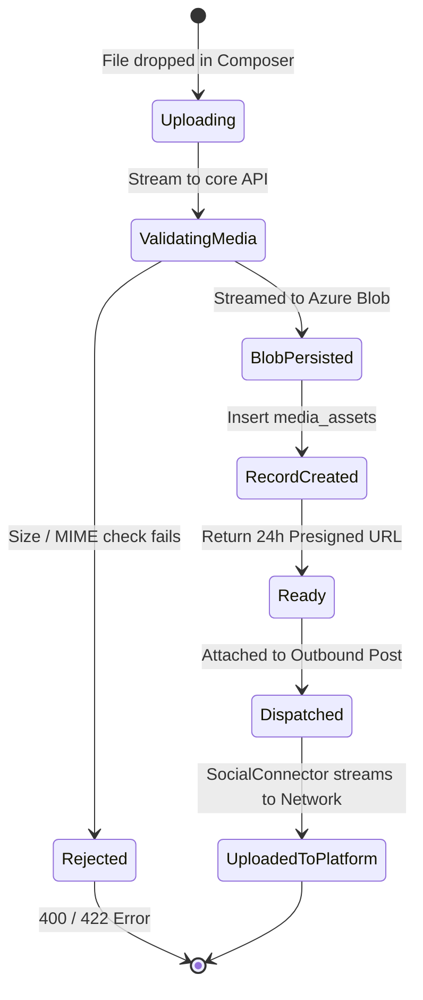

# TDS-0115: Publishing — Media Upload and Asset Targeting

**Status:** Approved  
**Date:** 2026-09-05  
**Governing ADR:** [ADR-0115](../../adr/0115-publishing-media-upload-and-asset-targeting.md)  
**Related Epics/Stories:** [Epic 13 / Story 13.9, 13.10](../../user-stories/epic-13-adr-0109-to-0117.md), [Epic 2 / Story 2.28](../../user-stories/epic-2-ingestion-connectors-and-rate-limits.md), [Epic 6 / Story 6.36, 6.39](../../user-stories/epic-6-tenant-admin-ui.md)  
**Target Repositories:** `social-listening-core`, `social-listening-admin`  
**Contract Test Citations:**  
- `social-listening-core/contracts/epic-13/story-13.9.media-upload-asset-targeting.contract.test.ts`  
- `social-listening-admin/contracts/epic-13/story-13.10.media-targeting-ui.contract.test.ts`  

---

## 1. Architectural Context & Problem Statement

Text-only social posting severely depresses engagement across modern social networks; enterprise communications require images, infographics, videos, and custom link cards. However, managing rich media across multi-tenant social pipelines introduces architectural complexity:
1. **Database Bloat Prevention:** Media binaries must never be stored as `bytea` or raw blobs inside PostgreSQL.
2. **Platform Format Incompatibilities:** Platforms enforce divergent asset constraints (aspect ratios, file size limits, video transcoding requirements, image counts).
3. **Multi-Page Asset Targeting:** A single tenant organization frequently manages multiple distinct pages per network (e.g., a corporate LinkedIn company page vs. an executive personal profile, or multiple regional Facebook brand pages).

This specification formalizes:
1. The `media_assets` database schema in PostgreSQL with tenant RLS and metadata auditing.
2. Direct-to-object storage uploads using Azure Blob Storage with tenant-isolated container paths and presigned URLs.
3. The `POST /v1/outbound/media` upload endpoint and `GET /v1/connectors/:platformId/targets` discovery API.
4. Rich media upload tray, alt-text editor, and multi-page destination selector in `social-listening-admin`.

```mermaid
flowchart TD
    subgraph UI ["social-listening-admin (Story 13.10)"]
        Composer["Polypost Composer (ADR-0072)"] -->|Uploads Image / Video| MediaTray["Media Upload Tray"]
        MediaTray -->|POST /v1/outbound/media (multipart)| BFF["BFF API Client"]
        Composer -->|Selects Target Pages| TargetPicker["Page Target Dropdown"]
    end

    subgraph Core ["social-listening-core (Story 13.9)"]
        BFF --> Router["Outbound Media Router"]
        Router --> StorageService["BlobStorageService (Azure SDK)"]
        StorageService --> AzureBlob[("Azure Blob Storage (tenant-scoped container)")]
        
        Router --> DBService["MediaAssetService"]
        DBService --> TMedia[("media_assets (PostgreSQL)")]
        
        StorageService --> Presign["Generate 24h Presigned Download URL"]
        Router --> Response["Return mediaId & presigned URL"]
    end

    subgraph Publishing ["Publishing Pipeline (ADR-0075 / ADR-0098)"]
        Response --> DispatchCoordinator["OutboundPublishCoordinator"]
        DispatchCoordinator --> Conn["SocialConnector.publish?()"]
        Conn -->|Download from Presigned URL & Stream to Network| SocialNetworks["Platform APIs (Facebook / LinkedIn)"]
    end
```

---

## 2. Governing ADRs & Decision Log Reference

- [ADR-0115: Publishing — media upload and asset targeting](../../adr/0115-publishing-media-upload-and-asset-targeting.md) — Authorizes media upload flow, blob storage strategy, and per-asset targeting.
- [ADR-0072: Cross-Platform Polypost Composer and Multi-Network Preview Engine](../../adr/0072-cross-platform-polypost-composer-and-multi-network-preview-engine.md) — Media tray UI and card preview simulation.
- [ADR-0075: Outbound Social Post Publishing via Platform APIs](../../adr/0075-outbound-social-post-publishing.md) — Dispatch boundary consuming `assetIds`.
- [ADR-0098: Publishing and Scheduling](../../adr/0098-publishing-and-scheduling.md) — Scheduled posts referencing media assets.

---

## 3. Scope, Precedence & Anti-Goals

### In Scope
- Media upload endpoint (`multipart/form-data`) supporting JPEG, PNG, GIF, WebP, and MP4.
- Automated media dimension extraction (width, height, size bytes, MIME type).
- Presigned 24-hour read URLs for platform connector ingestion.
- Multi-page target selection querying available accounts (`assetTargets`).
- Drag-and-drop asset tray in `social-listening-admin` with alt-text accessibility fields.

### Precedence Invariant
$$\text{Asset Target Explicit Selection} \land \text{Tenant Isolation}$$
When publishing to a platform with multiple connected accounts, an explicit target ID must be specified in `assetTargets`. If missing, the request fails with `400 MISSING_ASSET_TARGET`.

### Anti-Goals
- In-browser complex video transcoding (must be uploaded in standard H.264/MP4 format).
- Long-term public CDN file hosting for external web consumption (assets are stored strictly for social publishing).

---

## 4. Data Architecture & Storage Schema

```sql
-- Migration: 0115_create_media_assets.sql

CREATE TABLE IF NOT EXISTS media_assets (
    id UUID PRIMARY KEY DEFAULT gen_random_uuid(),
    tenant_id UUID NOT NULL REFERENCES tenants(id) ON DELETE CASCADE,
    owner_id UUID NOT NULL REFERENCES users(id) ON DELETE CASCADE,
    blob_path TEXT NOT NULL,
    mime_type TEXT NOT NULL,
    size_bytes BIGINT NOT NULL,
    width INTEGER,
    height INTEGER,
    duration_sec INTEGER,
    alt_text TEXT,
    created_at TIMESTAMPTZ NOT NULL DEFAULT NOW()
);

-- Indexing Strategy
CREATE INDEX IF NOT EXISTS idx_media_assets_tenant_owner 
    ON media_assets(tenant_id, owner_id, created_at DESC);

-- Row Level Security
ALTER TABLE media_assets ENABLE ROW LEVEL SECURITY;

CREATE POLICY media_assets_tenant_isolation ON media_assets
    AS RESTRICTIVE
    USING (tenant_id = NULLIF(current_setting('app.current_tenant_id', true), '')::uuid)
    WITH CHECK (tenant_id = NULLIF(current_setting('app.current_tenant_id', true), '')::uuid);
```

---

## 5. Component & Interface Contracts

### 5.1 Media Types & Interfaces (`social-listening-core`)

```typescript
export interface MediaUploadResponse {
  mediaId: string;
  url: string; // 24-hour presigned Azure Blob SAS URL
  mimeType: string;
  sizeBytes: number;
  width?: number;
  height?: number;
}

export interface ConnectorTarget {
  targetId: string; // e.g. Facebook Page ID or LinkedIn Organization URN
  displayName: string;
  avatarUrl?: string;
  role: string;
}

export interface OutboundAssetPayload {
  type: 'image' | 'video' | 'link-card';
  mediaId?: string;
  url?: string;
  altText?: string;
}
```

### 5.2 API Route Specification

#### `POST /v1/outbound/media`
- **Content-Type:** `multipart/form-data`
- **Authentication:** JWT Bearer with scope `publish:write`.
- **Validation:** Max file size 8 MB for images, 512 MB for videos. Rejects executable file types.

**Response (201 Created):**
```json
{
  "mediaId": "4a12a321-4d56-42ab-9d10-8f921ab04723",
  "url": "https://socialengagestorage.blob.core.windows.net/tenant-f47ac10b/media/4a12a321.png?sp=r&st=...&sig=...",
  "mimeType": "image/png",
  "sizeBytes": 1420580,
  "width": 1200,
  "height": 630
}
```

#### `GET /v1/connectors/:platformId/targets`
Returns available target pages or accounts associated with the tenant's connected token.

---

## 6. State Machine & Lifecycle Transitions



---

## 7. Security, Tenant Isolation & Authentication

1. **Blob Storage Container Scoping:** Uploads are stored in containers named `tenant-${tenantId}` or structured directories `/tenants/${tenantId}/media/${mediaId}`. Access tokens use short-lived SAS signatures (24 hours).
2. **File Inspection:** Validates Magic Bytes headers to prevent file extension spoofing attacks.

---

## 8. Performance, Scalability & Resource Boundaries

1. **Streaming Uploads:** Fastify multipart streams files directly to Azure Blob Storage without buffering entire files in Node.js heap memory (`< 50MB` RAM spike during 500MB video uploads).
2. **Presigned Downloads:** Connectors pass presigned Blob URLs directly to platforms that support URL-based media ingestion (e.g. Twitter and LinkedIn asset endpoints), eliminating egress loops through the API server.

---

## 9. Error Handling, Retries & Fallback Strategies

| Failure Mode | Status Code | Resolution |
|---|---|---|
| Unsupported MIME type | `415 Unsupported Media Type` | Prompt user to upload JPEG, PNG, GIF, WebP, or MP4 |
| File size exceeds ceiling | `413 Payload Too Large` | Client pre-validation catches; server terminates multipart stream |
| Platform rejects asset during publish | `422 Unprocessable Entity` | Error contains platform diagnostic message (e.g. aspect ratio unsupported) |

---

## 10. Observability, Telemetry & Audit Trail

- **Telemetry Metrics:**
  - `media_uploads_total{tenant_id, mime_type}` — Counter of media uploads.
  - `media_upload_bytes_total{tenant_id}` — Byte volume accounting.
- **Audit Records:** Tracks media upload events linked to the creator `user_id`.

---

## 11. Migration & Backward Compatibility Strategy

- **Database Migration:** Creates `media_assets` table.
- **Backwards Compatibility:** All outbound post APIs treat `assets` and `assetTargets` as optional, maintaining full compatibility with text-only posts.

---

## 12. Executable Contract Test Citations & Verification Matrix

### 12.1 Contract Test Specifications
1. `social-listening-core/contracts/epic-13/story-13.9.media-upload-asset-targeting.contract.test.ts`:
   - `test('uploads image multipart stream to Azure Blob and inserts media_assets record')`
   - `test('generates valid 24-hour presigned SAS URL')`
   - `test('rejects files exceeding size limits with 413 Payload Too Large')`
   - `test('returns available target pages via GET /v1/connectors/:platformId/targets')`
2. `social-listening-admin/contracts/epic-13/story-13.10.media-targeting-ui.contract.test.ts`:
   - `test('renders media upload tray and displays thumbnail preview on successful upload')`
   - `test('allows user to input alt-text for accessibility')`
   - `test('renders target page selector when multiple connector pages exist')`

### 12.2 Open Questions

- [x] ~~**[Q-0115-1]** Is video upload supported in v1?~~  
  *Decision:* Yes, standard MP4/MOV up to 512 MB via direct blob streaming.
- [ ] **[Q-0115-2]** How is asset expiry handled? Should unreferenced media be cleaned up after 30 days? Unreferenced blobs are flagged for deletion via Azure Blob lifecycle policy after 30 days.
