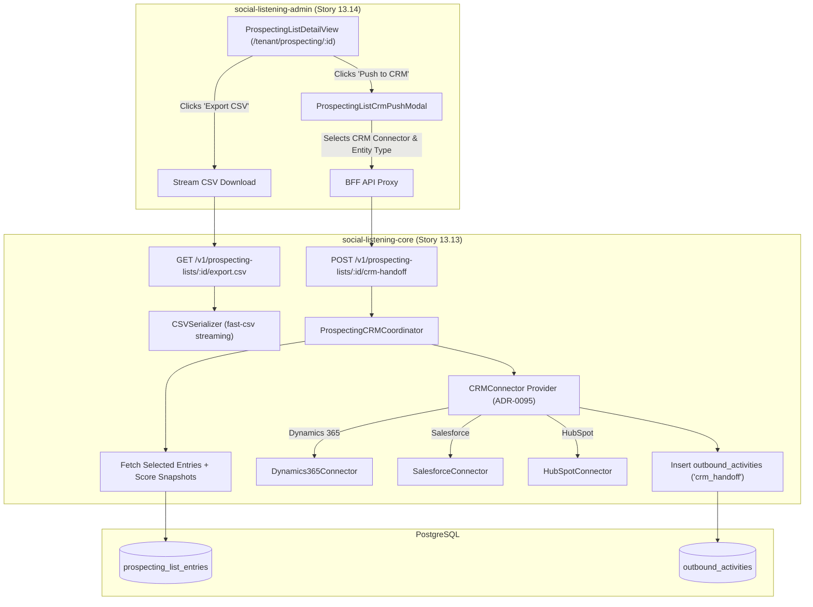
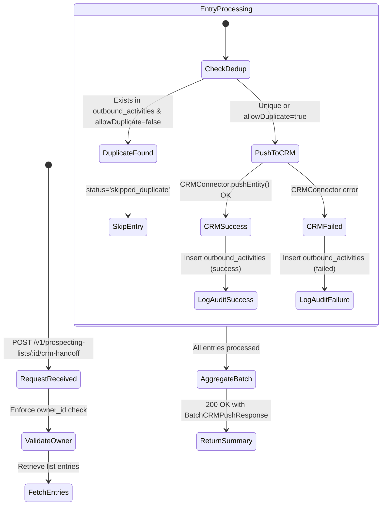

# TDS-0117: Prospecting List Export and CRM Push

**Status:** Approved  
**Date:** 2026-09-05  
**Governing ADR:** [ADR-0117](../../adr/0117-prospecting-list-export-and-crm-push.md)  
**Related Epics/Stories:** [Epic 13 / Story 13.13, 13.14](../../user-stories/epic-13-adr-0109-to-0117.md), [Epic 10 / Story 10.1, 10.2](../../user-stories/epic-10-adr-0086-to-0094.md), [Epic 11 / Story 11.1](../../user-stories/epic-11-adr-0095-to-0100.md)  
**Target Repositories:** `social-listening-core`, `social-listening-admin`  
**Contract Test Citations:**  
- `social-listening-core/contracts/epic-13/story-13.13.prospecting-export-crm-push.contract.test.ts`  
- `social-listening-admin/contracts/epic-13/story-13.14.prospecting-export-and-crm-push-ui.contract.test.ts`  

---

## 1. Architectural Context & Problem Statement

Commercial and social-selling teams use the Prospecting List (ADR-0086) to curate high-intent prospects and authoritative creators. However, qualification data trapped inside SocialEngage cannot drive external sales cycles or outreach cadences. Commercial workflows require:
1. **CSV Export for Offline Analysis:** Generating standard CSV files for reporting, spreadsheet analysis, and import into cold-outreach tools.
2. **Batch Lead Handoff into Enterprise CRMs:** Dispatching multiple curated authors into Microsoft Dynamics 365, Salesforce, or HubSpot as leads or opportunities without manual copy-pasting.
3. **PII and Data Minimization Compliance:** Enforcing privacy constraints so that only public handles, score snapshots, and tenant notes are exported—preventing accidental exfiltration of unauthorized private personal data.

This specification defines:
1. The streaming CSV export endpoint (`GET /v1/prospecting-lists/:id/export.csv`).
2. The batch CRM handoff endpoint (`POST /v1/prospecting-lists/:id/crm-handoff`) reusing `CRMConnector` (ADR-0095).
3. Deduplication safeguards and individual audit logging in `outbound_activities`.
4. Export and push triggers and progress dialogs in `social-listening-admin`.



---

## 2. Governing ADRs & Decision Log Reference

- [ADR-0117: Prospecting list export and CRM push](../../adr/0117-prospecting-list-export-and-crm-push.md) — Authorizes CSV export columns, CRM handoff wire contract, and privacy boundaries.
- [ADR-0086: Prospecting list model and sharing](../../adr/0086-prospecting-list-model-and-sharing.md) — Base data model, RLS ownership, and score snapshot semantics.
- [ADR-0095: Case and Lead Handoff to CRM](../../adr/0095-case-handoff-to-crm.md) — Source of `CRMConnector` abstraction and provider mappings.
- [ADR-0108: Influencer discovery and scoring](../../adr/0108-influencer-discovery-and-scoring.md) — Four-score snapshot columns.

---

## 3. Scope, Precedence & Anti-Goals

### In Scope
- Streaming CSV export with RFC 4180 escaping and UTF-8 BOM encoding for Excel compatibility.
- Standardized CSV column schema:
  `author_id, author_name, platform_id, public_url, topic, engagement_score, authenticity_score, influence_score, reach_score, relationship_stage, notes, tags`
- Batch lead dispatch into configured CRM connectors (`entityType = 'lead' | 'opportunity'`).
- Partial batch resilience: tracking per-entry success and failure results.
- Audit records inserted into `outbound_activities` with `activity_type = 'crm_handoff'`.

### Precedence Invariant
$$\text{Owner-Only Export Authority} \land \text{Metadata-Only PII Boundary}$$
Only the list's `owner_id` (or authorized user under ADR-0129) can initiate CSV exports or CRM pushes. In v1, shared teammate viewers cannot export lists.

### Anti-Goals
- Exporting raw scraped private contact data (emails/phone numbers not present in public metadata).
- Background scheduled recurring CRM syncs (v1 is user-initiated on demand).

---

## 4. Data Architecture & Storage Schema

Batch CRM dispatches leverage the unified `outbound_activities` table (ADR-0073 / ADR-0095).

```sql
-- Audit Schema Reference: outbound_activities
-- Each author pushed to CRM generates an individual audit row:
-- activity_type: 'crm_handoff'
-- author_id: target author UUID
-- connector_id: selected CRM connector
-- external_id: created CRM Lead / Contact ID
-- external_url: canonical CRM deep link
-- status: 'success' | 'failed'
```

---

## 5. Component & Interface Contracts

### 5.1 Batch CRM Handoff Types (`social-listening-core`)

```typescript
export interface BatchCRMPushRequest {
  crmConnectorId: string;
  entityType: 'lead' | 'opportunity';
  entryIds?: string[]; // Optional subset; if omitted, pushes all entries in list
  assignedTo?: string; // CRM queue or user ID
  allowDuplicate?: boolean;
}

export interface EntryPushResult {
  entryId: string;
  authorId: string;
  crmRecordId?: string;
  crmRecordUrl?: string;
  status: 'success' | 'failed' | 'skipped_duplicate';
  errorDetails?: string;
}

export interface BatchCRMPushResponse {
  summary: {
    total: number;
    successful: number;
    skipped: number;
    failed: number;
  };
  results: EntryPushResult[];
}
```

### 5.2 API Route Specification

#### `GET /v1/prospecting-lists/:id/export.csv`
- **Authentication:** JWT Bearer with scope `prospecting:export`.
- **Headers:** `Content-Type: text/csv; charset=utf-8`, `Content-Disposition: attachment; filename="prospecting-list-{id}.csv"`
- **Response:** Chunked CSV stream with RFC 4180 quoting.

#### `POST /v1/prospecting-lists/:id/crm-handoff`
- **Authentication:** JWT Bearer with scope `crm:write`.
- **Headers:** `X-Tenant-ID: <uuid>`

**Request Body:**
```json
{
  "crmConnectorId": "salesforce-production",
  "entityType": "lead",
  "entryIds": ["9c12a321-4d56-42ab-9d10-8f921ab04721"],
  "allowDuplicate": false
}
```

**Response (200 OK):**
```json
{
  "summary": {
    "total": 1,
    "successful": 1,
    "skipped": 0,
    "failed": 0
  },
  "results": [
    {
      "entryId": "9c12a321-4d56-42ab-9d10-8f921ab04721",
      "authorId": "3b9e6679-7425-40de-944b-e07fc1f90ae4",
      "crmRecordId": "00Q5g00000abc123",
      "crmRecordUrl": "https://mycompany.lightning.force.com/lightning/r/Lead/00Q5g00000abc123/view",
      "status": "success"
    }
  ]
}
```

---

## 6. State Machine & Lifecycle Transitions



---

## 7. Security, Tenant Isolation & Authentication

1. **Owner-Only Export Guard:** Enforces `owner_id = app.user_id` verification before generating CSVs or pushing to CRM. Teammates viewing a shared list receive `403 Forbidden` if attempting export.
2. **Data Minimization:** CSV rows and CRM payloads exclude private tracking parameters, internal system hashes, and unapproved PII fields.

---

## 8. Performance, Scalability & Resource Boundaries

1. **Backpressure-Aware Streaming:** CSV exports stream rows directly from the PostgreSQL cursor into the HTTP response stream (`fast-csv`), avoiding full list buffering in memory.
2. **Rate Gating on Batch Push:** CRM pushes process entries with concurrency limits (`concurrency: 5`) and token bucket throttling (`RequestGate`) to prevent exhausting CRM API limits.

---

## 9. Error Handling, Retries & Fallback Strategies

| Scenario | Response / Behavior | Recovery Action |
|---|---|---|
| CRM token expired | `502 Bad Gateway` with `TOKEN_EXPIRED` | Triggers OAuth refresh and alerts user |
| Partial batch failure | Returns 200 with summary of failures | User can re-trigger push selecting failed entries only |
| Duplicate lead detected | Entry marked `skipped_duplicate` | Returns existing CRM URL without halting remaining batch |

---

## 10. Observability, Telemetry & Audit Trail

- **Telemetry Metrics:**
  - `prospecting_list_exports_total{tenant_id, format='csv'}` — CSV download count.
  - `prospecting_crm_pushes_total{tenant_id, provider, status}` — Batch entry counts.
- **Audit Ledger:** Every pushed author creates an individual `outbound_activities` audit entry.

---

## 11. Migration & Backward Compatibility Strategy

- **Zero Schema Additions:** Uses existing `prospecting_lists`, `prospecting_list_entries`, and `outbound_activities` schemas.
- **UI Integration:** Exposes action buttons on `ProspectingListDetailView` gated by `exports` and `prospecting_crm` feature toggles.

---

## 12. Executable Contract Test Citations & Verification Matrix

### 12.1 Contract Test Specifications
1. `social-listening-core/contracts/epic-13/story-13.13.prospecting-export-crm-push.contract.test.ts`:
   - `test('streams RFC 4180 compliant CSV export with score snapshots')`
   - `test('pushes entries in batch to CRMConnector and records outbound_activities')`
   - `test('skips previously pushed entries unless allowDuplicate is true')`
   - `test('rejects export requests from non-owners with 403 Forbidden')`
2. `social-listening-admin/contracts/epic-13/story-13.14.prospecting-export-and-crm-push-ui.contract.test.ts`:
   - `test('renders Export CSV and Push to CRM buttons for list owner')`
   - `test('disables export actions for non-owner viewing shared list')`
   - `test('renders CRM Push modal with connector selection and live progress bar')`

### 12.2 Open Questions

- [x] ~~**[Q-0117-1]** Can non-owners export a shared list?~~  
  *Decision:* No. Export and CRM push are strictly restricted to the list `owner_id` in v1 to prevent unauthorized data exfiltration.
- [x] ~~**[Q-0117-2]** How are large exports handled?~~  
  *Decision:* Streamed via chunked HTTP transfer encoding using database cursor pagination.
