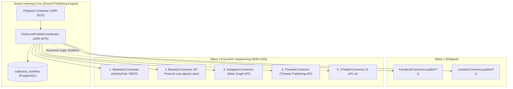
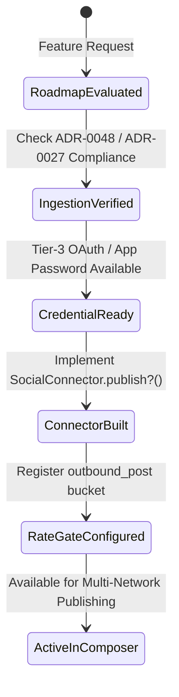

# TDS-0118: Additional Social Platform Publishing Roadmap

**Status:** Approved  
**Date:** 2026-09-05  
**Governing ADR:** [ADR-0118](../../adr/0118-additional-social-platform-publishing.md)  
**Related Epics/Stories:** [Epic 14 / Story 14.1](../../user-stories/epic-14-adr-0118-to-0122.md), [Epic 2 / Story 2.28](../../user-stories/epic-2-ingestion-connectors-and-rate-limits.md), [Epic 6 / Story 6.36, 6.39](../../user-stories/epic-6-tenant-admin-ui.md)  
**Target Repositories:** `social-listening-core`  
**Contract Test Citations:**  
- `social-listening-core/contracts/epic-14/story-14.1.additional-social-platform-publishing-roadmap.contract.test.ts`  

---

## 1. Architectural Context & Problem Statement

ADR-0075 authorized the baseline outbound publishing framework and designated **Facebook Pages** and **LinkedIn** as Wave 1 targets. However, enterprise brand teams require omnichannel reach across modern open networks (Mastodon, Bluesky) and mobile visual platforms (Instagram, Threads, X/Twitter).

Each additional network introduces platform-specific authorization, API models, cost constraints, and review barriers. Integrating platforms haphazardly risks degrading existing ingestion pipelines, leaking credentials, or incurring massive API licensing fees.

This specification defines the **Wave 2 Social Publishing Architecture**:
1. A rigorous phased implementation sequence: **Mastodon** $\rightarrow$ **Bluesky** $\rightarrow$ **Instagram** $\rightarrow$ **Threads** $\rightarrow$ **X / Twitter**.
2. Shared architecture reusing the `SocialConnector.publish?()` contract and `outbound_activities` audit ledger.
3. Isolated `RequestGate` rate limit token buckets per network.
4. Economic and prerequisite governance gates before connector activation.



---

## 2. Governing ADRs & Decision Log Reference

- [ADR-0118: Additional Social Platform Publishing](../../adr/0118-additional-social-platform-publishing.md) — Establishes Wave 2 sequencing, credential requirements, and economic barriers.
- [ADR-0075: Outbound Social Post Publishing via Platform APIs](../../adr/0075-outbound-social-post-publishing.md) — Foundation `SocialConnector.publish?()` contract.
- [ADR-0048: Connector Registry and Zero-Pipeline-Change Ingestion](../../adr/0048-connector-registry-and-zero-pipeline-change-ingestion.md) — Ingestion prerequisites for publishing connectors.
- [ADR-0051: Connector Activation and Credential Storage](../../adr/0051-connector-activation-and-credential-storage.md) — OAuth token resolution.
- [ADR-0119: Editing and Deleting Published Outbound Posts](../../adr/0119-editing-and-deleting-published-outbound-posts.md) — Post-publish mutation contracts.

---

## 3. Scope, Precedence & Anti-Goals

### In Scope
- Phased delivery sequence based on verification complexity and API accessibility:
  1. **Mastodon:** Instance-scoped Bearer token; `POST /api/v1/statuses`.
  2. **Bluesky:** AT Protocol repo mutations; `app.bsky.feed.post` records.
  3. **Instagram:** Meta Graph API container model; photo/reel publishing.
  4. **Threads:** Meta Threads API; text and media threads.
  5. **X (Twitter):** X API v2; paywalled tier with explicit customer sponsorship.
- Independent rate-limit metering on `RequestGate`: `(tenantId, providerId, 'outbound_post')`.
- Immutable audit rows in `outbound_activities`.

### Precedence Invariant
$$\text{Platform Ingestion Stability} > \text{Outbound Publishing Activation}$$
A platform cannot be enabled for outbound publishing until its inbound connector is verified, registered, and stable in the connector registry.

### Anti-Goals
- Blanket X/Twitter API enterprise subscription without confirmed customer billing sponsorship.
- Custom one-off publishing tables (all platforms must reuse `outbound_activities`).

---

## 4. Data Architecture & Storage Schema

Wave 2 platforms leverage existing `outbound_activities` and `platform_credentials` tables without schema modifications.

```sql
-- Schema Verification Check: outbound_activities supports Wave 2 provider identifiers:
-- connector_id IN ('mastodon', 'bluesky', 'instagram', 'threads', 'x')
-- activity_type = 'publish'
-- external_id: platform post URI / AT-URI / status ID
```

---

## 5. Component & Interface Contracts

### 5.1 Wave 2 Connector Implementations (`social-listening-core`)

```typescript
export interface Wave2PublishingPlatform {
  platformId: 'mastodon' | 'bluesky' | 'instagram' | 'threads' | 'x';
  authType: 'oauth2' | 'app_password' | 'api_key';
  rateLimitPerDay: number;
  supportsAltText: boolean;
  maxCharacters: number;
  dispatchEndpoint: string;
}

export const WAVE_2_ROADMAP: Record<string, Wave2PublishingPlatform> = {
  mastodon: {
    platformId: 'mastodon',
    authType: 'oauth2',
    rateLimitPerDay: 300,
    supportsAltText: true,
    maxCharacters: 500,
    dispatchEndpoint: '/api/v1/statuses'
  },
  bluesky: {
    platformId: 'bluesky',
    authType: 'app_password',
    rateLimitPerDay: 5000,
    supportsAltText: true,
    maxCharacters: 300,
    dispatchEndpoint: 'com.atproto.repo.createRecord'
  },
  instagram: {
    platformId: 'instagram',
    authType: 'oauth2',
    rateLimitPerDay: 25,
    supportsAltText: true,
    maxCharacters: 2200,
    dispatchEndpoint: '/v19.0/{ig-user-id}/media_publish'
  },
  threads: {
    platformId: 'threads',
    authType: 'oauth2',
    rateLimitPerDay: 250,
    supportsAltText: true,
    maxCharacters: 500,
    dispatchEndpoint: '/v19.0/{threads-user-id}/threads_publish'
  },
  x: {
    platformId: 'x',
    authType: 'oauth2',
    rateLimitPerDay: 100,
    supportsAltText: true,
    maxCharacters: 280,
    dispatchEndpoint: '/2/tweets'
  }
};
```

---

## 6. State Machine & Lifecycle Transitions



---

## 7. Security, Tenant Isolation & Authentication

1. **Credential Isolation:** Mastodon instance URLs and Bluesky app passwords are encrypted per tenant using AES-256-GCM envelope encryption (`platform_credentials`).
2. **Scattered Account Boundaries:** Multi-account tenants manage isolated tokens for corporate and subsidiary handles.

---

## 8. Performance, Scalability & Resource Boundaries

1. **Rate Gate Isolation:** Each platform's outbound post bucket is independently isolated in Redis, ensuring high posting volume on Bluesky never degrades Mastodon or Facebook posting limits.
2. **Timeout Boundaries:** External platform dispatch calls enforce a 10-second timeout before failing closed.

---

## 9. Error Handling, Retries & Fallback Strategies

| Error Condition | Behavior | Action |
|---|---|---|
| Bluesky AT Protocol session invalid | Returns 401 | Re-authenticates with app password |
| Mastodon instance rate-limited | Returns 429 | Extracts `X-RateLimit-Reset` header and backs off |
| Instagram aspect ratio rejected | Returns 422 | Surfaces format requirements to composer UI |

---

## 10. Observability, Telemetry & Audit Trail

- **Prometheus Metrics:**
  - `outbound_posts_by_platform_total{platform, status}` — Publishing counts across Wave 1 & 2.
  - `outbound_post_errors_total{platform, error_code}` — Error categorization.

---

## 11. Migration & Backward Compatibility Strategy

- **Add-Only Extensibility:** New platforms plug cleanly into the `SocialConnector` registry without core routing changes.

---

## 12. Executable Contract Test Citations & Verification Matrix

### 12.1 Contract Test Specifications
1. `social-listening-core/contracts/epic-14/story-14.1.additional-social-platform-publishing-roadmap.contract.test.ts`:
   - `test('validates build sequencing following Mastodon -> Bluesky -> Instagram -> Threads -> X')`
   - `test('ensures all Wave 2 connectors conform to SocialConnector.publish?() signature')`
   - `test('verifies RequestGate key isolation for (tenantId, providerId, outbound_post)')`
   - `test('enforces economic barrier requirement on X/Twitter publishing activation')`

### 12.2 Open Questions

- [x] ~~**[Q-0118-1]** Why is Mastodon prioritized before Instagram and Threads?~~  
  *Decision:* Mastodon uses straightforward OAuth2 Bearer tokens with no business verification review delays, making it the fastest path to production for open social publishing.
- [x] ~~**[Q-0118-2]** How is X/Twitter handled?~~  
  *Decision:* Deferred to final position due to prohibitive API paywalls ($100/mo) until an enterprise tenant explicitly sponsors the credential.
